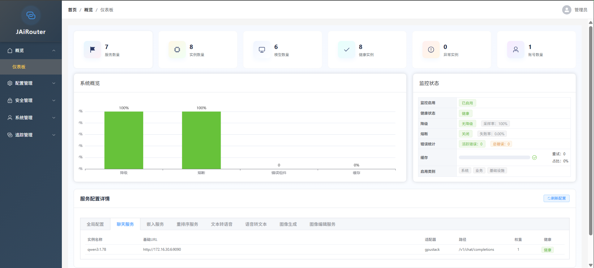

# JAiRouter

  

JAiRouter is a Spring Boot-based model service routing and load balancing gateway designed to centrally manage and route various AI model services (such as Chat, Embedding, Rerank, TTS, etc.), supporting multiple load balancing strategies, rate limiting, circuit breaking, health checks, dynamic configuration updates, and more.

[中文介绍](README.md)

---

## 🧭 Feature Overview (Web Console)

| Module Category     | Menu             | Description                                                                                      |
|---------------------|------------------|--------------------------------------------------------------------------------------------------|
| 🔍 **Overview**      | Dashboard        | Real-time display of system status, service health, request trends, exception statistics, with chart visualization and dynamic refresh support. |
| ⚙️ **Configuration Management** | Service Management   | Supports dynamic configuration of AI service types, adapters, load balancing policies, and service-level rate limiting and circuit breaker rules. |
|                     | Instance Management  | Provides instance creation, editing, deletion, status management, and supports instance-level rate limiting, circuit breaking, health checks, and weight configuration. |
|                     | Version Management   | Full lifecycle management of configuration versions: create, apply, rollback, delete; metadata recording and version comparison supported. |
|                     | Configuration Merge  | Intelligent merging of multi-version configurations with conflict detection, merge preview, operation logs, auto-merge, and manual intervention. |
| 🔐 **Security Management** | API Key Management   | Supports API key creation, enable/disable, permission assignment, usage statistics, expiration reminders, and field desensitization for sensitive data. |
|                     | JWT Token Management | Lifecycle management of JWT tokens: query, revoke, refresh, blacklist mechanism; supports Redis and file persistence. |
|                     | Audit Logs           | Comprehensive logging of user login, configuration changes, token operations, key management events, with event type filtering and tracking. |
| 👤 **System Management** | Account Management   | Supports admin account creation, permission allocation, status management, and action log tracking. |
| 📊 **Trace Management** | Trace Overview       | Real-time display of trace data health status, sampling rate, service statistics, and trend charts. |
|                     | Trace Search         | Multi-condition combined queries for trace records, supporting filtering by service, time, status, tags, etc. |
|                     | Performance Analysis | Service-level performance analysis including latency distribution, error rates, throughput, bottleneck diagnosis, and optimization suggestions. |
|                     | Trace Management     | Configurable sampling strategies (global/service-level), performance settings, exporter configuration, real-time refresh of trace data. |

---

## 🚀 Core Highlights

- ✅ **Full-featured Web Console**: Built from scratch covering complete management chains such as configuration, security, tracing, and auditing.
- ✅ **Frontend-backend Separation Architecture**: Based on Vue3 + Element Plus with responsive design and friendly interaction.
- ✅ **Configuration Version Control**: Supports multi-version configuration management and rollback to ensure traceability of changes.
- ✅ **Tracing & Performance Monitoring**: Integrated distributed tracing and performance analysis to enhance system observability.
- ✅ **Enterprise-grade Security Mechanism**: Dual authentication system with JWT + API Key, built-in audit and desensitization mechanisms.
- ✅ **High Availability & Scalability**: Supports high availability deployment via Redis, multi-tier storage strategy for configurations and tokens.

---

## 🧩 Use Cases

- Centralized internal AI service gateway management
- Multi-model service routing and load balancing
- API security authentication and access control
- Distributed system tracing and performance analysis
- Configuration change audit and version rollback

---

## 📚 Online Documentation

Complete project documentation has been migrated to GitHub Pages and can be accessed online:

- [Chinese Documentation](https://jairouter.com/)
- [English Documentation](https://jairouter.com/en/)

Documentation includes:

- Quick Start Guide
- Detailed Configuration Instructions
- API Reference
- Deployment Guide
- Monitoring Configuration
- Development Guide
- Troubleshooting

---

## 🚀 Quick Start

# Pull the latest image
docker pull sodlinken/jairouter:latest

# Run container
docker run -d \
  --name jairouter-dev \
  -p 8080:8080 \
  -e SPRING_PROFILES_ACTIVE=dev \
  -e JWT_SECRET="your-very-strong-jwt-secret-key-at-least-32-characters-long" \
  -e JAVA_OPTS="-Xms256m -Xmx512m -agentlib:jdwp=transport=dt_socket,server=y,suspend=n" \
  sodlinken/jairouter:dev

3. Access Service

curl http://localhost:8080/admin/login

Username: admin  
Password: UqfpTm2Zw7ff2BNnZb8AQo8t  

After successful login, you can enter the web interface to perform service configuration, management, tracing, and performance analysis operations.

## 📘 API Documentation

After starting the project, you can access the automatically generated API documentation at the following addresses:

- **Swagger UI**: http://127.0.0.1:8080/swagger-ui/index.html
- **OpenAPI JSON**: http://127.0.0.1:8080/v3/api-docs

## 📌 Development Roadmap (Status Update)

| Phase   | Status | Content                                                       |
|---------|--------|---------------------------------------------------------------|
| 0.1.0   | ✅     | Basic gateway, adapter, load balancing, health check          |
| 0.2.0   | ✅     | Rate limiting, circuit breaking, degradation, config persistence, dynamic update APIs |
| 0.2.1   | ✅     | Scheduled cleanup tasks, memory optimization, enhanced client IP rate limiting, automatic config file merging |
| 0.3.0   | ✅     | Docker containerization, multi-environment deployment, monitoring integration |
| 0.3.1   | ✅     | Accelerated image building using Alibaba Maven mirror in China |
| 0.4.0   | ✅     | Monitoring metrics, Prometheus integration, alert notifications |
| 0.5.0   | ✅     | Managing all documents involved in the project via GitHub Pages |
| 0.6.0   | ✅     | Authentication and authorization                              |
| 0.7.0   | ✅     | Log tracing                                                   |
| 0.8.0   | ✅     | Automated packaging and publishing images to Docker Hub       |
| 0.9.0   | ✅     | Enhanced monitoring dashboard and user management features    |
| 1.0.0   | ✅     | Enterprise deployment guide                                   |
| 1.1.0   | ✅     | Add API playground feature         |
| 1.2.5   | ✅     | Add H2 database support for persistence and set as default         |
| 1.3.0   | 🚧     | Integration into self-developed large model application platform |

---

📖 **Full Documentation & Deployment Guide**: [Click Here](https://jairouter.com)  
🐙 **Source Code Repository**: [GitHub - JAiRouter](https://github.com/Lincoln-cn/jairouter)

---

💬 Welcome feedback and collaboration—let's make JAiRouter better together!
