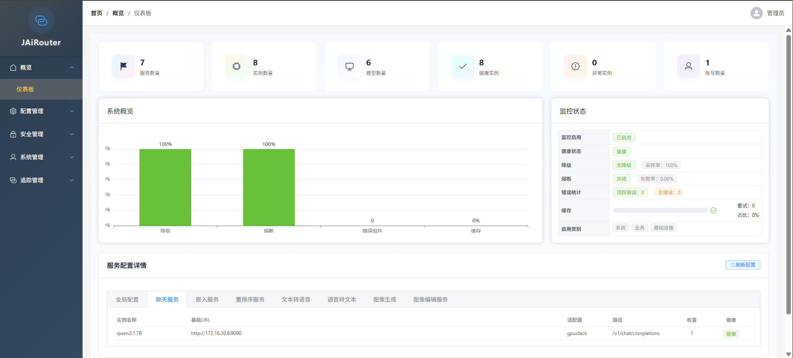

# JAiRouter

<p align="center">
  
</p>

JAiRouter 是一个基于 Spring Boot 的模型服务路由和负载均衡网关，用于统一管理和路由各种 AI 模型服务（如
Chat、Embedding、Rerank、TTS 等），支持多种负载均衡策略、限流、熔断、健康检查、动态配置更新等功能。

[English Introduction](README.md)

---
[](https://deepwiki.com/Lincoln-cn/JAiRouter)

## 🧭 功能概览（Web 控制台）

| 模块分类 | 功能菜单 | 功能描述 |
|----------|----------|----------|
| 🔍 **概览** | 仪表板 | 实时展示系统状态、服务健康度、请求趋势、异常统计等关键信息，支持图表可视化与动态刷新。 |
| ⚙️ **配置管理** | 服务管理 | 支持动态配置 AI 服务类型、适配器、负载均衡策略，支持服务级限流与熔断规则配置。 |
|  | 实例管理 | 提供实例的新增、编辑、删除、状态管理，支持实例级限流、熔断、健康检查与权重配置。 |
|  | 版本管理 | 支持配置版本的全生命周期管理：创建、应用、回滚、删除，支持元数据记录与版本对比。 |
|  | 配置合并 | 提供多版本配置的智能合并、冲突检测、合并预览与操作日志，支持自动合并与手动干预。 |
| 🔐 **安全管理** | API 密钥管理 | 支持 API Key 的创建、启用/禁用、权限分配、使用统计与过期提醒，支持敏感字段脱敏。 |
|  | JWT 令牌管理 | 提供 JWT 令牌的生命周期管理：查询、撤销、刷新、黑名单机制，支持 Redis 与文件持久化。 |
|  | 审计日志 | 完整记录用户登录、配置变更、令牌操作、密钥管理等关键事件，支持事件类型筛选与追踪。 |
| 👤 **系统管理** | 账户管理 | 支持管理员账户的创建、权限分配、状态管理与操作日志追踪。 |
| 📊 **追踪管理** | 追踪概览 | 实时展示追踪数据的健康状态、采样率、服务统计与趋势图表。 |
|  | 追踪搜索 | 支持多条件组合查询追踪记录，支持按服务、时间、状态、标签等维度筛选。 |
|  | 性能分析 | 提供服务级性能指标分析：延迟分布、错误率、吞吐量、瓶颈诊断与优化建议。 |
|  | 追踪管理 | 支持采样策略配置（全局/服务级）、性能配置、导出器配置，支持追踪数据实时刷新。 |

---

## 🚀 核心亮点

- ✅ **全功能 Web 控制台**：从零构建，覆盖配置、安全、追踪、审计等完整管理链路。
- ✅ **前后端分离架构**：基于 Vue3 + Element Plus，响应式设计，交互友好。
- ✅ **配置版本控制**：支持配置的多版本管理与回滚，保障变更可追溯。
- ✅ **追踪与性能监控**：集成分布式追踪与性能分析，助力系统可观测性。
- ✅ **企业级安全机制**：支持 JWT + API Key 双认证体系，内置审计与脱敏机制。
- ✅ **高可用与扩展性**：支持 Redis 高可用部署，配置与令牌支持多级存储策略。
- ✅ **多后端适配器支持**：支持最新的 GPUStack、Ollama、VLLM、Xinference、LocalAI 等后端服务的最新 API 特性。

---

## 🧩 适用场景

- 企业内部 AI 服务网关统一管理
- 多模型服务路由与负载均衡
- API 安全认证与访问控制
- 分布式系统追踪与性能分析
- 配置变更审计与版本回滚

---

## 📚 在线文档

完整的项目文档已迁移至 GitHub Pages，可在线访问：

- [中文文档](https://jairouter.com/)
- [English Documentation](https://jairouter.com/en/)

文档内容包括：

- 快速开始指南
- 详细配置说明
- API 参考
- 部署指南
- 监控配置
- 开发指南
- 故障排查

---

## 🚀 快速开始

### 1. 拉取镜像

```bash
# 拉取最新镜像
docker pull sodlinken/jairouter:latest
```

### 2. 生成安全密钥（推荐）

**v1.8.0+ 新增密钥生成工具**，支持自动生成安全的 JWT 密钥和管理员密码：

**方式一：使用 Docker 运行（推荐）**

```bash
# 生成 JWT 密钥（Base64 编码，至少 32 字符）
docker run --rm sodlinken/jairouter:latest java -jar /app/modelrouter.jar --generate-key

# 示例输出：
# Base64 编码（推荐，适用于 JWT HS256）:
#   cGFzc3dvcmQtdGVzdC1rZXktZm9yLWphb3V0ZXItMjAyNg==
# 密钥强度：非常强

# 生成随机密码
docker run --rm sodlinken/jairouter:latest java -jar /app/modelrouter.jar --generate-password

# 示例输出：
# 16 字符密码：aB3dEfGhIjKlMnOp
# 密码强度：强
```

**方式二：使用 OpenSSL（无需 jar 包）**

```bash
# 生成 JWT 密钥
openssl rand -base64 32

# 生成随机密码
openssl rand -base64 24 | tr -dc 'A-Za-z0-9!@#$%^&*' | head -c 16
```

### 3. 运行容器

**方式一：使用生成的密钥（推荐）**

```bash
# 设置环境变量
export JWT_SECRET="cGFzc3dvcmQtdGVzdC1rZXktZm9yLWphb3V0ZXItMjAyNg=="
export INITIAL_ADMIN_PASSWORD="MyStr0ng!Pass#2026"

# 运行容器
docker run -d \
  --name jairouter \
  -p 8080:8080 \
  -e SPRING_PROFILES_ACTIVE=prod \
  -e JWT_SECRET="$JWT_SECRET" \
  -e INITIAL_ADMIN_PASSWORD="$INITIAL_ADMIN_PASSWORD" \
  sodlinken/jairouter:latest
```

**方式二：使用默认密码（仅限开发环境）**

```bash
docker run -d \
  --name jairouter-dev \
  -p 8080:8080 \
  -e SPRING_PROFILES_ACTIVE=dev \
  -e JWT_SECRET="your-very-strong-jwt-secret-key-at-least-32-characters-long" \
  -e JAVA_OPTS="-Xms256m -Xmx512m -agentlib:jdwp=transport=dt_socket,server=y,suspend=n" \
  sodlinken/jairouter:dev
```

### 4. 访问服务

```bash
curl http://localhost:8080/admin/login
```


**默认登录凭证**：
- 用户名：`admin`
- 密码：启动时设置的 `INITIAL_ADMIN_PASSWORD` 环境变量值
  - 如果未设置，开发环境使用默认密码（见启动日志）
  - 生产环境必须设置，否则启动时会发出安全警告

登录成功后，即可进入 Web 界面进行服务配置、管理、追踪与性能分析等操作。




## 📘 API 文档

启动项目后，可通过以下地址访问自动生成的 API 文档：

- **Swagger UI**: http://127.0.0.1:8080/swagger-ui/index.html
- **OpenAPI JSON**: http://127.0.0.1:8080/v3/api-docs

## 📌 开发计划（更新状态）

### 第一阶段：基础功能 (v0.x - v1.0.x) ✅

| 版本 | 状态 | 内容 |
|------|------|------|
| 0.1.0 | ✅ | 基础网关、适配器、负载均衡、健康检查 |
| 0.2.0 | ✅ | 限流、熔断、降级、配置持久化、动态更新接口 |
| 0.2.1 | ✅ | 定时清理任务、内存优化、客户端IP限流增强 |
| 0.3.0 | ✅ | Docker容器化、多环境部署、监控集成 |
| 0.3.1 | ✅ | Alibaba Maven镜像加速（中国） |
| 0.4.0 | ✅ | 监控指标、Prometheus集成、告警通知 |
| 0.5.0 | ✅ | GitHub Pages文档管理 |
| 0.6.0 | ✅ | 认证鉴权 |
| 0.7.0 | ✅ | 日志追踪 |
| 0.8.0 | ✅ | Docker Hub自动打包发布 |
| 0.9.0 | ✅ | 增强监控仪表板和用户管理 |
| 1.0.0 | ✅ | 企业级部署指南 |
| 1.1.0 | ✅ | API试验场功能 |
| 1.2.5 | ✅ | H2数据库支持（默认持久化） |

### 第二阶段：安全与管理 (v1.5.x - v1.9.x) ✅

| 版本 | 状态 | 内容 |
|------|------|------|
| 1.5.6 | ✅ | 实例级限流器和熔断器配置独立存储 |
| 1.5.7 | ✅ | JWT账户初始化功能 |
| 1.6.0 | ✅ | 配置版本管理优化 |
| 1.6.1 | ✅ | API Key安全增强（P0修复） |
| 1.6.2 | ✅ | API Key管理功能增强（P1/P2） |
| 1.7.0 | ✅ | JWT账户管理优化 |
| 1.7.2 | ✅ | Playground组件化重构 |
| 1.8.0 | ✅ | 安全加固版本 |
| 1.8.1 | ✅ | 快速开始指南 |
| 1.9.0 | ✅ | 核心重构 - 性能优化和代码结构改进 |
| 1.9.3 | ✅ | 异常管理前端开发 |
| 1.9.4 | ✅ | 异常管理Prometheus集成 |
| 1.9.5 | ✅ | Token使用量统计功能 |
| 1.9.6 | ✅ | 完整监控体系 |

### 第三阶段：重构优化 (v2.0.x - v2.3.x) ✅

| 版本 | 状态 | 内容 |
|------|------|------|
| 2.0.0 | ✅ | 并发性能优化、模型调用统计分析 |
| 2.1.2 | ✅ | 魔法字符串清理 - Adapter支持类 |
| 2.1.3 | ✅ | 魔法字符串清理 - 监控追踪类 |
| 2.1.4 | ✅ | 魔法字符串清理 - 全面扫描修复 |
| 2.2.0 | ✅ | ConfigurationService拆分 |
| 2.2.1 | ✅ | BaseAdapter拆分 - RequestBuilder & ResponseHandler |
| 2.2.4 | ✅ | BaseAdapter进一步拆分 |
| 2.2.5 | ✅ | 实例健康检查增强 - HTTP连通性检测 |
| 2.2.6 | ✅ | ServiceConfigManager重构 |
| 2.2.7 | ✅ | 适配器能力检查拆分 |
| 2.2.8 | ✅ | 新组件集成测试 |
| 2.2.9 | ✅ | 质量提升和文档专项 |
| 2.3.0 | ✅ | 错误处理与重试组件 |
| 2.3.1 | ✅ | HttpRequestProcessor & ResponseMapper |
| 2.3.2 | ✅ | 监控与追踪拆分 |
| 2.3.3 | ✅ | 健康检查显示修复 |
| 2.4.0 | ✅ | 一致性哈希负载均衡器、权重溢出修复 |
| 2.4.1 | ✅ | 负载均衡器管理页面、配置持久化 |
| 2.4.5 | ✅ | 状态持久化基础设施 |
| 2.4.7 | ✅ | 熔断器状态管理页面 |

### 第四阶段：状态持久化 (v2.5.x) ✅

| 版本 | 状态 | 内容 |
|------|------|------|
| 2.5.0 | ✅ | 熔断器状态持久化（Redis + 文件） |
| 2.5.1 | ✅ | 限流器状态持久化 |
| 2.5.2 | ✅ | 统一状态管理器API |
| 2.5.3-2.5.15 | ✅ | 状态持久化优化与Bug修复 |

### 第五阶段：代码质量 (v2.6.x) ✅

| 版本 | 状态 | 内容 |
|------|------|------|
| 2.6.1-2.6.9 | ✅ | Checkstyle FinalParameters清理 (5,413→0) |
| 2.6.10 | ✅ | WhitespaceAfter修复 (1,655→29, 减少98.2%) |
| 2.6.11 | ✅ | HiddenField & OperatorWrap suppression配置 |
| **总计** | ✅ | **警告数: 10,413→3,424 (减少67%)** |

### 第六阶段：微服务化准备 (v2.7-v2.9) 🚧

| 版本 | 状态 | 内容 | 工期 |
|------|------|------|------|
| **v2.7.x** | 🚧 | **Package结构重组** | 10 天 |
| 2.7.0 | 🚧 | - 服务边界定义与基础结构创建 |
| 2.7.1 | 🚧 | - auth模块迁移（security/audit） |
| 2.7.2 | 🚧 | - config模块迁移（config/version） |
| 2.7.3 | 🚧 | - router模块迁移（adapter/loadbalancer） |
| 2.7.4 | 🚧 | - router模块迁移（circuitbreaker/ratelimit） |
| 2.7.5 | 🚧 | - monitor模块迁移（tracing/metrics） |
| 2.7.6 | 🚧 | - persistence模块迁移（store/jpa） |
| 2.7.7 | 🚧 | - common模块迁移（constants/dto/util） |
| 2.7.8 | 🚧 | - controller按服务分组 |
| 2.7.9 | 🚧 | - 测试调整与依赖修复 |
| **v2.8.x** | 📋 | **配置文件整合** | 10 天 |
| 2.8.0 | 📋 | - 配置文件结构分析 |
| 2.8.1 | 📋 | - 配置文件按模块拆分 |
| 2.8.2 | 📋 | - 服务模块配置分离 |
| 2.8.3 | 📋 | - 多环境配置完善 |
| 2.8.4 | 📋 | - 外部配置文件支持 |
| 2.8.5 | 📋 | - 敏感配置分离 |
| 2.8.6 | 📋 | - 配置加载优先级 |
| 2.8.7 | 📋 | - 配置校验机制 |
| 2.8.8 | 📋 | - 配置文档完善 |
| 2.8.9 | 📋 | - 配置迁移测试与总结 |
| **v2.9.0** | 📋 | **问题修复与梳理** | 7 天 |
| | 📋 | - 修复v2.7/v2.8遗留问题 |
| | 📋 | - 更新所有文档 |
| | 📋 | - 代码质量检查与性能测试 |

### 第七阶段：微服务架构 (v3.0.x) ⏸️ 推迟

| 版本 | 状态 | 内容 | 工期 |
|------|------|------|------|
| 3.0.0 | ⏸️ | **微服务架构转型** - 无限期推迟 |
| | ⏸️ | - 认证授权服务拆分独立部署 |
| | ⏸️ | - Nacos 配置中心集成 |
| | ⏸️ | - 监控追踪服务独立扩展 |
| | ⏸️ | - 服务发现机制 |
| | ⏸️ | - 服务间通信稳定 |

> **说明**：v3.0 微服务架构转型已无限期推迟。当前单体架构已满足需求。

---

📖 **完整文档与部署指南**：[点击查看](https://jairouter.com)
🐙 **开源地址**：[GitHub - JAiRouter](https://github.com/Lincoln-cn/jairouter)

---

💬 欢迎反馈与共建，让我们一起让 JAiRouter 变得更好！
