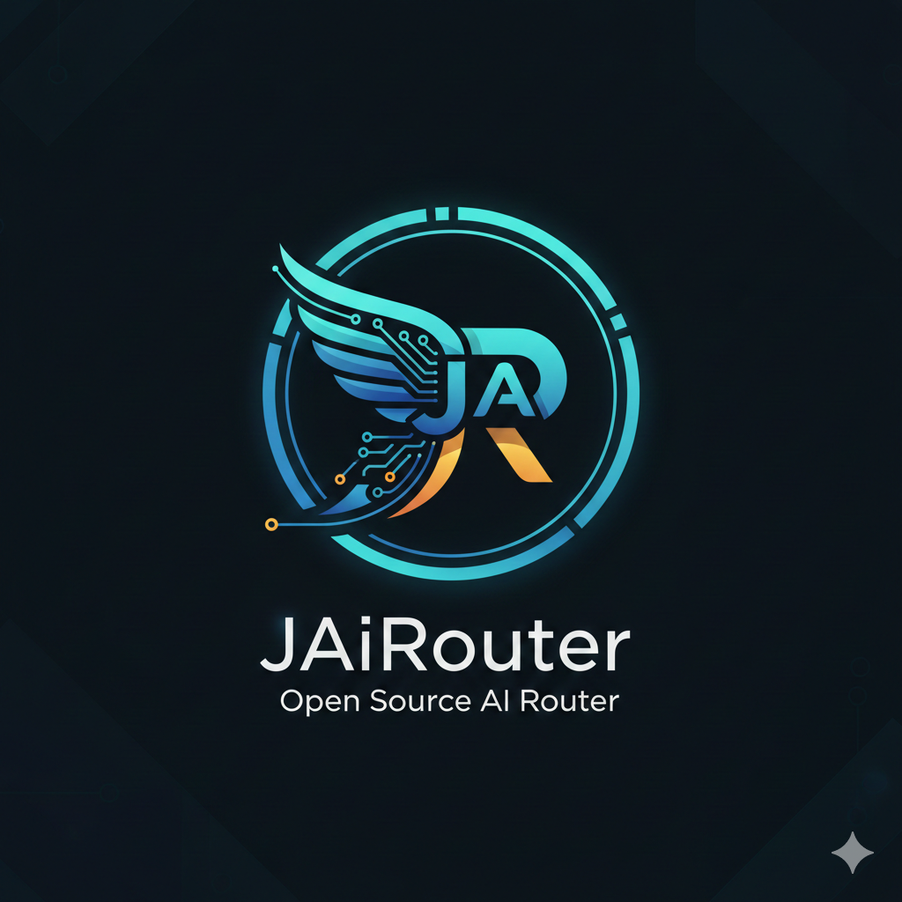
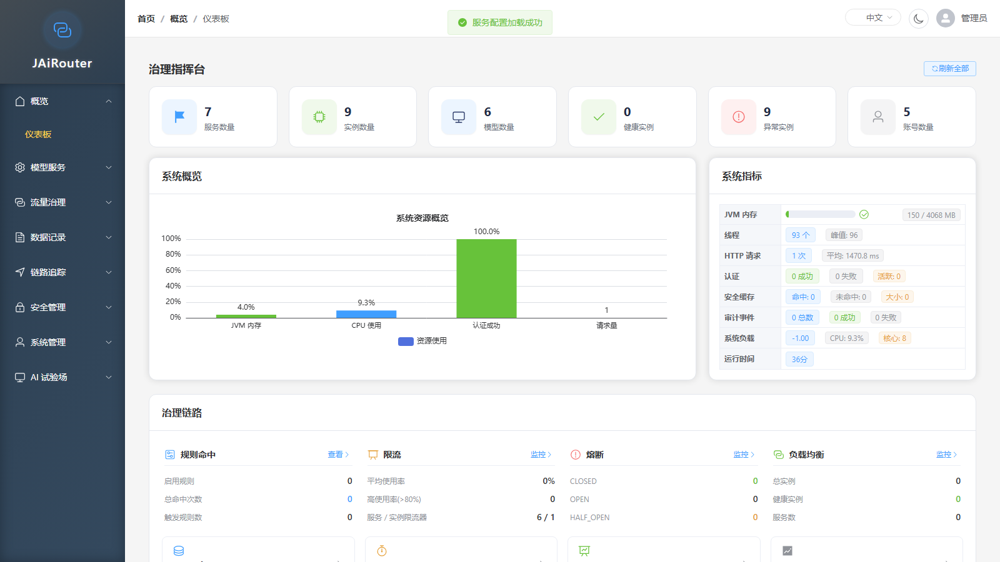
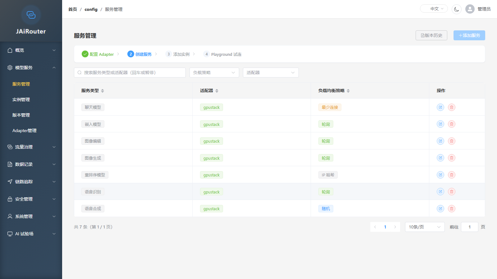
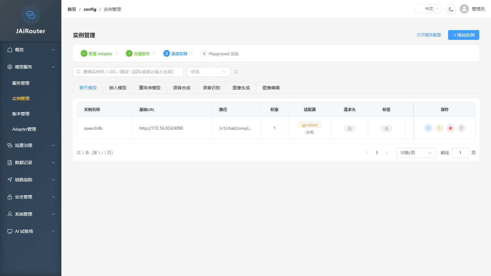
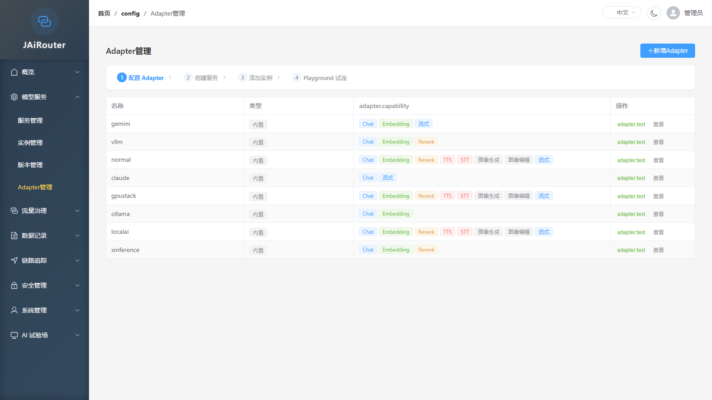
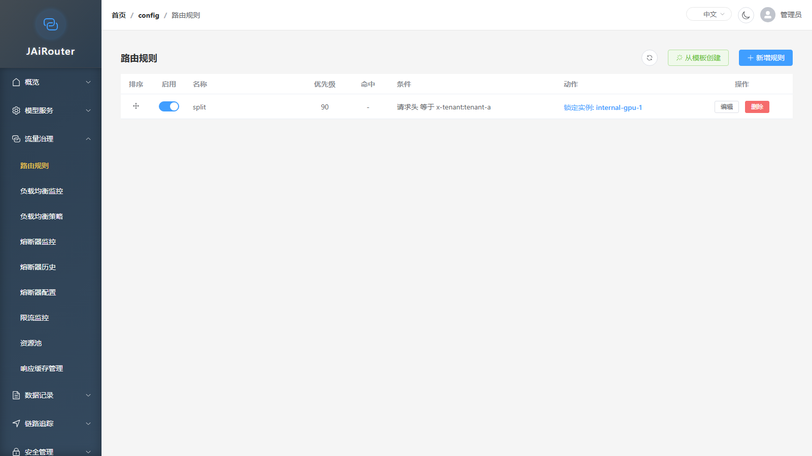
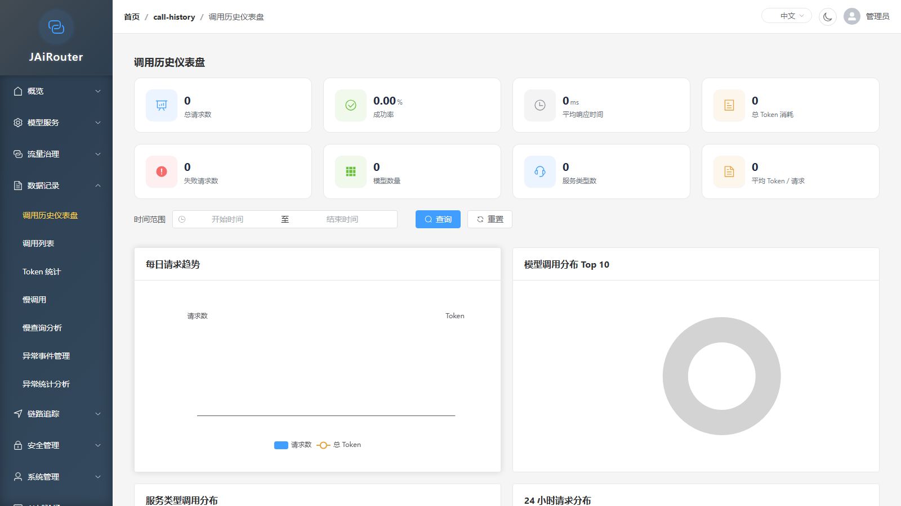
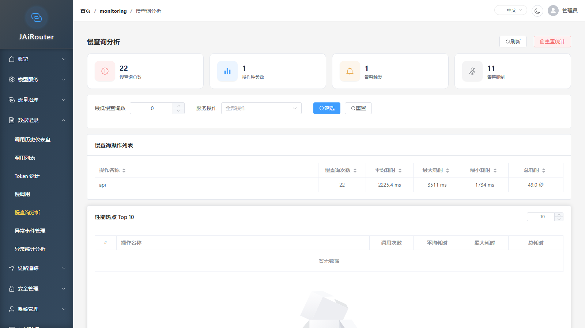
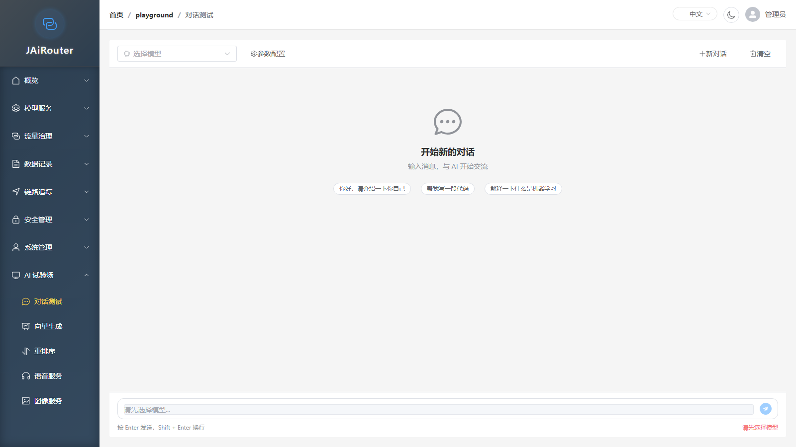
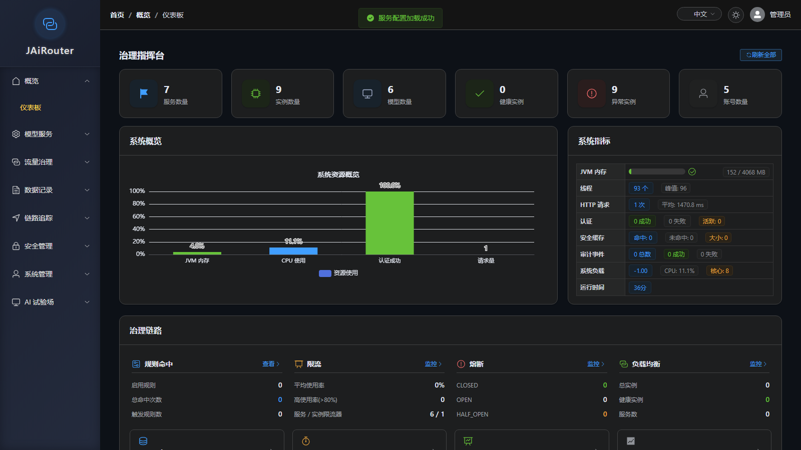

# JAiRouter

<p align="center">
  
</p>

<p align="center">
  <strong>把您的所有 LLM 后端，收敛到一个 OpenAI 兼容入口。</strong>
</p>

<p align="center">
  Ollama · vLLM · GPUStack · Xinference · OpenAI · Claude · Gemini<br>
  统一路由 · 负载均衡 · 限流 · 熔断 · 故障转移 · 可视化控制台
</p>

<p align="center">
  <a href="https://github.com/Lincoln-cn/JAiRouter/releases">
    
  </a>
  <a href="https://hub.docker.com/r/sodlinken/jairouter">
    
  </a>
  <a href="https://github.com/Lincoln-cn/JAiRouter/blob/master/LICENSE">
    
  </a>
</p>

<p align="center">
  <a href="README.md">English</a> •
  <a href="https://jairouter.com">文档</a> •
  <a href="https://github.com/Lincoln-cn/JAiRouter/discussions">讨论</a>
</p>

- **一个入口调用所有模型** —— 把对 Ollama、vLLM、GPUStack、OpenAI、Claude、Gemini 的直接调用统一为一个 OpenAI 兼容 `base_url`，现有 OpenAI SDK、LangChain、LlamaIndex 代码零改造即可切换。
- **为本地推理集群而生** —— 多实例负载均衡（含延迟感知、标签路由）、熔断降级，以及实例故障时**自动换到健康实例重试**的请求级故障转移。
- **为企业团队打造** —— Web 控制台热更新、配置版本管理与回滚、RBAC、审计日志、加密调用记录与完整可观测性。调整路由无需重启服务。

## 3 分钟快速体验

```bash
# 启动网关（零配置）
docker run -d --name jairouter -p 8080:8080 sodlinken/jairouter:latest

# Web 控制台：http://localhost:8080/admin
# 默认账号：admin / ChangeMeOnFirstStartup123456
```

任意 OpenAI 兼容客户端即可接入：

```python
from openai import OpenAI

client = OpenAI(
    base_url="http://localhost:8080/v1",
    api_key="not-needed"  # 认证由 JAiRouter 处理
)

response = client.chat.completions.create(
    model="llama3.2",  # 任意已配置的后端模型
    messages=[{"role": "user", "content": "你好！"}]
)
print(response.choices[0].message.content)
```

在控制台「实例管理」中添加您自己的后端——Ollama、vLLM、GPUStack 或任意云端提供商。配置热更新即时生效，无需重启。

<p align="center">
  
  <br/>
  <em>管理控制台 — 服务/实例/系统指标实时总览</em>
</p>

<details>
<summary><b>更多截图</b></summary>

<p align="center">
  
  <br/>
  <em>服务管理 — 按服务配置适配器与负载均衡策略</em>
</p>

<p align="center">
  
  
  <br/>
  <em>实例管理与适配器管理</em>
</p>

<p align="center">
  
  <br/>
  <em>可视化路由规则 — 命中统计、优先级拖拽与场景模板</em>
</p>

<p align="center">
  
  <br/>
  <em>调用历史分析 — 成功率、延迟与 Token 用量趋势</em>
</p>

<p align="center">
  
  <br/>
  <em>慢查询分析 — 性能热点、告警状态与操作分布</em>
</p>

<p align="center">
  
  <br/>
  <em>AI 试验场 — 对话/向量/重排序/语音/图像 五类能力在线调试</em>
</p>

<p align="center">
  
  <br/>
  <em>内置暗色主题 — 管理台支持亮/暗切换与中英双语</em>
</p>

</details>

## JAiRouter 是什么？

JAiRouter 是一个 **生产级 AI 模型网关**，面向自建推理基础设施（Ollama、vLLM、GPUStack、Xinference）并与云端模型混用的团队。它把全部后端收敛为一个统一的 OpenAI 兼容 API，并补齐您本需自行搭建的弹性与治理能力：负载均衡、限流、熔断、故障转移、RBAC、审计日志与可观测性。

| 问题 | JAiRouter 解决方案 |
|------|-------------------|
| 多个模型端点需要管理 | 统一的 API 入口 |
| 服务故障时手动切换 | 自动熔断故障转移 |
| 每个服务单独实现认证 | 内置 JWT + API Key |
| 分散的日志和监控指标 | 统一可观测性 |
| 修改配置需重启服务 | Web 控制台热更新 |

### 核心功能

- **🔌 OpenAI 兼容 API** — 直接替换 OpenAI SDK、LangChain、LlamaIndex
- **🔧 可配置 Adapter** — 通过配置或 Web 页面添加新 AI 提供商（DeepSeek、智谱等），无需编码
- **⚖️ 智能负载均衡** — 轮询、加权、最少连接、IP Hash、一致性哈希、EWMA 延迟感知
- **🎯 规则引擎与标签路由** — 可视化条件路由（模型名、服务类型、请求头、来源 IP、权重、实例标签）
- **🛡️ 流量控制** — 令牌桶、漏桶、滑动窗口算法
- **🔥 熔断降级** — 自动故障转移、可配置阈值与恢复策略，支持请求级故障转移（换健康实例重试）
- **🔐 认证与 RBAC** — JWT + API Key 双重认证 + 审计日志 + 数据驱动 RBAC（44 权限码 + 4 角色模板 + 菜单与 URL 权限）
- **📊 可观测性** — Prometheus 指标、OpenTelemetry 追踪、实时仪表盘、调用历史分析
- **🔒 记录治理** — 三档记录级别（仅元数据 / 脱敏摘要 / AES-256-GCM 加密全文）
- **⚡ 响应缓存** — 确定性请求直接复用下游响应、跳过后端（可选开启，租户隔离键）
- **💾 状态持久化** — Redis / H2 / 文件存储，支持分布式部署
- **🎛️ Web 控制台** — 可视化管理、版本控制、配置回滚、亮/暗主题

## 支持的 AI 后端

<details>
<summary><b>内置 Adapter</b> — Chat / Embedding / Rerank / TTS / STT / Image 能力一览</summary>

| 后端 | Chat | Embedding | Rerank | TTS | STT | Image | 说明 |
|------|:----:|:---------:|:------:|:---:|:---:|:-----:|------|
| **Ollama** | ✅ | ✅ | - | - | - | - | 本地推理 |
| **vLLM** | ✅ | ✅ | - | - | - | - | 高吞吐量 |
| **GPUStack** | ✅ | ✅ | ✅ | ✅ | ✅ | ✅ | 功能完整 |
| **Xinference** | ✅ | ✅ | ✅ | ✅ | ✅ | ✅ | 多模型支持 |
| **LocalAI** | ✅ | ✅ | - | ✅ | ✅ | ✅ | OpenAI 兼容 |
| **OpenAI** | ✅ | ✅ | - | ✅ | ✅ | ✅ | 云端兜底 |
| **Anthropic Claude** | ✅ | - | - | - | - | - | 原生 Claude API |
| **Google Gemini** | ✅ | - | - | - | - | - | 原生 Gemini API |

</details>

<details>
<summary><b>可配置 Adapter</b> — 任意 OpenAI 兼容提供商，无需编码</summary>

| 提供商 | 配置方式 |
|--------|----------|
| **DeepSeek** | `adapter-definitions: deepseek: type: openai-compatible` |
| **智谱 (GLM)** | `adapter-definitions: zhipu: type: openai-compatible` |
| **月之暗面** | `adapter-definitions: moonshot: type: openai-compatible` |
| **通义千问** | `adapter-definitions: qwen: type: openai-compatible` |
| **百川** | `adapter-definitions: baichuan: type: openai-compatible` |
| **Minimax** | `adapter-definitions: minimax: type: openai-compatible` |

> 📖 详见 [Adapter 配置指南](https://jairouter.com/configuration/adapter-config/)

</details>

## 为什么选择 JAiRouter？

- **对比直连后端** —— 没有统一弹性、没有集中密钥、没有调用可见性。JAiRouter 提供单一入口、自动故障转移与完整审计链路。
- **对比 One-API / new-api** —— 它们侧重 API Key 的分发与计费（适合账号共享/中转服务）；JAiRouter 定位在**自建本地推理集群**的网关：多实例负载均衡、熔断、规则路由、RBAC 与可观测性，两者可以互补。
- **对比 Nginx** —— Nginx 是通用 Web 服务器；JAiRouter **专为 AI/LLM 工作负载设计**，提供 OpenAI 兼容路由、熔断与模型感知的负载均衡。
- **对比 LangChain** —— LangChain 是应用框架；JAiRouter 是**其下的基础设施层**，提供路由、故障转移与监控。

| 功能 | JAiRouter | Nginx | One-API | LangChain |
|------|:---------:|:-----:|:-------:|:---------:|
| OpenAI 兼容 | ✅ | ❌ | ✅ | ✅ |
| 负载均衡 | ✅ | ✅ | ✅ | ❌ |
| 熔断降级 | ✅ | ❌ | ❌ | ❌ |
| 限流 | ✅ | ✅ | ✅ | ❌ |
| Web 控制台 | ✅ | ❌ | ✅ | ❌ |
| 配置热更新 | ✅ | ❌ | ✅ | ❌ |
| 版本控制 | ✅ | ❌ | ❌ | ❌ |
| OpenTelemetry | ✅ | ❌ | ❌ | ✅ |

## 系统架构

<details>
<summary><b>请求在网关中的流转</b></summary>

```
┌─────────────────────────────────────────────────────────────────┐
│                           您的应用                               │
│                 (OpenAI SDK / LangChain / LlamaIndex)           │
└─────────────────────────────────┬───────────────────────────────┘
                                  │
                                  ▼ OpenAI 兼容 API
┌─────────────────────────────────────────────────────────────────┐
│                        JAiRouter 网关                            │
│  ┌─────────┐ ┌─────────┐ ┌─────────┐ ┌─────────┐ ┌─────────┐   │
│  │  路由   │ │负载均衡 │ │  限流   │ │  熔断   │ │  认证   │   │
│  └─────────┘ └─────────┘ └─────────┘ └─────────┘ └─────────┘   │
│  ┌─────────────────────────────────────────────────────────┐   │
│  │                  可观测性与持久化                         │   │
│  └─────────────────────────────────────────────────────────┘   │
└─────────────────────────────────┬───────────────────────────────┘
                                  │
       ┌──────────────┬───────────┼───────────┬──────────────┐
       ▼              ▼           ▼           ▼              ▼
   ┌───────┐     ┌───────┐   ┌───────┐   ┌──────────┐   ┌───────┐
   │Ollama │     │ vLLM  │   │GPUStack│  │Xinference│   │ OpenAI │
   └───────┘     └───────┘   └───────┘   └──────────┘   └───────┘
```

</details>

## 文档资源

| 资源 | 链接 |
|------|------|
| 完整文档 | https://jairouter.com |
| 部署指南 | https://jairouter.com/deployment/ |
| 配置说明 | https://jairouter.com/configuration/ |
| 监控配置 | https://jairouter.com/monitoring/ |
| API 参考 | http://localhost:8080/swagger-ui |

## 发展路线

**已发布**（最新：v2.9.11）

- [x] 核心网关 + OpenAI 兼容 API
- [x] 内置 + 可配置适配器（Ollama、vLLM、GPUStack、Xinference、LocalAI、OpenAI、Claude、Gemini 等）
- [x] 多策略负载均衡（轮询、加权、最少连接、IP Hash、一致性哈希、EWMA 延迟感知）
- [x] 多算法限流（令牌桶、漏桶、滑动窗口）
- [x] 熔断降级 + 请求级故障转移（自动换健康实例重试）
- [x] 可视化规则引擎：条件路由、服务级动态限流、标签路由
- [x] JWT + API Key 认证与审计日志
- [x] 数据驱动 RBAC（44 权限码 + 4 角色模板 + 菜单与 URL 权限）
- [x] 调用历史与记录治理（仅元数据 / 脱敏摘要 / AES-256-GCM 全文）+ 分析仪表盘
- [x] 响应缓存（确定性请求复用；可选开启、租户隔离）
- [x] Prometheus 指标 + OpenTelemetry 分布式追踪
- [x] 配置版本管理与回滚
- [x] Web 控制台热更新 + 亮/暗主题
- [x] Docker 镜像优化（Alpine/Distroless）

**开发中**（尚未发布）

- [ ] 响应缓存 P1：流式 SSE 缓存、失效 API、限流提前短路

> **当前版本**：v3.0.3 | **LTS 版本**：v2.6.11（维护至 2028-05）

## 参与贡献

欢迎参与贡献，请查看 [贡献指南](https://jairouter.com/development/contributing/)。

```bash
git clone https://github.com/Lincoln-cn/JAiRouter.git
cd JAiRouter/modelrouter
mvn clean package -DskipTests
java -jar target/modelrouter.jar
```

## 获取支持

- **文档**：https://jairouter.com
- **问题反馈**：[GitHub Issues](https://github.com/Lincoln-cn/JAiRouter/issues)
- **讨论交流**：[GitHub Discussions](https://github.com/Lincoln-cn/JAiRouter/discussions)

## 许可证

JAiRouter 基于 [Apache 2.0 License](LICENSE) 开源。

---

<p align="center">
  <strong>如果 JAiRouter 帮到了您，欢迎在 GitHub 上点个 <a href="https://github.com/Lincoln-cn/JAiRouter/stargazers">Star</a> ⭐</strong>
  <br/>
  <em>有问题？开 Issue 或在 Discussions 发起讨论，我们都会回复。</em>
</p>

<p align="center">
  由 Lincoln-cn 维护 · Apache-2.0
</p>
