# JAiRouter

<p align="center">
  
</p>

<p align="center">
  <strong>All your LLM backends behind one OpenAI-compatible API.</strong>
</p>

<p align="center">
  Ollama · vLLM · GPUStack · Xinference · OpenAI · Claude · Gemini<br>
  Unified routing · load balancing · rate limiting · circuit breaking · failover · visual console
</p>

<p align="center">
  <a href="https://github.com/Lincoln-cn/JAiRouter/releases">
    
  </a>
  <a href="https://hub.docker.com/r/sodlinken/jairouter">
    
  </a>
  <a href="https://github.com/Lincoln-cn/JAiRouter/blob/master/LICENSE">
    
  </a>
</p>

<p align="center">
  <a href="README-ZH.md">中文</a> •
  <a href="https://jairouter.com">Docs</a> •
  <a href="https://github.com/Lincoln-cn/JAiRouter/issues">Issues</a> •
  <a href="https://github.com/Lincoln-cn/JAiRouter/discussions">Discussions</a>
</p>

- **One endpoint for every model** — replace direct calls to Ollama, vLLM, GPUStack, OpenAI, Claude, Gemini with a single OpenAI-compatible `base_url`. Existing OpenAI SDK, LangChain and LlamaIndex code keeps working unchanged.
- **Built for local inference clusters** — load balancing across instances (including latency-aware and tag-based selection), circuit breaking, and failover that retries on a *different* healthy instance when one dies.
- **Made for teams** — Web console with hot reload, config versioning & rollback, RBAC, audit logging, encrypted call records and full observability. Change routing without restarting anything.

## Try it in 3 minutes

```bash
# Start the gateway — dev profile: no key setup required (built-in dev key)
docker run -d --name jairouter -p 8080:8080 \
  -e SPRING_PROFILES_ACTIVE=dev \
  sodlinken/jairouter:latest

# Web console:  http://localhost:8080/admin
# Default login: admin / ChangeMeOnFirstStartup123456
```

For production, run the default `prod` profile and supply your own key — the prod profile deliberately ships no default key:

```bash
docker run -d --name jairouter -p 8080:8080 \
  -e JWT_SECRET="<your-secret-at-least-32-characters>" \
  sodlinken/jairouter:latest
```

Point any OpenAI-compatible client at it:

```python
from openai import OpenAI

client = OpenAI(
    base_url="http://localhost:8080/v1",          # OpenAI-native surface (raw JSON / SSE)
    api_key="not-needed",                          # Authorization is forwarded to the downstream
    default_headers={"X-API-Key": "<your-api-key>"}  # gateway credential (Management API keys)
)

response = client.chat.completions.create(
    model="llama3.2",  # any model from your configured backends
    messages=[{"role": "user", "content": "Hello!"}]
)
print(response.choices[0].message.content)
```

Add your own backends — Ollama, vLLM, GPUStack or any cloud provider — in the console under **Instance Management**. Changes apply via hot reload, no restart required.

<p align="center">
  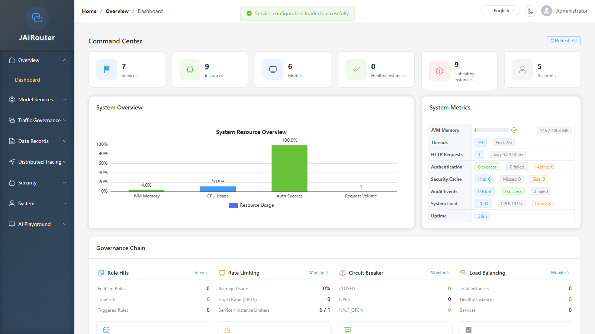
  <br/>
  <em>Management console — real-time service, instance and system metrics</em>
</p>

<details>
<summary><b>More screenshots</b></summary>

<p align="center">
  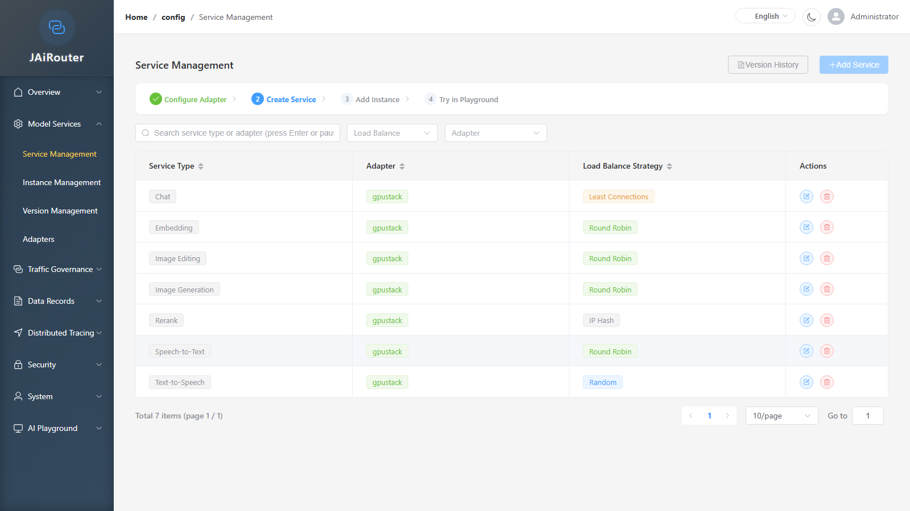
  <br/>
  <em>Service management — adapters and load-balancing strategies per service</em>
</p>

<p align="center">
  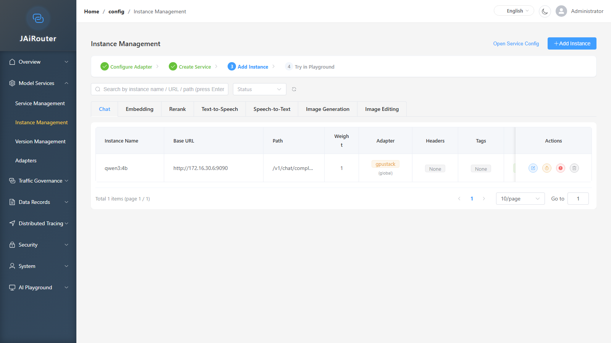
  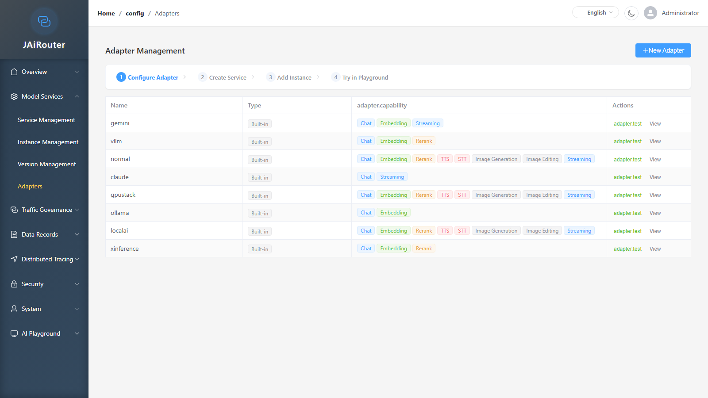
  <br/>
  <em>Instance & adapter management</em>
</p>

<p align="center">
  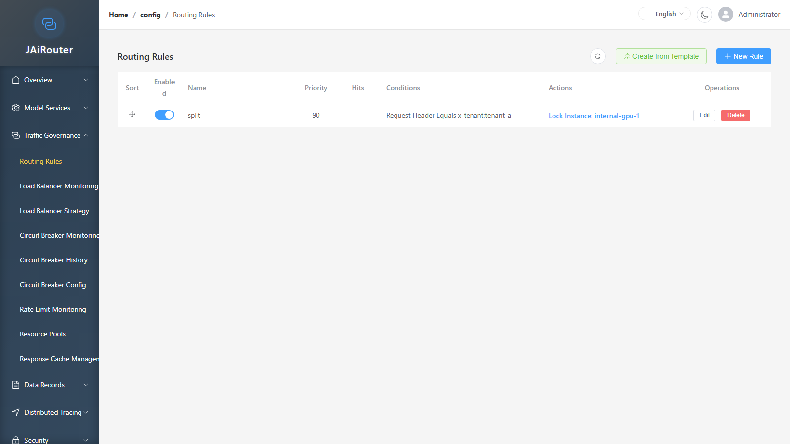
  <br/>
  <em>Visual routing rules with hit statistics, priority drag-and-drop and templates</em>
</p>

<p align="center">
  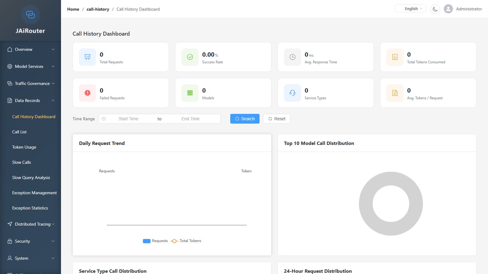
  <br/>
  <em>Call history analytics — success rate, latency and token usage trends</em>
</p>

<p align="center">
  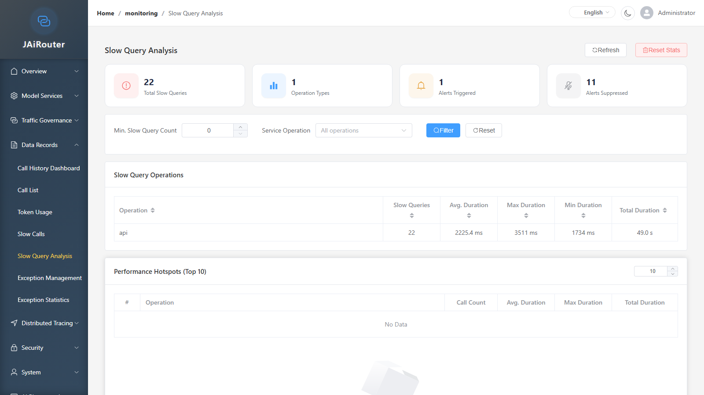
  <br/>
  <em>Slow-query analysis — hotspots, alert status and operation breakdown</em>
</p>

<p align="center">
  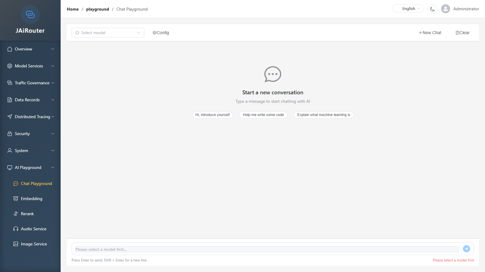
  <br/>
  <em>AI playground — chat, embedding, rerank, audio and image test benches</em>
</p>

<p align="center">
  
  <br/>
  <em>Quota runtime configuration — hot-toggle enable/disable, windows and fail-open; restart-required fields are read-only with a "restart needed" badge</em>
</p>

<p align="center">
  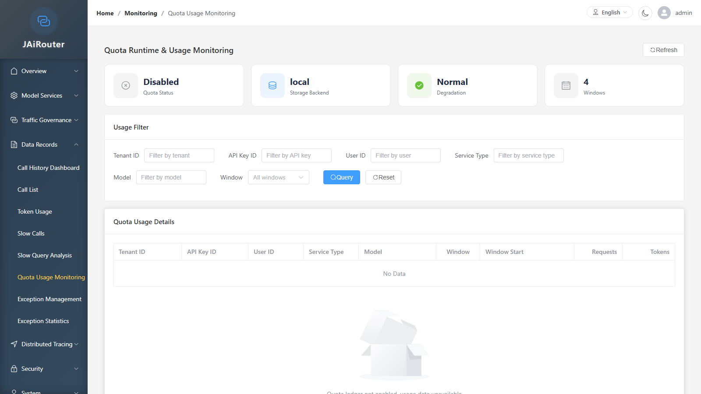
  <br/>
  <em>Quota usage monitoring — backend type and degradation status cards plus multi-dimensional filtering (tenant / key / user / service / model × window)</em>
</p>

<p align="center">
  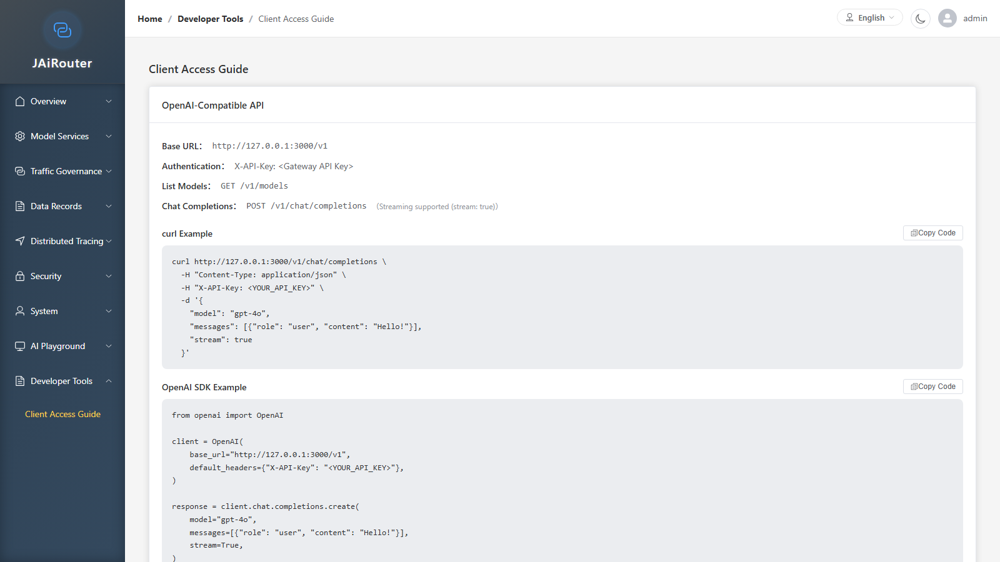
  <br/>
  <em>Client access guide — OpenAI-compatible and Anthropic base URLs, credential headers and copy-ready code snippets</em>
</p>

<p align="center">
  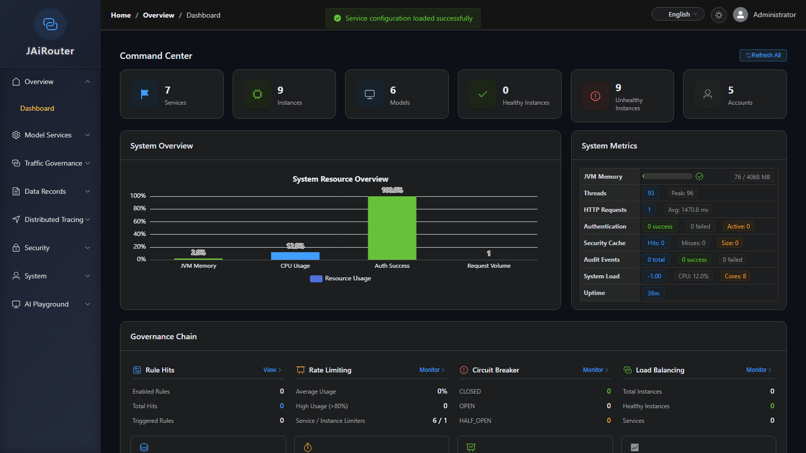
  <br/>
  <em>Built-in dark theme — the console is fully themeable and bilingual (zh-CN / en-US)</em>
</p>

</details>

## What is JAiRouter?

JAiRouter is a **production-ready AI model gateway** for teams that run their own inference infrastructure (Ollama, vLLM, GPUStack, Xinference) alongside cloud providers. It exposes every backend through one unified, OpenAI-compatible API and adds the resilience and governance layer you would otherwise build yourself: load balancing, rate limiting, circuit breaking, failover, RBAC, audit logging and observability.

| Problem | JAiRouter Solution |
|---------|-------------------|
| Multiple model endpoints to manage | Single unified API endpoint |
| Manual failover when a service fails | Automatic circuit breaker |
| Implementing auth for each service | JWT + API Key built-in |
| Scattered logs and metrics | Centralized observability |
| Service restart for config changes | Hot reload via Web Console |

### Core Features

- **🔌 OpenAI-Compatible API** — Drop-in replacement for OpenAI SDK, LangChain, LlamaIndex
- **🔧 Configurable Adapters** — Add new AI providers (DeepSeek, Zhipu, etc.) via config or Web UI, no code needed
- **⚖️ Smart Load Balancing** — Round-robin, weighted, least-connections, IP-hash, consistent-hash, EWMA latency-aware
- **🎯 Rule Engine & Tag Routing** — Visual conditional routing (model name, service type, request header, client IP, weight, instance tags)
- **🛡️ Rate Limiting** — Token bucket, leaky bucket, sliding window algorithms
- **🔥 Circuit Breaker** — Auto failover with configurable thresholds, plus request-level failover that retries on another healthy instance
- **🔐 Authentication & RBAC** — JWT + API Key with audit logging and data-driven RBAC (44 permission codes, 4 role templates, menu & URL authorization)
- **📊 Observability** — Prometheus metrics, OpenTelemetry tracing, real-time dashboards, call-history analytics
- **🔒 Record Governance** — Three recording levels (metadata-only / desensitized summary / AES-256-GCM-encrypted full content)
- **⚡ Response Cache** — Deterministic requests reuse the downstream response and skip the backend (opt-in, tenant-isolated keys)
- **💾 Persistence** — Redis / H2 / File storage for distributed deployment
- **🎛️ Web Console** — Visual management, version control, configuration rollback, dark/light theme

## Supported AI Backends

<details>
<summary><b>Built-in adapters</b> — chat, embedding, rerank, TTS/STT and image coverage</summary>

| Backend | Chat | Embedding | Rerank | TTS | STT | Image | Notes |
|---------|:----:|:---------:|:------:|:---:|:---:|:-----:|-------|
| **Ollama** | ✅ | ✅ | - | - | - | - | Local inference |
| **vLLM** | ✅ | ✅ | - | - | - | - | High-throughput |
| **GPUStack** | ✅ | ✅ | ✅ | ✅ | ✅ | ✅ | Full-featured |
| **Xinference** | ✅ | ✅ | ✅ | ✅ | ✅ | ✅ | Multi-model |
| **LocalAI** | ✅ | ✅ | - | ✅ | ✅ | ✅ | OpenAI-compatible |
| **OpenAI** | ✅ | ✅ | - | ✅ | ✅ | ✅ | Cloud fallback |
| **Anthropic Claude** | ✅ | - | - | - | - | - | Native Claude API |
| **Google Gemini** | ✅ | - | - | - | - | - | Native Gemini API |

</details>

<details>
<summary><b>Configurable adapters</b> — any OpenAI-compatible provider, no code required</summary>

| Provider | Configuration |
|----------|--------------|
| **DeepSeek** | `adapter-definitions: deepseek: type: openai-compatible` |
| **Zhipu (GLM)** | `adapter-definitions: zhipu: type: openai-compatible` |
| **Moonshot** | `adapter-definitions: moonshot: type: openai-compatible` |
| **Qwen (Tongyi)** | `adapter-definitions: qwen: type: openai-compatible` |
| **Baichuan** | `adapter-definitions: baichuan: type: openai-compatible` |
| **Minimax** | `adapter-definitions: minimax: type: openai-compatible` |

> 📖 See the [Adapter Configuration Guide](https://jairouter.com/configuration/adapter-config/) for details.

</details>

## Why Choose JAiRouter?

- **vs running backends directly** — no shared resilience, no central keys, no usage visibility. JAiRouter gives one endpoint, automatic failover and a full audit trail.
- **vs One-API / new-api** — those focus on distributing and billing API keys for shared accounts. JAiRouter targets the gateway in front of **your own local inference cluster**: multi-instance load balancing, circuit breaking, rule routing, RBAC and observability for self-hosted Ollama/vLLM/GPUStack. The two approaches complement each other.
- **vs Nginx** — Nginx is a general-purpose web server. JAiRouter is **purpose-built for AI/LLM workloads** with OpenAI-compatible routing, circuit breaking and model-aware load balancing.
- **vs LangChain** — LangChain is an application framework. JAiRouter is the **infrastructure layer beneath it**, providing routing, failover and monitoring.

| Feature | JAiRouter | Nginx | One-API | LangChain |
|---------|:---------:|:-----:|:-------:|:---------:|
| OpenAI Compatible | ✅ | ❌ | ✅ | ✅ |
| Load Balancing | ✅ | ✅ | ✅ | ❌ |
| Circuit Breaker | ✅ | ❌ | ❌ | ❌ |
| Rate Limiting | ✅ | ✅ | ✅ | ❌ |
| Web Console | ✅ | ❌ | ✅ | ❌ |
| Config Hot Reload | ✅ | ❌ | ✅ | ❌ |
| Version Control | ✅ | ❌ | ❌ | ❌ |
| OpenTelemetry | ✅ | ❌ | ❌ | ✅ |

## Architecture

<details>
<summary><b>How requests flow through the gateway</b></summary>

```
┌─────────────────────────────────────────────────────────────────┐
│                         Your Application                         │
│                 (OpenAI SDK / LangChain / LlamaIndex)           │
└─────────────────────────────────┬───────────────────────────────┘
                                  │
                                  ▼ OpenAI-Compatible API
┌─────────────────────────────────────────────────────────────────┐
│                         JAiRouter Gateway                        │
│  ┌─────────┐ ┌─────────┐ ┌─────────┐ ┌─────────┐ ┌─────────┐   │
│  │ Routing │ │ Balance │ │  Limit  │ │ Circuit │ │   Auth  │   │
│  └─────────┘ └─────────┘ └─────────┘ └─────────┘ └─────────┘   │
│  ┌─────────────────────────────────────────────────────────┐   │
│  │              Observability & Persistence                 │   │
│  └─────────────────────────────────────────────────────────┘   │
└─────────────────────────────────┬───────────────────────────────┘
                                  │
       ┌──────────────┬───────────┼───────────┬──────────────┐
       ▼              ▼           ▼           ▼              ▼
   ┌───────┐     ┌───────┐   ┌───────┐   ┌──────────┐   ┌───────┐
   │Ollama │     │ vLLM  │   │GPUStack│  │Xinference│   │ OpenAI │
   └───────┘     └───────┘   └───────┘   └──────────┘   └───────┘
```

</details>

## Documentation

| Resource | Link |
|----------|------|
| Full Documentation | https://jairouter.com |
| Deployment Guide | https://jairouter.com/en/deployment/ |
| Configuration | https://jairouter.com/en/configuration/ |
| Monitoring | https://jairouter.com/en/monitoring/ |
| API Reference | http://localhost:8080/swagger-ui |

## Roadmap

**Released** (latest: v3.1.2)

- [x] Core gateway with OpenAI-compatible API
- [x] Built-in + configurable adapters (Ollama, vLLM, GPUStack, Xinference, LocalAI, OpenAI, Claude, Gemini, …)
- [x] Multi-strategy load balancing (round-robin, weighted, least-connections, IP-hash, consistent-hash, EWMA latency-aware)
- [x] Rate limiting (token bucket, leaky bucket, sliding window)
- [x] Circuit breaker + request-level failover (retry on another healthy instance)
- [x] Visual rule engine: conditional routing, service-level dynamic rate limiting, tag routing
- [x] JWT + API Key authentication with audit logging
- [x] Data-driven RBAC (44 permission codes, 4 role templates, menu & URL authorization)
- [x] Call history with record governance (metadata-only / summary / AES-256-GCM full) and analytics dashboards
- [x] Response cache (deterministic reuse; opt-in, tenant-isolated)
- [x] Prometheus metrics + OpenTelemetry distributed tracing
- [x] Configuration version control & rollback
- [x] Web console with hot reload and dark/light theme
- [x] Docker image optimization (Alpine/Distroless)

**Recently released**

- [x] Token quota & multi-dimensional multi-window rate limiting: MINUTE/HOUR/DAY/MONTH ledger, JPA persistence, Redis distributed counting with automatic local fallback (`jairouter.quota.enabled=false` by default, v3.1.0)
- [x] Quota runtime config & observability: `GET/PUT /api/config/quota`, quota status/usage monitoring endpoints, 3 new console pages (quota config, usage monitoring, client access guide), new permission codes `config:quota:read/write`, `monitoring:quota:read` (v3.1.0)
- [x] OpenAI-native surface `/v1/models` endpoint (v3.1.0)
- [x] Anthropic `/v1/messages` entry: non-streaming + streaming SSE + `count_tokens` + tool calling (`tools`/`tool_choice`/`tool_use`/`tool_result`), Claude Code direct connectivity (v3.1.0)
- [x] Response cache P1: streaming SSE cache, invalidation API and rate-limit short-circuit (`DELETE /api/config/cache/response`, v2.9.10 — shipped in v3.0.3)
- [x] Web console refactor series: design tokens, dark theme, governance dashboard, bilingual UI (zh/en), slow-query analytics (v2.10.x)
- [x] Web complete-flow series: onboarding preselect loop, governance entries across pages, page-skeleton rollout (v3.0.1–v3.0.3)

**In progress**

- [ ] Semantic cache evaluation (vector-similarity reuse) — separate project
- [ ] High-availability foundation (multi-node / Redis distributed / config rollback) — assessed after v3.1.x

> **Current Release**: v3.1.2

## Contributing

Contributions are welcome — see the [Contributing Guide](https://jairouter.com/en/development/contributing/).

```bash
git clone https://github.com/Lincoln-cn/JAiRouter.git
cd JAiRouter
mvn clean package -DskipTests
java -jar target/model-router-*.jar
```

## Support

- **Documentation**: https://jairouter.com

### Issues or Discussions — where should I post?

GitHub gives us two channels and we keep them separate on purpose, so nothing gets lost. Pick by **what you have**, not by where you happen to be:

| What you have | Where to post | How we handle it |
|---------------|---------------|------------------|
| A **reproducible defect** — crash, wrong result, regression, broken doc | [**Issues**](https://github.com/Lincoln-cn/JAiRouter/issues) | **Fast follow-up** — triaged and answered quickly; confirmed defects are fixed or scheduled |
| A **requirement or idea** — feature request, new adapter, design discussion, usage question, feedback | [**Discussions**](https://github.com/Lincoln-cn/JAiRouter/discussions) | **Regularly curated** — ideas are collected, voted on and folded into the [Roadmap](#roadmap) |

**In one line**: a defect goes to **Issues**; a requirement or a question goes to **Discussions**.

> Not sure which one fits? Post in Discussions — if it turns out to be a reproducible defect, we will move it to Issues for you.

Discussions is organized by category:

| Category | Use it for |
|----------|------------|
| 💡 Ideas | Feature requests and improvement suggestions |
| 🗳 Polls | Community votes on direction |
| 🙏 Q&A | How-to questions for the community |
| 🙌 Show and tell | Share what you built on JAiRouter |
| 💬 General | Anything else |
| 📣 Announcements | Release notes from maintainers |

## License

JAiRouter is released under the [Apache 2.0 License](LICENSE).

---

<p align="center">
  <strong>If JAiRouter saves you time, <a href="https://github.com/Lincoln-cn/JAiRouter/stargazers">star it on GitHub</a> ⭐</strong>
  <br/>
  <em>Found a bug? Open an issue. Have an idea or a question? Start a discussion.</em>
</p>

<p align="center">
  Maintained by Lincoln-cn · Apache-2.0
</p>
