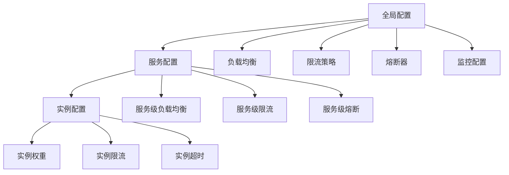

# 配置指南

JAiRouter 提供了灵活而强大的配置系统，支持静态配置和动态配置两种方式。本指南将详细介绍各种配置选项和最佳实践。

## 配置概述

JAiRouter 的配置系统设计原则：

- **分层配置**：支持全局、服务级别、实例级别的配置
- **动态更新**：支持运行时配置更新，无需重启服务
- **配置持久化**：支持内存和文件两种存储方式
- **配置验证**：自动验证配置的正确性和完整性

## 配置方式

| 配置方式 | 优先级 | 热更新 | 持久化 | 适用场景 |
|----------|--------|--------|--------|----------|
| **动态 API 配置** | 高 | ✅ | ✅ | 生产环境运维 |
| **JSON 配置文件** | 中 | ❌ | ✅ | 批量配置管理 |
| **YAML 配置文件** | 低 | ❌ | ✅ | 基础配置 |

## 配置结构



## 配置类别

### 核心配置

- **[应用配置](application-config.md)** - 服务器端口、WebClient、监控等基础配置
- **[动态配置](dynamic-config.md)** - 运行时配置管理和 API 接口

### 服务配置

- **[负载均衡](load-balancing.md)** - 四种负载均衡策略的配置和使用
- **[限流配置](rate-limiting.md)** - 多种限流算法的配置和调优
- **[熔断器配置](circuit-breaker.md)** - 熔断保护机制的配置和监控

## 配置示例

### 基础配置示例

```yaml
# application.yml
server:
  port: 8080

model:
  load-balance:
    type: round-robin
  rate-limit:
    enabled: true
    algorithm: token-bucket
    capacity: 1000
    rate: 100
  services:
    chat:
      instances:
        - name: "llama3.2:3b"
          base-url: "http://localhost:11434"
          path: "/v1/chat/completions"
          weight: 1
```

### 动态配置示例

```json
{
  "services": {
    "chat": {
      "instances": [
        {
          "name": "qwen2:7b",
          "baseUrl": "http://gpu-server:8080",
          "path": "/v1/chat/completions",
          "weight": 2
        }
      ],
      "loadBalance": {
        "type": "least-connections"
      },
      "rateLimit": {
        "type": "token-bucket",
        "capacity": 100,
        "refillRate": 10
      }
    }
  }
}
```

## 配置最佳实践

### 1. 环境隔离

```yaml
# application-dev.yml（开发环境）
model:
  rate-limit:
    capacity: 1000
    rate: 100

# application-prod.yml（生产环境）
model:
  rate-limit:
    capacity: 10000
    rate: 1000
```

### 2. 配置分层

- **全局配置**：设置默认值和通用参数
- **服务配置**：针对特定服务类型的优化
- **实例配置**：针对特定实例的个性化设置

### 3. 监控配置

```yaml
management:
  endpoints:
    web:
      exposure:
        include: health,info,metrics,prometheus
  metrics:
    export:
      prometheus:
        enabled: true
```

## 配置验证

JAiRouter 提供配置验证功能：

```bash
# 验证配置文件
curl "http://localhost:8080/api/config/merge/validate"

# 查看配置统计
curl "http://localhost:8080/api/config/merge/statistics"
```

## 故障排查

### 常见配置问题

1. **端口冲突**：检查 `server.port` 配置
2. **后端连接失败**：验证 `base-url` 和网络连通性
3. **限流过于严格**：调整 `capacity` 和 `rate` 参数
4. **负载不均衡**：检查实例 `weight` 配置

### 配置调试

```bash
# 查看当前配置
curl "http://localhost:8080/api/config/instance/type/chat"

# 查看服务状态
curl "http://localhost:8080/actuator/health"

# 查看指标
curl "http://localhost:8080/actuator/metrics"
```

## 下一步

选择您需要配置的功能：

- **[应用配置](application-config.md)** - 配置基础应用参数
- **[动态配置](dynamic-config.md)** - 学习运行时配置管理
- **[负载均衡](load-balancing.md)** - 配置负载均衡策略
- **[限流配置](rate-limiting.md)** - 设置流量控制
- **[熔断器配置](circuit-breaker.md)** - 配置故障保护