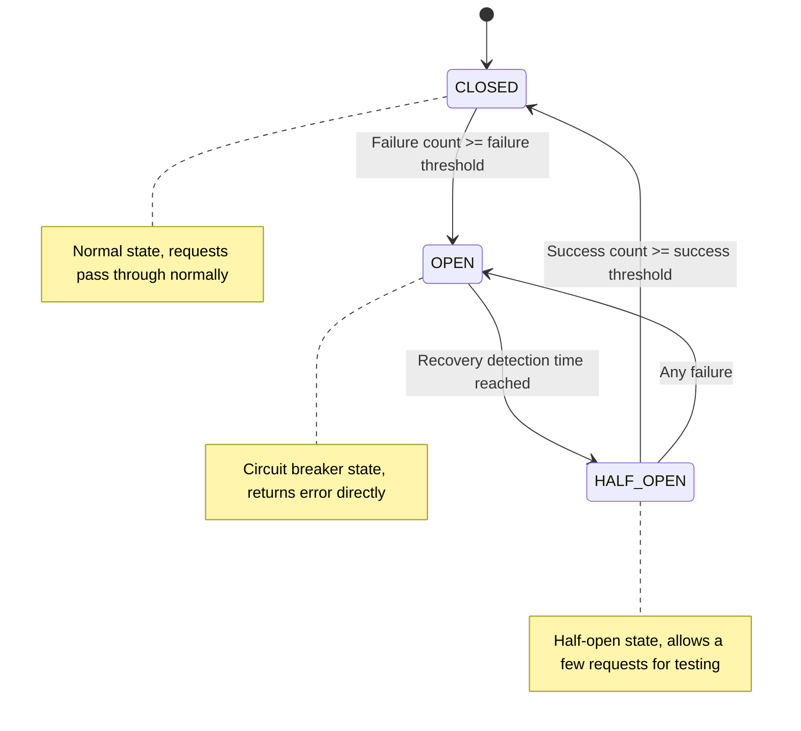

# Circuit Breaker Configuration

<!-- 版本信息 -->
> **文档版本**: 1.0.0  
> **最后更新**: 2025-08-19  
> **Git 提交**: c1aa5b0f  
> **作者**: Lincoln
<!-- /版本信息 -->


JAiRouter has a built-in circuit breaker mechanism to prevent service avalanches and cascading failures. When backend services fail, the circuit breaker automatically cuts off requests and automatically resumes normal operation after service recovery. This document details the configuration and usage of the circuit breaker.

## Circuit Breaker Overview

### Working Principle

The circuit breaker has three states:



### State Description

| State | Description | Behavior |
|------|------|------|
| **CLOSED** | Normal state | Requests pass through normally, failure count is recorded |
| **OPEN** | Circuit breaker state | Requests are directly rejected, circuit breaker error is returned |
| **HALF_OPEN** | Half-open state | Allows a few requests to test service recovery |

### Core Parameters

| Parameter | Description | Default Value |
|------|------|--------|
| [failureThreshold](file://D:\IdeaProjects\model-router\src\main\java\org\unreal\modelrouter\circuitbreaker\DefaultCircuitBreaker.java#L10-L10) | Failure threshold, circuit breaker trips after exceeding | 5 |
| `recoveryTimeout` | Recovery detection interval (milliseconds) | 60000 |
| [successThreshold](file://D:\IdeaProjects\model-router\src\main\java\org\unreal\modelrouter\circuitbreaker\DefaultCircuitBreaker.java#L12-L12) | Success threshold, circuit breaker closes after reaching | 3 |
| [timeout](file://D:\IdeaProjects\model-router\src\main\java\org\unreal\modelrouter\circuitbreaker\DefaultCircuitBreaker.java#L11-L11) | Request timeout (milliseconds) | 30000 |

## Global Circuit Breaker Configuration

### Basic Configuration

```yaml
# application.yml
model:
  circuit-breaker:
    enabled: true               # Enable global circuit breaker
    failure-threshold: 5        # Failure threshold
    recovery-timeout: 60000     # Recovery detection interval (milliseconds)
    success-threshold: 3        # Success threshold
    timeout: 30000             # Request timeout (milliseconds)
```

### Advanced Configuration

```yaml
model:
  circuit-breaker:
    enabled: true
    failure-threshold: 5
    recovery-timeout: 60000
    success-threshold: 3
    timeout: 30000
    
    # Statistics window configuration
    statistics:
      window-size: 100          # Statistics window size
      minimum-requests: 10      # Minimum number of requests
      
    # Exception configuration
    exceptions:
      include:                  # Included exception types
        - "java.net.ConnectException"
        - "java.net.SocketTimeoutException"
      exclude:                  # Excluded exception types
        - "java.lang.IllegalArgumentException"
    
    # Monitoring configuration
    monitoring:
      enabled: true             # Enable monitoring
      metrics-interval: 10s     # Metrics collection interval
```

## Service-Level Circuit Breaker Configuration

### YAML Configuration

```yaml
model:
  services:
    chat:
      circuit-breaker:
        enabled: true
        failure-threshold: 3     # More sensitive failure threshold
        recovery-timeout: 30000  # Faster recovery detection
        success-threshold: 2     # Faster recovery
        timeout: 45000          # Longer timeout
      instances:
        - name: "unstable-model"
          base-url: "http://unstable-server:8080"
          path: "/v1/chat/completions"
          weight: 1
    
    embedding:
      circuit-breaker:
        enabled: true
        failure-threshold: 10    # More lenient failure threshold
        recovery-timeout: 120000 # Longer recovery time
        success-threshold: 5     # More success count required
        timeout: 60000
```

### JSON Configuration

```json
{
  "services": {
    "chat": {
      "circuitBreaker": {
        "enabled": true,
        "failureThreshold": 5,
        "recoveryTimeout": 60000,
        "successThreshold": 3,
        "timeout": 30000
      },
      "instances": [
        {
          "name": "reliable-model",
          "baseUrl": "http://reliable-server:8080",
          "path": "/v1/chat/completions",
          "weight": 2
        }
      ]
    }
  }
}
```

## Instance-Level Circuit Breaker Configuration

### Independent Instance Circuit Breaking

```yaml
model:
  services:
    chat:
      instances:
        - name: "high-risk-model"
          base-url: "http://high-risk-server:8080"
          circuit-breaker:
            enabled: true
            failure-threshold: 2  # Stricter threshold
            recovery-timeout: 30000
            success-threshold: 1
            timeout: 20000
        
        - name: "stable-model"
          base-url: "http://stable-server:8080"
          circuit-breaker:
            enabled: true
            failure-threshold: 10 # More lenient threshold
            recovery-timeout: 60000
            success-threshold: 3
            timeout: 30000
```

### Instance-Specific Configuration

```json
{
  "services": {
    "chat": {
      "instances": [
        {
          "name": "experimental-model",
          "baseUrl": "http://experimental-server:8080",
          "circuitBreaker": {
            "enabled": true,
            "failureThreshold": 3,
            "recoveryTimeout": 45000,
            "successThreshold": 2,
            "timeout": 25000,
            "statistics": {
              "windowSize": 50,
              "minimumRequests": 5
            }
          }
        }
      ]
    }
  }
}
```

## Circuit Breaker and Fallback Strategy

### Basic Fallback Configuration

```yaml
model:
  services:
    chat:
      circuit-breaker:
        enabled: true
        failure-threshold: 5
        recovery-timeout: 60000
      
      # Fallback strategy configuration
      fallback:
        enabled: true
        strategy: default       # Fallback strategy: default or cache
        response:
          choices:
            - message:
                role: "assistant"
                content: "Service is temporarily unavailable. Please try again later."
              finish_reason: "stop"
          usage:
            prompt_tokens: 0
            completion_tokens: 0
            total_tokens: 0
```

### Cache Fallback Configuration

```yaml
model:
  services:
    embedding:
      circuit-breaker:
        enabled: true
        failure-threshold: 3
        recovery-timeout: 30000
      
      fallback:
        enabled: true
        strategy: cache
        cache:
          size: 1000            # Cache size
          ttl: 3600000         # Cache TTL (milliseconds)
          key-generator: "md5"  # Cache key generation algorithm
```

### JSON Fallback Configuration

```json
{
  "services": {
    "chat": {
      "circuitBreaker": {
        "enabled": true,
        "failureThreshold": 5,
        "recoveryTimeout": 60000
      },
      "fallback": {
        "type": "default",
        "response": {
          "id": "fallback-response",
          "object": "chat.completion",
          "choices": [
            {
              "index": 0,
              "message": {
                "role": "assistant",
                "content": "Sorry, the service is temporarily unavailable. We are working hard to restore the service. Please try again later."
              },
              "finish_reason": "stop"
            }
          ],
          "usage": {
            "prompt_tokens": 0,
            "completion_tokens": 0,
            "total_tokens": 0
          }
        }
      }
    }
  }
}
```

## Circuit Breaker Monitoring

### Monitoring Metrics

```bash
# Circuit breaker state
curl "http://localhost:8080/actuator/metrics/jairouter.circuitbreaker.state"

# Circuit breaker call statistics
curl "http://localhost:8080/actuator/metrics/jairouter.circuitbreaker.calls"

# Circuit breaker failure statistics
curl "http://localhost:8080/actuator/metrics/jairouter.circuitbreaker.failures"

# Circuit breaker recovery statistics
curl "http://localhost:8080/actuator/metrics/jairouter.circuitbreaker.recovery"
```

### Prometheus Metrics

```prometheus
# Circuit breaker state (0=CLOSED, 1=OPEN, 2=HALF_OPEN)
jairouter_circuitbreaker_state{service="chat",instance="model-1"}

# Total circuit breaker calls
jairouter_circuitbreaker_calls_total{service="chat",instance="model-1",result="success"}

# Circuit breaker failure rate
rate(jairouter_circuitbreaker_calls_total{result="failure"}[5m]) / rate(jairouter_circuitbreaker_calls_total[5m])

# Circuit breaker opening count
jairouter_circuitbreaker_opened_total{service="chat",instance="model-1"}
```

### Monitoring Dashboard

```yaml
# Grafana dashboard configuration
dashboard:
  panels:
    - title: "Circuit Breaker State"
      type: "stat"
      targets:
        - expr: 'jairouter_circuitbreaker_state'
          legendFormat: '{{service}}-{{instance}}'
    
    - title: "Circuit Breaker Failure Rate"
      type: "graph"
      targets:
        - expr: 'rate(jairouter_circuitbreaker_calls_total{result="failure"}[5m]) / rate(jairouter_circuitbreaker_calls_total[5m])'
          legendFormat: '{{service}}-{{instance}}'
    
    - title: "Circuit Breaker Opening Count"
      type: "graph"
      targets:
        - expr: 'increase(jairouter_circuitbreaker_opened_total[1h])'
          legendFormat: '{{service}}-{{instance}}'
```

## Circuit Breaker Alerts

### Prometheus Alert Rules

```yaml
groups:
  - name: jairouter_circuitbreaker
    rules:
      - alert: CircuitBreakerOpen
        expr: jairouter_circuitbreaker_state == 1
        for: 1m
        labels:
          severity: critical
        annotations:
          summary: "Circuit breaker open"
          description: "The circuit breaker for service {{ $labels.service }} instance {{ $labels.instance }} is open"
      
      - alert: HighFailureRate
        expr: rate(jairouter_circuitbreaker_calls_total{result="failure"}[5m]) / rate(jairouter_circuitbreaker_calls_total[5m]) > 0.5
        for: 2m
        labels:
          severity: warning
        annotations:
          summary: "High circuit breaker failure rate"
          description: "The failure rate for service {{ $labels.service }} instance {{ $labels.instance }} exceeds 50%"
      
      - alert: FrequentCircuitBreakerOpening
        expr: increase(jairouter_circuitbreaker_opened_total[1h]) > 5
        for: 0m
        labels:
          severity: warning
        annotations:
          summary: "Frequent circuit breaker opening"
          description: "The circuit breaker for service {{ $labels.service }} instance {{ $labels.instance }} has opened more than 5 times in the past hour"
```

### Alert Notification Configuration

```yaml
# AlertManager configuration
route:
  group_by: ['alertname', 'service']
  group_wait: 10s
  group_interval: 10s
  repeat_interval: 1h
  receiver: 'web.hook'

receivers:
  - name: 'web.hook'
    webhook_configs:
      - url: 'http://your-webhook-url/alert'
        send_resolved: true
```

## Circuit Breaker Tuning

### Parameter Tuning Guide

#### 1. Failure Threshold Tuning

```yaml
# Sensitive service: Fast circuit breaking
sensitive-service:
  circuit-breaker:
    failure-threshold: 3        # Circuit breaker trips after 3 failures

# Stable service: Lenient circuit breaking
stable-service:
  circuit-breaker:
    failure-threshold: 10       # Circuit breaker trips after 10 failures

# Experimental service: Extremely sensitive circuit breaking
experimental-service:
  circuit-breaker:
    failure-threshold: 1        # Circuit breaker trips after 1 failure
```

#### 2. Recovery Time Tuning

```yaml
# Fast recovery service
fast-recovery:
  circuit-breaker:
    recovery-timeout: 30000     # Attempt recovery after 30 seconds

# Slow recovery service
slow-recovery:
  circuit-breaker:
    recovery-timeout: 300000    # Attempt recovery after 5 minutes

# Adaptive recovery
adaptive-recovery:
  circuit-breaker:
    recovery-timeout: 60000
    adaptive-recovery:
      enabled: true
      min-timeout: 30000
      max-timeout: 600000
      backoff-multiplier: 2
```

#### 3. Success Threshold Tuning

```yaml
# Strict recovery: Requires more successes
strict-recovery:
  circuit-breaker:
    success-threshold: 5

# Quick recovery: Fewer successes needed
quick-recovery:
  circuit-breaker:
    success-threshold: 1

# Standard recovery
standard-recovery:
  circuit-breaker:
    success-threshold: 3
```

### Performance Optimization

#### 1. Statistics Window Optimization

```yaml
model:
  circuit-breaker:
    statistics:
      window-size: 100          # Statistics window size
      minimum-requests: 10      # Minimum number of requests
      sliding-window: true      # Use sliding window
      
    # Memory optimization
    memory:
      max-statistics: 1000      # Maximum number of statistics records
      cleanup-interval: 300s    # Cleanup interval
```

#### 2. Concurrency Optimization

```yaml
model:
  circuit-breaker:
    concurrency:
      thread-safe: true         # Thread safe
      lock-free: true          # Lock-free implementation
      batch-processing: true    # Batch processing
```

## Real-World Use Cases

### Case 1: Microservice Protection

```yaml
# Protect critical microservices
model:
  services:
    user-service:
      circuit-breaker:
        enabled: true
        failure-threshold: 5
        recovery-timeout: 60000
        success-threshold: 3
      fallback:
        enabled: true
        strategy: cache
        cache:
          size: 1000
          ttl: 300000
    
    order-service:
      circuit-breaker:
        enabled: true
        failure-threshold: 3     # More sensitive
        recovery-timeout: 30000  # Faster recovery
        success-threshold: 2
      fallback:
        enabled: true
        strategy: default
```

### Case 2: External API Protection

```yaml
# Protect external API calls
model:
  services:
    external-ai-api:
      circuit-breaker:
        enabled: true
        failure-threshold: 3
        recovery-timeout: 120000  # External service recovery is slower
        success-threshold: 5      # Requires more success confirmations
        timeout: 60000           # Longer timeout
      fallback:
        enabled: true
        strategy: default
        response:
          error:
            code: "service_unavailable"
            message: "External AI service is temporarily unavailable"
```

### Case 3: Layered Circuit Breaker Protection

```yaml
# Multi-layer circuit breaker protection
model:
  # Global circuit breaker
  circuit-breaker:
    enabled: true
    failure-threshold: 20
    recovery-timeout: 300000
  
  services:
    # Service-level circuit breaker
    critical-service:
      circuit-breaker:
        enabled: true
        failure-threshold: 10
        recovery-timeout: 120000
      
      instances:
        # Instance-level circuit breaker
        - name: "primary-instance"
          circuit-breaker:
            enabled: true
            failure-threshold: 5
            recovery-timeout: 60000
        
        - name: "backup-instance"
          circuit-breaker:
            enabled: true
            failure-threshold: 3   # Backup instance is more sensitive
            recovery-timeout: 30000
```

## Troubleshooting

### Common Issues

#### 1. Circuit Breaker Too Sensitive

**Symptom**: Service frequently trips, affecting normal usage

**Troubleshooting**:
```bash
# Check failure rate
curl "http://localhost:8080/actuator/metrics/jairouter.circuitbreaker.calls"

# Check circuit breaker opening frequency
curl "http://localhost:8080/actuator/metrics/jairouter.circuitbreaker.opened"
```

**Solution**:
```yaml
# Adjust parameters
circuit-breaker:
  failure-threshold: 10         # Increase failure threshold
  recovery-timeout: 30000       # Reduce recovery time
  success-threshold: 2          # Reduce success threshold
```

#### 2. Circuit Breaker Not Working

**Symptom**: Circuit breaker does not open when service fails

**Troubleshooting**:
```bash
# Check circuit breaker configuration
curl "http://localhost:8080/actuator/configprops" | jq '.model.circuit-breaker'

# Check circuit breaker state
curl "http://localhost:8080/actuator/metrics/jairouter.circuitbreaker.state"
```

**Solution**:
```yaml
# Ensure circuit breaker is enabled
circuit-breaker:
  enabled: true                 # Ensure enabled
  failure-threshold: 3          # Lower threshold
  timeout: 10000               # Reduce timeout
```

#### 3. Incorrect Fallback Response

**Symptom**: Incorrect fallback response format when circuit breaker trips

**Troubleshooting**:
```bash
# Test fallback response
curl -X POST "http://localhost:8080/v1/chat/completions" \
  -H "Content-Type: application/json" \
  -d '{"model": "unavailable-model", "messages": [{"role": "user", "content": "test"}]}'
```

**Solution**:
```yaml
# Correct fallback response format
fallback:
  strategy: default
  response:
    id: "fallback-response"
    object: "chat.completion"
    choices:
      - index: 0
        message:
          role: "assistant"
          content: "Service is temporarily unavailable"
        finish_reason: "stop"
```

### Debugging Tools

#### 1. Circuit Breaker State Check

```bash
#!/bin/bash
# Circuit breaker state check script

echo "=== Circuit Breaker State ==="
curl -s "http://localhost:8080/actuator/metrics/jairouter.circuitbreaker.state" | jq .

echo "=== Circuit Breaker Call Statistics ==="
curl -s "http://localhost:8080/actuator/metrics/jairouter.circuitbreaker.calls" | jq .

echo "=== Circuit Breaker Failure Statistics ==="
curl -s "http://localhost:8080/actuator/metrics/jairouter.circuitbreaker.failures" | jq .
```

#### 2. Circuit Breaker Test Tool

```bash
#!/bin/bash
# Circuit breaker test script

SERVICE_URL="http://localhost:8080/v1/chat/completions"
TEST_PAYLOAD='{"model": "test-model", "messages": [{"role": "user", "content": "test"}]}'

echo "Starting circuit breaker test..."

for i in {1..20}; do
  RESPONSE=$(curl -s -w "%{http_code}" -X POST "$SERVICE_URL" \
    -H "Content-Type: application/json" \
    -d "$TEST_PAYLOAD")
  
  HTTP_CODE=$(echo "$RESPONSE" | tail -c 4)
  echo "Request $i: HTTP $HTTP_CODE"
  
  if [ "$HTTP_CODE" = "503" ]; then
    echo "Circuit breaker is open"
    break
  fi
  
  sleep 1
done
```

## Best Practices

### 1. Circuit Breaker Configuration Strategy

```yaml
# Configure different circuit breaker strategies based on service characteristics

# Critical services: Fast circuit breaking, fast recovery
critical-services:
  circuit-breaker:
    failure-threshold: 3
    recovery-timeout: 30000
    success-threshold: 2

# Normal services: Standard configuration
normal-services:
  circuit-breaker:
    failure-threshold: 5
    recovery-timeout: 60000
    success-threshold: 3

# Experimental services: Extremely sensitive circuit breaking
experimental-services:
  circuit-breaker:
    failure-threshold: 1
    recovery-timeout: 120000
    success-threshold: 5
```

### 2. Monitoring and Alerts

- Set up circuit breaker state monitoring
- Configure failure rate alerts
- Monitor circuit breaker opening frequency
- Set up fallback response monitoring

### 3. Testing and Validation

- Regularly perform circuit breaker testing
- Verify the correctness of fallback responses
- Test recovery mechanisms
- Verify monitoring and alerts

## Next Steps

After completing circuit breaker configuration, you can continue to learn about:

- **[Monitoring Guide](../../monitoring/index.md)** - Setting up circuit breaker monitoring and alerts
- **[Troubleshooting](../troubleshooting/index.md)** - Circuit breaker problem diagnosis
- **[API Reference](../api-reference/index.md)** - Circuit breaker related APIs
- **[Deployment Guide](../../deployment/index.md)** - Production environment circuit breaker configuration
