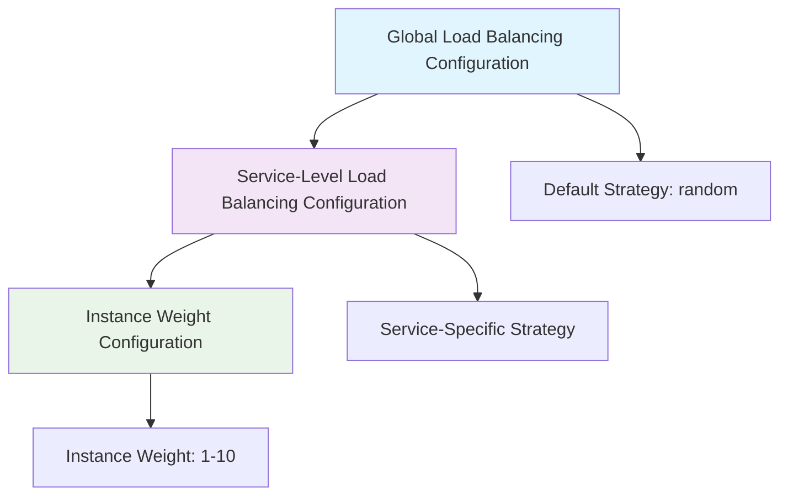
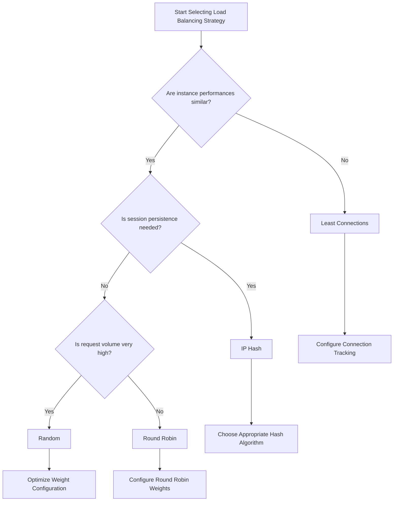

# Load Balancing Configuration

<!-- 版本信息 -->
> **文档版本**: 1.0.0  
> **最后更新**: 2025-08-19  
> **Git 提交**: c1aa5b0f  
> **作者**: Lincoln
<!-- /版本信息 -->


JAiRouter provides four load balancing strategies, supporting configuration at global, service, and instance levels. This document details the configuration methods and use cases for various load balancing strategies.

## Load Balancing Overview

### Supported Strategies

| Strategy | Algorithm | Features | Use Cases |
|----------|-----------|----------|-----------|
| **Random** | Random selection | Simple and efficient, uniform over time | Instances with similar performance |
| **Round Robin** | Round-robin allocation | Ensures each instance is used | Instances with similar performance |
| **Least Connections** | Minimum connections | Automatically balances load | Large differences in request processing time |
| **IP Hash** | Client IP hash | Session persistence | Client stickiness required |

### Configuration Hierarchy



## Global Load Balancing Configuration

### Basic Configuration

```yaml
# application.yml
model:
  load-balance:
    type: round-robin           # Global default strategy
    hash-algorithm: "md5"       # Hash algorithm for IP Hash strategy
    
    # Health check configuration
    health-check:
      enabled: true             # Enable health check
      interval: 30s            # Check interval
      timeout: 5s              # Check timeout
      failure-threshold: 3      # Failure threshold
      success-threshold: 2      # Success threshold
```

### Advanced Configuration

```yaml
model:
  load-balance:
    type: least-connections
    
    # Connection tracking configuration
    connection-tracking:
      enabled: true             # Enable connection tracking
      cleanup-interval: 60s     # Cleanup interval
      max-idle-time: 300s      # Maximum idle time
    
    # Weight adjustment configuration
    weight-adjustment:
      enabled: true             # Enable dynamic weight adjustment
      adjustment-interval: 30s  # Adjustment interval
      performance-window: 300s  # Performance statistics window
```

## Service-Level Load Balancing Configuration

### YAML Configuration Method

```yaml
model:
  services:
    chat:
      load-balance:
        type: least-connections
        hash-algorithm: "sha256"  # Required only for IP Hash strategy
      instances:
        - name: "high-perf-model"
          base-url: "http://gpu-server:8080"
          weight: 3               # High-weight instance
        - name: "standard-model"
          base-url: "http://cpu-server:8080"
          weight: 1               # Standard-weight instance
    
    embedding:
      load-balance:
        type: ip-hash
        hash-algorithm: "md5"
      instances:
        - name: "embedding-model-1"
          base-url: "http://embed-server-1:8080"
          weight: 2
        - name: "embedding-model-2"
          base-url: "http://embed-server-2:8080"
          weight: 2
```

### JSON Configuration Method

```json
{
  "services": {
    "chat": {
      "loadBalance": {
        "type": "round-robin",
        "healthCheck": {
          "enabled": true,
          "interval": 30000,
          "timeout": 5000
        }
      },
      "instances": [
        {
          "name": "qwen2:7b",
          "baseUrl": "http://gpu-cluster:8080",
          "path": "/v1/chat/completions",
          "weight": 3
        },
        {
          "name": "llama3.2:3b",
          "baseUrl": "http://cpu-cluster:8080",
          "path": "/v1/chat/completions",
          "weight": 1
        }
      ]
    }
  }
}
```

## Detailed Load Balancing Strategies

### 1. Random Strategy

#### Configuration Example

```yaml
model:
  services:
    chat:
      load-balance:
        type: random
      instances:
        - name: "model-1"
          base-url: "http://server-1:8080"
          weight: 1
        - name: "model-2"
          base-url: "http://server-2:8080"
          weight: 2
        - name: "model-3"
          base-url: "http://server-3:8080"
          weight: 1
```

#### Features and Use Cases

**Features**:
- Simple algorithm with minimal performance overhead
- Supports weight configuration
- Uniform request distribution over time
- Stateless, easy to scale

**Use Cases**:
- Instances with similar performance
- Relatively stable request processing time
- High-concurrency scenarios
- Stateless services

**Weight Calculation**:
```
Instance selection probability = Instance weight / Total weight
```

Example selection probabilities:
- model-1: 1/4 = 25%
- model-2: 2/4 = 50%
- model-3: 1/4 = 25%

### 2. Round Robin Strategy

#### Configuration Example

```yaml
model:
  services:
    embedding:
      load-balance:
        type: round-robin
      instances:
        - name: "embed-1"
          base-url: "http://embed-server-1:8080"
          weight: 2
        - name: "embed-2"
          base-url: "http://embed-server-2:8080"
          weight: 1
        - name: "embed-3"
          base-url: "http://embed-server-3:8080"
          weight: 3
```

#### Features and Use Cases

**Features**:
- Ensures each instance receives requests
- Supports weighted round-robin
- Predictable request distribution
- Suitable for batch processing scenarios

**Use Cases**:
- Instances with similar performance
- Need for uniform request distribution
- Batch data processing
- Testing and debugging scenarios

**Weighted Round Robin Algorithm**:
Generates a scheduling sequence based on weights; an instance with weight 2 will be selected consecutively twice.

Example scheduling sequence: embed-1, embed-1, embed-2, embed-3, embed-3, embed-3

### 3. Least Connections Strategy

#### Configuration Example

```yaml
model:
  services:
    chat:
      load-balance:
        type: least-connections
        connection-tracking:
          enabled: true
          cleanup-interval: 60s
          max-idle-time: 300s
      instances:
        - name: "fast-model"
          base-url: "http://fast-server:8080"
          weight: 2
        - name: "slow-model"
          base-url: "http://slow-server:8080"
          weight: 1
```

#### Features and Use Cases

**Features**:
- Automatically balances load
- Adapts to instance performance differences
- Requires maintaining connection state
- Dynamically adjusts request allocation

**Use Cases**:
- Large performance differences between instances
- Variable request processing time
- Long-connection services
- Need for precise load balancing

**Selection Algorithm**:
```
Selected instance = min(current connections / weight)
```

#### Connection Tracking Configuration

```yaml
model:
  load-balance:
    connection-tracking:
      enabled: true             # Enable connection tracking
      cleanup-interval: 60s     # Interval for cleaning up expired connections
      max-idle-time: 300s      # Maximum idle time for connections
      initial-connections: 0    # Initial connection count
      max-connections: 1000     # Maximum connection tracking
```

### 4. IP Hash Strategy

#### Configuration Example

```yaml
model:
  services:
    chat:
      load-balance:
        type: ip-hash
        hash-algorithm: "md5"    # Supported: md5, sha1, sha256
      instances:
        - name: "session-model-1"
          base-url: "http://session-server-1:8080"
          weight: 1
        - name: "session-model-2"
          base-url: "http://session-server-2:8080"
          weight: 1
        - name: "session-model-3"
          base-url: "http://session-server-3:8080"
          weight: 2
```

#### Features and Use Cases

**Features**:
- Same client always routed to the same instance
- Supports session persistence
- Instance changes affect routing
- May cause load imbalance

**Use Cases**:
- Session persistence required
- Stateful services
- Localized caching
- Personalized user services

**Hash Algorithm Selection**:

| Algorithm | Features | Performance | Uniformity |
|-----------|----------|-------------|------------|
| MD5 | Fast, uniform distribution | High | Good |
| SHA1 | Better security | Medium | Good |
| SHA256 | Best security | Low | Best |

#### Consistent Hash Configuration

```yaml
model:
  services:
    chat:
      load-balance:
        type: ip-hash
        hash-algorithm: "md5"
        consistent-hash:
          enabled: true          # Enable consistent hashing
          virtual-nodes: 150     # Number of virtual nodes
          hash-function: "md5"   # Hash function
```

## Dynamic Load Balancing Configuration

### Updating Load Balancing Strategy via API

```bash
# Update service load balancing strategy (requires configuration file or restart)
# Note: Current version does not support direct API updates to load balancing strategy
# Requires updating the configuration file and restarting the service

# But instance weights can be adjusted to influence load distribution
curl -X PUT "http://localhost:8080/api/config/instance/update/chat" \
  -H "Content-Type: application/json" \
  -d '{
    "instanceId": "high-perf-model@http://gpu-server:8080",
    "instance": {
      "name": "high-perf-model",
      "baseUrl": "http://gpu-server:8080",
      "path": "/v1/chat/completions",
      "weight": 5
    }
  }'
```

### Dynamic Instance Weight Adjustment

```bash
# Scenario: GPU server performance improved, increase weight
curl -X PUT "http://localhost:8080/api/config/instance/update/chat" \
  -H "Content-Type: application/json" \
  -d '{
    "instanceId": "gpu-model@http://gpu-server:8080",
    "instance": {
      "weight": 4
    }
  }'

# Scenario: CPU server overloaded, decrease weight
curl -X PUT "http://localhost:8080/api/config/instance/update/chat" \
  -H "Content-Type: application/json" \
  -d '{
    "instanceId": "cpu-model@http://cpu-server:8080",
    "instance": {
      "weight": 1
    }
  }'
```

## Load Balancing Monitoring

### Monitoring Metrics

JAiRouter provides the following load balancing related metrics:

```bash
# View load balancing metrics
curl "http://localhost:8080/actuator/metrics/jairouter.loadbalancer.requests"

# View instance request distribution
curl "http://localhost:8080/actuator/metrics/jairouter.instance.requests"

# View connection count statistics (Least Connections strategy only)
curl "http://localhost:8080/actuator/metrics/jairouter.connections.active"
```

### Prometheus Metrics

```prometheus
# Total load balancing requests
jairouter_loadbalancer_requests_total{service="chat",strategy="round-robin"}

# Instance request distribution
jairouter_instance_requests_total{service="chat",instance="model-1",status="success"}

# Active connections
jairouter_connections_active{service="chat",instance="model-1"}

# Instance response time
jairouter_instance_response_time_seconds{service="chat",instance="model-1"}
```

### Monitoring Dashboard Configuration

```yaml
# Grafana dashboard query examples
queries:
  - name: "Request Distribution"
    query: 'rate(jairouter_instance_requests_total[5m])'
    
  - name: "Load Balancing Effectiveness"
    query: 'jairouter_instance_requests_total / ignoring(instance) group_left sum(jairouter_instance_requests_total) by (service)'
    
  - name: "Instance Health Status"
    query: 'jairouter_instance_health_status'
```

## Performance Tuning

### 1. Strategy Selection Guide



### 2. Weight Configuration Best Practices

```yaml
# Weight configuration based on instance performance
model:
  services:
    chat:
      instances:
        # High-performance GPU server
        - name: "gpu-model"
          base-url: "http://gpu-server:8080"
          weight: 5              # High weight
          
        # Medium-performance server
        - name: "cpu-model"
          base-url: "http://cpu-server:8080"
          weight: 2              # Medium weight
          
        # Backup server
        - name: "backup-model"
          base-url: "http://backup-server:8080"
          weight: 1              # Low weight
```

### 3. Connection Pool Optimization

```yaml
# Optimization for Least Connections strategy
webclient:
  connection-pool:
    max-connections: 500        # Increase connection pool size
    max-idle-time: 30s         # Appropriate idle time
    pending-acquire-timeout: 60s # Connection acquisition timeout

model:
  load-balance:
    connection-tracking:
      cleanup-interval: 30s     # More frequent cleanup
      max-idle-time: 180s      # Shorter idle time
```

## Fault Handling

### 1. Automatic Instance Fault Handling

```yaml
model:
  load-balance:
    health-check:
      enabled: true
      interval: 15s             # More frequent health checks
      timeout: 3s
      failure-threshold: 2      # More sensitive fault detection
      success-threshold: 1      # Faster recovery detection
```

### 2. Failover Configuration

```yaml
model:
  services:
    chat:
      load-balance:
        type: round-robin
        failover:
          enabled: true          # Enable failover
          retry-attempts: 3      # Retry attempts
          retry-delay: 1s       # Retry delay
          circuit-breaker: true  # Enable circuit breaker
      instances:
        - name: "primary-model"
          base-url: "http://primary:8080"
          weight: 3
          priority: 1           # Primary instance
        - name: "secondary-model"
          base-url: "http://secondary:8080"
          weight: 2
          priority: 2           # Secondary instance
        - name: "backup-model"
          base-url: "http://backup:8080"
          weight: 1
          priority: 3           # Backup instance
```

### 3. Load Balancing Issue Diagnosis

```bash
# Check instance status
curl "http://localhost:8080/api/config/instance/type/chat"

# View load distribution
curl "http://localhost:8080/actuator/metrics/jairouter.instance.requests"

# Check connection status (Least Connections)
curl "http://localhost:8080/actuator/metrics/jairouter.connections.active"

# View health check status
curl "http://localhost:8080/actuator/health"
```

## Real-World Use Cases

### Case 1: E-commerce Recommendation System

```yaml
# Recommendation service requiring session persistence
model:
  services:
    recommendation:
      load-balance:
        type: ip-hash
        hash-algorithm: "md5"
      instances:
        - name: "rec-server-1"
          base-url: "http://rec-1:8080"
          weight: 1
        - name: "rec-server-2"
          base-url: "http://rec-2:8080"
          weight: 1
        - name: "rec-server-3"
          base-url: "http://rec-3:8080"
          weight: 1
```

### Case 2: Multi-Model AI Service

```yaml
# Model instances with different performance characteristics
model:
  services:
    chat:
      load-balance:
        type: least-connections
      instances:
        - name: "gpt-4"
          base-url: "http://openai-proxy:8080"
          weight: 1              # Slow but high quality
        - name: "llama3.2:70b"
          base-url: "http://gpu-cluster:8080"
          weight: 3              # Fast and good quality
        - name: "qwen2:7b"
          base-url: "http://cpu-cluster:8080"
          weight: 2              # Medium performance
```

### Case 3: High-Concurrency Scenario

```yaml
# High-concurrency chat service
model:
  services:
    chat:
      load-balance:
        type: random             # Lowest latency
      instances:
        - name: "chat-1"
          base-url: "http://chat-server-1:8080"
          weight: 1
        - name: "chat-2"
          base-url: "http://chat-server-2:8080"
          weight: 1
        - name: "chat-3"
          base-url: "http://chat-server-3:8080"
          weight: 1
```

## Next Steps

After completing load balancing configuration, you can continue to learn about:

- **[Rate Limiting Configuration](rate-limiting.md)** - Setting up traffic control and protection
- **[Circuit Breaker Configuration](circuit-breaker.md)** - Configuring fault protection mechanisms
- **[Monitoring Guide](../../monitoring/index.md)** - Setting up load balancing monitoring
- **[Troubleshooting](../troubleshooting/index.md)** - Load balancing issue diagnosis
