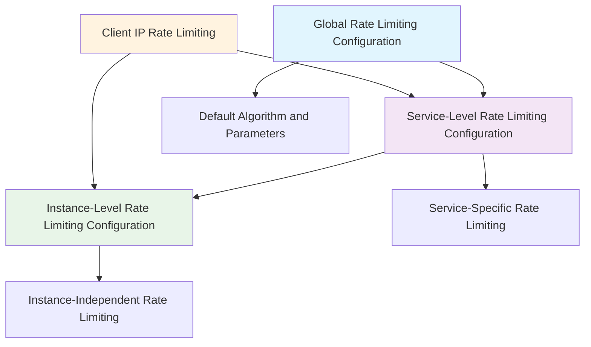
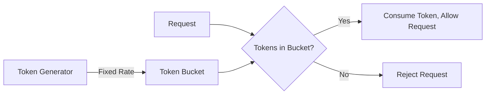
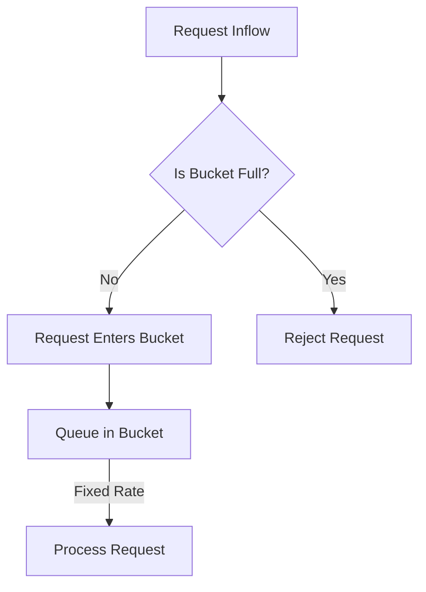
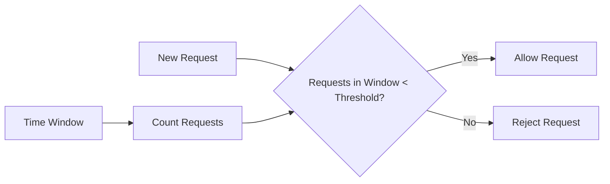

# Rate Limiting Configuration

<!-- 版本信息 -->
> **文档版本**: 1.0.0  
> **最后更新**: 2025-08-18  
> **Git 提交**: 3418d3f6  
> **作者**: Lincoln
<!-- /版本信息 -->


JAiRouter provides multiple rate limiting algorithms, supporting global, service-level, and instance-level rate limiting configurations, as well as independent rate limiting based on client IP. This document details the configuration and usage of various rate limiting strategies.

## Rate Limiting Overview

### Supported Algorithms

| Algorithm | Characteristics | Use Cases | Burst Handling |
|-----------|-----------------|-----------|----------------|
| **Token Bucket** | Allows burst traffic | Steady traffic + occasional bursts | Excellent |
| **Leaky Bucket** | Smooths output traffic | Requires steady output | Moderate |
| **Sliding Window** | Precise time window control | Precise traffic control | Moderate |
| **Warm Up** | Cold start protection | Service startup scenarios | Gradual |

### Rate Limiting Hierarchy



## Global Rate Limiting Configuration

### Basic Configuration

```yaml
# application.yml
model:
  rate-limit:
    enabled: true               # Enable global rate limiting
    algorithm: "token-bucket"   # Default algorithm
    capacity: 1000             # Default capacity
    rate: 100                  # Default rate
    scope: "service"           # Rate limiting scope: service or instance
    client-ip-enable: true     # Enable client IP rate limiting
```

### Advanced Configuration

```yaml
model:
  rate-limit:
    enabled: true
    algorithm: "token-bucket"
    
    # Client IP rate limiting configuration
    client-ip:
      enabled: true
      cleanup-interval: 300s    # Cleanup interval
      max-idle-time: 1800s     # Maximum idle time
      max-clients: 10000       # Maximum number of clients
    
    # Rate limiter performance configuration
    performance:
      async-processing: true    # Asynchronous processing
      batch-size: 100          # Batch processing size
      cache-size: 1000         # Cache size
```

## Detailed Rate Limiting Algorithms

### 1. Token Bucket Algorithm

#### Algorithm Principle

The token bucket algorithm maintains a fixed-capacity bucket and adds tokens at a fixed rate. Requests consume tokens when they arrive, and are rejected if no tokens are available.



#### Configuration Example

```yaml
model:
  services:
    chat:
      rate-limit:
        enabled: true
        algorithm: "token-bucket"
        capacity: 100            # Bucket capacity (maximum tokens)
        rate: 10                # Token refill rate (per second)
        scope: "service"        # Rate limiting scope
        client-ip-enable: true  # Enable client IP rate limiting
```

#### JSON Configuration

```json
{
  "services": {
    "chat": {
      "rateLimit": {
        "type": "token-bucket",
        "capacity": 100,
        "refillRate": 10,
        "clientIpEnable": true
      }
    }
  }
}
```

#### Parameter Description

| Parameter | Type | Description | Default Value |
|-----------|------|-------------|---------------|
| [capacity](file://D:\IdeaProjects\model-router\src\main\java\org\unreal\modelrouter\ratelimit\RateLimitConfig.java#L9-L9) | Integer | Bucket capacity, maximum number of tokens | 100 |
| [rate](file://D:\IdeaProjects\model-router\src\main\java\org\unreal\modelrouter\ratelimit\RateLimitConfig.java#L10-L10)/`refillRate` | Integer | Token refill rate (per second) | 10 |
| `client-ip-enable` | Boolean | Whether to enable client IP rate limiting | false |

#### Use Cases

- **Steady Traffic + Occasional Bursts**: Daily traffic is steady with occasional burst requests
- **API Gateway**: Need to allow short-term bursts but control long-term average rate
- **User Request Limiting**: Allow users to send multiple requests in a short time

#### Configuration Recommendations

```yaml
# High concurrency scenario
rate-limit:
  algorithm: "token-bucket"
  capacity: 1000              # Large capacity to support bursts
  rate: 100                  # Moderate refill rate

# Backend protection scenario
rate-limit:
  algorithm: "token-bucket"
  capacity: 50               # Small capacity to limit bursts
  rate: 5                    # Low rate to protect backend
```

### 2. Leaky Bucket Algorithm

#### Algorithm Principle

The leaky bucket algorithm maintains a fixed-capacity bucket. Requests enter the bucket to queue, and are processed at a fixed rate from the bottom of the bucket.



#### Configuration Example

```yaml
model:
  services:
    embedding:
      rate-limit:
        enabled: true
        algorithm: "leaky-bucket"
        capacity: 50            # Bucket capacity
        rate: 5                # Leak rate (per second)
        scope: "service"
        client-ip-enable: true
```

#### JSON Configuration

```json
{
  "services": {
    "embedding": {
      "rateLimit": {
        "type": "leaky-bucket",
        "capacity": 50,
        "leakRate": 5,
        "clientIpEnable": true
      }
    }
  }
}
```

#### Parameter Description

| Parameter | Type | Description | Default Value |
|-----------|------|-------------|---------------|
| [capacity](file://D:\IdeaProjects\model-router\src\main\java\org\unreal\modelrouter\ratelimit\RateLimitConfig.java#L9-L9) | Integer | Bucket capacity, maximum queued requests | 50 |
| [rate](file://D:\IdeaProjects\model-router\src\main\java\org\unreal\modelrouter\ratelimit\RateLimitConfig.java#L10-L10)/`leakRate` | Integer | Leak rate (per second) | 5 |

#### Use Cases

- **Steady Output Required**: Backend needs to receive requests at a steady rate
- **Message Queue**: Need to control message processing rate
- **Database Protection**: Protect database from burst traffic impact

### 3. Sliding Window Algorithm

#### Algorithm Principle

The sliding window algorithm counts requests within a fixed time window and rejects requests when the threshold is exceeded.



#### Configuration Example

```yaml
model:
  services:
    tts:
      rate-limit:
        enabled: true
        algorithm: "sliding-window"
        window-size: 60         # Time window size (seconds)
        max-requests: 100       # Maximum requests in window
        scope: "service"
        client-ip-enable: true
```

#### JSON Configuration

```json
{
  "services": {
    "tts": {
      "rateLimit": {
        "type": "sliding-window",
        "windowSize": 60,
        "maxRequests": 100,
        "clientIpEnable": true
      }
    }
  }
}
```

#### Parameter Description

| Parameter | Type | Description | Default Value |
|-----------|------|-------------|---------------|
| `window-size`/`windowSize` | Integer | Time window size (seconds) | 60 |
| `max-requests`/`maxRequests` | Integer | Maximum requests in window | 100 |

#### Use Cases

- **Precise Traffic Control**: Need precise control of requests within time window
- **API Quota Management**: Allocate API call quotas by time period
- **Interface Protection**: Prevent large number of duplicate requests in short time

### 4. Warm Up Algorithm

#### Algorithm Principle

The warm-up algorithm gradually increases the allowed request rate during service startup to avoid performance issues during cold start.

```mermaid
graph LR
    A[Service Startup] --> B[Low Rate]
    B --> C[Gradually Increase]
    C --> D[Reach Target Rate]
    
    E[Warm-up Time] --> F[Current Allowed Rate]
    F --> G[= Target Rate * (Current Time / Warm-up Time)]
```

#### Configuration Example

```yaml
model:
  services:
    chat:
      rate-limit:
        enabled: true
        algorithm: "warm-up"
        capacity: 100           # Final capacity
        rate: 10               # Final rate
        warm-up-period: 300    # Warm-up time (seconds)
        cold-factor: 3         # Cold start factor
        scope: "service"
```

#### JSON Configuration

```json
{
  "services": {
    "chat": {
      "rateLimit": {
        "type": "warm-up",
        "capacity": 100,
        "warmUpPeriod": 300,
        "coldFactor": 3,
        "clientIpEnable": true
      }
    }
  }
}
```

#### Parameter Description

| Parameter | Type | Description | Default Value |
|-----------|------|-------------|---------------|
| [capacity](file://D:\IdeaProjects\model-router\src\main\java\org\unreal\modelrouter\ratelimit\RateLimitConfig.java#L9-L9) | Integer | Final capacity | 100 |
| `warm-up-period`/[warmUpPeriod](file://D:\IdeaProjects\model-router\src\main\java\org\unreal\modelrouter\ratelimit\RateLimitConfig.java#L13-L13) | Integer | Warm-up time (seconds) | 300 |
| `cold-factor`/`coldFactor` | Integer | Cold start factor | 3 |

#### Use Cases

- **Service Cold Start**: Service needs warm-up when starting
- **Cache Warm-up**: Time needed to build cache
- **Connection Pool Warm-up**: Database connection pool needs time to establish

## Client IP Rate Limiting

### Basic Configuration

```yaml
model:
  rate-limit:
    client-ip-enable: true      # Enable client IP rate limiting
    
    # Client IP rate limiting configuration
    client-ip:
      enabled: true
      cleanup-interval: 300s    # Cleanup interval
      max-idle-time: 1800s     # Maximum idle time
      max-clients: 10000       # Maximum number of clients
      default-capacity: 100     # Default capacity
      default-rate: 10         # Default rate
```

### Service-Level IP Rate Limiting

```yaml
model:
  services:
    chat:
      rate-limit:
        enabled: true
        algorithm: "token-bucket"
        capacity: 1000          # Service-level total capacity
        rate: 100              # Service-level total rate
        client-ip-enable: true  # Enable IP rate limiting
        
        # Rate limiting configuration per IP
        client-ip:
          capacity: 50          # Capacity per IP
          rate: 5              # Rate per IP
```

### Instance-Level IP Rate Limiting

```yaml
model:
  services:
    chat:
      instances:
        - name: "model-1"
          base-url: "http://server-1:8080"
          rate-limit:
            enabled: true
            algorithm: "token-bucket"
            capacity: 100
            rate: 10
            scope: "instance"
            client-ip-enable: true
```

### IP Rate Limiting Monitoring

```bash
# View client IP rate limiting statistics
curl "http://localhost:8080/actuator/metrics/jairouter.ratelimit.clients"

# View IP rate limiter cleanup statistics
curl "http://localhost:8080/actuator/metrics/jairouter.ratelimit.cleanup"
```

## Multi-Layer Rate Limiting Configuration

### Layered Rate Limiting Strategy

```yaml
model:
  # Global rate limiting: Protect the entire system
  rate-limit:
    enabled: true
    algorithm: "token-bucket"
    capacity: 10000
    rate: 1000
    client-ip-enable: true
  
  services:
    chat:
      # Service-level rate limiting: Protect specific service
      rate-limit:
        enabled: true
        algorithm: "token-bucket"
        capacity: 1000
        rate: 100
        client-ip-enable: true
        client-ip:
          capacity: 50
          rate: 5
      
      instances:
        - name: "high-perf-model"
          base-url: "http://gpu-server:8080"
          # Instance-level rate limiting: Protect specific instance
          rate-limit:
            enabled: true
            algorithm: "token-bucket"
            capacity: 500
            rate: 50
            scope: "instance"
```

### Rate Limiting Priority

1. **Instance-Level Rate Limiting**: Highest priority, directly protects instances
2. **Service-Level Rate Limiting**: Medium priority, protects service types
3. **Global Rate Limiting**: Lowest priority, protects the entire system

## Dynamic Rate Limiting Configuration

### Dynamic Adjustment via Configuration Files

```json
{
  "services": {
    "chat": {
      "rateLimit": {
        "type": "token-bucket",
        "capacity": 200,
        "refillRate": 20,
        "clientIpEnable": true
      },
      "instances": [
        {
          "name": "model-1",
          "baseUrl": "http://server-1:8080",
          "rateLimit": {
            "type": "token-bucket",
            "capacity": 100,
            "refillRate": 10
          }
        }
      ]
    }
  }
}
```

### Rate Limiting Parameter Tuning

```bash
# Monitor current rate limiting effectiveness
curl "http://localhost:8080/actuator/metrics/jairouter.ratelimit.requests"

# Adjust configuration based on monitoring results
# If rejection rate is too high, increase capacity or rate
# If backend pressure is high, reduce capacity or rate
```

## Rate Limiting Monitoring and Alerting

### Monitoring Metrics

```bash
# Total rate limiting requests
curl "http://localhost:8080/actuator/metrics/jairouter.ratelimit.requests.total"

# Rate limiting rejections
curl "http://localhost:8080/actuator/metrics/jairouter.ratelimit.rejected.total"

# Number of client IPs
curl "http://localhost:8080/actuator/metrics/jairouter.ratelimit.clients.active"

# Rate limiter cleanup statistics
curl "http://localhost:8080/actuator/metrics/jairouter.ratelimit.cleanup.total"
```

### Prometheus Metrics

```prometheus
# Rate limiting request rate
rate(jairouter_ratelimit_requests_total[5m])

# Rate limiting rejection rate
rate(jairouter_ratelimit_rejected_total[5m]) / rate(jairouter_ratelimit_requests_total[5m])

# Active client count
jairouter_ratelimit_clients_active

# Rate limiter memory usage
jairouter_ratelimit_memory_usage_bytes
```

### Alert Rules

```yaml
# Prometheus alert rules
groups:
  - name: jairouter_ratelimit
    rules:
      - alert: HighRateLimitRejection
        expr: rate(jairouter_ratelimit_rejected_total[5m]) / rate(jairouter_ratelimit_requests_total[5m]) > 0.1
        for: 2m
        labels:
          severity: warning
        annotations:
          summary: "High rate limiting rejection rate"
          description: "Service {{ $labels.service }} rejection rate exceeds 10%"
      
      - alert: TooManyActiveClients
        expr: jairouter_ratelimit_clients_active > 5000
        for: 5m
        labels:
          severity: warning
        annotations:
          summary: "Too many active clients"
          description: "Active client count reached {{ $value }}, may need to adjust cleanup strategy"
```

## Performance Optimization

### 1. Rate Limiter Performance Configuration

```yaml
model:
  rate-limit:
    performance:
      async-processing: true    # Enable asynchronous processing
      batch-size: 100          # Batch processing size
      cache-size: 1000         # Cache size
      thread-pool-size: 4      # Thread pool size
```

### 2. Memory Optimization

```yaml
model:
  rate-limit:
    client-ip:
      cleanup-interval: 180s    # More frequent cleanup
      max-idle-time: 900s      # Shorter idle time
      max-clients: 5000        # Limit maximum clients
      
      # Memory optimization configuration
      memory:
        initial-capacity: 1000  # Initial capacity
        load-factor: 0.75      # Load factor
        concurrency-level: 16   # Concurrency level
```

### 3. Algorithm Selection Optimization

```yaml
# High concurrency scenario: Choose the best performing algorithm
model:
  services:
    high-traffic:
      rate-limit:
        algorithm: "token-bucket"  # Best performance
        
# Precise control scenario: Choose the most accurate algorithm
model:
  services:
    precise-control:
      rate-limit:
        algorithm: "sliding-window"  # Highest accuracy
```

## Practical Use Cases

### Case 1: API Gateway Rate Limiting

```yaml
# Multi-layer rate limiting protection
model:
  # Global rate limiting: Protect the entire gateway
  rate-limit:
    enabled: true
    algorithm: "token-bucket"
    capacity: 10000
    rate: 1000
    client-ip-enable: true
    client-ip:
      capacity: 100
      rate: 10
  
  services:
    # Chat service: High frequency usage
    chat:
      rate-limit:
        algorithm: "token-bucket"
        capacity: 5000
        rate: 500
        client-ip-enable: true
        client-ip:
          capacity: 50
          rate: 5
    
    # Image generation: Resource intensive
    image-generation:
      rate-limit:
        algorithm: "leaky-bucket"
        capacity: 100
        rate: 10
        client-ip-enable: true
        client-ip:
          capacity: 5
          rate: 1
```

### Case 2: Anti-Scraping Protection

```yaml
# Prevent malicious interface scraping
model:
  services:
    sensitive-api:
      rate-limit:
        enabled: true
        algorithm: "sliding-window"
        window-size: 300        # 5-minute window
        max-requests: 50        # Maximum 50 requests
        client-ip-enable: true
        client-ip:
          window-size: 60       # 1-minute window
          max-requests: 10      # Maximum 10 requests per IP
```

### Case 3: Service Warm-up

```yaml
# New service online warm-up
model:
  services:
    new-service:
      rate-limit:
        enabled: true
        algorithm: "warm-up"
        capacity: 1000
        rate: 100
        warm-up-period: 600     # 10-minute warm-up
        cold-factor: 5          # Initial rate is 1/5 of target
```

## Troubleshooting

### Common Issues

1. **Rate Limiting Too Strict**
   ```bash
   # Check rejection rate
   curl "http://localhost:8080/actuator/metrics/jairouter.ratelimit.rejected.total"
   
   # Solution: Increase capacity or rate
   ```

2. **High Memory Usage**
   ```bash
   # Check client count
   curl "http://localhost:8080/actuator/metrics/jairouter.ratelimit.clients.active"
   
   # Solution: Adjust cleanup strategy
   ```

3. **Rate Limiting Not Working**
   ```bash
   # Check if configuration is loaded correctly
   curl "http://localhost:8080/api/config/instance/type/chat"
   
   # Check if rate limiting is enabled
   ```

### Debugging Commands

```bash
# View rate limiting configuration
curl "http://localhost:8080/actuator/configprops" | jq '.model.rate-limit'

# View rate limiting metrics
curl "http://localhost:8080/actuator/metrics" | grep ratelimit

# Test rate limiting effect
for i in {1..20}; do
  curl -w "%{http_code}\n" "http://localhost:8080/v1/chat/completions" \
    -H "Content-Type: application/json" \
    -d '{"model": "test", "messages": [{"role": "user", "content": "test"}]}'
done
```

## Next Steps

After completing rate limiting configuration, you can continue to learn about:

- **[Circuit Breaker Configuration](circuit-breaker.md)** - Configure fault protection mechanisms
- **[Monitoring Guide](../../monitoring/index.md)** - Set up rate limiting monitoring and alerts
- **[Troubleshooting](../troubleshooting/index.md)** - Diagnose and resolve rate limiting issues
- **[Performance Tuning](../troubleshooting/performance.md)** - Optimize rate limiting performance
