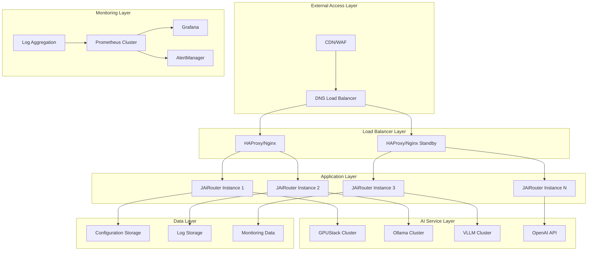

# Production Environment Deployment

<!-- 版本信息 -->
> **文档版本**: 1.0.0  
> **最后更新**: 2025-08-18  
> **Git 提交**: 3418d3f6  
> **作者**: Lincoln
<!-- /版本信息 -->


This document details how to deploy JAiRouter in a production environment, including enterprise-level deployment solutions such as high availability architecture, load balancing configuration, monitoring and alerting, backup and recovery.

## Production Environment Overview

### Architecture Features

- **High Availability**: Multi-instance deployment with automatic failover
- **Load Balancing**: Multi-layer load balancing with traffic distribution
- **Monitoring and Alerting**: Comprehensive monitoring with timely alerts
- **Security Hardening**: Multi-layer security protection
- **Backup and Recovery**: Complete backup and recovery strategy

### Deployment Architecture



## System Requirements

### Hardware Requirements

| Component | Minimum | Recommended | High Performance | Notes |
|-----------|---------|-------------|------------------|-------|
| **Load Balancer** | 2C4G | 4C8G | 8C16G | Active/standby mode, at least 2 units |
| **Application Server** | 4C8G | 8C16G | 16C32G | At least 3 units, supports failover |
| **Database Server** | 4C8G | 8C16G | 16C32G | Master-slave mode, read-write separation |
| **Monitoring Server** | 2C4G | 4C8G | 8C16G | Independent deployment to avoid affecting business |
| **Storage** | 100GB SSD | 500GB NVMe | 1TB+ NVMe | RAID configuration, data redundancy |
| **Network** | 1Gbps | 10Gbps | 25Gbps | Dual NIC bonding, network redundancy |

### Software Requirements

| Software | Version | Purpose |
|----------|---------|---------|
| **Operating System** | Ubuntu 20.04+ / CentOS 8+ | Server OS |
| **Docker** | 20.10+ | Container runtime |
| **Docker Compose** | 2.0+ | Container orchestration |
| **HAProxy** | 2.4+ | Load balancing |
| **Nginx** | 1.20+ | Reverse proxy |
| **Prometheus** | 2.30+ | Monitoring system |
| **Grafana** | 8.0+ | Visualization monitoring |

## High Availability Architecture Deployment

### 1. Load Balancer Configuration

#### HAProxy Configuration

Create `/etc/haproxy/haproxy.cfg`:

```bash
global
    daemon
    maxconn 4096
    log stdout local0
    
defaults
    mode http
    timeout connect 5000ms
    timeout client 50000ms
    timeout server 50000ms
    option httplog
    option dontlognull
    option redispatch
    retries 3

# Statistics page
stats enable
stats uri /stats
stats refresh 30s
stats admin if TRUE

# Frontend configuration
frontend jairouter_frontend
    bind *:80
    bind *:443 ssl crt /etc/ssl/certs/jairouter.pem
    redirect scheme https if !{ ssl_fc }
    
    # Health check
    acl health_check path_beg /health
    use_backend health_backend if health_check
    
    default_backend jairouter_backend

# Backend configuration
backend jairouter_backend
    balance roundrobin
    option httpchk GET /actuator/health
    http-check expect status 200
    
    server jairouter1 10.0.1.10:8080 check inter 5s fall 3 rise 2
    server jairouter2 10.0.1.11:8080 check inter 5s fall 3 rise 2
    server jairouter3 10.0.1.12:8080 check inter 5s fall 3 rise 2

backend health_backend
    server health 127.0.0.1:8080 check
```

#### Nginx Configuration

Create `/etc/nginx/sites-available/jairouter`:

```nginx
upstream jairouter_backend {
    least_conn;
    server 10.0.1.10:8080 max_fails=3 fail_timeout=30s;
    server 10.0.1.11:8080 max_fails=3 fail_timeout=30s;
    server 10.0.1.12:8080 max_fails=3 fail_timeout=30s;
}

server {
    listen 80;
    listen 443 ssl http2;
    server_name jairouter.example.com;
    
    # SSL configuration
    ssl_certificate /etc/ssl/certs/jairouter.crt;
    ssl_certificate_key /etc/ssl/private/jairouter.key;
    ssl_protocols TLSv1.2 TLSv1.3;
    ssl_ciphers ECDHE-RSA-AES256-GCM-SHA512:DHE-RSA-AES256-GCM-SHA512;
    
    # Security headers
    add_header X-Frame-Options DENY;
    add_header X-Content-Type-Options nosniff;
    add_header X-XSS-Protection "1; mode=block";
    
    # Log configuration
    access_log /var/log/nginx/jairouter_access.log;
    error_log /var/log/nginx/jairouter_error.log;
    
    # Proxy configuration
    location / {
        proxy_pass http://jairouter_backend;
        proxy_set_header Host $host;
        proxy_set_header X-Real-IP $remote_addr;
        proxy_set_header X-Forwarded-For $proxy_add_x_forwarded_for;
        proxy_set_header X-Forwarded-Proto $scheme;
        
        # Timeout configuration
        proxy_connect_timeout 30s;
        proxy_send_timeout 300s;
        proxy_read_timeout 300s;
        
        # Buffer configuration
        proxy_buffering on;
        proxy_buffer_size 4k;
        proxy_buffers 8 4k;
    }
    
    # Health check
    location /health {
        access_log off;
        return 200 "healthy\n";
        add_header Content-Type text/plain;
    }
    
    # Monitoring endpoint
    location /actuator {
        proxy_pass http://jairouter_backend;
        allow 10.0.0.0/8;
        deny all;
    }
}
```

### 2. Application Server Deployment

#### Docker Compose Production Configuration

Create `docker-compose.prod.yml`:

```yaml
version: '3.8'

services:
  jairouter:
    image: jairouter/model-router:latest
    container_name: jairouter-${INSTANCE_ID:-1}
    hostname: jairouter-${INSTANCE_ID:-1}
    restart: unless-stopped
    
    ports:
      - "${PORT:-8080}:8080"
    
    environment:
      - SPRING_PROFILES_ACTIVE=prod
      - JAVA_OPTS=-Xms1g -Xmx2g -XX:+UseG1GC -XX:+UseContainerSupport -XX:MaxRAMPercentage=75.0
      - INSTANCE_ID=${INSTANCE_ID:-1}
      - CLUSTER_NODES=${CLUSTER_NODES}
    
    volumes:
      - ./config:/app/config:ro
      - ./logs:/app/logs
      - ./config-store:/app/config-store
      - /etc/localtime:/etc/localtime:ro
    
    networks:
      - jairouter-network
    
    healthcheck:
      test: ["CMD", "curl", "-f", "http://localhost:8080/actuator/health"]
      interval: 30s
      timeout: 10s
      retries: 3
      start_period: 60s
    
    deploy:
      resources:
        limits:
          cpus: '2.0'
          memory: 2G
        reservations:
          cpus: '1.0'
          memory: 1G
    
    logging:
      driver: "json-file"
      options:
        max-size: "100m"
        max-file: "3"
    
    security_opt:
      - no-new-privileges:true
    
    ulimits:
      nofile:
        soft: 65536
        hard: 65536

networks:
  jairouter-network:
    driver: bridge
    ipam:
      config:
        - subnet: 172.20.0.0/16
```

#### Multi-instance Deployment Script

Create `deploy-cluster.sh`:

```bash
#!/bin/bash

# Configuration parameters
INSTANCES=3
BASE_PORT=8080
CLUSTER_NODES=""

# Generate cluster node list
for i in $(seq 1 $INSTANCES); do
    if [ $i -eq 1 ]; then
        CLUSTER_NODES="jairouter-$i:$((BASE_PORT + i - 1))"
    else
        CLUSTER_NODES="$CLUSTER_NODES,jairouter-$i:$((BASE_PORT + i - 1))"
    fi
done

echo "Deploying JAiRouter cluster, nodes: $CLUSTER_NODES"

# Deploy each instance
for i in $(seq 1 $INSTANCES); do
    echo "Deploying instance $i..."
    
    INSTANCE_ID=$i \
    PORT=$((BASE_PORT + i - 1)) \
    CLUSTER_NODES=$CLUSTER_NODES \
    docker-compose -f docker-compose.prod.yml up -d
    
    sleep 10
done

echo "Cluster deployment completed"

# Verify deployment
echo "Verifying cluster status..."
for i in $(seq 1 $INSTANCES); do
    port=$((BASE_PORT + i - 1))
    if curl -f http://localhost:$port/actuator/health > /dev/null 2>&1; then
        echo "Instance $i (port $port): Healthy"
    else
        echo "Instance $i (port $port): Unhealthy"
    fi
done
```

### 3. Configuration Management

#### Production Environment Configuration

Create `config/application-prod.yml`:

```yaml
server:
  port: 8080
  tomcat:
    threads:
      max: 200
      min-spare: 10
    connection-timeout: 20000
    max-connections: 8192
    accept-count: 100

spring:
  application:
    name: jairouter
  profiles:
    active: prod

model:
  # Global configuration
  load-balance:
    type: least-connections
    health-check:
      enabled: true
      interval: 30s
      timeout: 5s
      failure-threshold: 3
      success-threshold: 2
  
  rate-limit:
    enabled: true
    algorithm: token-bucket
    capacity: 10000
    rate: 1000
    client-ip-enable: true
    client-ip:
      cleanup-interval: 300s
      max-idle-time: 1800s
      max-clients: 50000
  
  circuit-breaker:
    enabled: true
    failure-threshold: 5
    recovery-timeout: 60000
    success-threshold: 3
    timeout: 30000
  
  services:
    chat:
      load-balance:
        type: least-connections
      rate-limit:
        enabled: true
        algorithm: token-bucket
        capacity: 5000
        rate: 500
        client-ip-enable: true
      circuit-breaker:
        enabled: true
        failure-threshold: 3
        recovery-timeout: 30000
      instances:
        - name: "gpt-4"
          base-url: "https://api.openai.com"
          path: "/v1/chat/completions"
          weight: 1
          headers:
            Authorization: "Bearer ${OPENAI_API_KEY}"
        - name: "claude-3"
          base-url: "https://api.anthropic.com"
          path: "/v1/messages"
          weight: 2
          headers:
            x-api-key: "${ANTHROPIC_API_KEY}"

# WebClient configuration
webclient:
  connection-timeout: 10s
  read-timeout: 60s
  write-timeout: 60s
  max-in-memory-size: 50MB
  connection-pool:
    max-connections: 1000
    max-idle-time: 30s
    pending-acquire-timeout: 60s

# Storage configuration
store:
  type: file
  path: "/app/config-store/"
  file:
    auto-backup: true
    backup-interval: 1h
    max-backups: 24
    compression: true

# Monitoring configuration
management:
  endpoints:
    web:
      exposure:
        include: health,info,metrics,prometheus
      base-path: /actuator
  endpoint:
    health:
      show-details: when-authorized
      show-components: always
    prometheus:
      cache:
        time-to-live: 10s
  metrics:
    export:
      prometheus:
        enabled: true
        descriptions: true
        step: 10s
    tags:
      application: jairouter
      environment: production
      instance: ${INSTANCE_ID:unknown}

# Logging configuration
logging:
  level:
    org.unreal.modelrouter: INFO
    org.springframework: WARN
    org.springframework.web: INFO
  pattern:
    file: "%d{yyyy-MM-dd HH:mm:ss.SSS} [%thread] %-5level [%X{traceId}] %logger{36} - %msg%n"
  file:
    name: /app/logs/jairouter.log
    max-size: 500MB
    max-history: 30
    total-size-cap: 10GB
```

## Monitoring and Alerting

### 1. Prometheus Configuration

Create `monitoring/prometheus.yml`:

```yaml
global:
  scrape_interval: 15s
  evaluation_interval: 15s

rule_files:
  - "rules/*.yml"

alerting:
  alertmanagers:
    - static_configs:
        - targets:
          - alertmanager:9093

scrape_configs:
  - job_name: 'jairouter'
    static_configs:
      - targets: 
        - 'jairouter-1:8080'
        - 'jairouter-2:8080'
        - 'jairouter-3:8080'
    metrics_path: '/actuator/prometheus'
    scrape_interval: 10s
    scrape_timeout: 5s
  
  - job_name: 'haproxy'
    static_configs:
      - targets: ['haproxy:8404']
    metrics_path: '/metrics'
  
  - job_name: 'nginx'
    static_configs:
      - targets: ['nginx-exporter:9113']
  
  - job_name: 'node'
    static_configs:
      - targets: 
        - 'node-exporter-1:9100'
        - 'node-exporter-2:9100'
        - 'node-exporter-3:9100'
```

### 2. Alert Rules

Create `monitoring/rules/jairouter.yml`:

```yaml
groups:
  - name: jairouter.rules
    rules:
      # Service availability alert
      - alert: JAiRouterDown
        expr: up{job="jairouter"} == 0
        for: 1m
        labels:
          severity: critical
        annotations:
          summary: "JAiRouter instance down"
          description: "JAiRouter instance {{ $labels.instance }} has been down for more than 1 minute"
      
      # High error rate alert
      - alert: JAiRouterHighErrorRate
        expr: rate(http_server_requests_total{status=~"5.."}[5m]) / rate(http_server_requests_total[5m]) > 0.05
        for: 2m
        labels:
          severity: warning
        annotations:
          summary: "JAiRouter high error rate"
          description: "JAiRouter instance {{ $labels.instance }} error rate exceeds 5%"
      
      # Response time alert
      - alert: JAiRouterHighLatency
        expr: histogram_quantile(0.95, rate(http_server_requests_seconds_bucket[5m])) > 2
        for: 5m
        labels:
          severity: warning
        annotations:
          summary: "JAiRouter high latency"
          description: "JAiRouter instance {{ $labels.instance }} 95th percentile response time exceeds 2 seconds"
      
      # Memory usage alert
      - alert: JAiRouterHighMemoryUsage
        expr: jvm_memory_used_bytes{area="heap"} / jvm_memory_max_bytes{area="heap"} > 0.8
        for: 5m
        labels:
          severity: warning
        annotations:
          summary: "JAiRouter high memory usage"
          description: "JAiRouter instance {{ $labels.instance }} heap memory usage exceeds 80%"
      
      # Rate limit alert
      - alert: JAiRouterHighRateLimitRejection
        expr: rate(jairouter_ratelimit_rejected_total[5m]) / rate(jairouter_ratelimit_requests_total[5m]) > 0.1
        for: 2m
        labels:
          severity: warning
        annotations:
          summary: "JAiRouter high rate limit rejection"
          description: "JAiRouter instance {{ $labels.instance }} rate limit rejection rate exceeds 10%"
      
      # Circuit breaker alert
      - alert: JAiRouterCircuitBreakerOpen
        expr: jairouter_circuitbreaker_state == 1
        for: 1m
        labels:
          severity: critical
        annotations:
          summary: "JAiRouter circuit breaker open"
          description: "JAiRouter instance {{ $labels.instance }} service {{ $labels.service }} circuit breaker is open"
```

### 3. AlertManager Configuration

Create `monitoring/alertmanager.yml`:

```yaml
global:
  smtp_smarthost: 'smtp.example.com:587'
  smtp_from: 'alerts@example.com'
  smtp_auth_username: 'alerts@example.com'
  smtp_auth_password: 'password'

route:
  group_by: ['alertname', 'cluster', 'service']
  group_wait: 10s
  group_interval: 10s
  repeat_interval: 1h
  receiver: 'web.hook'
  routes:
    - match:
        severity: critical
      receiver: 'critical-alerts'
    - match:
        severity: warning
      receiver: 'warning-alerts'

receivers:
  - name: 'web.hook'
    webhook_configs:
      - url: 'http://webhook-server:5001/webhook'
        send_resolved: true

  - name: 'critical-alerts'
    email_configs:
      - to: 'ops-team@example.com'
        subject: '[CRITICAL] JAiRouter Alert'
        body: |
          {{ range .Alerts }}
          Alert: {{ .Annotations.summary }}
          Description: {{ .Annotations.description }}
          {{ end }}
    webhook_configs:
      - url: 'http://webhook-server:5001/critical'
        send_resolved: true

  - name: 'warning-alerts'
    email_configs:
      - to: 'dev-team@example.com'
        subject: '[WARNING] JAiRouter Alert'
        body: |
          {{ range .Alerts }}
          Alert: {{ .Annotations.summary }}
          Description: {{ .Annotations.description }}
          {{ end }}

inhibit_rules:
  - source_match:
      severity: 'critical'
    target_match:
      severity: 'warning'
    equal: ['alertname', 'cluster', 'service']
```

### 4. Grafana Dashboard

Create `monitoring/grafana/dashboards/jairouter-overview.json`:

```json
{
  "dashboard": {
    "id": null,
    "title": "JAiRouter Overview",
    "tags": ["jairouter"],
    "timezone": "browser",
    "panels": [
      {
        "id": 1,
        "title": "Request Rate",
        "type": "graph",
        "targets": [
          {
            "expr": "sum(rate(http_server_requests_total[5m])) by (instance)",
            "legendFormat": "{{instance}}"
          }
        ],
        "yAxes": [
          {
            "label": "Requests/sec"
          }
        ]
      },
      {
        "id": 2,
        "title": "Response Time",
        "type": "graph",
        "targets": [
          {
            "expr": "histogram_quantile(0.95, sum(rate(http_server_requests_seconds_bucket[5m])) by (le, instance))",
            "legendFormat": "95th percentile - {{instance}}"
          },
          {
            "expr": "histogram_quantile(0.50, sum(rate(http_server_requests_seconds_bucket[5m])) by (le, instance))",
            "legendFormat": "50th percentile - {{instance}}"
          }
        ],
        "yAxes": [
          {
            "label": "Seconds"
          }
        ]
      },
      {
        "id": 3,
        "title": "Error Rate",
        "type": "graph",
        "targets": [
          {
            "expr": "sum(rate(http_server_requests_total{status=~\"5..\"}[5m])) by (instance) / sum(rate(http_server_requests_total[5m])) by (instance)",
            "legendFormat": "Error Rate - {{instance}}"
          }
        ],
        "yAxes": [
          {
            "label": "Percentage",
            "max": 1,
            "min": 0
          }
        ]
      },
      {
        "id": 4,
        "title": "JVM Memory Usage",
        "type": "graph",
        "targets": [
          {
            "expr": "jvm_memory_used_bytes{area=\"heap\"} / jvm_memory_max_bytes{area=\"heap\"}",
            "legendFormat": "Heap Usage - {{instance}}"
          }
        ],
        "yAxes": [
          {
            "label": "Percentage",
            "max": 1,
            "min": 0
          }
        ]
      }
    ],
    "time": {
      "from": "now-1h",
      "to": "now"
    },
    "refresh": "30s"
  }
}
```

## Security Configuration

### 1. Network Security

#### Firewall Configuration

```bash
# Ubuntu/Debian
ufw allow 22/tcp
ufw allow 80/tcp
ufw allow 443/tcp
ufw allow from 10.0.0.0/8 to any port 8080
ufw enable

# CentOS/RHEL
firewall-cmd --permanent --add-service=ssh
firewall-cmd --permanent --add-service=http
firewall-cmd --permanent --add-service=https
firewall-cmd --permanent --add-rich-rule="rule family='ipv4' source address='10.0.0.0/8' port protocol='tcp' port='8080' accept"
firewall-cmd --reload
```

#### SSL/TLS Configuration

```bash
# Generate self-signed certificate (for testing)
openssl req -x509 -nodes -days 365 -newkey rsa:2048 \
  -keyout /etc/ssl/private/jairouter.key \
  -out /etc/ssl/certs/jairouter.crt

# Or use Let's Encrypt
certbot --nginx -d jairouter.example.com
```

### 2. Application Security

#### Environment Variable Management

Create `.env.prod`:

```bash
# API Keys
OPENAI_API_KEY=sk-your-openai-api-key
ANTHROPIC_API_KEY=your-anthropic-api-key

# Database Password
DB_PASSWORD=your-secure-password

# JWT Secret
JWT_SECRET=your-jwt-secret-key

# Monitoring Password
GRAFANA_ADMIN_PASSWORD=your-grafana-password
```

#### Container Security

```yaml
# docker-compose.prod.yml security configuration
services:
  jairouter:
    security_opt:
      - no-new-privileges:true
    read_only: true
    tmpfs:
      - /tmp
    user: "1001:1001"
    cap_drop:
      - ALL
    cap_add:
      - NET_BIND_SERVICE
```

## Backup and Recovery

### 1. Configuration Backup

Create `backup-config.sh`:

```bash
#!/bin/bash

BACKUP_DIR="/backup/jairouter"
DATE=$(date +%Y%m%d_%H%M%S)
BACKUP_FILE="jairouter_config_$DATE.tar.gz"

# Create backup directory
mkdir -p $BACKUP_DIR

# Backup configuration files
tar -czf $BACKUP_DIR/$BACKUP_FILE \
  config/ \
  docker-compose.prod.yml \
  monitoring/ \
  scripts/

# Keep backups for the last 30 days
find $BACKUP_DIR -name "jairouter_config_*.tar.gz" -mtime +30 -delete

echo "Configuration backup completed: $BACKUP_DIR/$BACKUP_FILE"
```

### 2. Data Backup

Create `backup-data.sh`:

```bash
#!/bin/bash

BACKUP_DIR="/backup/jairouter"
DATE=$(date +%Y%m%d_%H%M%S)

# Backup configuration store
docker exec jairouter-1 tar -czf - /app/config-store | \
  cat > $BACKUP_DIR/config-store_$DATE.tar.gz

# Backup logs (last 7 days)
find logs/ -name "*.log" -mtime -7 | \
  tar -czf $BACKUP_DIR/logs_$DATE.tar.gz -T -

# Backup monitoring data
docker exec prometheus tar -czf - /prometheus | \
  cat > $BACKUP_DIR/prometheus_$DATE.tar.gz

echo "Data backup completed"
```

### 3. Automatic Backup

Create crontab task:

```bash
# Edit crontab
crontab -e

# Add backup tasks
0 2 * * * /path/to/backup-config.sh
0 3 * * * /path/to/backup-data.sh
```

### 4. Recovery Process

Create `restore.sh`:

```bash
#!/bin/bash

BACKUP_FILE=$1
RESTORE_DIR="/tmp/jairouter_restore"

if [ -z "$BACKUP_FILE" ]; then
    echo "Usage: $0 <backup_file>"
    exit 1
fi

# Stop services
docker-compose -f docker-compose.prod.yml down

# Create restore directory
mkdir -p $RESTORE_DIR
cd $RESTORE_DIR

# Extract backup file
tar -xzf $BACKUP_FILE

# Restore configuration files
cp -r config/ /path/to/jairouter/
cp docker-compose.prod.yml /path/to/jairouter/
cp -r monitoring/ /path/to/jairouter/

# Start services
cd /path/to/jairouter
docker-compose -f docker-compose.prod.yml up -d

echo "Recovery completed"
```

## Performance Optimization

### 1. JVM Tuning

```bash
# Production environment JVM parameters
JAVA_OPTS="
-Xms2g -Xmx4g
-XX:+UseG1GC
-XX:MaxGCPauseMillis=200
-XX:+UseContainerSupport
-XX:MaxRAMPercentage=75.0
-XX:+HeapDumpOnOutOfMemoryError
-XX:HeapDumpPath=/app/logs/
-XX:+UseStringDeduplication
-XX:+OptimizeStringConcat
-Djava.security.egd=file:/dev/./urandom
"
```

### 2. System Tuning

```bash
# Kernel parameter optimization
cat >> /etc/sysctl.conf << EOF
# Network optimization
net.core.somaxconn = 65535
net.core.netdev_max_backlog = 5000
net.ipv4.tcp_max_syn_backlog = 65535
net.ipv4.tcp_fin_timeout = 30
net.ipv4.tcp_keepalive_time = 1200
net.ipv4.tcp_max_tw_buckets = 5000

# File descriptors
fs.file-max = 2097152
fs.nr_open = 2097152

# Virtual memory
vm.swappiness = 10
vm.dirty_ratio = 15
vm.dirty_background_ratio = 5
EOF

sysctl -p
```

### 3. Container Optimization

```yaml
# docker-compose.prod.yml performance optimization
services:
  jairouter:
    ulimits:
      nofile:
        soft: 65536
        hard: 65536
      nproc:
        soft: 32768
        hard: 32768
    
    sysctls:
      - net.core.somaxconn=65535
      - net.ipv4.tcp_keepalive_time=1200
    
    deploy:
      resources:
        limits:
          cpus: '4.0'
          memory: 4G
        reservations:
          cpus: '2.0'
          memory: 2G
```

## Operations Management

### 1. Health Check Script

Create `health-check.sh`:

```bash
#!/bin/bash

INSTANCES=("jairouter-1:8080" "jairouter-2:8080" "jairouter-3:8080")
FAILED=0

echo "JAiRouter Cluster Health Check - $(date)"
echo "=================================="

for instance in "${INSTANCES[@]}"; do
    if curl -f -s http://$instance/actuator/health > /dev/null; then
        echo "✓ $instance - Healthy"
    else
        echo "✗ $instance - Unhealthy"
        FAILED=$((FAILED + 1))
    fi
done

echo "=================================="
echo "Total instances: ${#INSTANCES[@]}"
echo "Healthy instances: $((${#INSTANCES[@]} - FAILED))"
echo "Unhealthy instances: $FAILED"

if [ $FAILED -gt 0 ]; then
    exit 1
fi
```

### 2. Log Rotation

Create `/etc/logrotate.d/jairouter`:

```bash
/path/to/jairouter/logs/*.log {
    daily
    rotate 30
    compress
    delaycompress
    missingok
    notifempty
    create 0644 jairouter jairouter
    postrotate
        docker exec jairouter-1 kill -USR1 1
        docker exec jairouter-2 kill -USR1 1
        docker exec jairouter-3 kill -USR1 1
    endscript
}
```

### 3. Monitoring Script

Create `monitor.sh`:

```bash
#!/bin/bash

# Check container status
echo "Container status:"
docker ps --filter "name=jairouter" --format "table {{.Names}}\t{{.Status}}\t{{.Ports}}"

# Check resource usage
echo -e "\nResource usage:"
docker stats --no-stream --format "table {{.Name}}\t{{.CPUPerc}}\t{{.MemUsage}}\t{{.NetIO}}"

# Check error logs
echo -e "\nRecent error logs:"
docker logs --since="1h" jairouter-1 2>&1 | grep -i error | tail -5
```

## Troubleshooting

### 1. Common Issue Diagnosis

```bash
# Check service status
systemctl status docker
docker-compose ps

# Check network connectivity
curl -v http://localhost:8080/actuator/health
telnet jairouter-1 8080

# Check resource usage
top
free -h
df -h

# Check logs
docker logs jairouter-1 --tail 100
tail -f logs/jairouter.log
```

### 2. Performance Issue Troubleshooting

```bash
# JVM performance analysis
docker exec jairouter-1 jstack 1
docker exec jairouter-1 jstat -gc 1 5s

# Network performance analysis
iftop
netstat -i
ss -tuln

# Disk I/O analysis
iotop
iostat -x 1
```

### 3. Fault Recovery Process

1. **Identify the problem**: Discover issues through monitoring alerts or health checks
2. **Isolate the fault**: Remove the faulty instance from the load balancer
3. **Diagnose the cause**: Analyze logs, metrics, and system status
4. **Fix the problem**: Restart services, fix configurations, or scale resources
5. **Verify recovery**: Confirm normal service before rejoining the load balancer
6. **Summarize improvements**: Document fault causes and improvement measures

## Best Practices

### 1. Deployment Strategy

- Use blue-green deployment or rolling updates
- Implement canary releases
- Configure automatic rollback mechanisms
- Establish complete testing processes

### 2. Monitoring Strategy

- Set up multi-layer monitoring (infrastructure, application, business)
- Configure reasonable alert thresholds
- Establish fault response procedures
- Regularly maintain monitoring systems

### 3. Security Strategy

- Regularly update systems and dependencies
- Implement the principle of least privilege
- Configure network isolation
- Establish security audit mechanisms

### 4. Operations Strategy

- Automate deployment and operations processes
- Establish complete backup and recovery mechanisms
- Regularly conduct fault drills
- Continuously optimize performance and costs

## Next Steps

After completing the production environment deployment, you can:

- **[Monitoring Guide](../../monitoring/index.md)** - Deep dive into monitoring configuration
- **[Troubleshooting](../troubleshooting/index.md)** - Learn fault diagnosis skills
- **[Performance Tuning](../troubleshooting/performance.md)** - Optimize system performance
- **[API Reference](../api-reference/index.md)** - Understand management API
