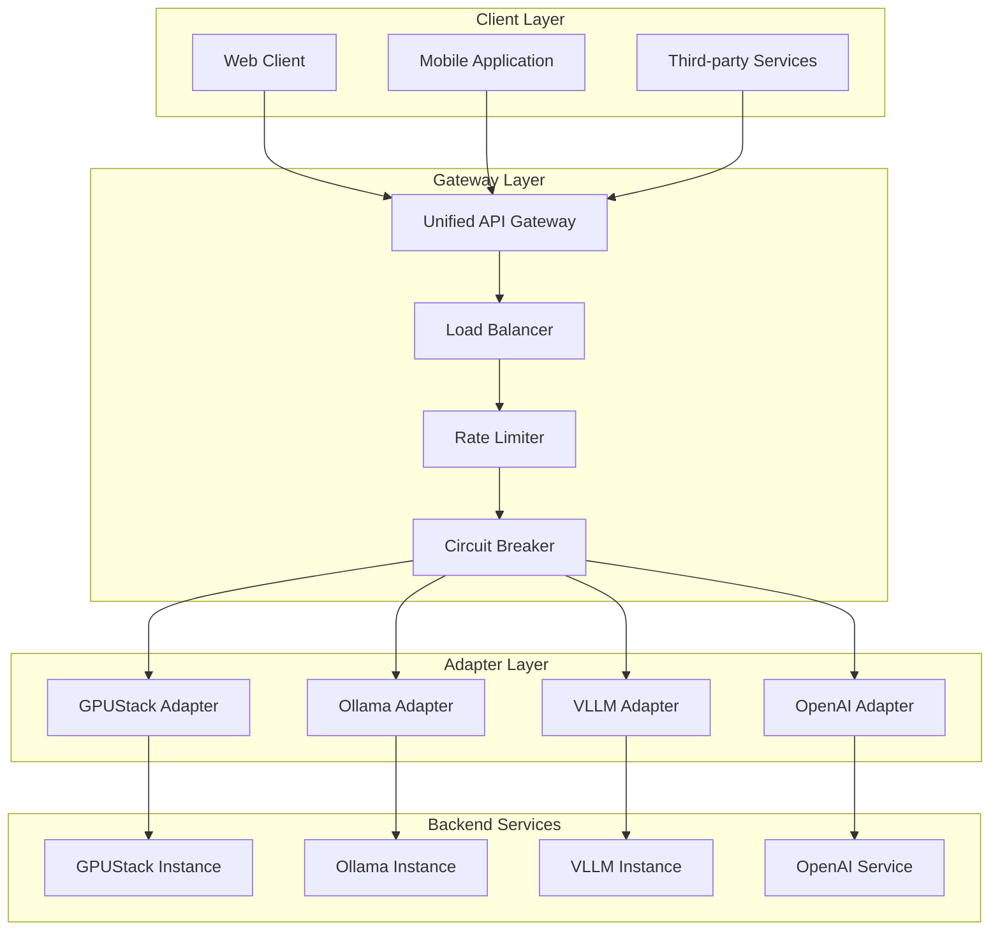
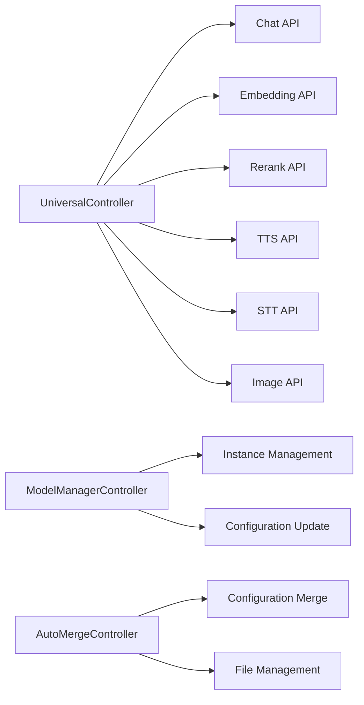
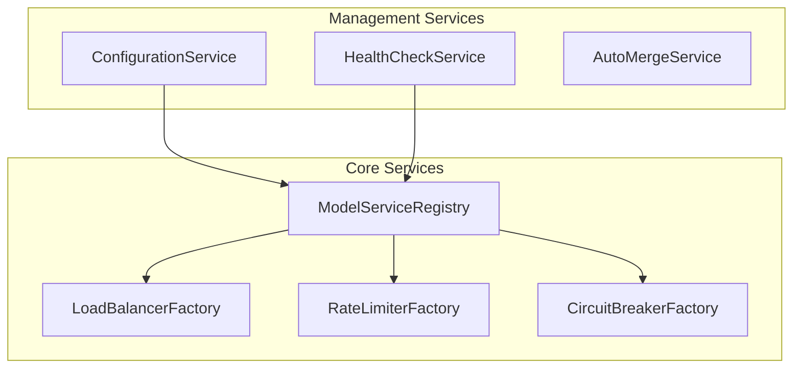
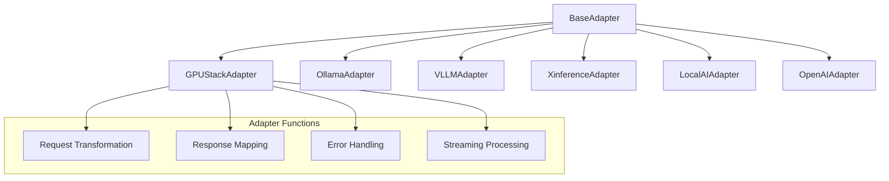
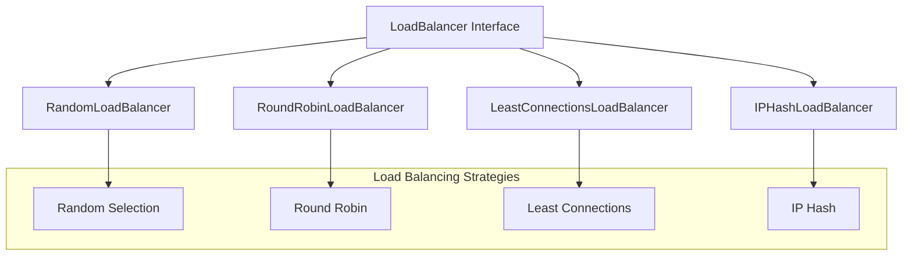
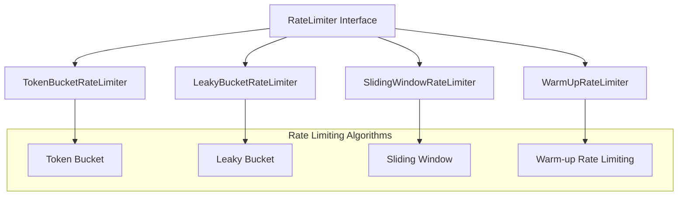
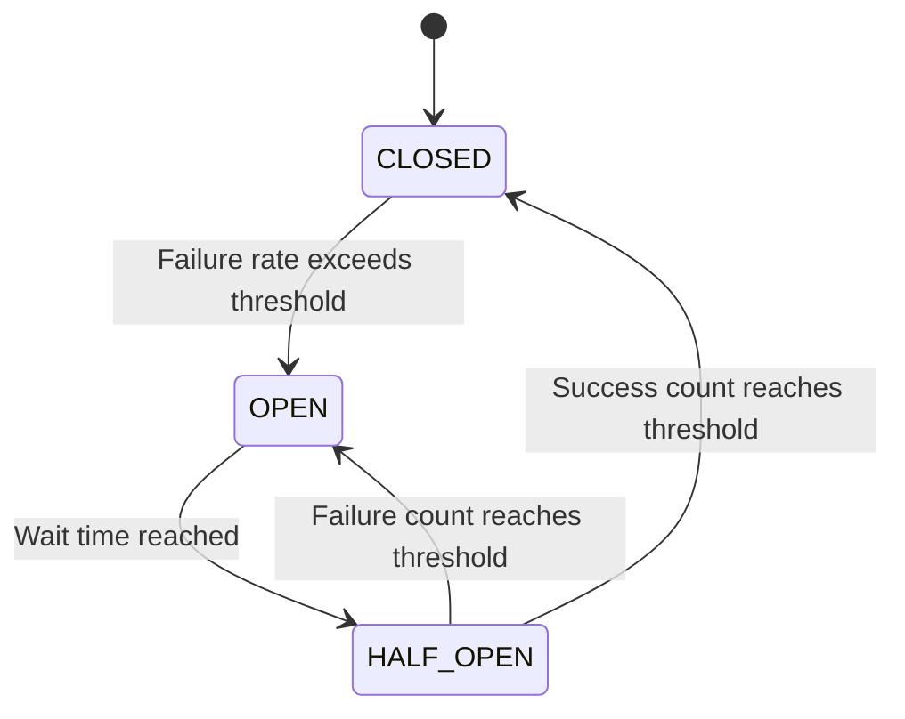
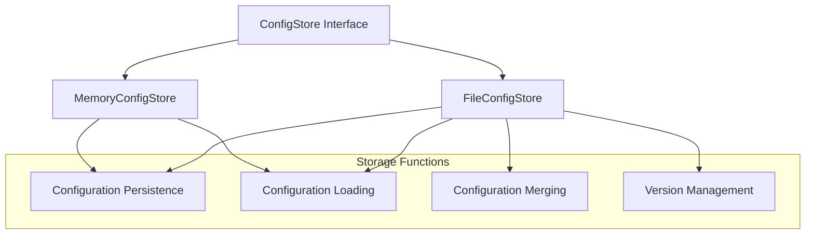

# Architecture Description

<!-- 版本信息 -->
> **文档版本**: 1.0.0  
> **最后更新**: 2025-08-19  
> **Git 提交**: c1aa5b0f  
> **作者**: Lincoln
<!-- /版本信息 -->


## Overview

JAiRouter is a reactive AI model service routing gateway built on Spring Boot 3.5.x and Spring WebFlux. It adopts a modular design, supporting multiple load balancing strategies, rate limiting algorithms, circuit breaker mechanisms, and dynamic configuration management.

## Overall Architecture



## Core Module Architecture

### 1. Controller Layer



**Responsibilities:**
- Unified API entry point, providing OpenAI-compatible interfaces
- Dynamic configuration management interfaces
- Automatic configuration file merging functionality

### 2. Service Layer



**Responsibilities:**
- Service registration and discovery
- Component factory management
- Dynamic configuration updates
- Health check monitoring

### 3. Adapter Layer



**Responsibilities:**
- Unifying invocation methods for different backend services
- Request/response format conversion
- Protocol adaptation and error handling

### 4. Load Balancer Layer



**Responsibilities:**
- Implementation of multiple load balancing algorithms
- Support for weight configuration
- Dynamic instance management

### 5. Rate Limiting Layer



**Responsibilities:**
- Implementation of multiple rate limiting algorithms
- Independent rate limiting per client IP
- Dynamic rate limiting parameter adjustment

### 6. Circuit Breaker Layer



**Responsibilities:**
- Circuit breaker state management
- Failure rate statistics and threshold detection
- Automatic recovery mechanism

### 7. Storage Layer



**Responsibilities:**
- Configuration data persistence
- Support for memory and file storage
- Configuration version management and merging

## Technology Stack

### Core Frameworks
- **Java 17+**: Modern Java feature support
- **Spring Boot 3.5.x**: Application framework and auto-configuration
- **Spring WebFlux**: Reactive web framework
- **Reactor Core**: Reactive programming support

### Build Tools
- **Maven 3.8+**: Project building and dependency management
- **Maven Wrapper**: Ensuring build environment consistency

### Monitoring and Documentation
- **SpringDoc OpenAPI**: Automatic API documentation generation
- **Micrometer**: Metrics collection and monitoring
- **Spring Boot Actuator**: Health checks and management endpoints

### Code Quality
- **Checkstyle**: Code style checking
- **SpotBugs**: Static code analysis
- **JaCoCo**: Code coverage analysis

## Design Principles

### 1. Reactive Programming
- Using Reactor for non-blocking I/O
- Supporting high-concurrency request processing
- Backpressure handling and flow control

### 2. Modular Design
- Clear module boundaries and responsibility separation
- Pluggable component architecture
- Easy to extend and maintain

### 3. Configuration-driven
- Supporting static and dynamic configurations
- Hot configuration updates without restart
- Configuration version management and rollback

### 4. Fault Tolerance Design
- Multi-layered fault tolerance mechanisms
- Graceful degradation and failure recovery
- Comprehensive error handling and logging

### 5. Observability
- Comprehensive metrics monitoring
- Structured log output
- Health checks and status reporting

## Extension Points

### 1. Adapter Extension
Implement the [BaseAdapter](file://D:\IdeaProjects\model-router\src\main\java\org\unreal\modelrouter\adapter\BaseAdapter.java#L19-L539) interface to support new backend services:

```java
@Component
public class CustomAdapter extends BaseAdapter {
    @Override
    public Mono<String> processRequest(String serviceType, String requestBody, ServiceInstance instance) {
        // Implement custom adapter logic
    }
}
```

### 2. Load Balancing Strategy Extension
Implement the [LoadBalancer](file://D:\IdeaProjects\model-router\src\main\java\org\unreal\modelrouter\loadbalancer\LoadBalancer.java#L13-L57) interface to add new load balancing algorithms:

```java
@Component
public class CustomLoadBalancer implements LoadBalancer {
    @Override
    public ServiceInstance selectInstance(List<ServiceInstance> instances, String clientInfo) {
        // Implement custom load balancing logic
    }
}
```

### 3. Rate Limiting Algorithm Extension
Implement the [RateLimiter](file://D:\IdeaProjects\model-router\src\main\java\org\unreal\modelrouter\ratelimit\RateLimiter.java#L5-L18) interface to add new rate limiting algorithms:

```java
@Component
public class CustomRateLimiter implements RateLimiter {
    @Override
    public boolean tryAcquire(String key, int permits) {
        // Implement custom rate limiting logic
    }
}
```

## Performance Considerations

### 1. Memory Management
- Periodic cleanup of inactive rate limiters
- Reasonable caching strategies and expiration mechanisms
- Avoiding memory leaks

### 2. Concurrent Processing
- Using reactive programming model
- Proper thread pool configuration
- Avoiding blocking operations

### 3. Network Optimization
- Connection pool reuse
- Request timeout control
- Backpressure handling

### 4. Monitoring and Tuning
- Key metrics monitoring
- Performance bottleneck identification
- Dynamic parameter adjustment

## Security Considerations

### 1. Input Validation
- Request parameter validation
- Prevention of injection attacks
- Data format validation

### 2. Access Control
- API key authentication
- Request frequency limiting
- IP whitelist mechanism

### 3. Data Protection
- Sensitive information masking
- Transmission encryption
- Log security

This architecture design ensures JAiRouter's scalability, maintainability, and high performance, providing a stable and reliable foundation platform for AI model service routing.
