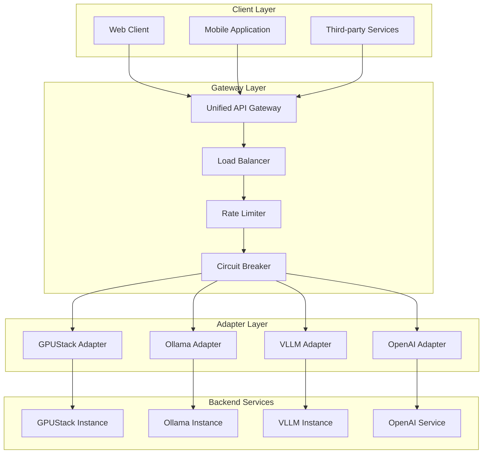
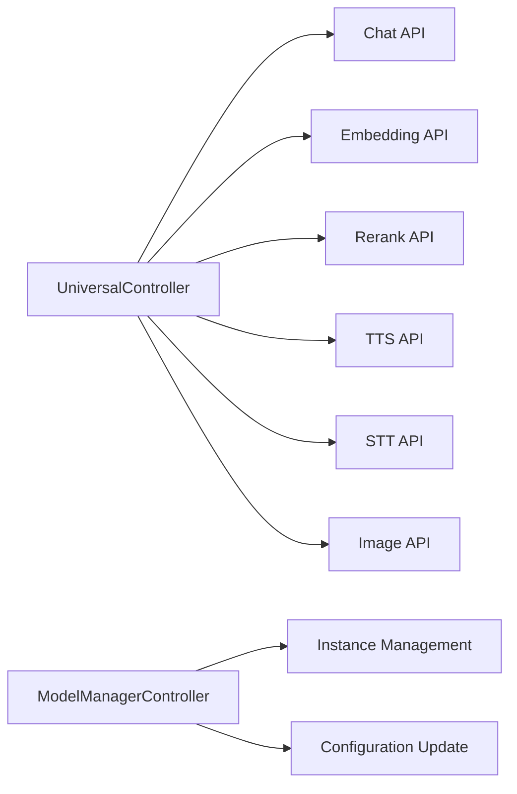
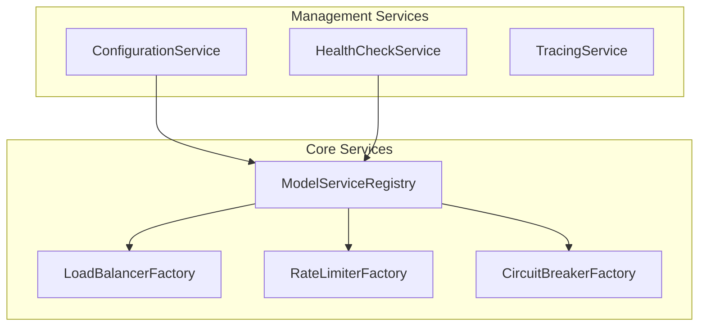
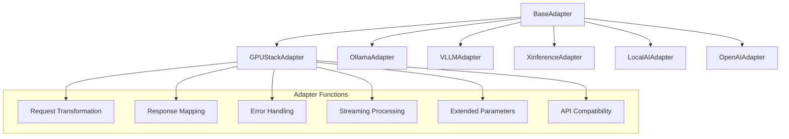
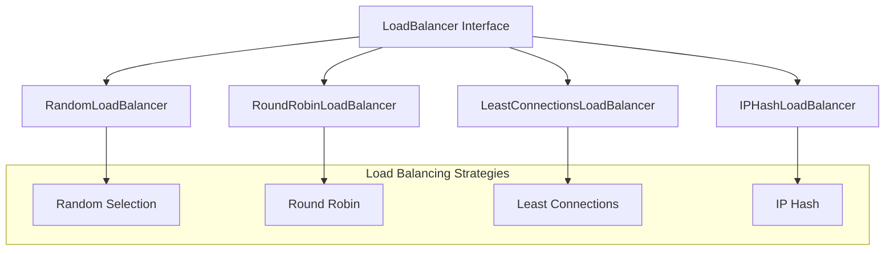
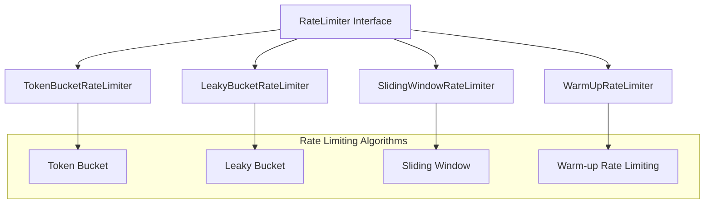
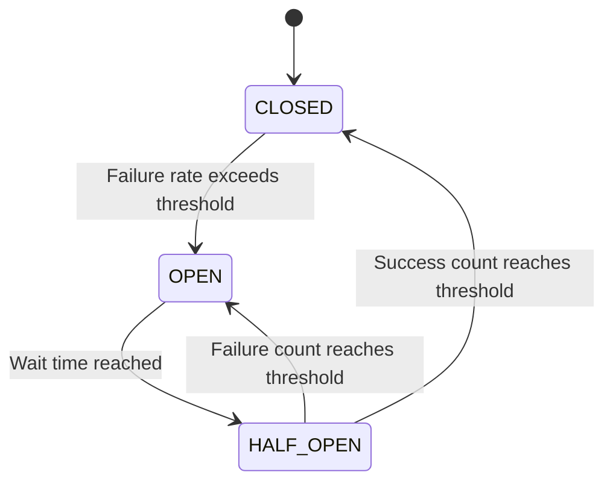
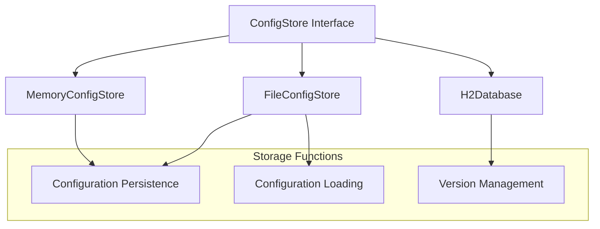

# Architecture Overview

<!-- Version Info -->
> **Document Version**: 2.0.0
> **Last Updated**: 2026-06-15
> **Git Commit**: 0f56b957
> **Author**: JAiRouter Team
<!-- /Version Info -->

## Overview

JAiRouter is a reactive AI model service routing gateway built on Spring Boot 3.5.x and Spring WebFlux. It adopts a modular design, supporting multiple load balancing strategies, rate limiting algorithms, circuit breaker mechanisms, and dynamic configuration management.

## Overall Architecture


```mermaid
graph TB
    subgraph "Client Layer"
        A[Web Client]
        B[Mobile Application]
        C[Third-party Services]
    end

    subgraph "Gateway Layer"
        D[Unified API Gateway]
        E[Load Balancer]
        F[Rate Limiter]
        G[Circuit Breaker]
    end

    subgraph "Adapter Layer"
        H[GPUStack Adapter]
        I[Ollama Adapter]
        J[VLLM Adapter]
        K[OpenAI Adapter]
    end

    subgraph "Backend Services"
        L[GPUStack Instance]
        M[Ollama Instance]
        N[VLLM Instance]
        O[OpenAI Service]
    end

    A --> D
    B --> D
    C --> D
    D --> E
    E --> F
    F --> G
    G --> H
    G --> I
    G --> J
    G --> K
    H --> L
    I --> M
    J --> N
    K --> O
```

## Core Module Architecture

### 1. Controller Layer


```mermaid
graph LR
    A[UniversalController] --> B[Chat API]
    A --> C[Embedding API]
    A --> D[Rerank API]
    A --> E[TTS API]
    A --> F[STT API]
    A --> G[Image API]

    H[ModelManagerController] --> I[Instance Management]
    H --> J[Configuration Update]
```

**Responsibilities:**
- Unified API entry point, providing OpenAI-compatible interfaces
- Dynamic configuration management interfaces
- Service request routing and dispatch

### 2. Service Layer


```mermaid
graph TB
    subgraph "Core Services"
        A[ModelServiceRegistry]
        B[LoadBalancerFactory]
        C[RateLimiterFactory]
        D[CircuitBreakerFactory]
    end

    subgraph "Management Services"
        E[ConfigurationService]
        F[HealthCheckService]
        G[TracingService]
    end

    A --> B
    A --> C
    A --> D
    E --> A
    F --> A
```

**Responsibilities:**
- Service registration and discovery
- Component factory management
- Dynamic configuration updates
- Health check monitoring
- Distributed tracing

### 3. Adapter Layer


```mermaid
graph TB
    A[BaseAdapter] --> B[GPUStackAdapter]
    A --> C[OllamaAdapter]
    A --> D[VLLMAdapter]
    A --> E[XinferenceAdapter]
    A --> F[LocalAIAdapter]
    A --> G[OpenAIAdapter]

    subgraph "Adapter Functions"
        H[Request Transformation]
        I[Response Mapping]
        J[Error Handling]
        K[Streaming Processing]
        L[Extended Parameters]
        M[API Compatibility]
    end

    B --> H
    B --> I
    B --> J
    B --> K
    B --> L
    B --> M
```

**Responsibilities:**
- Unifying invocation methods for different backend services
- Request/response format conversion
- Protocol adaptation and error handling
- Support for latest API features
- Extended parameter handling

### 4. Load Balancer Layer


```mermaid
graph TB
    A[LoadBalancer Interface] --> B[RandomLoadBalancer]
    A --> C[RoundRobinLoadBalancer]
    A --> D[LeastConnectionsLoadBalancer]
    A --> E[IPHashLoadBalancer]

    subgraph "Load Balancing Strategies"
        F[Random Selection]
        G[Round Robin]
        H[Least Connections]
        I[IP Hash]
    end

    B --> F
    C --> G
    D --> H
    E --> I
```

**Responsibilities:**
- Implementation of multiple load balancing algorithms
- Support for weight configuration
- Dynamic instance management

### 5. Rate Limiting Layer


```mermaid
graph TB
    A[RateLimiter Interface] --> B[TokenBucketRateLimiter]
    A --> C[LeakyBucketRateLimiter]
    A --> D[SlidingWindowRateLimiter]
    A --> E[WarmUpRateLimiter]

    subgraph "Rate Limiting Algorithms"
        F[Token Bucket]
        G[Leaky Bucket]
        H[Sliding Window]
        I[Warm-up Rate Limiting]
    end

    B --> F
    C --> G
    D --> H
    E --> I
```

**Responsibilities:**
- Implementation of multiple rate limiting algorithms
- Independent rate limiting per client IP
- Dynamic rate limiting parameter adjustment

### 6. Circuit Breaker Layer


```mermaid
stateDiagram-v2
    [*] --> CLOSED
    CLOSED --> OPEN : Failure rate exceeds threshold
    OPEN --> HALF_OPEN : Wait time reached
    HALF_OPEN --> CLOSED : Success count reaches threshold
    HALF_OPEN --> OPEN : Failure count reaches threshold
```

**Responsibilities:**
- Circuit breaker state management (State Pattern)
- Failure rate statistics and threshold detection
- Automatic recovery mechanism

### 7. Storage Layer


```mermaid
graph TB
    A[ConfigStore Interface] --> B[MemoryConfigStore]
    A --> C[FileConfigStore]
    A --> D[H2Database]

    subgraph "Storage Functions"
        E[Configuration Persistence]
        F[Configuration Loading]
        G[Version Management]
    end

    B --> E
    C --> E
    C --> F
    D --> G
```

**Responsibilities:**
- Configuration data persistence
- Support for memory and database storage
- Configuration version management

---

## Package Structure (v2.7.x+)

Starting from v2.7.x, the project adopts a modular package structure:

| Module | Package Path | Responsibility |
|--------|--------------|----------------|
| **auth** | `org.unreal.modelrouter.auth` | Authentication, JWT, API Key |
| **config** | `org.unreal.modelrouter.config` | Configuration management, version control |
| **router** | `org.unreal.modelrouter.router` | Routing, load balancing, rate limiting, circuit breaker |
| **monitor** | `org.unreal.modelrouter.monitor` | Monitoring, tracing, metrics |
| **persistence** | `org.unreal.modelrouter.persistence` | Data persistence, repositories |
| **common** | `org.unreal.modelrouter.common` | Common utilities, exceptions, constants |

---

## Technology Stack

### Core Frameworks
- **Java 17+**: Modern Java feature support
- **Spring Boot 3.5.x**: Application framework and auto-configuration
- **Spring WebFlux**: Reactive web framework
- **Reactor Core**: Reactive programming support

### Data Storage
- **H2 Database**: Embedded database (default)
- **R2DBC**: Reactive database access
- **Redis**: Cache and session storage (optional)

### Build Tools
- **Maven 3.8+**: Project building and dependency management
- **Maven Wrapper**: Ensuring build environment consistency

### Monitoring and Documentation
- **SpringDoc OpenAPI**: Automatic API documentation generation
- **Micrometer**: Metrics collection and monitoring
- **Spring Boot Actuator**: Health checks and management endpoints
- **OpenTelemetry**: Distributed tracing

### Code Quality
- **Checkstyle**: Code style checking
- **SpotBugs**: Static code analysis
- **JaCoCo**: Code coverage analysis

---

## Design Principles

### 1. Reactive Programming
- Using Reactor for non-blocking I/O
- Supporting high-concurrency request processing
- Backpressure handling and flow control

### 2. Modular Design
- Clear module boundaries and responsibility separation
- Pluggable component architecture
- Easy to extend and maintain

### 3. Configuration-driven
- Supporting static and dynamic configurations
- Hot configuration updates without restart
- Configuration version management and rollback

### 4. Fault Tolerance Design
- Multi-layered fault tolerance mechanisms (rate limiting, circuit breaker, retry)
- Graceful degradation and failure recovery
- Comprehensive error handling and logging

### 5. Observability
- Comprehensive metrics monitoring (Prometheus)
- Structured log output
- Distributed tracing (OpenTelemetry)
- Health checks and status reporting

---

## Extension Points

### 1. Adapter Extension
Implement the `BaseAdapter` interface to support new backend services:

```java
@Component
public class CustomAdapter extends BaseAdapter {
    @Override
    public Mono<String> processRequest(String serviceType, String requestBody, ServiceInstance instance) {
        // Implement custom adapter logic
    }
}
```

### 2. Load Balancing Strategy Extension
Implement the `LoadBalancer` interface to add new load balancing algorithms:

```java
@Component
public class CustomLoadBalancer implements LoadBalancer {
    @Override
    public ServiceInstance selectInstance(List<ServiceInstance> instances, String clientInfo) {
        // Implement custom load balancing logic
    }
}
```

### 3. Rate Limiting Algorithm Extension
Implement the `RateLimiter` interface to add new rate limiting algorithms:

```java
@Component
public class CustomRateLimiter implements RateLimiter {
    @Override
    public boolean tryAcquire(String key, int permits) {
        // Implement custom rate limiting logic
    }
}
```

---

## Architecture Evolution History

### V2.5.x Refactoring (2026-05)
- Super-large class refactoring (BaseAdapter, TracingService, etc.)
- Added 12 components, reduced 2011 lines of code (-62%)
- Test count reached 971

### V2.7.x Package Refactoring (2026-06)
- Migrated 481 files to 6 service modules
- Modularization preparation for microservices architecture

### V2.8.x Configuration Integration (2026-06)
- Split application.yml into 25 module configuration files
- Streamlined environment configuration 763→271 lines (-62%)

### V2.9.x Code Cleanup (2026-06)
- Deleted 628 lines of deprecated code
- Checkstyle warnings reduced by 46%

---

## Performance Considerations

### 1. Memory Management
- Periodic cleanup of inactive rate limiters
- Reasonable caching strategies and expiration mechanisms
- Avoiding memory leaks

### 2. Concurrent Processing
- Using reactive programming model
- Proper thread pool configuration
- Avoiding blocking operations

### 3. Network Optimization
- Connection pool reuse
- Request timeout control
- Backpressure handling

### 4. Monitoring and Tuning
- Key metrics monitoring
- Performance bottleneck identification
- Dynamic parameter adjustment

---

## Security Considerations

### 1. Authentication & Authorization
- API Key authentication
- JWT Token support
- Role-based access control (RBAC)

### 2. Access Control
- Request frequency limiting
- IP whitelist mechanism
- Security blacklist

### 3. Data Protection
- Sensitive information masking
- Transmission encryption (HTTPS)
- API Key hashed storage

---

This architecture design ensures JAiRouter's scalability, maintainability, and high performance, providing a stable and reliable foundation platform for AI model service routing.
