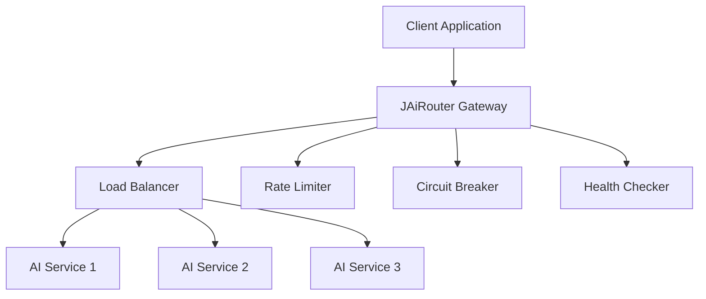

# Getting Started

<!-- 版本信息 -->
> **文档版本**: 1.0.0  
> **最后更新**: 2025-08-19  
> **Git 提交**: c1aa5b0f  
> **作者**: Lincoln
<!-- /版本信息 -->

Welcome to JAiRouter! This section will help you quickly get started with JAiRouter, from installation to your first API call.

## What is JAiRouter?

JAiRouter is a Spring Boot-based AI model service routing and load balancing gateway that provides unified access to various AI model services through OpenAI-compatible APIs.

## Key Benefits

- **Unified Interface**: Single API endpoint for multiple AI model providers
- **High Availability**: Built-in load balancing, circuit breaking, and health monitoring
- **Easy Integration**: OpenAI-compatible API format
- **Dynamic Configuration**: Runtime updates without service restart
- **Production Ready**: Comprehensive monitoring and logging

## Quick Navigation

1. **[Installation Guide](installation.md)** - Install and configure JAiRouter
2. **[Quick Start](quick-start.md)** - Make your first API call
3. **[First Steps](first-steps.md)** - Basic configuration and usage

## Prerequisites

Before you begin, ensure you have:

- Java 17 or higher
- Maven 3.6+ (or use the included Maven wrapper)
- At least one AI model service (Ollama, VLLM, GPUStack, etc.)

## Architecture Overview

JAiRouter sits between your applications and AI model services, providing:

- **Load Balancing**: Distribute requests across multiple service instances
- **Rate Limiting**: Control request rates to prevent overload
- **Circuit Breaking**: Protect against cascading failures
- **Health Monitoring**: Automatically detect and handle unhealthy services

## Next Steps

Ready to get started? Head over to the [Installation Guide](installation.md) to set up JAiRouter in your environment.