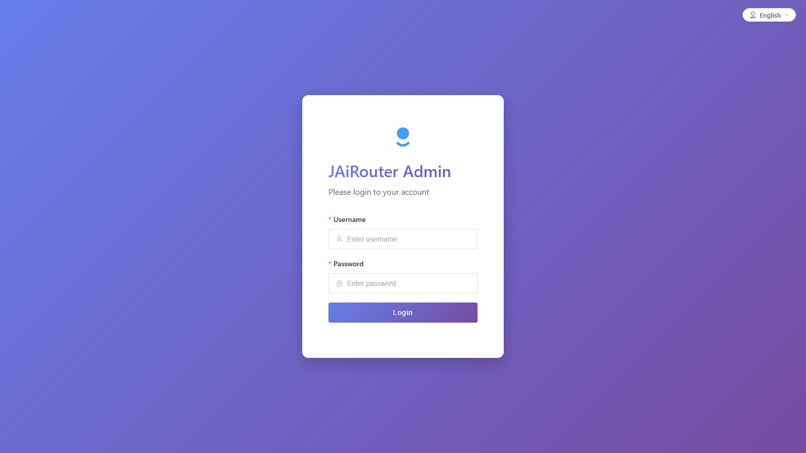
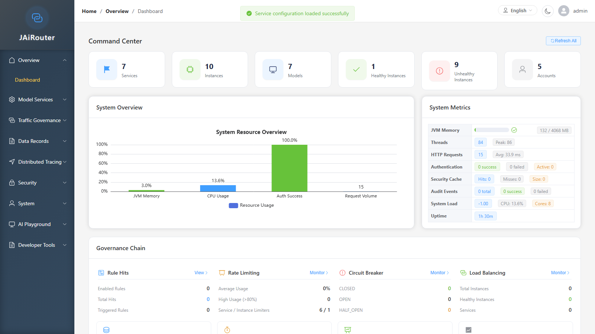
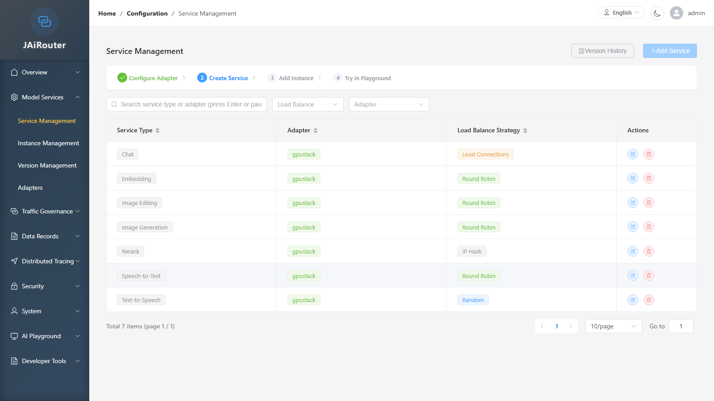
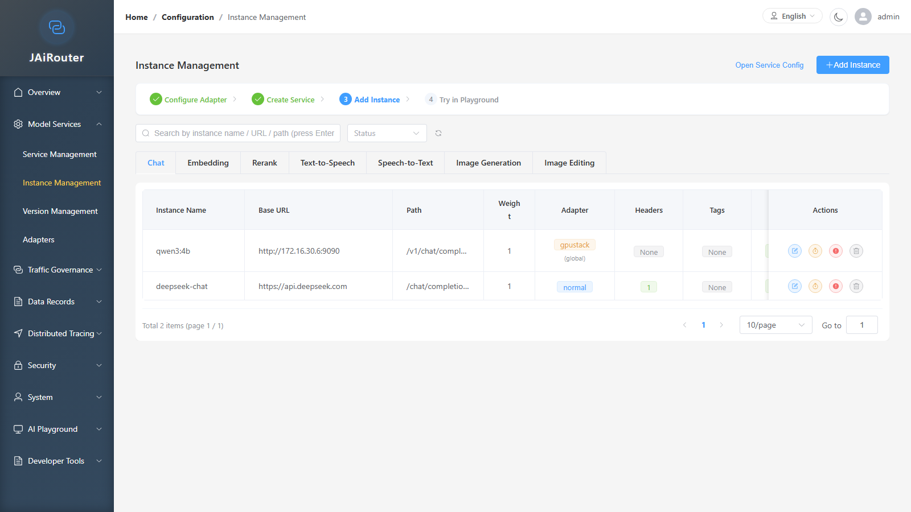
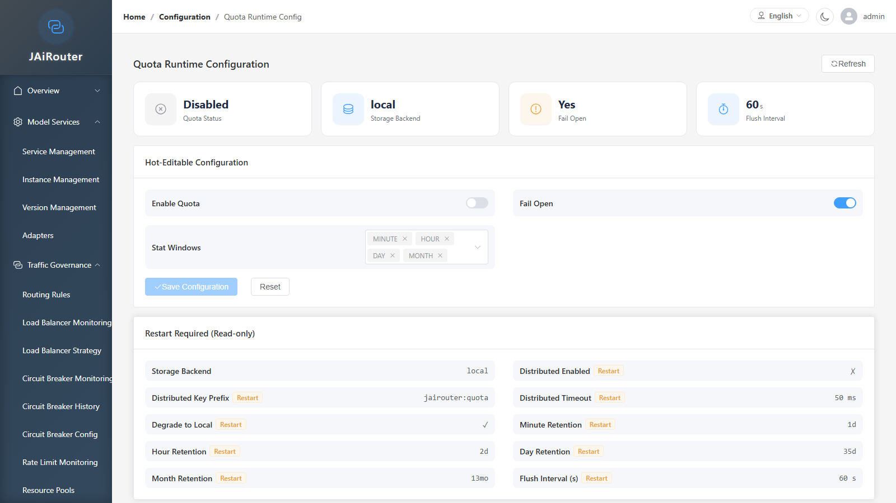

# Web Console Operation Guide

<!-- Version Info -->
> **Doc Version**: 1.0.0
> **Last Updated**: 2026-09-15
> **Applicable Version**: v3.1.1
> **Author**: Lincoln
<!-- /Version Info -->

This guide is for first-time users of the JAiRouter Web Console, covering everything from login to connecting your first model service, quota management, observability, and access control.

## 1. Login and First Launch

### 1.1 Access URL

| Deployment | URL | Notes |
|------------|-----|-------|
| Local dev (Vite) | `http://localhost:3000/admin` | Vite dev server, hot reload |
| Production / standalone | `http://<host>:8080/admin` | Backend-served SPA |

Both entry points serve the same frontend code with identical functionality.

### 1.2 Default Accounts

| Username | Default Password | Role | Description |
|----------|-----------------|------|-------------|
| `admin` | `ChangeMeOnFirstStartup123456` | ADMIN, USER | Super admin with all 48 permission codes |
| `user` | `user123456` | USER | Regular user, primarily read-only |

> ⚠️ **Change the `admin` password before first production use.** The password is set via the `INITIAL_ADMIN_PASSWORD` environment variable (see `src/main/resources/config/auth/jwt.yml`). Restart the service after changing it.

```bash
# Example: set the environment variable before startup
export INITIAL_ADMIN_PASSWORD="YourStr0ngPassword#2026"
```

### 1.3 Token Storage

After a successful login, the JWT is stored in the browser `localStorage` under the key `admin_token`.

> ⚠️ **Do not inject tokens manually.** The frontend route guard (`router.beforeEach`) performs the following checks on every navigation:
>
> 1. Checks whether `admin_token` exists in `localStorage`;
> 2. Decodes the JWT to verify expiration (marked expired 60 seconds early);
> 3. Validates that the route's `meta.roles` / `meta.permissions` requirements are met.
>
> Only when all conditions pass is navigation allowed; otherwise the user is redirected to `/login`. A manually written token that is expired or missing the `permissions` claim will prevent the console from functioning properly.

### 1.4 Login Flow

1. Open the console URL in a browser;
2. The page title displays **JAiRouter Admin** (zh: **JAiRouter 管理后台**);
3. Enter your username and password, then click the **Login** button;
4. On success, you are automatically redirected to the **Dashboard** page.



---

## 2. Interface Layout

### 2.1 Left Navigation

The console has a collapsible sidebar containing **9 menu groups** with a total of **39 pages**. Menu visibility is controlled by permission codes — groups and pages for which the user lacks the required permission code are hidden.



| # | Group (en) | Group (zh) | Pages |
|---|-----------|-----------|-------|
| 1 | Overview | 概览 | Dashboard |
| 2 | Model Services | 模型服务 | Service Management, Instance Management, Version Management, Adapters |
| 3 | Traffic Governance | 流量治理 | Routing Rules, Load Balancer Monitoring, Load Balancer Strategy, Circuit Breaker Monitoring, Circuit Breaker History, Circuit Breaker Config, Rate Limit Monitoring, Resource Pools, Response Cache Management, Quota Runtime Config |
| 4 | Data Records | 数据记录 | Call History Dashboard, Call List, Token Usage, Slow Calls, Slow Query Analysis, Quota Usage Monitoring, Exception Management, Exception Statistics |
| 5 | Distributed Tracing | 链路追踪 | Tracing Dashboard, Tracing Search, Tracing Config |
| 6 | Security | 安全管理 | API Key Management, PII Sanitization, JWT Token Management, Blacklist Management, Audit Logs |
| 7 | System | 系统管理 | Account Management, Permission Management, State Persistence |
| 8 | AI Playground | AI 试验场 | Chat Playground, Embedding, Rerank, Audio Service, Image Service |
| 9 | Developer Tools | 开发者工具 | Client Access Guide |

### 2.2 Top Bar

| Area | Element | Description |
|------|---------|-------------|
| Left | Breadcrumb | Format: Home / Group Name / Current Page |
| Right | Language Switcher | Capsule button with dropdown to select 中文 or English; change takes effect immediately |
| Right | Theme Toggle | Round button with ☀️/🌙 icon to switch between light and dark themes |
| Right | User Menu | Avatar + username (e.g. `admin`); dropdown contains **Profile** and **Log Out** |

### 2.3 Breadcrumb

The top of the page displays the current navigation path, e.g. `Home / Overview / Dashboard`. The breadcrumb updates automatically when navigating between pages.

---

## 3. Minimum Path to Connect Your First Model Service

The following steps are ordered by dependency, using an Ollama model service as an example.



### Step 1: Configure a Service

**Menu path**: Model Services → Service Management

1. Go to the **Service Management** page;
2. Click the **Add Service** button;
3. Fill in the form:

| Field | Description | Required |
|-------|-------------|:--------:|
| Service Type | Dropdown selection, e.g. `chat`, `embedding`, `completion` | ✅ |
| Adapter | Dropdown to select the adapter type | ✅ |
| Load Balance Strategy | Random / Round Robin / Least Connections / IP Hash | ✅ |
| Description | Optional note | ❌ |

4. Click **Save**;
5. After saving, the service type appears in the list with status **Enabled**.

### Step 2: Configure an Instance

**Menu path**: Model Services → Instance Management



1. Go to the **Instance Management** page;
2. Select the corresponding service type from the left dropdown;
3. Click the **Add Instance** button;
4. Fill in the form:

| Field | Description | Required | Example |
|-------|-------------|:--------:|---------|
| Service Type | The associated service type | ✅ | `chat` |
| Instance Name | Instance identifier | ✅ | `ollama-local` |
| Base URL | Downstream service address | ✅ | `http://localhost:11434` |
| Path | Request path (optional) | ❌ | `/v1/chat/completions` |
| Weight | Load balancing weight | ✅ | `1` |
| Adapter | Leave empty to use global config | ❌ | — |

5. Expand the **Request Header Config** section and add headers required by the downstream service:

| Header Name | Header Value | Description |
|-------------|-------------|-------------|
| `Authorization` | `Bearer <your-api-key>` | Authentication credential transparently forwarded to the downstream model service |

> 💡 The `Authorization` header is **forwarded transparently to the downstream service** — it is not the gateway's own credential. The gateway credential is `Jairouter_Token` (JWT).

6. Optional: expand the **Tag Config** section and add tags for routing rule matching;
7. Click **Save**;
8. After saving, the instance appears in the list. The status column shows the health status (healthy/unhealthy).

### Step 3: Version and Adapter (If Needed)

- **Version Management** (Model Services → Version Management): Configure version information if needed. This is not a required step.
- **Adapters** (Model Services → Adapters): View and manage registered adapters. Skip this step if the adapter was correctly selected in Step 1.

### Step 4: Verify Connectivity

After configuration, verify using these methods:

1. **Dashboard** (Overview → Dashboard): Check the "Service Configuration Overview" area to confirm service instance count and healthy instance count;
2. **Instance Management** page: The instance status column should show a green **Healthy** label (not **Unhealthy**);
3. **Load Balancer Monitoring** (Traffic Governance → Load Balancer Monitoring): View real-time load balancing status.

### Step 5: Test in Playground

**Menu path**: AI Playground → Chat Playground

1. Go to the **Chat Playground** page;
2. Select the model matching the service type configured in Step 1;
3. Enter a message and send it;
4. If you receive a response, the entire pipeline (Console → Gateway → Model Service) is working.

> 💡 Playground requires the `ai:playground:use` permission code. Both ADMIN and USER roles have this permission by default.

---

## 4. How Quotas Work

### 4.1 Quota Runtime Configuration

**Menu path**: Traffic Governance → Quota Runtime Config

The quota feature is **disabled by default**. To enable it:



1. Go to the **Quota Runtime Configuration** page;
2. Find the **Hot-Editable Configuration** section;
3. Turn on the **Enable Quota** switch;
4. Optional settings:
   - **Fail Open**: whether to allow requests when the quota system is unavailable;
   - **Stat Windows**: select the statistical window dimensions;
5. Click **Save Configuration**.

**Hot-editable fields** (take effect immediately, no restart):

| Field | Description |
|-------|-------------|
| `enabled` | Enable/disable quotas |
| `failOpen` | Fail-open switch |
| `windows` | Statistical window selection |

**Restart-required fields** (marked with a **Restart** badge, read-only):

| Field | Description |
|-------|-------------|
| `backendName` | Storage backend name |
| `distributedEnabled` | Distributed enabled |
| `distributedKeyPrefix` | Distributed key prefix |
| `distributedTimeout` | Distributed timeout |
| `flushIntervalSeconds` | Flush interval |

### 4.2 Quota Usage Monitoring

**Menu path**: Data Records → Quota Usage Monitoring

On the **Quota Usage Monitoring** page you can:

- View quota **runtime status**: storage backend type, degradation status;
- Filter usage data by **Tenant ID / API Key ID / User ID / Service Type / Model / Window**;
- View **usage details**: request count, token count.

> 💡 If the page displays **"Quota ledger not enabled, usage data unavailable"**, the quota feature is not enabled. Go to the Quota Runtime Config page first to enable it.

---

## 5. Observability and Troubleshooting

### 5.1 Data Records Group

| Page | Path | What It Answers |
|------|------|-----------------|
| Call History Dashboard | `/call-history/dashboard` | Overall call volume trend, success/failure rate overview |
| Call List | `/call-history/list` | Detailed record of every request (time, service, status code, latency) |
| Token Usage | `/call-history/token-usage` | Token consumption per model/service |
| Slow Calls | `/call-history/slow-calls` | Which requests took too long |
| Slow Query Analysis | `/monitoring/slow-queries` | Deep analysis of slow requests (requires `monitoring:slowquery:read`) |
| Quota Usage Monitoring | `/monitoring/quota` | Quota consumption details |
| Exception Management | `/exceptions/list` | List of all exception events (visible to all authenticated users) |
| Exception Statistics | `/exceptions/statistics` | Exception distribution by type/time |

### 5.2 Distributed Tracing Group

| Page | Path | What It Answers |
|------|------|-----------------|
| Tracing Dashboard | `/tracing/dashboard` | Trace volume trends, latency distribution, error rate trends, throughput |
| Tracing Search | `/tracing/search` | Locate specific request traces by Trace ID / service name / time range |
| Tracing Config | `/tracing/management` | Tracing toggle, sampling rate, exporter configuration (Logging / OTLP / Jaeger) |

### 5.3 Dashboard Overview

Overview → Dashboard provides a single-pane view:

- **System Overview**: service count, instance count, healthy instances, unhealthy instances;
- **System Metrics**: JVM memory, thread count, HTTP requests, CPU usage, uptime;
- **Governance Chain**: shortcuts to rule hits, rate limiting, circuit breaker, load balancing status;
- **Exception / Alert Summary**: recent exception event list;
- **Service Configuration Overview**: global config summary (adapter, rate limit, circuit breaker, etc.).

---

## 6. Permissions and Roles

### 6.1 Four Built-in Roles

| Role | Permission Count | Permission Scope | Description |
|------|:----------------:|------------------|-------------|
| **ADMIN** | 48 | All permission codes | Super admin; bypasses URL rules, full codes embedded in JWT |
| **OPERATOR** | 39 | All `:read` + `:write` codes | Day-to-day ops; excludes system management (`system:*`), security management `manage` codes (API Key / JWT Token / Blacklist management) |
| **USER** | 27 | Dashboard + config read + full lb/cb/rl + monitoring read + tracing dashboard/search + AI Playground | Regular user; only write code is `lb:config:write` |
| **VIEWER** | 26 | All `:read` codes | Pure read-only role; no `callhistory:view`, `ai:playground:use`, or other non-`:read` codes |

### 6.2 Why Some Menu Pages Are Missing {#why-menu-pages-missing}

Frontend menu rendering is filtered by permission codes:

1. Each menu group/item is associated with a permission code (e.g. `config:services:read`);
2. After login, the JWT's `permissions` claim contains the current user's permission code list;
3. The `usePermission` composable filters out menu items the user does not have;
4. The route guard (`meta.permissions`) further blocks direct URL access without permissions.

**Resolution**:

1. Go to **System → Permission Management** (requires `system:permissions:manage`, ADMIN only);
2. Find the target role, check the missing permission codes, and save.

> 💡 `/v1/**` (OpenAI-compatible inference endpoints) is independent of the RBAC system and only requires authentication — it is not restricted by permission codes.

---

## 7. Multi-Protocol Access

### 7.1 Client Access Guide

**Menu path**: Developer Tools → Client Access Guide

This page provides complete access examples for the OpenAI-compatible API and the Anthropic-compatible API, including Base URL, authentication method, curl examples, and SDK examples.

### 7.2 Credential Header Specifications

| Protocol Surface | Credential Header | Description |
|-----------------|-------------------|-------------|
| OpenAI-compatible | `X-API-Key: <Gateway API Key>` | Used for `/v1/*` endpoints |
| Anthropic-compatible | `x-api-key: <Gateway API Key>` | Used for the Anthropic Messages API |
| Console | `Jairouter_Token: <JWT>` | Management API credential after Web Console login |
| `Authorization` | — | **Forwarded transparently to the downstream model service**; not a gateway credential |

> ⚠️ The `Authorization` header (e.g. `Bearer <token>`) is forwarded as-is to the downstream model service by the gateway — it is not used as the gateway's own authentication credential.

---

## 8. Common Issues

### 8.1 401 After Login

**Symptom**: API requests return 401 Unauthorized after logging in.

**Possible causes**:

1. The JWT has expired (default validity is 60 minutes);
2. The `JWT_SECRET` environment variable is inconsistent across restarts, causing token signature verification to fail.

**Resolution**:

- Log in again to obtain a new token;
- Verify that the `JWT_SECRET` environment variable has not changed after a restart.

### 8.2 403 After Login

**Symptom**: Some APIs return 403 Forbidden.

**Possible cause**: The current user's role lacks the required permission code.

**Resolution**:

- Log in with the `admin` account, go to System → Permission Management, and add the missing permission code to the role;
- See the [RBAC Permission Management](../security/rbac-permissions.md) documentation for details on the permission code system.

### 8.3 Missing Menu Pages

**Symptom**: After logging in, some menu groups or pages are missing from the sidebar.

**Possible cause**: The current user's role does not include the permission code for the corresponding menu item.

**Resolution**:

- See [6.2 Why Some Menu Pages Are Missing](#why-menu-pages-missing).

### 8.4 OpenAI SDK Integration Error

**Symptom**: Using the OpenAI SDK returns 401.

**Possible cause**: The SDK defaults to using the `Authorization: Bearer <key>` header rather than `X-API-Key`. The gateway's OpenAI-compatible endpoint requires the `X-API-Key` header for API Key authentication.

**Resolution**:

- Use the `X-API-Key` header instead of `Authorization` to pass the API Key;
- See the SDK example on the Developer Tools → Client Access Guide page.

### 8.5 Redis Unavailable Degradation

**Symptom**: The dashboard or monitoring pages show connection errors.

**Possible cause**: When JAiRouter uses Redis for JWT persistence or distributed quota storage, Redis is not started or is unreachable. In local development, Redis is disabled by default (`redis.enabled: false`), and JWT uses H2 + memory fallback.

**Resolution**:

- Local development: No Redis needed — JWT uses H2 storage with memory fallback, and functionality is unaffected;
- Production: Ensure Redis is available, or configure `jairouter.security.jwt.persistence.fallback-storage: memory`.

### 8.6 Quotas Not Taking Effect

**Symptom**: After sending requests, the Quota Usage Monitoring page shows no data.

**Possible cause**: The quota feature is disabled by default.

**Resolution**:

1. Go to Traffic Governance → Quota Runtime Config;
2. Enable the quota switch and save;
3. Verify the storage backend status is normal (not degraded).

---

## Appendix: Page Path Quick Reference

| Group | Page | Route Path |
|-------|------|-----------|
| Overview | Dashboard | `/dashboard/main` |
| Model Services | Service Management | `/config/services` |
| Model Services | Instance Management | `/config/instances` |
| Model Services | Version Management | `/config/versions` |
| Model Services | Adapters | `/config/adapters` |
| Traffic Governance | Routing Rules | `/config/rules` |
| Traffic Governance | Load Balancer Monitoring | `/load-balancers/monitoring` |
| Traffic Governance | Load Balancer Strategy | `/load-balancers/strategy-config` |
| Traffic Governance | Circuit Breaker Monitoring | `/circuit-breakers/monitoring` |
| Traffic Governance | Circuit Breaker History | `/circuit-breakers/history` |
| Traffic Governance | Circuit Breaker Config | `/circuit-breakers/global-config` |
| Traffic Governance | Rate Limit Monitoring | `/rate-limiters/monitoring` |
| Traffic Governance | Resource Pools | `/config/pools` |
| Traffic Governance | Response Cache Management | `/config/cache` |
| Traffic Governance | Quota Runtime Config | `/config/quota` |
| Data Records | Call History Dashboard | `/call-history/dashboard` |
| Data Records | Call List | `/call-history/list` |
| Data Records | Token Usage | `/call-history/token-usage` |
| Data Records | Slow Calls | `/call-history/slow-calls` |
| Data Records | Slow Query Analysis | `/monitoring/slow-queries` |
| Data Records | Quota Usage Monitoring | `/monitoring/quota` |
| Data Records | Exception Management | `/exceptions/list` |
| Data Records | Exception Statistics | `/exceptions/statistics` |
| Distributed Tracing | Tracing Dashboard | `/tracing/dashboard` |
| Distributed Tracing | Tracing Search | `/tracing/search` |
| Distributed Tracing | Tracing Config | `/tracing/management` |
| Security | API Key Management | `/security/api-keys` |
| Security | PII Sanitization | `/security/sanitization` |
| Security | JWT Token Management | `/security/jwt-tokens` |
| Security | Blacklist Management | `/security/blacklist` |
| Security | Audit Logs | `/security/audit-logs` |
| System | Account Management | `/system/accounts` |
| System | Permission Management | `/system/permissions` |
| System | State Persistence | `/config/state-persistence` |
| AI Playground | Chat Playground | `/playground/chat` |
| AI Playground | Embedding | `/playground/embedding` |
| AI Playground | Rerank | `/playground/rerank` |
| AI Playground | Audio Service | `/playground/audio` |
| AI Playground | Image Service | `/playground/image` |
| Developer Tools | Client Access Guide | `/tools/client-access` |

### PII Sanitization (v3.2.0)

Path: **Security → PII Sanitization** `/security/sanitization` (permission `security:sanitization:manage`)

1. Review request/response PII patterns, sensitive words, masking char
2. Save to hot-rebuild the rule set (record-path SUMMARY applies immediately)
3. Dry-run with a chat sample; expect `****` in the result
4. Gateway live responses are not masked by default; admin `/api/**` and AI paths are excluded

### API Key Quota Ops (v3.2.0)

Path: **Security → API Key Management** → row action **Quota**

1. Open the quota drawer: today usage / remaining + presets
2. Adjust limits → **Save Quota** (quota fields only)
3. **Reset Counters** clears daily usage/rate
4. Quota Monitoring cross-links back to API Keys for limit edits

### Quota Usage Monitoring

Path: **Data Records → Quota Usage Monitoring** `/monitoring/quota`

- Shows multi-dimensional usage plus daily request/token limits and progress
- **Set limits on API Keys** navigates to `/security/api-keys`
