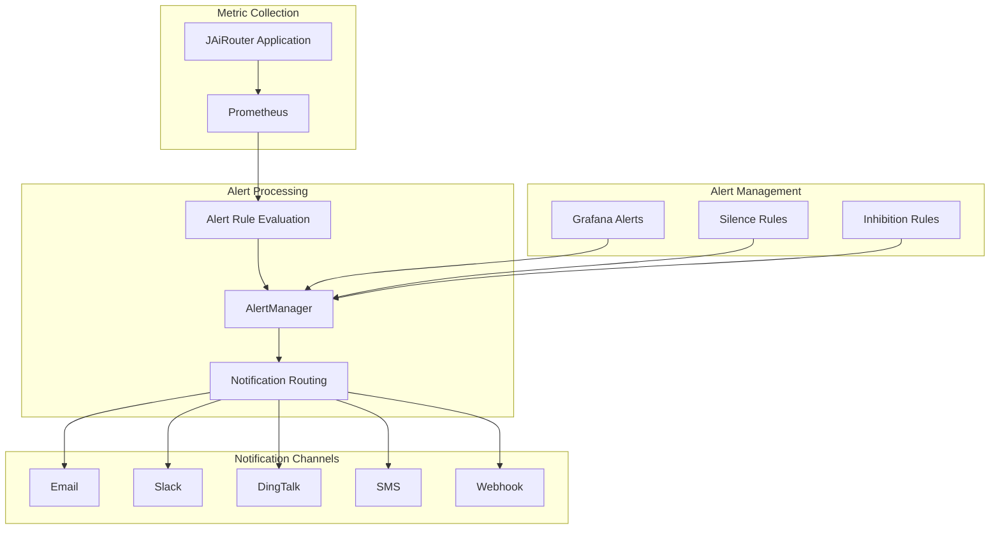
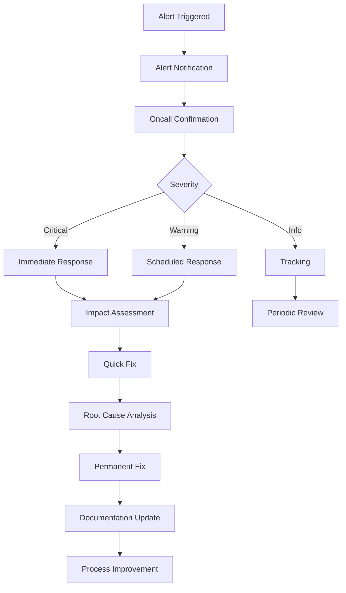

# Alert Configuration Guide

<!-- 版本信息 -->
> **文档版本**: 1.0.0  
> **最后更新**: 2025-08-19  
> **Git 提交**: c1aa5b0f  
> **作者**: Lincoln
<!-- /版本信息 -->


This document describes how to configure and manage the JAiRouter alerting system, including alert rule setup, notification configuration, and alert handling procedures.

## Alert Architecture



## Alert Rule Configuration

### Basic Alert Rules

Create `monitoring/prometheus/rules/jairouter-alerts.yml`:

```yaml
groups:
  - name: jairouter.critical
    interval: 30s
    rules:
      # Service Unavailable
      - alert: JAiRouterDown
        expr: up{job="jairouter"} == 0
        for: 1m
        labels:
          severity: critical
          service: jairouter
        annotations:
          summary: "JAiRouter Service Unavailable"
          description: "JAiRouter service has stopped responding for more than 1 minute"
          runbook_url: "https://docs.jairouter.com/troubleshooting/service-down"

      # High Error Rate
      - alert: HighErrorRate
        expr: sum(rate(jairouter_requests_total{status=~"5.."}[5m])) / sum(rate(jairouter_requests_total[5m])) > 0.05
        for: 2m
        labels:
          severity: critical
          service: jairouter
        annotations:
          summary: "High Error Rate Alert"
          description: "5xx error rate exceeds 5%, current value: {{ $value | humanizePercentage }}"
          runbook_url: "https://docs.jairouter.com/troubleshooting/high-error-rate"

      # High Latency
      - alert: HighLatency
        expr: histogram_quantile(0.95, sum(rate(jairouter_request_duration_seconds_bucket[5m])) by (le)) > 5
        for: 5m
        labels:
          severity: critical
          service: jairouter
        annotations:
          summary: "Response Time Too Long"
          description: "P95 response time exceeds 5 seconds, current value: {{ $value }}s"
          runbook_url: "https://docs.jairouter.com/troubleshooting/high-latency"

      # High Memory Usage
      - alert: HighMemoryUsage
        expr: jvm_memory_used_bytes{area="heap"} / jvm_memory_max_bytes{area="heap"} > 0.90
        for: 2m
        labels:
          severity: critical
          service: jairouter
        annotations:
          summary: "Memory Usage Too High"
          description: "JVM heap memory usage exceeds 90%, current value: {{ $value | humanizePercentage }}"
          runbook_url: "https://docs.jairouter.com/troubleshooting/memory-issues"

      # Backend Service Unavailable
      - alert: BackendServiceDown
        expr: jairouter_backend_health == 0
        for: 1m
        labels:
          severity: critical
          service: jairouter
          adapter: "{{ $labels.adapter }}"
          instance: "{{ $labels.instance }}"
        annotations:
          summary: "Backend Service Unavailable"
          description: "Backend service {{ $labels.adapter }}/{{ $labels.instance }} health check failed"
          runbook_url: "https://docs.jairouter.com/troubleshooting/backend-down"

  - name: jairouter.warning
    interval: 60s
    rules:
      # Moderate Error Rate
      - alert: ModerateErrorRate
        expr: sum(rate(jairouter_requests_total{status=~"4..|5.."}[5m])) / sum(rate(jairouter_requests_total[5m])) > 0.10
        for: 5m
        labels:
          severity: warning
          service: jairouter
        annotations:
          summary: "Error Rate High"
          description: "Total error rate exceeds 10%, current value: {{ $value | humanizePercentage }}"

      # Response Time Warning
      - alert: ModerateLatency
        expr: histogram_quantile(0.95, sum(rate(jairouter_request_duration_seconds_bucket[5m])) by (le)) > 2
        for: 10m
        labels:
          severity: warning
          service: jairouter
        annotations:
          summary: "Response Time High"
          description: "P95 response time exceeds 2 seconds, current value: {{ $value }}s"

      # Memory Usage Warning
      - alert: ModerateMemoryUsage
        expr: jvm_memory_used_bytes{area="heap"} / jvm_memory_max_bytes{area="heap"} > 0.80
        for: 5m
        labels:
          severity: warning
          service: jairouter
        annotations:
          summary: "Memory Usage High"
          description: "JVM heap memory usage exceeds 80%, current value: {{ $value | humanizePercentage }}"

      # Circuit Breaker Open
      - alert: CircuitBreakerOpen
        expr: jairouter_circuit_breaker_state == 1
        for: 1m
        labels:
          severity: warning
          service: jairouter
          circuit_breaker: "{{ $labels.circuit_breaker }}"
        annotations:
          summary: "Circuit Breaker Open"
          description: "Circuit breaker {{ $labels.circuit_breaker }} is open"

      # High Rate Limit Rejection
      - alert: HighRateLimitRejection
        expr: sum(rate(jairouter_rate_limit_events_total{result="denied"}[5m])) / sum(rate(jairouter_rate_limit_events_total[5m])) > 0.20
        for: 5m
        labels:
          severity: warning
          service: jairouter
        annotations:
          summary: "Rate Limit Rejection Rate High"
          description: "Rate limit rejection rate exceeds 20%, current value: {{ $value | humanizePercentage }}"

      # Load Imbalance
      - alert: LoadImbalance
        expr: |
          (
            max(sum by (instance) (rate(jairouter_backend_calls_total[5m]))) -
            min(sum by (instance) (rate(jairouter_backend_calls_total[5m])))
          ) / avg(sum by (instance) (rate(jairouter_backend_calls_total[5m]))) > 0.5
        for: 10m
        labels:
          severity: warning
          service: jairouter
        annotations:
          summary: "Load Imbalance"
          description: "Load difference between instances exceeds 50%"

  - name: jairouter.business
    interval: 60s
    rules:
      # High Model Call Failure Rate
      - alert: HighModelCallFailureRate
        expr: sum(rate(jairouter_model_calls_total{status!="success"}[5m])) / sum(rate(jairouter_model_calls_total[5m])) > 0.10
        for: 5m
        labels:
          severity: warning
          service: jairouter
        annotations:
          summary: "Model Call Failure Rate High"
          description: "Model call failure rate exceeds 10%, current value: {{ $value | humanizePercentage }}"

      # Unusual Active Session Count
      - alert: UnusualActiveSessionCount
        expr: |
          (
            sum(jairouter_user_sessions_active) > 
            (avg_over_time(sum(jairouter_user_sessions_active)[1h:5m]) * 2)
          ) or (
            sum(jairouter_user_sessions_active) < 
            (avg_over_time(sum(jairouter_user_sessions_active)[1h:5m]) * 0.5)
          )
        for: 10m
        labels:
          severity: info
          service: jairouter
        annotations:
          summary: "Unusual Active Session Count"
          description: "Current active session count: {{ $value }}, significantly different from historical average"
```

### Business-Specific Alert Rules

```yaml
groups:
  - name: jairouter.business-specific
    interval: 60s
    rules:
      # Slow Chat Service Response
      - alert: ChatServiceSlowResponse
        expr: histogram_quantile(0.95, sum(rate(jairouter_request_duration_seconds_bucket{service="chat"}[5m])) by (le)) > 3
        for: 5m
        labels:
          severity: warning
          service: jairouter
          business_service: chat
        annotations:
          summary: "Chat Service Slow Response"
          description: "Chat service P95 response time exceeds 3 seconds"

      # Embedding Service Traffic Drop
      - alert: EmbeddingServiceLowTraffic
        expr: sum(rate(jairouter_requests_total{service="embedding"}[5m])) < (avg_over_time(sum(rate(jairouter_requests_total{service="embedding"}[5m]))[1h:5m]) * 0.3)
        for: 15m
        labels:
          severity: info
          service: jairouter
          business_service: embedding
        annotations:
          summary: "Embedding Service Traffic Drop"
          description: "Embedding service request volume is 70% lower than historical average"

      # Specific Model Provider Down
      - alert: ModelProviderDown
        expr: sum by (provider) (jairouter_backend_health{adapter=~".*"}) == 0
        for: 2m
        labels:
          severity: critical
          service: jairouter
          provider: "{{ $labels.provider }}"
        annotations:
          summary: "Model Provider Service Down"
          description: "All instances of model provider {{ $labels.provider }} are unavailable"
```

## AlertManager Configuration

### Basic Configuration

Create `monitoring/alertmanager/alertmanager.yml`:

```yaml
global:
  smtp_smarthost: 'smtp.example.com:587'
  smtp_from: 'alerts@jairouter.com'
  smtp_auth_username: 'alerts@jairouter.com'
  smtp_auth_password: 'your-password'

# Alert routing configuration
route:
  group_by: ['alertname', 'service']
  group_wait: 10s
  group_interval: 10s
  repeat_interval: 1h
  receiver: 'default'
  routes:
    # Critical alerts notify immediately
    - match:
        severity: critical
      receiver: 'critical-alerts'
      group_wait: 0s
      repeat_interval: 5m
    
    # Warning alerts delay notification
    - match:
        severity: warning
      receiver: 'warning-alerts'
      group_wait: 30s
      repeat_interval: 30m
    
    # Business alerts special handling
    - match_re:
        business_service: '.*'
      receiver: 'business-alerts'
      group_wait: 15s
      repeat_interval: 15m

# Inhibition rules
inhibit_rules:
  # Suppress other alerts when service is unavailable
  - source_match:
      alertname: JAiRouterDown
    target_match:
      service: jairouter
    equal: ['service']
  
  # Critical alerts suppress warning alerts
  - source_match:
      severity: critical
    target_match:
      severity: warning
    equal: ['service', 'alertname']

# Receiver configuration
receivers:
  - name: 'default'
    email_configs:
      - to: 'admin@jairouter.com'
        subject: 'JAiRouter Alert: {{ .GroupLabels.alertname }}'
        body: |
          {{ range .Alerts }}
          Alert: {{ .Annotations.summary }}
          Description: {{ .Annotations.description }}
          Time: {{ .StartsAt.Format "2006-01-02 15:04:05" }}
          {{ end }}

  - name: 'critical-alerts'
    email_configs:
      - to: 'oncall@jairouter.com'
        subject: '🚨 Critical Alert: {{ .GroupLabels.alertname }}'
        body: |
          Critical alert triggered!
          
          {{ range .Alerts }}
          Alert: {{ .Annotations.summary }}
          Description: {{ .Annotations.description }}
          Service: {{ .Labels.service }}
          Time: {{ .StartsAt.Format "2006-01-02 15:04:05" }}
          Runbook: {{ .Annotations.runbook_url }}
          {{ end }}
    slack_configs:
      - api_url: 'YOUR_SLACK_WEBHOOK_URL'
        channel: '#alerts-critical'
        title: '🚨 JAiRouter Critical Alert'
        text: |
          {{ range .Alerts }}
          *{{ .Annotations.summary }}*
          {{ .Annotations.description }}
          {{ end }}

  - name: 'warning-alerts'
    email_configs:
      - to: 'team@jairouter.com'
        subject: '⚠️ Warning Alert: {{ .GroupLabels.alertname }}'
    slack_configs:
      - api_url: 'YOUR_SLACK_WEBHOOK_URL'
        channel: '#alerts-warning'
        title: '⚠️ JAiRouter Warning Alert'

  - name: 'business-alerts'
    email_configs:
      - to: 'business@jairouter.com'
        subject: '📊 Business Alert: {{ .GroupLabels.alertname }}'
    webhook_configs:
      - url: 'http://your-webhook-endpoint/alerts'
        send_resolved: true
```

### Advanced Routing Configuration

```yaml
# Complex routing example
route:
  group_by: ['alertname', 'service', 'severity']
  group_wait: 10s
  group_interval: 10s
  repeat_interval: 1h
  receiver: 'default'
  routes:
    # Different handling for business hours and after hours
    - match:
        severity: critical
      receiver: 'critical-business-hours'
      active_time_intervals:
        - business-hours
    
    - match:
        severity: critical
      receiver: 'critical-after-hours'
      active_time_intervals:
        - after-hours
    
    # Specific service alerts
    - match:
        service: jairouter
        alertname: JAiRouterDown
      receiver: 'service-down'
      group_wait: 0s
      repeat_interval: 2m

# Time interval definitions
time_intervals:
  - name: business-hours
    time_intervals:
      - times:
          - start_time: '09:00'
            end_time: '18:00'
        weekdays: ['monday:friday']
        location: 'Asia/Shanghai'
  
  - name: after-hours
    time_intervals:
      - times:
          - start_time: '18:00'
            end_time: '09:00'
        weekdays: ['monday:friday']
        location: 'Asia/Shanghai'
      - weekdays: ['saturday', 'sunday']
        location: 'Asia/Shanghai'
```

## Notification Channel Configuration

### Email Notifications

```yaml
receivers:
  - name: 'email-alerts'
    email_configs:
      - to: 'alerts@jairouter.com'
        from: 'noreply@jairouter.com'
        smarthost: 'smtp.example.com:587'
        auth_username: 'noreply@jairouter.com'
        auth_password: 'your-password'
        subject: 'JAiRouter Alert: {{ .GroupLabels.alertname }}'
        headers:
          Priority: 'high'
        body: |
          <!DOCTYPE html>
          <html>
          <head>
              <style>
                  .alert { padding: 10px; margin: 10px 0; border-radius: 5px; }
                  .critical { background-color: #ffebee; border-left: 5px solid #f44336; }
                  .warning { background-color: #fff3e0; border-left: 5px solid #ff9800; }
              </style>
          </head>
          <body>
              <h2>JAiRouter Alert Notification</h2>
              {{ range .Alerts }}
              <div class="alert {{ .Labels.severity }}">
                  <h3>{{ .Annotations.summary }}</h3>
                  <p><strong>Description:</strong> {{ .Annotations.description }}</p>
                  <p><strong>Service:</strong> {{ .Labels.service }}</p>
                  <p><strong>Severity:</strong> {{ .Labels.severity }}</p>
                  <p><strong>Start Time:</strong> {{ .StartsAt.Format "2006-01-02 15:04:05" }}</p>
                  {{ if .Annotations.runbook_url }}
                  <p><strong>Runbook:</strong> <a href="{{ .Annotations.runbook_url }}">View</a></p>
                  {{ end }}
              </div>
              {{ end }}
          </body>
          </html>
```

### Slack Notifications

```yaml
receivers:
  - name: 'slack-alerts'
    slack_configs:
      - api_url: 'https://hooks.slack.com/services/YOUR/SLACK/WEBHOOK'
        channel: '#jairouter-alerts'
        username: 'AlertManager'
        icon_emoji: ':warning:'
        title: '{{ if eq .Status "firing" }}🚨{{ else }}✅{{ end }} JAiRouter Alert'
        title_link: 'http://localhost:9093'
        text: |
          {{ range .Alerts }}
          *Alert:* {{ .Annotations.summary }}
          *Description:* {{ .Annotations.description }}
          *Service:* {{ .Labels.service }}
          *Severity:* {{ .Labels.severity }}
          *Time:* {{ .StartsAt.Format "2006-01-02 15:04:05" }}
          {{ if .Annotations.runbook_url }}*Runbook:* {{ .Annotations.runbook_url }}{{ end }}
          ---
          {{ end }}
        actions:
          - type: button
            text: 'View Grafana'
            url: 'http://localhost:3000'
          - type: button
            text: 'View Prometheus'
            url: 'http://localhost:9090'
```

### DingTalk Notifications

```yaml
receivers:
  - name: 'dingtalk-alerts'
    webhook_configs:
      - url: 'https://oapi.dingtalk.com/robot/send?access_token=YOUR_TOKEN'
        send_resolved: true
        http_config:
          proxy_url: 'http://proxy.example.com:8080'
        body: |
          {
            "msgtype": "markdown",
            "markdown": {
              "title": "JAiRouter Alert Notification",
              "text": "## JAiRouter Alert Notification\n\n{{ range .Alerts }}**Alert:** {{ .Annotations.summary }}\n\n**Description:** {{ .Annotations.description }}\n\n**Service:** {{ .Labels.service }}\n\n**Severity:** {{ .Labels.severity }}\n\n**Time:** {{ .StartsAt.Format \"2006-01-02 15:04:05\" }}\n\n---\n\n{{ end }}"
            }
          }
```

### SMS Notifications

```yaml
receivers:
  - name: 'sms-alerts'
    webhook_configs:
      - url: 'http://your-sms-gateway/send'
        http_config:
          basic_auth:
            username: 'your-username'
            password: 'your-password'
        body: |
          {
            "to": ["13800138000", "13900139000"],
            "message": "JAiRouter Alert: {{ range .Alerts }}{{ .Annotations.summary }}{{ end }}"
          }
```

## Alert Silencing and Inhibition

### Silence Rules

```bash
# Create silence rules using amtool
amtool silence add alertname="HighMemoryUsage" --duration="2h" --comment="Memory optimization maintenance"

# Silence all alerts for a specific service
amtool silence add service="jairouter" --duration="30m" --comment="Service maintenance"

# Silence alerts for a specific instance
amtool silence add instance="jairouter-01" --duration="1h" --comment="Instance restart"
```

### Inhibition Rule Configuration

```yaml
inhibit_rules:
  # Suppress other related alerts when service is completely unavailable
  - source_match:
      alertname: JAiRouterDown
    target_match_re:
      alertname: '(HighLatency|HighErrorRate|HighMemoryUsage)'
    equal: ['service']
  
  # Suppress related business alerts when backend service is unavailable
  - source_match:
      alertname: BackendServiceDown
    target_match:
      alertname: HighModelCallFailureRate
    equal: ['service']
  
  # Critical level alerts suppress warning level alerts
  - source_match:
      severity: critical
    target_match:
      severity: warning
    equal: ['service', 'alertname']
```

## Alert Testing

### Manual Alert Triggering

```bash
# Stop JAiRouter service to test service unavailable alert
docker stop jairouter

# Simulate high memory usage
curl -X POST http://localhost:8080/actuator/test/memory-stress

# Simulate high error rate
for i in {1..100}; do curl http://localhost:8080/invalid-endpoint; done
```

### Alert Rule Validation

```bash
# Validate alert rule syntax
promtool check rules monitoring/prometheus/rules/jairouter-alerts.yml

# Test alert rules
promtool query instant http://localhost:9090 'up{job="jairouter"} == 0'

# View current active alerts
curl http://localhost:9090/api/v1/alerts
```

### AlertManager Testing

```bash
# Check AlertManager configuration
amtool config show

# View current alerts
amtool alert query

# View silence rules
amtool silence query

# Test notifications
amtool alert add alertname="TestAlert" service="jairouter" severity="warning"
```

## Alert Handling Process

### Alert Response Flow



### Alert Handling Checklist

#### Critical Alert Handling
- [ ] Confirm alert authenticity
- [ ] Assess business impact scope
- [ ] Notify relevant teams
- [ ] Execute emergency response plan
- [ ] Document handling process
- [ ] Implement temporary fix
- [ ] Monitor fix effectiveness
- [ ] Conduct root cause analysis
- [ ] Implement permanent fix
- [ ] Update documentation and processes

#### Warning Alert Handling
- [ ] Confirm alert validity
- [ ] Assess potential risks
- [ ] Schedule handling time
- [ ] Implement preventive measures
- [ ] Monitor trend changes
- [ ] Document handling results

### Alert Escalation Mechanism

```yaml
# Alert escalation configuration example
route:
  routes:
    - match:
        severity: critical
      receiver: 'level1-oncall'
      group_wait: 0s
      repeat_interval: 5m
      routes:
        # Escalate to level 2 oncall after 15 minutes
        - match:
            severity: critical
          receiver: 'level2-oncall'
          group_wait: 15m
          repeat_interval: 10m
          routes:
            # Escalate to management after 30 minutes
            - match:
                severity: critical
              receiver: 'management'
              group_wait: 30m
              repeat_interval: 15m
```

## Alert Optimization

### Reducing Alert Noise

#### 1. Set Reasonable Thresholds
```yaml
# Avoid overly sensitive thresholds
- alert: HighLatency
  expr: histogram_quantile(0.95, sum(rate(jairouter_request_duration_seconds_bucket[5m])) by (le)) > 2
  for: 5m  # Increase duration to avoid transient fluctuations
```

#### 2. Use Alert Grouping
```yaml
route:
  group_by: ['alertname', 'service', 'severity']
  group_wait: 30s
  group_interval: 5m
```

#### 3. Implement Alert Inhibition
```yaml
inhibit_rules:
  - source_match:
      alertname: JAiRouterDown
    target_match_re:
      alertname: '.*'
    equal: ['service']
```

### Alert Quality Monitoring

#### Alert Metric Collection
```yaml
# Collect alert-related metrics
- record: jairouter:alert_firing_count
  expr: sum(ALERTS{alertstate="firing"})

- record: jairouter:alert_resolution_time
  expr: time() - ALERTS_FOR_STATE{alertstate="firing"}
```

#### Alert Effectiveness Analysis
- Alert accuracy: Real issues / Total alerts
- Alert coverage: Detected issues / Actual issues
- Average response time: From alert to start of handling
- Average resolution time: From alert to issue resolution

## Best Practices

### Alert Rule Design

#### 1. Follow SLI/SLO Principles
- Set alerts based on service level indicators
- Focus on user experience metrics
- Avoid alerts based on resource metrics

#### 2. Use Layered Alerts
- **Symptom alerts**: User-perceivable issues
- **Cause alerts**: Root causes of symptoms
- **Predictive alerts**: Trends that may lead to issues

#### 3. Alert Naming Conventions
```yaml
# Good alert naming
- alert: JAiRouterHighLatency
- alert: JAiRouterBackendDown
- alert: JAiRouterHighErrorRate

# Avoid these names
- alert: Alert1
- alert: Problem
- alert: Issue
```

### Notification Strategy

#### 1. Tiered Notifications
- **Critical**: Immediate notification, multiple channels
- **Warning**: Delayed notification, single channel
- **Info**: Only recorded, periodic summary

#### 2. Notification Content Optimization
- Include sufficient context information
- Provide runbook links
- Use clear descriptive language
- Avoid excessive technical jargon

#### 3. Notification Time Management
- Different strategies for business hours and after hours
- Avoid non-emergency notifications late at night
- Consider time zone differences

## Troubleshooting

### Common Issues

#### 1. Alert Rules Not Triggering
**Check Steps**:
```bash
# Validate rule syntax
promtool check rules rules/jairouter-alerts.yml

# Check rule loading status
curl http://localhost:9090/api/v1/rules

# Test query expressions
curl "http://localhost:9090/api/v1/query?query=up{job=\"jairouter\"}"
```

#### 2. Notifications Not Sent
**Check Steps**:
```bash
# Check AlertManager status
curl http://localhost:9093/api/v1/status

# View notification history
curl http://localhost:9093/api/v1/alerts

# Check configuration
amtool config show
```

#### 3. Alert Storm
**Handling Methods**:
```bash
# Create temporary silence
amtool silence add alertname=".*" --duration="1h" --comment="Alert storm handling"

# Check inhibition rules
amtool config show | grep -A 10 inhibit_rules
```

## Next Steps

After configuring alerts, it's recommended to:

1. [Learn about detailed metrics](metrics.md)
2. [Perform troubleshooting](troubleshooting.md)
3. [Optimize monitoring performance](performance.md)
4. [Review testing guidelines](testing.md)

---

**Important Reminder**: Regularly review and optimize alert rules to ensure their effectiveness and accuracy. Avoid alert fatigue and maintain team sensitivity to alerts.
