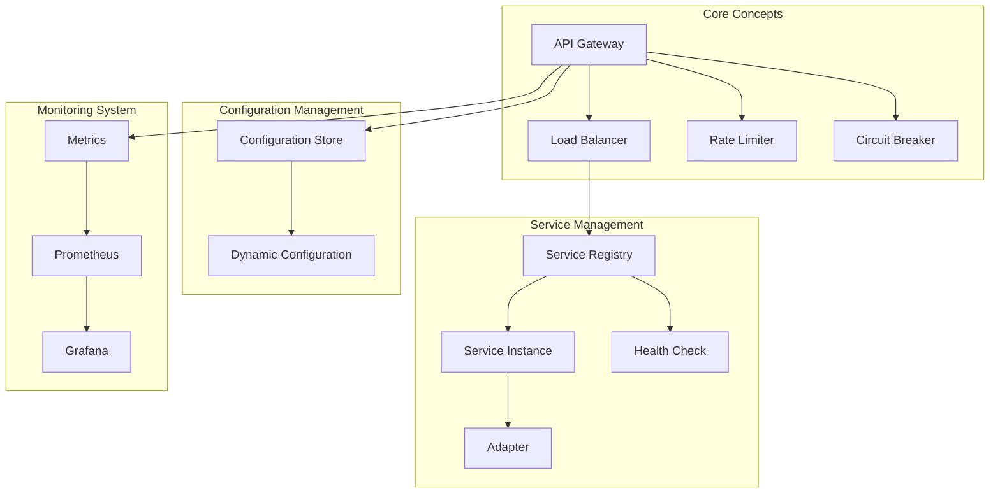

# Glossary

<!-- 版本信息 -->
> **文档版本**: 1.0.0  
> **最后更新**: 2025-08-18  
> **Git 提交**: 3418d3f6  
> **作者**: Lincoln
<!-- /版本信息 -->


This document defines the professional terms and concepts used in the JAiRouter project.

## A

### Adapter
A component that converts API formats of different backend AI services into a unified interface. Each adapter is responsible for handling request/response format conversion, error handling, and protocol adaptation for specific services.

**Example**: GPUStackAdapter converts JAiRouter requests into a format that GPUStack service can understand.

### API Gateway
A service that acts as a unified entry point for all client requests, providing functions such as routing, authentication, rate limiting, and monitoring. JAiRouter is an API gateway specifically designed for AI model services.

### Actuator
Production-ready features provided by Spring Boot, including health checks, metrics collection, configuration information, and other monitoring and management endpoints.

## B

### Backpressure
A flow control mechanism in reactive programming when the data production speed exceeds the consumption speed. JAiRouter uses the Reactor framework to handle backpressure.

### Base URL
The root address of a backend service, used to construct complete request URLs.

**Example**: `http://localhost:11434` is the base URL for the Ollama service.

## C

### Circuit Breaker
A fault protection mechanism that automatically cuts off requests when service failures are detected, preventing fault propagation. It has three states: CLOSED, OPEN, and HALF_OPEN.

### Client IP
The IP address of the client initiating the request, used for IP-based load balancing and rate limiting.

### Configuration Store
A storage backend for persisting configuration data, supporting both in-memory storage and file storage.

## D

### Dynamic Configuration
Configuration that can be modified at runtime without restarting the service. JAiRouter supports dynamically updating service instance configurations via REST API.

## E

### Endpoint
The specific access address of an API, including the URL path and HTTP method.

**Example**: `POST /v1/chat/completions` is the chat completion endpoint.

## F

### Fallback
A mechanism that returns preset responses or uses backup services when the primary service is unavailable. It supports two strategies: default response and cache fallback.

### Flux
A reactive type in the Reactor framework representing an asynchronous sequence of 0 to N elements.

## G

### Grafana
An open-source monitoring and visualization platform used to display metric data collected by Prometheus.

## H

### Health Check
A mechanism that periodically checks whether service instances are running normally. Unhealthy instances are automatically removed from the load balancing pool.

### HTTP Client Pool
A mechanism that reuses HTTP connections to avoid frequent creation and destruction of connections, thereby improving performance.

## I

### Instance
A specific deployment unit of a backend AI service, containing information such as name, address, path, and weight.

**Example**:
```yaml
- name: "ollama-llama2"
  baseUrl: "http://localhost:11434"
  path: "/v1/chat/completions"
  weight: 1
```

### IP Hash
A load balancing strategy that uses hash calculations based on the client's IP address to select backend instances, ensuring that requests from the same client are always routed to the same instance.

## J

### JVM (Java Virtual Machine)
The runtime environment for running Java applications. JAiRouter runs on the JVM and requires Java 17 or higher.

## L

### Load Balancer
A component that distributes requests among multiple backend instances. JAiRouter supports strategies such as random, round-robin, least connections, and IP hash.

### Least Connections
A load balancing strategy that selects the instance with the fewest active connections, suitable for requests with significant processing time differences.

### Leaky Bucket
A rate-limiting algorithm that processes requests at a fixed rate. Requests exceeding the rate are discarded or delayed to achieve smooth rate limiting.

## M

### Metrics
Quantitative data used to monitor system performance and status, such as request count, response time, and error rate.

### Mono
A reactive type in the Reactor framework representing an asynchronous sequence of 0 to 1 elements.

### Model
A specific model in AI services, such as GPT-3.5, LLaMA-2, etc. Each model may have different capabilities and performance characteristics.

## O

### OpenAI Compatible
An interface design that follows the OpenAI API format and specifications, allowing clients to seamlessly switch to JAiRouter.

## P

### Path
The URL path part of an API endpoint, combined with the base URL to form the complete request address.

**Example**: `/v1/chat/completions` is the path for the chat completion API.

### Prometheus
An open-source monitoring system and time-series database used to collect and store JAiRouter's operational metrics.

## R

### Rate Limiter
A component that controls request frequency to prevent system overload. It supports algorithms such as token bucket, leaky bucket, and sliding window.

### Reactive Programming
A programming paradigm based on asynchronous data streams. JAiRouter implements reactive programming using Spring WebFlux and Reactor.

### Round Robin
A load balancing strategy that selects backend instances in a cyclic order to ensure even distribution of requests.

## S

### Service Instance
See Instance.

### Service Registry
A component that manages information about all backend service instances, responsible for instance registration, discovery, and health status maintenance.

### Sliding Window
A rate-limiting algorithm that limits the number of requests within a fixed time window, with the window sliding over time.

### Spring Boot
A Java application framework. JAiRouter is built on Spring Boot 3.5.x.

### Spring WebFlux
Spring framework's reactive web module that supports non-blocking I/O and high-concurrency processing.

## T

### Token Bucket
A rate-limiting algorithm that adds tokens to a bucket at a fixed rate. Requests need to consume tokens to pass through, supporting burst traffic.

### Timeout
The maximum time limit for a request to wait for a response. Exceeding this time will return a timeout error.

## W

### WebClient
A non-blocking, reactive HTTP client provided by Spring WebFlux. JAiRouter uses it to communicate with backend services.

### Weight
The weight value of a service instance used for weighted load balancing. Instances with higher weights receive more requests.

### Warm Up
A rate-limiting strategy that gradually increases the allowed request volume during system startup to avoid performance issues during cold starts.

## Abbreviation List

| Abbreviation | Full Name | Chinese | Description |
|--------------|-----------|---------|-------------|
| **AI** | Artificial Intelligence | 人工智能 | Computer simulation of human intelligence |
| **API** | Application Programming Interface | 应用程序编程接口 | Communication protocol between software components |
| **CPU** | Central Processing Unit | 中央处理器 | Main processing unit of a computer |
| **DNS** | Domain Name System | 域名系统 | System that converts domain names to IP addresses |
| **GC** | Garbage Collection | 垃圾回收 | JVM automatic memory management mechanism |
| **HTTP** | HyperText Transfer Protocol | 超文本传输协议 | Basic protocol for web communication |
| **HTTPS** | HTTP Secure | 安全超文本传输协议 | Encrypted HTTP protocol |
| **IP** | Internet Protocol | 网际协议 | Basic protocol for network communication |
| **JSON** | JavaScript Object Notation | JavaScript 对象表示法 | Lightweight data interchange format |
| **JVM** | Java Virtual Machine | Java 虚拟机 | Virtual environment for running Java programs |
| **LLM** | Large Language Model | 大语言模型 | Large-scale pre-trained language model |
| **REST** | Representational State Transfer | 表述性状态转移 | Web service architectural style |
| **RPS** | Requests Per Second | 每秒请求数 | Metric for measuring system throughput |
| **SSL** | Secure Sockets Layer | 安全套接字层 | Network communication encryption protocol |
| **TLS** | Transport Layer Security | 传输层安全 | Successor version of SSL |
| **TTL** | Time To Live | 生存时间 | Validity period of data |
| **URL** | Uniform Resource Locator | 统一资源定位符 | Address of a network resource |
| **YAML** | YAML Ain't Markup Language | YAML 不是标记语言 | Human-readable data serialization format |

## Concept Relationship Diagram



## Usage Recommendations

### Getting Started
It is recommended to learn the following concepts in order:
1. **Basic Concepts**: API Gateway, Load Balancer, Service Instance
2. **Core Functions**: Rate Limiter, Circuit Breaker, Health Check
3. **Advanced Features**: Dynamic Configuration, Metrics, Adapter
4. **Operations and Monitoring**: Prometheus, Grafana, Actuator

### In-depth Understanding
- **Reactive Programming**: Learn Mono, Flux, and backpressure handling
- **Performance Optimization**: Understand concepts such as JVM, GC, and connection pools
- **Monitoring and Operations**: Master metric collection, alert configuration, and troubleshooting

### Practical Application
- Start with simple load balancing configurations
- Gradually add rate limiting and circuit breaker functions
- Configure monitoring and alert systems
- Optimize performance and stability

---

**Note**: This glossary will be continuously updated as the project develops. If you find missing terms or concepts that need to be added, please provide feedback through [GitHub Issues](https://github.com/Lincoln-cn/JAiRouter/issues).

**Last Updated**: January 15, 2025
