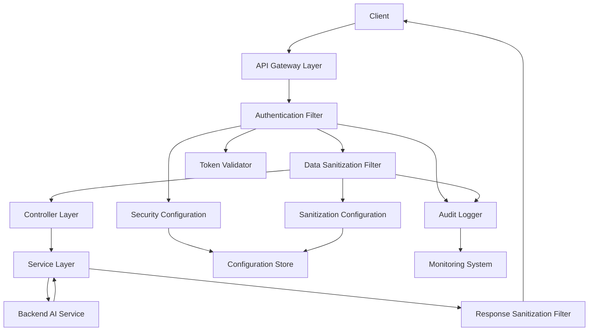

# Security Features

<!-- 版本信息 -->
> **文档版本**: 1.0.0  
> **最后更新**: 2025-08-19  
> **Git 提交**:   
> **作者**: 
<!-- /版本信息 -->


JAiRouter provides enterprise-grade security features, including authentication, data sanitization, security auditing, and monitoring. These features ensure that your AI model services not only deliver high-performance routing but also meet strict security and compliance requirements.

## Feature Overview

### 🔐 Authentication
- **API Key Authentication**: Supports multi-level permission control and expiration management
- **JWT Authentication**: Supports standard JWT tokens and refresh mechanisms
- **Dual Authentication**: API Key and JWT can be used simultaneously
- **Cache Optimization**: Supports Redis and local caching for performance improvement

### 🛡️ Data Sanitization
- **Bidirectional Sanitization**: Supports sanitization of both request and response data
- **Smart Recognition**: Automatically identifies PII data and sensitive keywords
- **Multiple Strategies**: Supports masking, replacement, deletion, hashing, and other sanitization strategies
- **Whitelist Mechanism**: Supports user and IP whitelists

### 📊 Security Auditing
- **Comprehensive Logging**: Records all security-related events
- **Real-time Alerts**: Supports real-time alerts for abnormal situations
- **Long-term Storage**: Supports long-term storage and archiving of audit logs
- **Compliance Support**: Meets data protection regulatory requirements

### 📈 Security Monitoring
- **Performance Metrics**: Provides detailed performance metrics for security functions
- **Health Checks**: Real-time monitoring of security function status
- **Alert Notifications**: Supports multiple alert methods including email and Webhook

## Quick Start

### 1. Enable Security Features

Enable security features in [application.yml](file://D:\IdeaProjects\model-router\target\classes\application.yml):

```yaml
jairouter:
  security:
    enabled: true
```

### 2. Configure API Key Authentication

```yaml
jairouter:
  security:
    api-key:
      enabled: true
      keys:
        - key-id: "admin-key"
          key-value: "${ADMIN_API_KEY}"
          permissions: ["admin", "read", "write"]
          expires-at: "2025-12-31T23:59:59"
```

### 3. Configure Data Sanitization

```yaml
jairouter:
  security:
    sanitization:
      request:
        enabled: true
        sensitive-words: ["password", "secret"]
        pii-patterns: ["\\d{11}", "[a-zA-Z0-9._%+-]+@[a-zA-Z0-9.-]+\\.[a-zA-Z]{2,}"]
```

### 4. Test Security Features

```bash
curl -H "X-API-Key: your-api-key" \
     -X POST \
     -H "Content-Type: application/json" \
     -d '{"model": "gpt-3.5-turbo", "messages": [...]}' \
     http://localhost:8080/v1/chat/completions
```

## Documentation Navigation

- [API Key Management](api-key-management.md) - Configuration and management of API Keys
- [JWT Authentication](jwt-authentication.md) - Configuration and usage of JWT authentication
- [Data Sanitization](data-sanitization.md) - Configuration of data sanitization features
- [Troubleshooting](troubleshooting.md) - Solutions to common issues

## Architecture Overview



## Configuration Examples

### Development Environment

```yaml
jairouter:
  security:
    enabled: true
    api-key:
      enabled: true
      keys:
        - key-id: "dev-admin"
          key-value: "dev-admin-key-12345"
          permissions: ["admin", "read", "write"]
    sanitization:
      request:
        enabled: true
        whitelist-users: ["dev-admin"]
    audit:
      enabled: true
      log-level: "DEBUG"
```

### Production Environment

```yaml
jairouter:
  security:
    enabled: true
    api-key:
      enabled: true
      cache-enabled: true
      keys:
        - key-id: "prod-admin"
          key-value: "${PROD_ADMIN_API_KEY}"
          permissions: ["admin", "read", "write"]
    jwt:
      enabled: true
      secret: "${JWT_SECRET}"
    sanitization:
      request:
        enabled: true
        sensitive-words: ["password", "secret", "token"]
      response:
        enabled: true
    audit:
      enabled: true
      retention-days: 365
    performance:
      cache:
        redis:
          enabled: true
```

## Best Practices

### Authentication Security
- Use strong API Keys (at least 32 characters)
- Rotate API Keys and JWT secrets regularly
- Set reasonable expiration times
- Enable caching for performance improvement

### Data Protection
- Configure sanitization rules according to business needs
- Regularly review and update sanitization patterns
- Set whitelists appropriately
- Ensure compliance

### Operations Security
- Enable detailed audit logs
- Configure real-time alerts
- Backup configurations regularly
- Monitor system performance

## Environment Variables

```bash
# API Key Configuration
export ADMIN_API_KEY="your-admin-api-key-here"
export USER_API_KEY="your-user-api-key-here"

# JWT Configuration
export JWT_SECRET="your-jwt-secret-key-here"

# Redis Configuration (if enabled)
export REDIS_HOST="localhost"
export REDIS_PORT="6379"
export REDIS_PASSWORD="your-redis-password"
```

## Monitoring Metrics

### Authentication Metrics
- `jairouter_security_authentication_attempts_total`: Total authentication attempts
- `jairouter_security_authentication_successes_total`: Total successful authentications
- `jairouter_security_authentication_failures_total`: Total authentication failures

### Sanitization Metrics
- `jairouter_security_sanitization_operations_total`: Total sanitization operations
- `jairouter_security_sanitization_duration_seconds`: Sanitization operation duration
- `jairouter_security_sanitization_patterns_matched_total`: Total matched patterns

## Next Steps

1. Read the [API Key Management Guide](api-key-management.md) to understand detailed authentication configuration
2. Review the [Data Sanitization Configuration](data-sanitization.md) to learn how to protect sensitive data
3. Refer to the [Troubleshooting Guide](troubleshooting.md) to resolve common issues
4. Configure monitoring and alerts to ensure secure system operation
