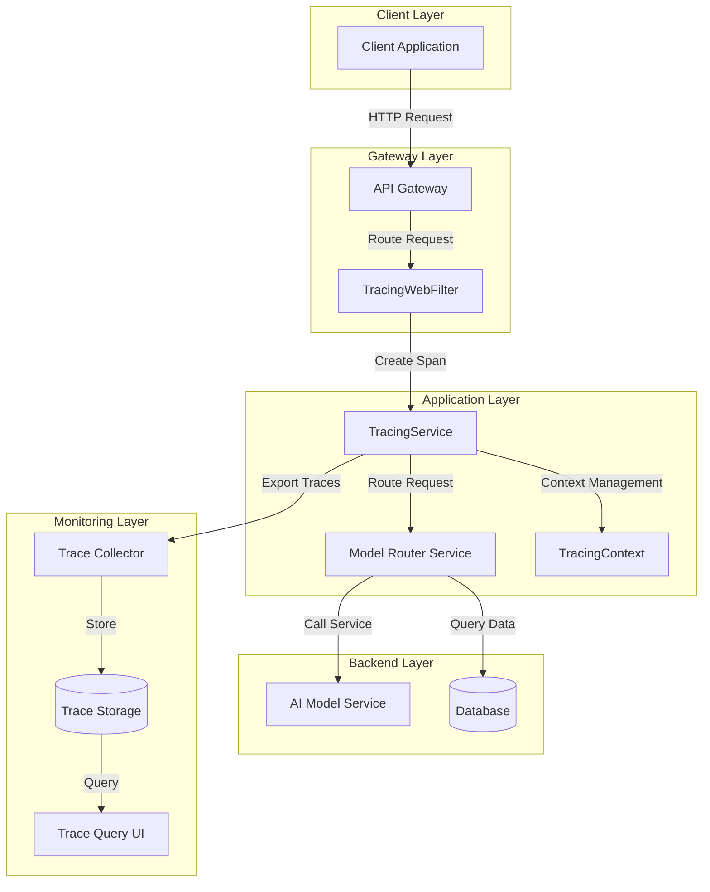

# Distributed Tracing Overview

JAiRouter integrates OpenTelemetry-based distributed tracing system, providing comprehensive request tracing, performance monitoring, and fault diagnosis capabilities.

## Key Features

### 🔍 End-to-End Tracing
- **Request-level tracing**: Complete tracing from client requests to backend service calls
- **Inter-service monitoring**: Automatic recording of microservice call relationships and latency
- **Async operation tracing**: Context propagation support in reactive programming
- **Database query tracing**: Monitor database operations and slow query detection

### 📊 Sampling Strategies  
- **Ratio sampling**: Random sampling based on percentage
- **Rule-based sampling**: Rule sampling based on service name, operation type, request path
- **Adaptive sampling**: Dynamic sampling rate adjustment based on system load and error rate
- **Dynamic configuration**: Runtime sampling strategy adjustment without service restart

### 🏷️ Context Management
- **Trace identifiers**: Automatic generation and management of Trace ID and Span ID
- **MDC integration**: Automatic injection of tracing information into logs
- **Context propagation**: Automatic tracing context propagation in reactive streams
- **Metadata tags**: Support for custom tags and business attributes

### 🎯 Performance Monitoring
- **Response time statistics**: Record request processing latency and performance metrics
- **Error rate monitoring**: Statistics and analysis of error occurrences
- **Throughput analysis**: Monitor system processing capacity and load
- **Slow query detection**: Automatic identification and reporting of performance bottlenecks

## Architecture Overview

## Core Components

### TracingService
Core tracing service component responsible for:
- Creating and managing Span lifecycle
- Handling tracing context creation, propagation, and cleanup
- Integrating sampling strategies for intelligent sampling
- Providing trace data export and storage interfaces

### TracingWebFilter
Web filter component implementing:
- Automatic tracing wrapper for HTTP requests
- Tracing context creation and injection
- Context propagation in reactive streams
- Automatic annotation of requests and responses

### SamplingStrategy
Sampling strategy management supporting:
- Implementation and switching of multiple sampling algorithms
- Dynamic sampling rate adjustment
- Rule-based intelligent sampling
- Performance optimization of sampling decisions

## Use Cases

### Microservice Chain Analysis
- Visualize service call relationships and dependency graphs
- Identify performance bottlenecks between services
- Analyze impact scope of service failures
- Optimize service deployment and resource allocation

### Performance Issue Diagnosis
- Locate specific stages of slow requests
- Analyze database query performance
- Identify code hotspots and optimization opportunities
- Monitor system capacity and scaling needs

### Root Cause Analysis
- Quickly locate error origins
- Analyze error propagation paths
- Evaluate fault impact scope
- Validate effectiveness of fixes

## Next Steps

- [Quick Start](quickstart.md) - Quickly enable and configure tracing features
- [Configuration Reference](config-reference.md) - Detailed configuration options
- [Usage Guide](usage-guide.md) - Common use cases and best practices
- [Development Integration](../development/tracing-integration.md) - Developer integration guide
- [Troubleshooting](troubleshooting.md) - Common issues and solutions