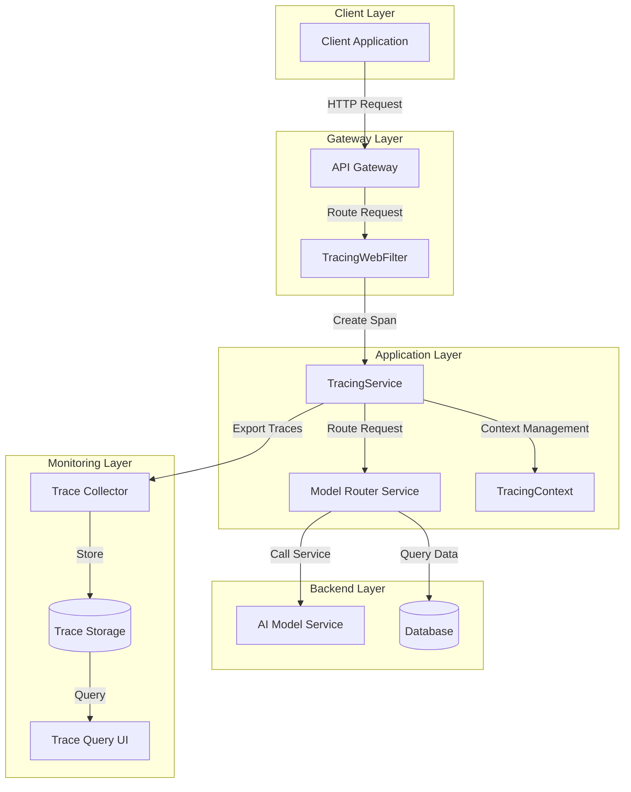

# Distributed Tracing Overview

> **Version:** 2.6.11  
> **Last Updated:** 2026-06-09  
> **Configuration Path:** `src/main/resources/config/tracing/tracing-base.yml`

JAiRouter integrates OpenTelemetry-based distributed tracing system, providing comprehensive request tracing, performance monitoring, and fault diagnosis capabilities.

## Key Features

### 🔍 End-to-End Tracing
- **Request-level tracing**: Complete tracing from client requests to backend service calls
- **Inter-service monitoring**: Automatic recording of microservice call relationships and latency
- **Async operation tracing**: Context propagation support in reactive programming (via `AsyncTracingProcessor`)
- **Database query tracing**: Monitor database operations and slow query detection
- **Component-level tracing**: Integrated tracing for rate limiter, circuit breaker, and load balancer

### 📊 Sampling Strategies
- **Ratio sampling**: Random sampling based on percentage (default: 0.1, optimized in v2.7.9 for 90% cost reduction)
- **Rule-based sampling**: Rule sampling based on service name, operation type, request path
- **Adaptive sampling**: Dynamic sampling rate adjustment based on system load and error rate
- **Parent-based sampling**: Respect parent trace sampling decisions
- **Dynamic configuration**: Runtime sampling strategy adjustment without service restart

### 🏷️ Context Management
- **Trace identifiers**: Automatic generation and management of Trace ID and Span ID
- **MDC integration**: Automatic injection of tracing information into logs via `TracingMDCManager`
- **Context propagation**: Automatic tracing context propagation in reactive streams via `ReactiveTracingContextHolder`
- **Metadata tags**: Support for custom tags and business attributes
- **Structured logging**: JSON-formatted logs with trace context via `StructuredLogger`

### 🎯 Performance Monitoring
- **Response time statistics**: Record request processing latency and performance metrics
- **Error rate monitoring**: Statistics and analysis of error occurrences
- **Throughput analysis**: Monitor system processing capacity and load
- **Slow query detection**: Automatic identification and reporting of performance bottlenecks
- **Memory management**: Intelligent cache management with `TracingMemoryManager` and LRU eviction
- **Performance optimization**: Automatic detection of bottlenecks via `TracingPerformanceMonitor`

## Architecture Overview

```mermaid
graph TB
    subgraph "Client Layer"
        Client[Client Application]
    end
    
    subgraph "Gateway Layer"
        Gateway[API Gateway]
        TFilter[TracingWebFilter]
    end
    
    subgraph "Application Layer"
        Router[Model Router Service]
        TService[TracingService]
        TContext[TracingContext]
    end
    
    subgraph "Backend Layer"
        Model[AI Model Service]
        Database[(Database)]
    end
    
    subgraph "Monitoring Layer"
        Collector[Trace Collector]
        Storage[(Trace Storage)]
        UI[Trace Query UI]
    end
    
    Client -->|HTTP Request| Gateway
    Gateway -->|Route Request| TFilter
    TFilter -->|Create Span| TService
    TService -->|Context Management| TContext
    TService -->|Route Request| Router
    Router -->|Call Service| Model
    Router -->|Query Data| Database
    
    TService -->|Export Traces| Collector
    Collector -->|Store| Storage
    Storage -->|Query| UI
```

## Core Components

### TracingService
Core tracing service component responsible for:
- Creating and managing Span lifecycle
- Handling tracing context creation, propagation, and cleanup
- Integrating sampling strategies for intelligent sampling
- Providing trace data export and storage interfaces
- Performance statistics and optimization triggers

### TracingWebFilter
Web filter component implementing:
- Automatic tracing wrapper for HTTP requests
- Tracing context creation and injection
- Context propagation in reactive streams
- Automatic annotation of requests and responses

### SamplingStrategyManager
Sampling strategy management supporting:
- Implementation and switching of multiple sampling algorithms
- Dynamic sampling rate adjustment
- Rule-based intelligent sampling
- Performance optimization of sampling decisions
- Runtime configuration updates

### TracingMemoryManager
Memory management component providing:
- LRU cache for trace data
- Memory pressure monitoring
- Automatic garbage collection triggers
- Cache hit/miss statistics

### AsyncTracingProcessor
Asynchronous trace processing component:
- Queue-based trace data processing
- Batch export to trace collectors
- Graceful degradation under high load
- Processing statistics and monitoring

### TracingPerformanceMonitor
Performance monitoring component:
- Real-time bottleneck detection
- Optimization suggestions generation
- Health status monitoring
- Performance reports generation

### StructuredLogger
Structured logging component:
- JSON-formatted log output
- Trace context injection
- Multiple log builders (Request, Response, Error, Performance, Security, etc.)
- Custom field support

### Security Components
- **TracingSecurityManager**: Access control for trace data
- **TracingSanitizationService**: Sensitive data sanitization
- **TracingEncryptionService**: Trace data encryption

## Use Cases

### Microservice Chain Analysis
- Visualize service call relationships and dependency graphs
- Identify performance bottlenecks between services
- Analyze impact scope of service failures
- Optimize service deployment and resource allocation

### Performance Issue Diagnosis
- Locate specific stages of slow requests
- Analyze database query performance
- Identify code hotspots and optimization opportunities
- Monitor system capacity and scaling needs

### Root Cause Analysis
- Quickly locate error origins
- Analyze error propagation paths
- Evaluate fault impact scope
- Validate effectiveness of fixes

## REST API Endpoints

### Query API (`/api/tracing/query`)
- `GET /trace/{traceId}` - Get trace chain details
- `GET /search` - Search traces with filters
- `GET /recent` - Get recent traces
- `GET /services` - Get service statistics
- `GET /statistics` - Get trace statistics
- `POST /export` - Export trace data
- `POST /cleanup` - Clean up expired traces
- `GET /operations` - Get operation list
- `GET /health` - Query service health check
- `GET /performance/stats` - Get performance stats
- `GET /performance/latency` - Get latency analysis
- `GET /performance/errors` - Get error analysis
- `GET /performance/throughput` - Get throughput analysis

### Performance API (`/api/tracing/performance`)
- `GET /stats` - Get performance statistics
- `GET /processing-stats` - Get async processing stats
- `GET /memory-stats` - Get memory usage stats
- `GET /health` - Get tracing system health
- `GET /bottlenecks` - Detect performance bottlenecks
- `GET /suggestions` - Get optimization suggestions
- `GET /report` - Generate performance report
- `POST /optimize` - Trigger performance optimization
- `POST /tuning` - Execute performance tuning
- `POST /memory/gc` - Trigger garbage collection
- `POST /memory/check` - Execute memory check
- `POST /processing/flush` - Flush processing buffer
- `GET /metrics/dashboard` - Get dashboard metrics
- `GET /alerts/active` - Get active alerts

### Actuator API (`/api/tracing/actuator`)
- `GET /status` - Get tracing system status
- `GET /health` - Get health status
- `GET /config` - Get tracing configuration
- `PUT /config` - Update tracing configuration
- `POST /sampling/refresh` - Refresh sampling strategy
- `GET /stats` - Get tracing statistics
- `POST /enable` - Enable tracing
- `POST /disable` - Disable tracing
- `GET /export` - Export tracing data
- `POST /clear-cache` - Clear tracing cache

## Next Steps

- [Quick Start](quickstart.md) - Quickly enable and configure tracing features
- [Configuration Reference](config-reference.md) - Detailed configuration options
- [Usage Guide](usage-guide.md) - Common use cases and best practices
- [Development Integration](developer-guide.md) - Developer integration guide
- [Troubleshooting](troubleshooting.md) - Common issues and solutions