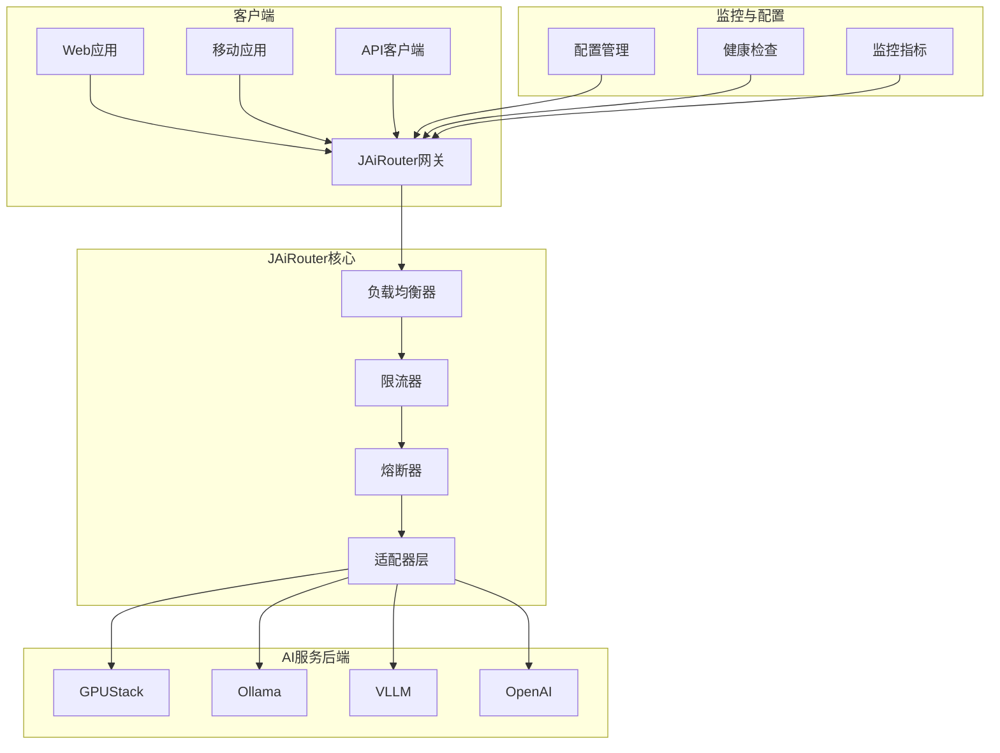

# JAiRouter

JAiRouter 是一个基于 Spring Boot 的 AI 模型服务路由和负载均衡网关，为各种 AI 模型服务提供统一的访问接口和智能路由功能。

## 项目概述

JAiRouter 旨在解决 AI 模型服务管理中的复杂性问题，通过统一的 OpenAI 兼容 API 接口，为开发者提供：

- **统一访问入口**：通过标准的 `/v1/*` 接口访问不同的 AI 模型服务
- **智能负载均衡**：支持多种负载均衡策略，确保服务的高可用性
- **流量控制**：内置限流、熔断机制，保护后端服务稳定运行
- **动态配置**：支持运行时配置更新，无需重启服务
- **多后端适配**：支持 GPUStack、Ollama、VLLM 等多种 AI 服务后端

## 核心特性

### 🚀 统一 API 网关
- 提供 OpenAI 兼容的 REST API 接口
- 支持 Chat、Embedding、Rerank、TTS、STT、Image Generation 等服务类型
- 统一的请求响应格式，简化客户端集成

### ⚖️ 智能负载均衡
- **Random**：随机选择可用实例
- **Round Robin**：轮询分配请求
- **Least Connections**：选择连接数最少的实例
- **IP Hash**：基于客户端 IP 的一致性哈希

### 🛡️ 流量保护机制
- **限流算法**：Token Bucket、Leaky Bucket、Sliding Window、Warm Up
- **熔断保护**：自动检测服务故障，实施熔断和恢复策略
- **降级策略**：提供默认响应和缓存机制

### 🔧 运维友好
- **健康检查**：自动监控服务实例状态，剔除不可用节点
- **动态配置**：支持运行时更新服务配置，无需重启
- **配置持久化**：支持内存和文件两种存储方式
- **监控集成**：内置 Prometheus 指标，支持 Grafana 可视化

### 🔌 多后端支持
支持主流 AI 服务后端：
- **GPUStack**：GPU 集群管理平台
- **Ollama**：本地大语言模型运行环境
- **VLLM**：高性能推理引擎
- **Xinference**：模型推理服务框架
- **LocalAI**：本地 AI 服务
- **OpenAI**：官方 OpenAI API

## 快速开始

### 环境要求
- **JDK**: 17 或更高版本
- **Maven**: 3.6+ （推荐使用项目内置的 Maven Wrapper）
- **Docker**: 可选，用于容器化部署

### 快速启动

1. **克隆项目**
   ```bash
   git clone https://github.com/Lincoln-cn/JAiRouter.git
   cd jairouter
   ```

2. **构建项目**
   ```bash
   # 使用 Maven Wrapper（推荐）
   ./mvnw clean package
   
   # 或使用系统 Maven
   mvn clean package
   ```

3. **启动服务**
   ```bash
   java -jar target/model-router-*.jar
   ```

4. **验证部署**
   访问 [http://localhost:8080/swagger-ui/index.html](http://localhost:8080/swagger-ui/index.html) 查看 API 文档

### Docker 部署

```bash
# 构建镜像
docker build -t jairouter/model-router:latest .

# 启动容器
docker run -d \
  --name jairouter \
  -p 8080:8080 \
  -v ./config:/app/config:ro \
  jairouter/model-router:latest
```

## 架构概览



## 使用场景

### 企业 AI 服务统一管理
- 统一管理多个 AI 模型服务提供商
- 实现服务的高可用和负载均衡
- 提供统一的访问接口和认证机制

### 开发环境服务代理
- 为开发团队提供统一的 AI 服务访问入口
- 支持不同环境的配置隔离
- 简化客户端集成和测试

### 生产环境流量治理
- 实现 AI 服务的流量控制和保护
- 提供服务降级和容错机制
- 支持灰度发布和 A/B 测试

## 文档导航

- **[快速开始](getting-started/index.md)** - 安装、配置和第一步指南
- **[配置指南](configuration/index.md)** - 详细的配置说明和示例
- **[API 参考](api-reference/index.md)** - 完整的 API 文档
- **[部署指南](deployment/index.md)** - Docker、Kubernetes 部署方案
- **[监控指南](monitoring/index.md)** - 监控配置和使用说明
- **[开发指南](en/development/index.md)** - 架构说明和贡献指南
- **[故障排查](en/troubleshooting/index.md)** - 常见问题和解决方案
- **[参考资料](en/reference/index.md)** - 更新日志、FAQ 等

## 社区与支持

- **GitHub**: [https://github.com/Lincoln-cn/JAiRouter](https://github.com/Lincoln-cn/JAiRouter)
- **文档**: [https://your-org.github.io/jairouter](https://your-org.github.io/jairouter)
- **问题反馈**: [GitHub Issues](https://github.com/Lincoln-cn/JAiRouter/issues)
- **DeepWiki**: [https://deepwiki.com/Lincoln-cn/JAiRouter](https://deepwiki.com/Lincoln-cn/JAiRouter)

## 许可证

本项目采用 [MIT 许可证](https://github.com/Lincoln-cn/JAiRouter/blob/main/LICENSE)。