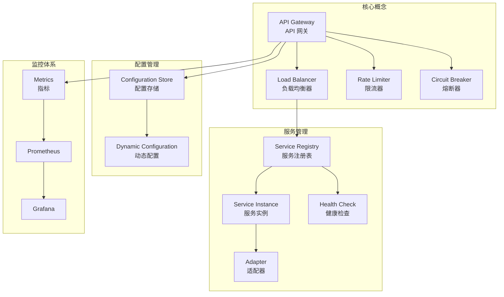

# 术语表

本文档定义了 JAiRouter 项目中使用的专业术语和概念。

## A

### Adapter (适配器)
将不同后端 AI 服务的 API 格式转换为统一接口的组件。每个适配器负责处理特定服务的请求/响应格式转换、错误处理和协议适配。

**示例**: GPUStackAdapter 将 JAiRouter 的请求转换为 GPUStack 服务能理解的格式。

### API Gateway (API 网关)
作为所有客户端请求的统一入口点，提供路由、认证、限流、监控等功能的服务。JAiRouter 是专门为 AI 模型服务设计的 API 网关。

### Actuator (执行器)
Spring Boot 提供的生产就绪功能，包括健康检查、指标收集、配置信息等监控和管理端点。

## B

### Backpressure (背压)
在响应式编程中，当数据生产速度超过消费速度时的流量控制机制。JAiRouter 使用 Reactor 框架处理背压。

### Base URL (基础 URL)
后端服务的根地址，用于构建完整的请求 URL。

**示例**: `http://localhost:11434` 是 Ollama 服务的基础 URL。

## C

### Circuit Breaker (熔断器)
一种故障保护机制，当检测到服务故障时自动切断请求，防止故障扩散。具有三种状态：关闭(CLOSED)、开启(OPEN)、半开(HALF_OPEN)。

### Client IP (客户端 IP)
发起请求的客户端的 IP 地址，用于基于 IP 的负载均衡和限流。

### Configuration Store (配置存储)
用于持久化配置数据的存储后端，支持内存存储和文件存储两种方式。

## D

### Dynamic Configuration (动态配置)
运行时可以修改的配置，无需重启服务即可生效。JAiRouter 支持通过 REST API 动态更新服务实例配置。

## E

### Endpoint (端点)
API 的具体访问地址，包括 URL 路径和 HTTP 方法。

**示例**: `POST /v1/chat/completions` 是聊天完成的端点。

## F

### Fallback (降级)
当主要服务不可用时，返回预设响应或使用备用服务的机制。支持默认响应和缓存降级两种策略。

### Flux
Reactor 框架中表示 0 到 N 个元素的异步序列的响应式类型。

## G

### Grafana
开源的监控和可视化平台，用于展示 Prometheus 收集的指标数据。

## H

### Health Check (健康检查)
定期检查服务实例是否正常运行的机制。不健康的实例会被自动从负载均衡池中移除。

### HTTP Client Pool (HTTP 客户端连接池)
复用 HTTP 连接的机制，避免频繁创建和销毁连接，提高性能。

## I

### Instance (实例)
后端 AI 服务的一个具体部署单元，包含名称、地址、路径、权重等信息。

**示例**:
```yaml
- name: "ollama-llama2"
  baseUrl: "http://localhost:11434"
  path: "/v1/chat/completions"
  weight: 1
```

### IP Hash (IP 哈希)
基于客户端 IP 地址进行哈希计算来选择后端实例的负载均衡策略，确保同一客户端的请求总是路由到同一实例。

## J

### JVM (Java 虚拟机)
运行 Java 应用程序的运行时环境。JAiRouter 基于 JVM 运行，需要 Java 17 或更高版本。

## L

### Load Balancer (负载均衡器)
在多个后端实例之间分配请求的组件。JAiRouter 支持随机、轮询、最少连接、IP 哈希等策略。

### Least Connections (最少连接)
选择当前活跃连接数最少的实例的负载均衡策略，适合处理时间差异较大的请求。

### Leaky Bucket (漏桶)
一种限流算法，以固定速率处理请求，超出速率的请求被丢弃或延迟，实现平滑限流。

## M

### Metrics (指标)
用于监控系统性能和状态的数量化数据，如请求数、响应时间、错误率等。

### Mono
Reactor 框架中表示 0 到 1 个元素的异步序列的响应式类型。

### Model (模型)
AI 服务中的具体模型，如 GPT-3.5、LLaMA-2 等。每个模型可能有不同的能力和性能特征。

## O

### OpenAI Compatible (OpenAI 兼容)
遵循 OpenAI API 格式和规范的接口设计，使得客户端可以无缝切换到 JAiRouter。

## P

### Path (路径)
API 端点的 URL 路径部分，与基础 URL 组合形成完整的请求地址。

**示例**: `/v1/chat/completions` 是聊天完成 API 的路径。

### Prometheus
开源的监控系统和时序数据库，用于收集和存储 JAiRouter 的运行指标。

## R

### Rate Limiter (限流器)
控制请求频率的组件，防止系统过载。支持令牌桶、漏桶、滑动窗口等算法。

### Reactive Programming (响应式编程)
基于异步数据流的编程范式，JAiRouter 使用 Spring WebFlux 和 Reactor 实现响应式编程。

### Round Robin (轮询)
按顺序循环选择后端实例的负载均衡策略，确保请求均匀分布。

## S

### Service Instance (服务实例)
参见 Instance (实例)。

### Service Registry (服务注册表)
管理所有后端服务实例信息的组件，负责实例的注册、发现和健康状态维护。

### Sliding Window (滑动窗口)
一种限流算法，在固定时间窗口内限制请求数量，窗口随时间滑动更新。

### Spring Boot
Java 应用程序框架，JAiRouter 基于 Spring Boot 3.5.x 构建。

### Spring WebFlux
Spring 框架的响应式 Web 模块，支持非阻塞 I/O 和高并发处理。

## T

### Token Bucket (令牌桶)
一种限流算法，以固定速率向桶中添加令牌，请求需要消耗令牌才能通过，支持突发流量。

### Timeout (超时)
请求等待响应的最大时间限制，超过此时间将返回超时错误。

## W

### WebClient
Spring WebFlux 提供的非阻塞、响应式的 HTTP 客户端，JAiRouter 使用它与后端服务通信。

### Weight (权重)
服务实例的权重值，用于加权负载均衡。权重越高的实例接收到的请求越多。

### Warm Up (预热)
一种限流策略，系统启动时逐渐增加允许的请求量，避免冷启动时的性能问题。

## 缩写词汇表

| 缩写 | 全称 | 中文 | 说明 |
|------|------|------|------|
| **AI** | Artificial Intelligence | 人工智能 | 计算机模拟人类智能的技术 |
| **API** | Application Programming Interface | 应用程序编程接口 | 软件组件间的通信协议 |
| **CPU** | Central Processing Unit | 中央处理器 | 计算机的主要处理单元 |
| **DNS** | Domain Name System | 域名系统 | 将域名转换为 IP 地址的系统 |
| **GC** | Garbage Collection | 垃圾回收 | JVM 自动内存管理机制 |
| **HTTP** | HyperText Transfer Protocol | 超文本传输协议 | Web 通信的基础协议 |
| **HTTPS** | HTTP Secure | 安全超文本传输协议 | 加密的 HTTP 协议 |
| **IP** | Internet Protocol | 网际协议 | 网络通信的基础协议 |
| **JSON** | JavaScript Object Notation | JavaScript 对象表示法 | 轻量级数据交换格式 |
| **JVM** | Java Virtual Machine | Java 虚拟机 | 运行 Java 程序的虚拟环境 |
| **LLM** | Large Language Model | 大语言模型 | 大规模预训练的语言模型 |
| **REST** | Representational State Transfer | 表述性状态转移 | Web 服务架构风格 |
| **RPS** | Requests Per Second | 每秒请求数 | 衡量系统吞吐量的指标 |
| **SSL** | Secure Sockets Layer | 安全套接字层 | 网络通信加密协议 |
| **TLS** | Transport Layer Security | 传输层安全 | SSL 的后续版本 |
| **TTL** | Time To Live | 生存时间 | 数据的有效期限 |
| **URL** | Uniform Resource Locator | 统一资源定位符 | 网络资源的地址 |
| **YAML** | YAML Ain't Markup Language | YAML 不是标记语言 | 人类可读的数据序列化格式 |

## 概念关系图



## 使用建议

### 新手入门
建议按以下顺序学习相关概念：
1. **基础概念**: API Gateway、Load Balancer、Service Instance
2. **核心功能**: Rate Limiter、Circuit Breaker、Health Check
3. **高级特性**: Dynamic Configuration、Metrics、Adapter
4. **运维监控**: Prometheus、Grafana、Actuator

### 深入理解
- **响应式编程**: 学习 Mono、Flux 和背压处理
- **性能优化**: 理解 JVM、GC、连接池等概念
- **监控运维**: 掌握指标收集、告警配置、故障排查

### 实践应用
- 从简单的负载均衡配置开始
- 逐步添加限流和熔断功能
- 配置监控和告警系统
- 优化性能和稳定性

---

**说明**: 本术语表会随着项目发展持续更新。如果您发现遗漏的术语或需要补充的概念，欢迎通过 [GitHub Issues](https://github.com/Lincoln-cn/JAiRouter/issues) 反馈。

**最后更新**: 2025年1月15日