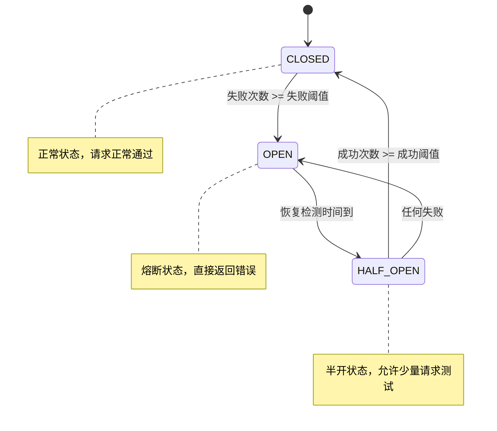

# 熔断器配置

JAiRouter 内置熔断器机制，用于防止服务雪崩和级联故障。当后端服务出现故障时，熔断器会自动切断请求，并在服务恢复后自动恢复正常。本文档详细介绍熔断器的配置和使用。

## 熔断器概述

### 工作原理

熔断器有三种状态：



### 状态说明

| 状态 | 说明 | 行为 |
|------|------|------|
| **CLOSED** | 正常状态 | 请求正常通过，统计失败次数 |
| **OPEN** | 熔断状态 | 直接拒绝请求，返回熔断错误 |
| **HALF_OPEN** | 半开状态 | 允许少量请求测试服务恢复 |

### 核心参数

| 参数 | 说明 | 默认值 |
|------|------|--------|
| `failureThreshold` | 失败阈值，超过后熔断 | 5 |
| `recoveryTimeout` | 恢复检测间隔（毫秒） | 60000 |
| `successThreshold` | 成功阈值，达到后关闭熔断 | 3 |
| `timeout` | 请求超时时间（毫秒） | 30000 |

## 全局熔断器配置

### 基础配置

```yaml
# application.yml
model:
  circuit-breaker:
    enabled: true               # 启用全局熔断器
    failure-threshold: 5        # 失败阈值
    recovery-timeout: 60000     # 恢复检测间隔（毫秒）
    success-threshold: 3        # 成功阈值
    timeout: 30000             # 请求超时时间（毫秒）
```

### 高级配置

```yaml
model:
  circuit-breaker:
    enabled: true
    failure-threshold: 5
    recovery-timeout: 60000
    success-threshold: 3
    timeout: 30000
    
    # 统计窗口配置
    statistics:
      window-size: 100          # 统计窗口大小
      minimum-requests: 10      # 最小请求数
      
    # 异常配置
    exceptions:
      include:                  # 包含的异常类型
        - "java.net.ConnectException"
        - "java.net.SocketTimeoutException"
      exclude:                  # 排除的异常类型
        - "java.lang.IllegalArgumentException"
    
    # 监控配置
    monitoring:
      enabled: true             # 启用监控
      metrics-interval: 10s     # 指标收集间隔
```

## 服务级熔断器配置

### YAML 配置

```yaml
model:
  services:
    chat:
      circuit-breaker:
        enabled: true
        failure-threshold: 3     # 更敏感的失败阈值
        recovery-timeout: 30000  # 更快的恢复检测
        success-threshold: 2     # 更快的恢复
        timeout: 45000          # 更长的超时时间
      instances:
        - name: "unstable-model"
          base-url: "http://unstable-server:8080"
          path: "/v1/chat/completions"
          weight: 1
    
    embedding:
      circuit-breaker:
        enabled: true
        failure-threshold: 10    # 更宽松的失败阈值
        recovery-timeout: 120000 # 更长的恢复时间
        success-threshold: 5     # 更多成功次数要求
        timeout: 60000
```

### JSON 配置

```json
{
  "services": {
    "chat": {
      "circuitBreaker": {
        "enabled": true,
        "failureThreshold": 5,
        "recoveryTimeout": 60000,
        "successThreshold": 3,
        "timeout": 30000
      },
      "instances": [
        {
          "name": "reliable-model",
          "baseUrl": "http://reliable-server:8080",
          "path": "/v1/chat/completions",
          "weight": 2
        }
      ]
    }
  }
}
```

## 实例级熔断器配置

### 独立实例熔断

```yaml
model:
  services:
    chat:
      instances:
        - name: "high-risk-model"
          base-url: "http://high-risk-server:8080"
          circuit-breaker:
            enabled: true
            failure-threshold: 2  # 更严格的阈值
            recovery-timeout: 30000
            success-threshold: 1
            timeout: 20000
        
        - name: "stable-model"
          base-url: "http://stable-server:8080"
          circuit-breaker:
            enabled: true
            failure-threshold: 10 # 更宽松的阈值
            recovery-timeout: 60000
            success-threshold: 3
            timeout: 30000
```

### 实例特定配置

```json
{
  "services": {
    "chat": {
      "instances": [
        {
          "name": "experimental-model",
          "baseUrl": "http://experimental-server:8080",
          "circuitBreaker": {
            "enabled": true,
            "failureThreshold": 3,
            "recoveryTimeout": 45000,
            "successThreshold": 2,
            "timeout": 25000,
            "statistics": {
              "windowSize": 50,
              "minimumRequests": 5
            }
          }
        }
      ]
    }
  }
}
```

## 熔断器与降级策略

### 基础降级配置

```yaml
model:
  services:
    chat:
      circuit-breaker:
        enabled: true
        failure-threshold: 5
        recovery-timeout: 60000
      
      # 降级策略配置
      fallback:
        enabled: true
        strategy: default       # 降级策略：default 或 cache
        response:
          choices:
            - message:
                role: "assistant"
                content: "服务暂时不可用，请稍后重试。"
              finish_reason: "stop"
          usage:
            prompt_tokens: 0
            completion_tokens: 0
            total_tokens: 0
```

### 缓存降级配置

```yaml
model:
  services:
    embedding:
      circuit-breaker:
        enabled: true
        failure-threshold: 3
        recovery-timeout: 30000
      
      fallback:
        enabled: true
        strategy: cache
        cache:
          size: 1000            # 缓存大小
          ttl: 3600000         # 缓存TTL（毫秒）
          key-generator: "md5"  # 缓存键生成算法
```

### JSON 降级配置

```json
{
  "services": {
    "chat": {
      "circuitBreaker": {
        "enabled": true,
        "failureThreshold": 5,
        "recoveryTimeout": 60000
      },
      "fallback": {
        "type": "default",
        "response": {
          "id": "fallback-response",
          "object": "chat.completion",
          "choices": [
            {
              "index": 0,
              "message": {
                "role": "assistant",
                "content": "抱歉，服务暂时不可用。我们正在努力恢复服务，请稍后重试。"
              },
              "finish_reason": "stop"
            }
          ],
          "usage": {
            "prompt_tokens": 0,
            "completion_tokens": 0,
            "total_tokens": 0
          }
        }
      }
    }
  }
}
```

## 熔断器监控

### 监控指标

```bash
# 熔断器状态
curl "http://localhost:8080/actuator/metrics/jairouter.circuitbreaker.state"

# 熔断器调用统计
curl "http://localhost:8080/actuator/metrics/jairouter.circuitbreaker.calls"

# 熔断器失败统计
curl "http://localhost:8080/actuator/metrics/jairouter.circuitbreaker.failures"

# 熔断器恢复统计
curl "http://localhost:8080/actuator/metrics/jairouter.circuitbreaker.recovery"
```

### Prometheus 指标

```prometheus
# 熔断器状态（0=CLOSED, 1=OPEN, 2=HALF_OPEN）
jairouter_circuitbreaker_state{service="chat",instance="model-1"}

# 熔断器调用总数
jairouter_circuitbreaker_calls_total{service="chat",instance="model-1",result="success"}

# 熔断器失败率
rate(jairouter_circuitbreaker_calls_total{result="failure"}[5m]) / rate(jairouter_circuitbreaker_calls_total[5m])

# 熔断器开启次数
jairouter_circuitbreaker_opened_total{service="chat",instance="model-1"}
```

### 监控仪表板

```yaml
# Grafana 仪表板配置
dashboard:
  panels:
    - title: "熔断器状态"
      type: "stat"
      targets:
        - expr: 'jairouter_circuitbreaker_state'
          legendFormat: '{{service}}-{{instance}}'
    
    - title: "熔断器失败率"
      type: "graph"
      targets:
        - expr: 'rate(jairouter_circuitbreaker_calls_total{result="failure"}[5m]) / rate(jairouter_circuitbreaker_calls_total[5m])'
          legendFormat: '{{service}}-{{instance}}'
    
    - title: "熔断器开启次数"
      type: "graph"
      targets:
        - expr: 'increase(jairouter_circuitbreaker_opened_total[1h])'
          legendFormat: '{{service}}-{{instance}}'
```

## 熔断器告警

### Prometheus 告警规则

```yaml
groups:
  - name: jairouter_circuitbreaker
    rules:
      - alert: CircuitBreakerOpen
        expr: jairouter_circuitbreaker_state == 1
        for: 1m
        labels:
          severity: critical
        annotations:
          summary: "熔断器开启"
          description: "服务 {{ $labels.service }} 实例 {{ $labels.instance }} 的熔断器已开启"
      
      - alert: HighFailureRate
        expr: rate(jairouter_circuitbreaker_calls_total{result="failure"}[5m]) / rate(jairouter_circuitbreaker_calls_total[5m]) > 0.5
        for: 2m
        labels:
          severity: warning
        annotations:
          summary: "熔断器失败率过高"
          description: "服务 {{ $labels.service }} 实例 {{ $labels.instance }} 的失败率超过 50%"
      
      - alert: FrequentCircuitBreakerOpening
        expr: increase(jairouter_circuitbreaker_opened_total[1h]) > 5
        for: 0m
        labels:
          severity: warning
        annotations:
          summary: "熔断器频繁开启"
          description: "服务 {{ $labels.service }} 实例 {{ $labels.instance }} 在过去1小时内熔断器开启超过5次"
```

### 告警通知配置

```yaml
# AlertManager 配置
route:
  group_by: ['alertname', 'service']
  group_wait: 10s
  group_interval: 10s
  repeat_interval: 1h
  receiver: 'web.hook'

receivers:
  - name: 'web.hook'
    webhook_configs:
      - url: 'http://your-webhook-url/alert'
        send_resolved: true
```

## 熔断器调优

### 参数调优指南

#### 1. 失败阈值调优

```yaml
# 敏感服务：快速熔断
sensitive-service:
  circuit-breaker:
    failure-threshold: 3        # 3次失败即熔断

# 稳定服务：宽松熔断
stable-service:
  circuit-breaker:
    failure-threshold: 10       # 10次失败才熔断

# 实验性服务：极敏感熔断
experimental-service:
  circuit-breaker:
    failure-threshold: 1        # 1次失败即熔断
```

#### 2. 恢复时间调优

```yaml
# 快速恢复服务
fast-recovery:
  circuit-breaker:
    recovery-timeout: 30000     # 30秒后尝试恢复

# 慢速恢复服务
slow-recovery:
  circuit-breaker:
    recovery-timeout: 300000    # 5分钟后尝试恢复

# 自适应恢复
adaptive-recovery:
  circuit-breaker:
    recovery-timeout: 60000
    adaptive-recovery:
      enabled: true
      min-timeout: 30000
      max-timeout: 600000
      backoff-multiplier: 2
```

#### 3. 成功阈值调优

```yaml
# 严格恢复：需要更多成功
strict-recovery:
  circuit-breaker:
    success-threshold: 5

# 快速恢复：较少成功即可
quick-recovery:
  circuit-breaker:
    success-threshold: 1

# 标准恢复
standard-recovery:
  circuit-breaker:
    success-threshold: 3
```

### 性能优化

#### 1. 统计窗口优化

```yaml
model:
  circuit-breaker:
    statistics:
      window-size: 100          # 统计窗口大小
      minimum-requests: 10      # 最小请求数
      sliding-window: true      # 使用滑动窗口
      
    # 内存优化
    memory:
      max-statistics: 1000      # 最大统计记录数
      cleanup-interval: 300s    # 清理间隔
```

#### 2. 并发优化

```yaml
model:
  circuit-breaker:
    concurrency:
      thread-safe: true         # 线程安全
      lock-free: true          # 无锁实现
      batch-processing: true    # 批量处理
```

## 实际使用案例

### 案例 1：微服务保护

```yaml
# 保护关键微服务
model:
  services:
    user-service:
      circuit-breaker:
        enabled: true
        failure-threshold: 5
        recovery-timeout: 60000
        success-threshold: 3
      fallback:
        enabled: true
        strategy: cache
        cache:
          size: 1000
          ttl: 300000
    
    order-service:
      circuit-breaker:
        enabled: true
        failure-threshold: 3     # 更敏感
        recovery-timeout: 30000  # 更快恢复
        success-threshold: 2
      fallback:
        enabled: true
        strategy: default
```

### 案例 2：外部 API 保护

```yaml
# 保护外部 API 调用
model:
  services:
    external-ai-api:
      circuit-breaker:
        enabled: true
        failure-threshold: 3
        recovery-timeout: 120000  # 外部服务恢复较慢
        success-threshold: 5      # 需要更多成功确认
        timeout: 60000           # 更长的超时时间
      fallback:
        enabled: true
        strategy: default
        response:
          error:
            code: "service_unavailable"
            message: "外部AI服务暂时不可用"
```

### 案例 3：分层熔断保护

```yaml
# 多层熔断保护
model:
  # 全局熔断器
  circuit-breaker:
    enabled: true
    failure-threshold: 20
    recovery-timeout: 300000
  
  services:
    # 服务级熔断器
    critical-service:
      circuit-breaker:
        enabled: true
        failure-threshold: 10
        recovery-timeout: 120000
      
      instances:
        # 实例级熔断器
        - name: "primary-instance"
          circuit-breaker:
            enabled: true
            failure-threshold: 5
            recovery-timeout: 60000
        
        - name: "backup-instance"
          circuit-breaker:
            enabled: true
            failure-threshold: 3   # 备用实例更敏感
            recovery-timeout: 30000
```

## 故障排查

### 常见问题

#### 1. 熔断器过于敏感

**现象**：服务频繁熔断，影响正常使用

**排查**：
```bash
# 检查失败率
curl "http://localhost:8080/actuator/metrics/jairouter.circuitbreaker.calls"

# 检查熔断器开启频率
curl "http://localhost:8080/actuator/metrics/jairouter.circuitbreaker.opened"
```

**解决**：
```yaml
# 调整参数
circuit-breaker:
  failure-threshold: 10         # 增加失败阈值
  recovery-timeout: 30000       # 减少恢复时间
  success-threshold: 2          # 减少成功阈值
```

#### 2. 熔断器不生效

**现象**：服务故障时熔断器没有开启

**排查**：
```bash
# 检查熔断器配置
curl "http://localhost:8080/actuator/configprops" | jq '.model.circuit-breaker'

# 检查熔断器状态
curl "http://localhost:8080/actuator/metrics/jairouter.circuitbreaker.state"
```

**解决**：
```yaml
# 确保熔断器启用
circuit-breaker:
  enabled: true                 # 确保启用
  failure-threshold: 3          # 降低阈值
  timeout: 10000               # 减少超时时间
```

#### 3. 降级响应不正确

**现象**：熔断时返回的降级响应格式错误

**排查**：
```bash
# 测试降级响应
curl -X POST "http://localhost:8080/v1/chat/completions" \
  -H "Content-Type: application/json" \
  -d '{"model": "unavailable-model", "messages": [{"role": "user", "content": "test"}]}'
```

**解决**：
```yaml
# 修正降级响应格式
fallback:
  strategy: default
  response:
    id: "fallback-response"
    object: "chat.completion"
    choices:
      - index: 0
        message:
          role: "assistant"
          content: "服务暂时不可用"
        finish_reason: "stop"
```

### 调试工具

#### 1. 熔断器状态检查

```bash
#!/bin/bash
# 熔断器状态检查脚本

echo "=== 熔断器状态 ==="
curl -s "http://localhost:8080/actuator/metrics/jairouter.circuitbreaker.state" | jq .

echo "=== 熔断器调用统计 ==="
curl -s "http://localhost:8080/actuator/metrics/jairouter.circuitbreaker.calls" | jq .

echo "=== 熔断器失败统计 ==="
curl -s "http://localhost:8080/actuator/metrics/jairouter.circuitbreaker.failures" | jq .
```

#### 2. 熔断器测试工具

```bash
#!/bin/bash
# 熔断器测试脚本

SERVICE_URL="http://localhost:8080/v1/chat/completions"
TEST_PAYLOAD='{"model": "test-model", "messages": [{"role": "user", "content": "test"}]}'

echo "开始熔断器测试..."

for i in {1..20}; do
  RESPONSE=$(curl -s -w "%{http_code}" -X POST "$SERVICE_URL" \
    -H "Content-Type: application/json" \
    -d "$TEST_PAYLOAD")
  
  HTTP_CODE=$(echo "$RESPONSE" | tail -c 4)
  echo "请求 $i: HTTP $HTTP_CODE"
  
  if [ "$HTTP_CODE" = "503" ]; then
    echo "熔断器已开启"
    break
  fi
  
  sleep 1
done
```

## 最佳实践

### 1. 熔断器配置策略

```yaml
# 根据服务特性配置不同的熔断策略

# 关键服务：快速熔断，快速恢复
critical-services:
  circuit-breaker:
    failure-threshold: 3
    recovery-timeout: 30000
    success-threshold: 2

# 一般服务：标准配置
normal-services:
  circuit-breaker:
    failure-threshold: 5
    recovery-timeout: 60000
    success-threshold: 3

# 实验性服务：极敏感熔断
experimental-services:
  circuit-breaker:
    failure-threshold: 1
    recovery-timeout: 120000
    success-threshold: 5
```

### 2. 监控和告警

- 设置熔断器状态监控
- 配置失败率告警
- 监控熔断器开启频率
- 设置降级响应监控

### 3. 测试和验证

- 定期进行熔断器测试
- 验证降级响应的正确性
- 测试恢复机制
- 验证监控和告警

## 下一步

完成熔断器配置后，您可以继续了解：

- **[监控指南](../monitoring/index.md)** - 设置熔断器监控和告警
- **[故障排查](../troubleshooting/index.md)** - 熔断器问题诊断
- **[API 参考](../api-reference/index.md)** - 熔断器相关 API
- **[部署指南](../deployment/index.md)** - 生产环境熔断器配置