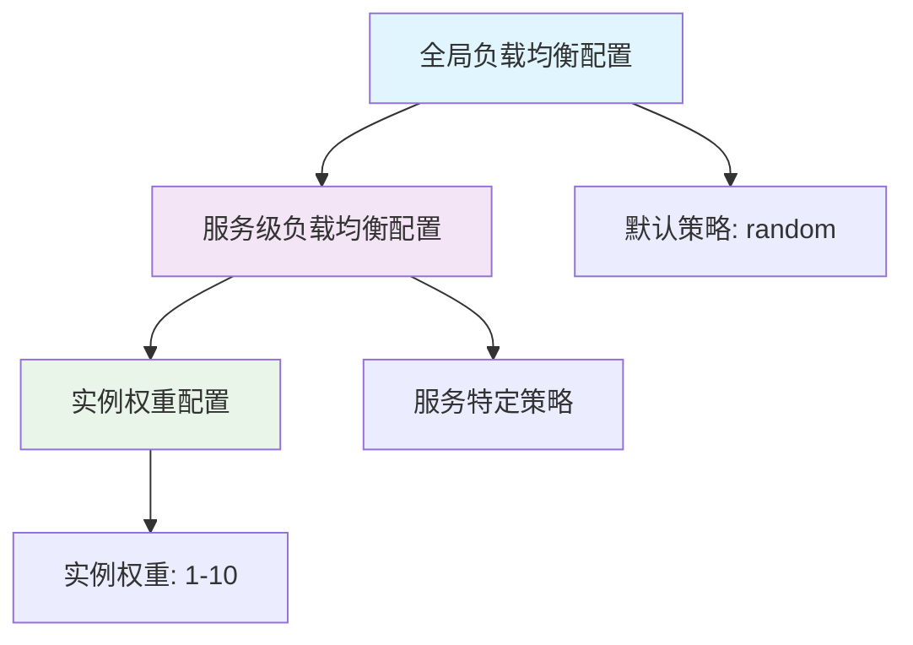
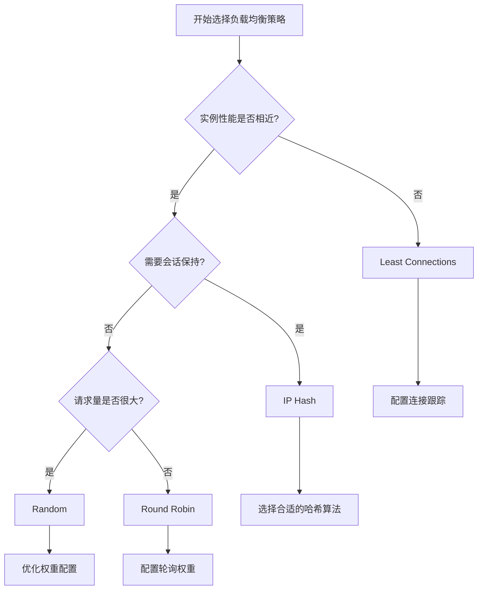

# 负载均衡配置

<!-- 版本信息 -->
> **文档版本**: 1.0.0  
> **最后更新**: 2025-08-28
> **Git 提交**: c1aa5b0f  
> **作者**: Lincoln
<!-- /版本信息 -->

JAiRouter 提供四种负载均衡策略，支持全局、服务级别和实例级别的配置。本文档详细介绍各种负载均衡策略的配置方法和使用场景。

## 模块化配置说明

从 v1.0.0 版本开始，JAiRouter 采用模块化配置结构，负载均衡相关配置已移至独立的配置文件中：

- 主配置文件: [application.yml](file://D:/IdeaProjects/model-router/src/main/resources/application.yml)
- 负载均衡基础配置: [config/base/model-services-base.yml](file://D:/IdeaProjects/model-router/src/main/resources/config/base/model-services-base.yml)

您可以在 [config/base/model-services-base.yml](file://D:/IdeaProjects/model-router/src/main/resources/config/base/model-services-base.yml) 文件中找到所有负载均衡相关配置，包括全局配置、各服务类型配置和实例配置。

## 负载均衡概述

### 支持的策略

| 策略 | 算法 | 特点 | 适用场景 |
|------|------|------|----------|
| **Random** | 随机选择 | 简单高效，长期均匀 | 实例性能相近 |
| **Round Robin** | 轮询分配 | 保证每个实例都被使用 | 实例性能相近 |
| **Least Connections** | 最少连接数 | 自动平衡负载 | 请求处理时间差异大 |
| **IP Hash** | 客户端IP哈希 | 会话保持 | 需要客户端粘性 |

### 配置层级



## 全局负载均衡配置

### 基础配置

在 [config/base/model-services-base.yml](file://D:/IdeaProjects/model-router/src/main/resources/config/base/model-services-base.yml) 文件中配置全局负载均衡策略：

```yaml
# config/base/model-services-base.yml
model:
  # 全局配置
  load-balance:
    type: round-robin           # 全局默认策略
    hash-algorithm: "md5"       # IP Hash 策略的哈希算法

  # 全局适配器配置 - 如果服务没有指定适配器，将使用此配置
  adapter: gpustack # 支持: normal, gpustack, ollama, vllm, xinference, localai

  # 全局限流配置
  rate-limit:
    enabled: true
    algorithm: "token-bucket"
    capacity: 1000
    rate: 100
    scope: "service"
    client-ip-enable: true  # 启用客户端IP限流

  # 全局熔断配置
  circuit-breaker:
    enabled: true
    failureThreshold: 5
    timeout: 60000
    successThreshold: 2

  # 全局降级配置
  fallback:
    enabled: true
    strategy: default
```

### 高级配置

```yaml
model:
  load-balance:
    type: least-connections
    
    # 连接跟踪配置
    connection-tracking:
      enabled: true             # 启用连接跟踪
      cleanup-interval: 60s     # 清理间隔
      max-idle-time: 300s      # 最大空闲时间
    
    # 权重调整配置
    weight-adjustment:
      enabled: true             # 启用动态权重调整
      adjustment-interval: 30s  # 调整间隔
      performance-window: 300s  # 性能统计窗口
```

## 服务级负载均衡配置

### YAML 配置方式

在 [config/base/model-services-base.yml](file://D:/IdeaProjects/model-router/src/main/resources/config/base/model-services-base.yml) 文件中配置各服务类型的负载均衡策略：

```yaml
model:
  services:
    chat:
      load-balance:
        type: least-connections
        hash-algorithm: "sha256"  # 仅 IP Hash 策略需要
      adapter: gpustack # 使用GPUStack适配器
      # 服务级别限流配置
      rate-limit:
        enabled: true
        algorithm: "token-bucket"
        capacity: 100
        rate: 10
        scope: "service"
        client-ip-enable: true
      instances:
        - name: "high-perf-model"
          base-url: "http://gpu-server:8080"
          path: "/v1-openai/chat/completions"
          weight: 3               # 高权重实例
        - name: "standard-model"
          base-url: "http://cpu-server:8080"
          path: "/v1/chat/completions"
          weight: 1               # 标准权重实例
    
    embedding:
      load-balance:
        type: ip-hash
        hash-algorithm: "md5"
      rate-limit:
        enabled: true
        algorithm: "token-bucket"
        capacity: 200
        rate: 20
        scope: "service"
        client-ip-enable: true
      instances:
        - name: "embedding-model-1"
          base-url: "http://embed-server-1:8080"
          path: "/v1/embeddings"
          weight: 2
        - name: "embedding-model-2"
          base-url: "http://embed-server-2:8080"
          path: "/v1/embeddings"
          weight: 2
```

### JSON 配置方式

JAiRouter 也支持通过动态配置 API 更新实例配置：

```json
{
  "services": {
    "chat": {
      "loadBalance": {
        "type": "round-robin",
        "healthCheck": {
          "enabled": true,
          "interval": 30000,
          "timeout": 5000
        }
      },
      "instances": [
        {
          "name": "qwen2:7b",
          "baseUrl": "http://gpu-cluster:8080",
          "path": "/v1/chat/completions",
          "weight": 3
        },
        {
          "name": "llama3.2:3b",
          "baseUrl": "http://cpu-cluster:8080",
          "path": "/v1/chat/completions",
          "weight": 1
        }
      ]
    }
  }
}
```

## 负载均衡策略详解

### 1. Random（随机策略）

#### 配置示例

```yaml
model:
  services:
    chat:
      load-balance:
        type: random
      instances:
        - name: "model-1"
          base-url: "http://server-1:8080"
          weight: 1
        - name: "model-2"
          base-url: "http://server-2:8080"
          weight: 2
        - name: "model-3"
          base-url: "http://server-3:8080"
          weight: 1
```

#### 特点和适用场景

**特点**：
- 算法简单，性能开销最小
- 支持权重配置
- 长期来看请求分布均匀
- 无状态，易于扩展

**适用场景**：
- 实例性能相近
- 请求处理时间相对稳定
- 高并发场景
- 无状态服务

**权重计算**：
```
实例被选中概率 = 实例权重 / 总权重
```

示例中各实例被选中的概率：
- model-1: 1/4 = 25%
- model-2: 2/4 = 50%
- model-3: 1/4 = 25%

### 2. Round Robin（轮询策略）

#### 配置示例

```yaml
model:
  services:
    embedding:
      load-balance:
        type: round-robin
      instances:
        - name: "embed-1"
          base-url: "http://embed-server-1:8080"
          weight: 2
        - name: "embed-2"
          base-url: "http://embed-server-2:8080"
          weight: 1
        - name: "embed-3"
          base-url: "http://embed-server-3:8080"
          weight: 3
```

#### 特点和适用场景

**特点**：
- 保证每个实例都能获得请求
- 支持加权轮询
- 请求分布可预测
- 适合批量处理场景

**适用场景**：
- 实例性能相近
- 需要均匀分布请求
- 批量数据处理
- 测试和调试场景

**加权轮询算法**：
根据权重生成调度序列，权重为2的实例会连续被选中2次。

示例调度序列：embed-1, embed-1, embed-2, embed-3, embed-3, embed-3

### 3. Least Connections（最少连接策略）

#### 配置示例

```yaml
model:
  services:
    chat:
      load-balance:
        type: least-connections
        connection-tracking:
          enabled: true
          cleanup-interval: 60s
          max-idle-time: 300s
      instances:
        - name: "fast-model"
          base-url: "http://fast-server:8080"
          weight: 2
        - name: "slow-model"
          base-url: "http://slow-server:8080"
          weight: 1
```

#### 特点和适用场景

**特点**：
- 自动平衡负载
- 适应实例性能差异
- 需要维护连接状态
- 动态调整请求分配

**适用场景**：
- 实例性能差异较大
- 请求处理时间变化大
- 长连接服务
- 需要精确负载平衡

**选择算法**：
```
选择实例 = min(当前连接数 / 权重)
```

#### 连接跟踪配置

```yaml
model:
  load-balance:
    connection-tracking:
      enabled: true             # 启用连接跟踪
      cleanup-interval: 60s     # 清理过期连接的间隔
      max-idle-time: 300s      # 连接最大空闲时间
      initial-connections: 0    # 初始连接数
      max-connections: 1000     # 最大连接数跟踪
```

### 4. IP Hash（IP哈希策略）

#### 配置示例

```yaml
model:
  services:
    chat:
      load-balance:
        type: ip-hash
        hash-algorithm: "md5"    # 支持: md5, sha1, sha256
      instances:
        - name: "session-model-1"
          base-url: "http://session-server-1:8080"
          weight: 1
        - name: "session-model-2"
          base-url: "http://session-server-2:8080"
          weight: 1
        - name: "session-model-3"
          base-url: "http://session-server-3:8080"
          weight: 2
```

#### 特点和适用场景

**特点**：
- 同一客户端总是路由到同一实例
- 支持会话保持
- 实例变化时会影响路由
- 可能导致负载不均衡

**适用场景**：
- 需要会话保持
- 有状态服务
- 缓存本地化
- 用户个性化服务

**哈希算法选择**：

| 算法 | 特点 | 性能 | 分布均匀性 |
|------|------|------|------------|
| MD5 | 快速，分布均匀 | 高 | 好 |
| SHA1 | 安全性较好 | 中 | 好 |
| SHA256 | 安全性最好 | 低 | 最好 |

#### 一致性哈希配置

```yaml
model:
  services:
    chat:
      load-balance:
        type: ip-hash
        hash-algorithm: "md5"
        consistent-hash:
          enabled: true          # 启用一致性哈希
          virtual-nodes: 150     # 虚拟节点数量
          hash-function: "md5"   # 哈希函数
```

## 动态负载均衡配置

### 通过 API 更新负载均衡策略

```bash
# 更新服务的负载均衡策略（需要通过配置文件或重启）
# 注意：当前版本不支持直接通过 API 更新负载均衡策略
# 需要通过配置文件更新后重启服务

# 但可以通过调整实例权重来影响负载分布
curl -X PUT "http://localhost:8080/api/config/instance/update/chat" \
  -H "Content-Type: application/json" \
  -d '{
    "instanceId": "high-perf-model@http://gpu-server:8080",
    "instance": {
      "name": "high-perf-model",
      "baseUrl": "http://gpu-server:8080",
      "path": "/v1/chat/completions",
      "weight": 5
    }
  }'
```

### 实例权重动态调整

```bash
# 场景：GPU 服务器性能提升，增加权重
curl -X PUT "http://localhost:8080/api/config/instance/update/chat" \
  -H "Content-Type: application/json" \
  -d '{
    "instanceId": "gpu-model@http://gpu-server:8080",
    "instance": {
      "weight": 4
    }
  }'

# 场景：CPU 服务器负载过高，降低权重
curl -X PUT "http://localhost:8080/api/config/instance/update/chat" \
  -H "Content-Type: application/json" \
  -d '{
    "instanceId": "cpu-model@http://cpu-server:8080",
    "instance": {
      "weight": 1
    }
  }'
```

## 负载均衡监控

### 监控指标

JAiRouter 提供以下负载均衡相关指标：

```bash
# 查看负载均衡指标
curl "http://localhost:8080/actuator/metrics/jairouter.loadbalancer.requests"

# 查看实例请求分布
curl "http://localhost:8080/actuator/metrics/jairouter.instance.requests"

# 查看连接数统计（仅 Least Connections 策略）
curl "http://localhost:8080/actuator/metrics/jairouter.connections.active"
```

### Prometheus 指标

```prometheus
# 负载均衡请求总数
jairouter_loadbalancer_requests_total{service="chat",strategy="round-robin"}

# 实例请求分布
jairouter_instance_requests_total{service="chat",instance="model-1",status="success"}

# 活跃连接数
jairouter_connections_active{service="chat",instance="model-1"}

# 实例响应时间
jairouter_instance_response_time_seconds{service="chat",instance="model-1"}
```

### 监控仪表板配置

```yaml
# Grafana 仪表板查询示例
queries:
  - name: "请求分布"
    query: 'rate(jairouter_instance_requests_total[5m])'
    
  - name: "负载均衡效果"
    query: 'jairouter_instance_requests_total / ignoring(instance) group_left sum(jairouter_instance_requests_total) by (service)'
    
  - name: "实例健康状态"
    query: 'jairouter_instance_health_status'
```

## 性能调优

### 1. 策略选择指南



### 2. 权重配置最佳实践

```yaml
# 基于实例性能配置权重
model:
  services:
    chat:
      instances:
        # 高性能 GPU 服务器
        - name: "gpu-model"
          base-url: "http://gpu-server:8080"
          weight: 5              # 高权重
          
        # 中等性能服务器
        - name: "cpu-model"
          base-url: "http://cpu-server:8080"
          weight: 2              # 中等权重
          
        # 备用服务器
        - name: "backup-model"
          base-url: "http://backup-server:8080"
          weight: 1              # 低权重
```

### 3. 连接池优化

```yaml
# 针对 Least Connections 策略的优化
webclient:
  connection-pool:
    max-connections: 500        # 增加连接池大小
    max-idle-time: 30s         # 适当的空闲时间
    pending-acquire-timeout: 60s # 获取连接超时

model:
  load-balance:
    connection-tracking:
      cleanup-interval: 30s     # 更频繁的清理
      max-idle-time: 180s      # 较短的空闲时间
```

## 故障处理

### 1. 实例故障自动处理

```yaml
model:
  load-balance:
    health-check:
      enabled: true
      interval: 15s             # 更频繁的健康检查
      timeout: 3s
      failure-threshold: 2      # 更敏感的故障检测
      success-threshold: 1      # 更快的恢复检测
```

### 2. 故障转移配置

```yaml
model:
  services:
    chat:
      load-balance:
        type: round-robin
        failover:
          enabled: true          # 启用故障转移
          retry-attempts: 3      # 重试次数
          retry-delay: 1s       # 重试延迟
          circuit-breaker: true  # 启用熔断器
      instances:
        - name: "primary-model"
          base-url: "http://primary:8080"
          weight: 3
          priority: 1           # 主要实例
        - name: "secondary-model"
          base-url: "http://secondary:8080"
          weight: 2
          priority: 2           # 次要实例
        - name: "backup-model"
          base-url: "http://backup:8080"
          weight: 1
          priority: 3           # 备用实例
```

### 3. 负载均衡问题诊断

```bash
# 检查实例状态
curl "http://localhost:8080/api/config/instance/type/chat"

# 查看负载分布
curl "http://localhost:8080/actuator/metrics/jairouter.instance.requests"

# 检查连接状态（Least Connections）
curl "http://localhost:8080/actuator/metrics/jairouter.connections.active"

# 查看健康检查状态
curl "http://localhost:8080/actuator/health"
```

## 实际使用案例

### 案例 1：电商推荐系统

```yaml
# 需要会话保持的推荐服务
model:
  services:
    recommendation:
      load-balance:
        type: ip-hash
        hash-algorithm: "md5"
      instances:
        - name: "rec-server-1"
          base-url: "http://rec-1:8080"
          weight: 1
        - name: "rec-server-2"
          base-url: "http://rec-2:8080"
          weight: 1
        - name: "rec-server-3"
          base-url: "http://rec-3:8080"
          weight: 1
```

### 案例 2：多模型 AI 服务

```yaml
# 不同性能的模型实例
model:
  services:
    chat:
      load-balance:
        type: least-connections
      instances:
        - name: "gpt-4"
          base-url: "http://openai-proxy:8080"
          weight: 1              # 慢但质量高
        - name: "llama3.2:70b"
          base-url: "http://gpu-cluster:8080"
          weight: 3              # 快且质量好
        - name: "qwen2:7b"
          base-url: "http://cpu-cluster:8080"
          weight: 2              # 中等性能
```

### 案例 3：高并发场景

```yaml
# 高并发聊天服务
model:
  services:
    chat:
      load-balance:
        type: random             # 最低延迟
      instances:
        - name: "chat-1"
          base-url: "http://chat-server-1:8080"
          weight: 1
        - name: "chat-2"
          base-url: "http://chat-server-2:8080"
          weight: 1
        - name: "chat-3"
          base-url: "http://chat-server-3:8080"
          weight: 1
```

## 下一步

完成负载均衡配置后，您可以继续了解：

- **[限流配置](rate-limiting.md)** - 设置流量控制和保护
- **[熔断器配置](circuit-breaker.md)** - 配置故障保护机制
- **[监控指南](../monitoring/index.md)** - 设置负载均衡监控
- **[故障排查](../troubleshooting/index.md)** - 负载均衡问题诊断