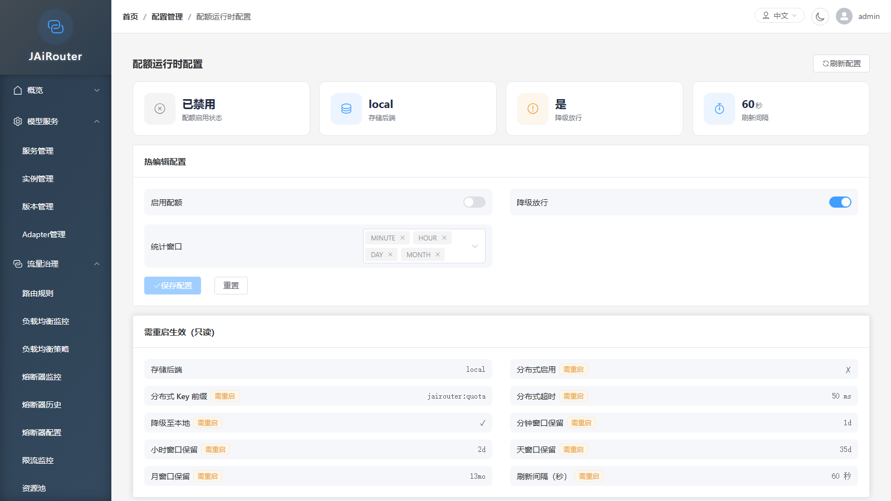

# 配额账本

<!-- 版本信息 -->
> **文档版本**: 1.0.0
> **最后更新**: 2026-09-06
> **Git 提交**: -
> **作者**: Lincoln
<!-- /版本信息 -->

## 概述

JAiRouter 从 **v3.1.0** 起提供**配额账本（quota ledger）**：在请求链路中按多维窗口（分钟 / 小时 / 天 / 月）累计请求数与 token 用量，并在账本启用时接入限额判定。

## 操作闭环（限额配在哪里）

| 步骤 | 位置 | 作用 |
|------|------|------|
| 1. 设置限额 | **安全管理 → API 密钥** 编辑表单 | `dailyRequestLimit` / `dailyTokenLimit` / `rateLimitPerMinute` / `quotaAlertThreshold`，**配额不在 Quota 配置页设置** |
| 2. 开启账本（可选） | **流量治理 → 配额运行时配置** `/config/quota` | 热改 `enabled` / `failOpen` / `windows`；账本默认关闭 |
| 3. 查看用量 | **数据记录 → 配额用量监控** `/monitoring/quota` | 多维用量 + 与 API Key 限额对照（进度条） |
| 4. 告警与重置 | **安全管理 → API 密钥** | 配额告警列表、重置每日计数 |

- 限额判定映射：DAY 窗口 → 日请求/日 Token；MINUTE 窗口 → 每分钟速率；`0` 表示不限制。
- 账本关闭时仍走 API Key 认证路径的既有校验（内存统计 + TokenBucket）。

- **默认关闭（opt-in）**：`jairouter.quota.enabled` 默认 `false`，即零行为变更——不累加、不查库、不落库，行为与 v3.0.x 完全一致
- **计数后端可选**：默认为进程内 `LocalCounterBackend`（`LongAdder`），仅 `distributed.enabled=true` 时才装配 `RedisCounterBackend` 作为跨实例权威计数
- **纯增量能力**：账本未启用时所有端点立即返回、不访问数据库与 Redis

## 快速启用

```yaml
jairouter:
  quota:
    enabled: true                  # 启用配额账本（默认 false）
    fail-open: true                # 账本异常时是否放行（默认 true）
    flush-interval-seconds: 60     # 内存账本快照落库间隔，秒（默认 60）
    windows:                       # 启用的窗口列表（默认四级全开）
      - MINUTE
      - HOUR
      - DAY
      - MONTH
    retention:                     # 各级窗口保留期（默认如下）
      minute: 1d
      hour: 2d
      day: 35d
      month: 13mo
    distributed:
      enabled: false               # 是否启用 Redis 分布式计数（默认 false）
      key-prefix: "jairouter:quota"  # Redis key 前缀（默认 jairouter:quota）
      timeout: 50ms                # 单条 Redis 命令超时（默认 50ms，钳制 1ms~5s）
      degrade-to-local: true       # Redis 不可用时是否降级回本地计数（默认 true）
```

## 配置项

所有配置项位于 `jairouter.quota` 前缀下。key 写法遵循 Spring relaxed binding（yaml 中使用 kebab-case，Java 中使用 camelCase）。

| 配置项 | 默认值 | 说明 |
|--------|--------|------|
| `enabled` | `false` | 总开关；关闭时账本读写全部短路，零额外开销 |
| `fail-open` | `true` | 账本异常时是否放行请求：`true` = 放行并标记降级，`false` = 拒绝请求 |
| `flush-interval-seconds` | `60` | 内存账本快照落库间隔（秒），最小为 1 |
| `windows` | `[MINUTE, HOUR, DAY, MONTH]` | 启用的窗口列表；省略的窗口不产生记账 |
| `retention.minute` | `1d` | 分钟窗口保留期 |
| `retention.hour` | `2d` | 小时窗口保留期 |
| `retention.day` | `35d` | 天窗口保留期 |
| `retention.month` | `13mo` | 月窗口保留期 |
| `distributed.enabled` | `false` | 是否启用 Redis 分布式计数；为 `false` 时计数完全留在本进程内存 |
| `distributed.key-prefix` | `jairouter:quota` | 分布式计数 Redis key 前缀 |
| `distributed.timeout` | `50ms` | 单条 Redis 命令超时（钳制范围 1ms~5s） |
| `distributed.degrade-to-local` | `true` | Redis 不可用时是否降级回本地计数视图 |

保留期支持的时长单位：`mo`（月）、`d`（天）、`h`（小时）、`m`（分钟）、`s`（秒）；无单位时按天解释，数量最小为 1。

## 运行时配置（不重启）



管理端基于以下端点读取配额配置并做运行时调整：

```
GET  /api/config/quota        # 配置快照
PUT  /api/config/quota        # 运行时部分更新
```

### GET 配置快照

返回当前生效的配额配置（含内存覆盖），并标注可热改字段：

- `enabled` / `failOpen` / `windows` — 可热改字段，当前运行时生效值
- `flushIntervalSeconds` / `retention` / `distributed` — 只读展示（需重启生效，不可通过 PUT 修改）
- `backendName` — 当前计数后端名称（`local` 或 `redis`）
- `hotEditableFields` — 可热改字段列表（`enabled` / `failOpen` / `windows`）
- `restartRequiredFields` — 需重启生效的字段列表（含 `flushIntervalSeconds`）

需 `config:quota:read` 权限。

### PUT 运行时配置

部分更新——仅修改请求体中非 `null` 的字段，`null` 字段保持不变。

**可热改字段**（即时生效，内存覆盖）：

| 字段 | 类型 | 说明 |
|------|------|------|
| `enabled` | Boolean | 是否启用配额账本 |
| `failOpen` | Boolean | 账本异常时是否放行 |
| `windows` | String[] | 启用的窗口列表（如 `["MINUTE", "HOUR", "DAY"]`） |

**需重启生效的字段**（携带非 `null` 值即被拒绝，返回 HTTP 400 + `errorCode=RESTART_REQUIRED`，message 列出具体字段名）：

| 字段 | 说明 |
|------|------|
| `distributedEnabled` | 分布式计数是否启用 |
| `distributedKeyPrefix` | 分布式 Redis key 前缀 |
| `distributedTimeoutMs` | 分布式 Redis 命令超时（毫秒） |
| `distributedDegradeToLocal` | Redis 不可用时是否降级 |
| `retention` | 各级窗口保留期 |
| `flushIntervalSeconds` | 快照落库间隔（秒） |

全 `null` 请求体 → HTTP 400 + `errorCode=INVALID_REQUEST`。

成功时返回 `data` 与 GET 响应同形。需 `config:quota:write` 权限。

### 已知限制

- 运行时改动是**内存覆盖**，重启或配置刷新后**还原为 yaml 值**（与响应缓存同口径）。持久化配置请修改 `jairouter.quota` yaml。
- **`flushIntervalSeconds` 不可热改**：该字段已被列为需重启生效字段，携带非 `null` 值的 PUT 请求会被拒绝。原因：后端使用 `@Scheduled(fixedDelayString = "${jairouter.quota.flush-interval-seconds:60}")` 注解，该值在 Spring 调度任务注册时一次性解析并固定；修改 `QuotaProperties` bean 字段值无法改变已注册的调度间隔。如需修改落库间隔，请修改 yaml 后重启应用。
- `enabled` 热改为 `true` 后，账本立即开始累加新请求的计数；热改为 `false` 后，账本停止累加但已有内存态数据在下次 `flush` 时仍会落库。

## 观测

```
GET /api/monitoring/quota/status   # 运行状态
GET /api/monitoring/quota/usage    # 用量查询
```

### 运行状态

`GET /api/monitoring/quota/status` 返回配额账本的运行时信息：

| 字段 | 说明 |
|------|------|
| `enabled` | 账本是否启用 |
| `backendName` | 当前计数后端名称（`local` 或 `redis`） |
| `degraded` | 是否处于降级状态 |
| `degradedReason` | 降级原因（未降级时为空串） |
| `failOpen` | 当前 fail-open 设置 |
| `windows` | 当前启用的窗口列表 |
| `distributed` | 分布式配置对象（`enabled` / `keyPrefix` / `timeoutMs` / `degradeToLocal`） |
| `redisProbe` | **仅 `distributed.enabled=true` 时存在**：`reachable`（bool）/ `status`（`healthy` / `degraded` / `error`）/ 可选的 `reason` |
| `counterMetrics` | **仅 `distributed.enabled=true` 时存在**：`degradationCount`（累计降级次数） |

需 `monitoring:quota:read` 权限。

### 用量查询

`GET /api/monitoring/quota/usage` 按维度与窗口查询配额用量（只读，不触发写入）。

**查询参数**（均可选，缺省为空串）：

| 参数 | 说明 |
|------|------|
| `tenantId` | 租户 ID |
| `apiKeyId` | API Key ID |
| `userId` | 用户 ID |
| `serviceType` | 服务类型（如 `chat`） |
| `model` | 模型名称 |
| `window` | 窗口类型（`MINUTE` / `HOUR` / `DAY` / `MONTH`；非法值返回 400） |

**响应**：`data` 为数组，每项包含：

| 字段 | 说明 |
|------|------|
| `dimensions` | 维度对象（`tenantId` / `apiKeyId` / `userId` / `serviceType` / `model`） |
| `window` | 窗口类型 |
| `windowStart` | 窗口起始时间 |
| `requestCount` | 请求计数 |
| `tokenCount` | token 计数 |

配额未启用时 `data=[]` 且 message=`配额账本未启用`。

需 `monitoring:quota:read` 权限。

## 权限码

配额功能引入 3 个新权限码：

| 权限码 | 说明 |
|--------|------|
| `config:quota:read` | 配额配置状态查询 |
| `config:quota:write` | 配额运行时配置更新 |
| `monitoring:quota:read` | 配额运行状态与用量查询 |

`ADMIN` 角色默认包含全部权限码；`OPERATOR` 角色包含读/写权限码；`VIEWER` 角色包含读权限码。

## 限制与后续

当前版本边界：

- **分布式**：`distributed.enabled=true` 时 Redis 为权威计数，本地退化为镜像 + 降级兜底；`distributed.enabled=false`（默认）仅保证单实例内计数精确
- **快照落库**：内存增量默认每 60 秒落库一次，`@Scheduled` 间隔在启动时固定且不可运行时修改（`flushIntervalSeconds` 为需重启生效字段）
- **限额判定**：账本提供数据基座，实际限额判定（`QuotaEnforcementService`）的端点与 UI 将在后续 PR 交付
- **异步化**：热路径使用 `Mono.block(timeout)` 同步阻塞 Redis 调用（默认 50ms），彻底异步化留待后续 PR

## 相关文档

- [更新日志](../reference/changelog.md)
- [响应缓存](./response-cache.md)
- [限流配置](./rate-limiting.md)
- [RBAC 权限管理](../security/rbac-permissions.md)
