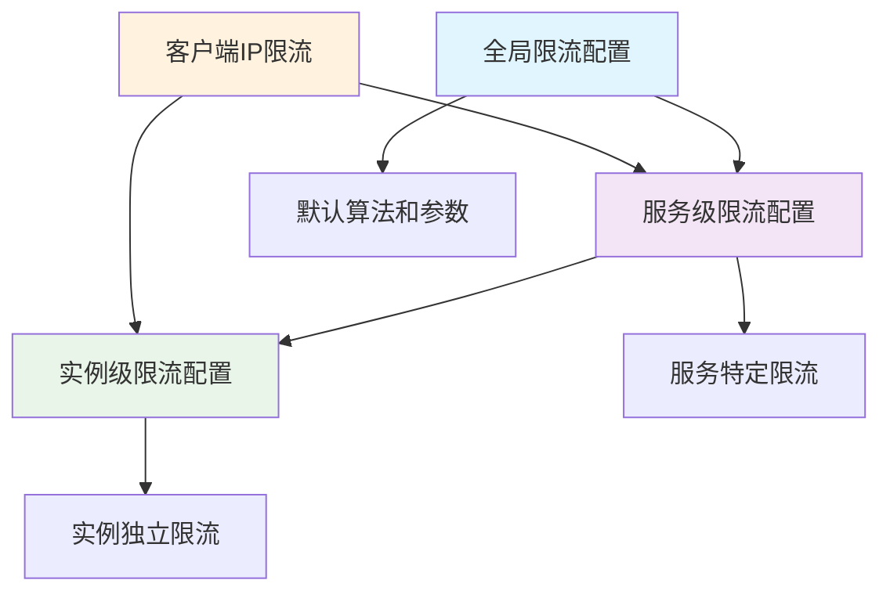
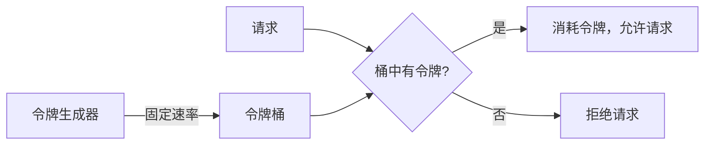
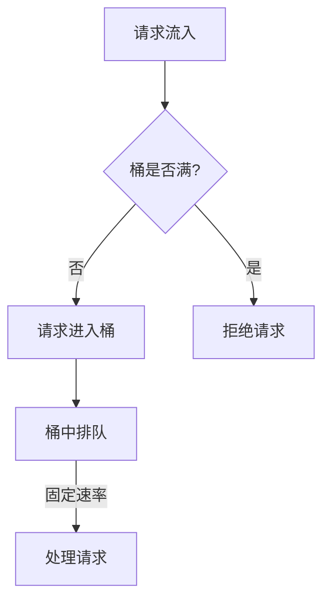
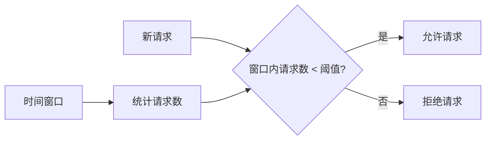

# 限流配置

<!-- 版本信息 -->
> **文档版本**: 1.0.2  
> **最后更新**: 2026-05-21
> **Git 提交**: 61384b4a  
> **作者**: Lincoln
<!-- /版本信息 -->

JAiRouter 提供多种限流算法，支持全局、服务级别和实例级别的限流配置，以及基于客户端 IP 的独立限流。本文档详细介绍各种限流策略的配置和使用。

## 模块化配置说明

从 v1.0.0 版本开始，JAiRouter 采用模块化配置结构，限流相关配置已移至独立的配置文件中：

- 主配置文件: `application.yml`
- 模型服务基础配置: `config/base/model-services-base.yml`

您可以在 `config/base/model-services-base.yml` 文件中找到所有限流相关配置，包括全局配置、各服务类型配置和实例配置。

## 限流概述

### 支持的算法

| 算法 | 特点 | 适用场景 | 突发处理 |
|------|------|----------|----------|
| **Token Bucket** | 允许突发流量 | 平稳流量 + 偶发突发 | 优秀 |
| **Leaky Bucket** | 平滑输出流量 | 需要平稳输出 | 一般 |
| **Sliding Window** | 精确时间窗口控制 | 精确流量控制 | 一般 |
| **Warm Up** | 冷启动保护 | 服务启动场景 | 渐进式 |

### 限流层级


```mermaid
graph TB
    A[全局限流配置] --> B[服务级限流配置]
    B --> C[实例级限流配置]
    
    A --> D[默认算法和参数]
    B --> E[服务特定限流]
    C --> F[实例独立限流]
    
    G[客户端IP限流] --> B
    G --> C
    
    style A fill:#e1f5fe
    style B fill:#f3e5f5
    style C fill:#e8f5e8
    style G fill:#fff3e0
```

> **限流层级说明（v2.8.8）**：请求经过 **服务级 → 实例级** 两级检查（全局/客户端 IP 限流按配置启用）。服务级超限返回 `429 Too Many Requests`；实例级超限自动换下一个实例，全部实例被限才返回 `503`。此外规则引擎的 **RATE_LIMIT 动作**提供按规则 ID 的独立限流（见 [routing-rules.md](./routing-rules.md)）。

## 服务级动态限流配置（v2.8.8）

服务级限流支持通过 Web 管理界面 **动态配置并热生效**（无需重启）：

- **API**：`PUT /api/services/{serviceType}/ratelimit`（持久化 + 立即生效）、`GET /api/services/{serviceType}/ratelimit`（读取当前配置）
- **配置格式（canonical）**：

```json
{
  "enabled": true,
  "algorithm": "token-bucket",
  "capacity": 100,
  "rate": 10,
  "scope": "service",
  "key": ""
}
```

- `enabled=false` 时移除该服务的限流器；启用时 `capacity`/`rate` 必须 > 0，否则返回 400
- 配置持久化到配置存储（`model-router-config`），**重启后自动生效**（启动时从合并配置加载）；YAML 中未配置限流的服务保持原样
- 服务管理页的编辑对话框已接入该端点（限流配置保存即热生效）

## 全局限流配置

### 基础配置

在 `config/base/model-services-base.yml` 文件中配置全局限流：
```yaml
# config/base/model-services-base.yml
model:
  # 全局限流配置
  rate-limit:
    enabled: true
    algorithm: "token-bucket"
    capacity: 1000
    rate: 100
    scope: "service"
    client-ip-enable: true  # 启用客户端IP限流

  services:
    # 聊天服务配置
    chat:
      load-balance:
        type: least-connections
      adapter: gpustack # 使用GPUStack适配器
      # 服务级别限流配置
      rate-limit:
        enabled: true
        algorithm: "token-bucket"
        capacity: 100
        rate: 10
        scope: "service"
        client-ip-enable: true
```

### 高级配置

```yaml
model:
  rate-limit:
    enabled: true
    algorithm: "token-bucket"
    capacity: 1000
    rate: 100
    scope: "service"
    client-ip-enable: true  # 启用客户端IP限流
```

## 限流算法详解

### 1. Token Bucket（令牌桶算法）

#### 算法原理

令牌桶算法维护一个固定容量的桶，以固定速率向桶中添加令牌。请求到达时消耗令牌，无令牌时拒绝请求。


```mermaid
graph LR
    A[令牌生成器] -->|固定速率| B[令牌桶]
    C[请求] --> D{桶中有令牌?}
    D -->|是| E[消耗令牌，允许请求]
    D -->|否| F[拒绝请求]
    B --> D
```

#### 配置示例

在 `config/base/model-services-base.yml` 文件中配置令牌桶算法：

```yaml
model:
  services:
    chat:
      rate-limit:
        enabled: true
        algorithm: "token-bucket"
        capacity: 100            # 桶容量（最大令牌数）
        rate: 10                # 令牌补充速率（每秒）
        scope: "service"        # 限流范围
        client-ip-enable: true  # 启用客户端IP限流
```

#### JSON 配置

JAiRouter 也支持通过动态配置 API 更新限流配置：

```json
{
  "services": {
    "chat": {
      "rateLimit": {
        "algorithm": "token-bucket",
        "capacity": 100,
        "rate": 10,
        "clientIpEnable": true
      }
    }
  }
}
```

#### 参数说明

| 参数 | 类型 | 说明 | 默认值 |
|------|------|------|--------|
| `capacity` | Integer | 桶容量，最大令牌数 | 100 |
| `rate` | Integer | 令牌补充速率（每秒） | 10 |
| `clientIpEnable` | Boolean | 是否启用客户端IP限流 | false |

#### 适用场景

- **平稳流量 + 偶发突发**：日常流量平稳，偶尔有突发请求
- **API 网关**：需要允许短时间突发，但控制长期平均速率
- **用户请求限制**：允许用户短时间内发送多个请求

#### 配置建议

```yaml
# 高并发场景
rate-limit:
  algorithm: "token-bucket"
  capacity: 1000              # 大容量支持突发
  rate: 100                  # 适中的补充速率

# 保护后端场景
rate-limit:
  algorithm: "token-bucket"
  capacity: 50               # 小容量限制突发
  rate: 5                    # 低速率保护后端
```

### 2. Leaky Bucket（漏桶算法）

#### 算法原理

漏桶算法维护一个固定容量的桶，请求进入桶中排队，以固定速率从桶底流出处理。


```mermaid
graph TB
    A[请求流入] --> B{桶是否满?}
    B -->|否| C[请求进入桶]
    B -->|是| D[拒绝请求]
    C --> E[桶中排队]
    E -->|固定速率| F[处理请求]
```

#### 配置示例

在 `config/base/model-services-base.yml` 文件中配置漏桶算法：

```yaml
model:
  services:
    embedding:
      rate-limit:
        enabled: true
        algorithm: "leaky-bucket"
        capacity: 50            # 桶容量
        rate: 5                # 漏出速率（每秒）
        scope: "service"
        client-ip-enable: true
```

#### JSON 配置

JAiRouter 也支持通过动态配置 API 更新限流配置：

```json
{
  "services": {
    "embedding": {
      "rateLimit": {
        "algorithm": "leaky-bucket",
        "capacity": 50,
        "rate": 5,
        "clientIpEnable": true
      }
    }
  }
}
```

#### 参数说明

| 参数 | 类型 | 说明 | 默认值 |
|------|------|------|--------|
| `capacity` | Integer | 桶容量，最大排队请求数 | 50 |
| `rate` | Integer | 漏出速率（每秒） | 5 |

#### 适用场景

- **需要平稳输出**：要求后端接收到的请求速率平稳
- **消息队列**：需要控制消息处理速率
- **数据库保护**：保护数据库免受突发流量冲击

### 3. Sliding Window（滑动窗口算法）

#### 算法原理

滑动窗口算法在固定时间窗口内统计请求数量，超过阈值时拒绝请求。


```mermaid
graph LR
    A[时间窗口] --> B[统计请求数]
    C[新请求] --> D{窗口内请求数 < 阈值?}
    D -->|是| E[允许请求]
    D -->|否| F[拒绝请求]
    B --> D
```

#### 配置示例

在 `config/base/model-services-base.yml` 文件中配置滑动窗口算法：

```yaml
model:
  services:
    tts:
      rate-limit:
        enabled: true
        algorithm: "sliding-window"
        capacity: 100          # 桶容量
        rate: 100              # 每秒窗口内最大请求数
        scope: "service"
        client-ip-enable: true
```

#### JSON 配置

JAiRouter 也支持通过动态配置 API 更新限流配置：

```json
{
  "services": {
    "tts": {
      "rateLimit": {
        "algorithm": "sliding-window",
        "capacity": 100,
        "rate": 100,
        "clientIpEnable": true
      }
    }
  }
}
```

#### 参数说明

| 参数 | 类型 | 说明 | 默认值 |
|------|------|------|--------|
| `capacity` | Integer | 桶容量 | 100 |
| `rate` | Integer | 每秒窗口内最大请求数 | 10 |

> **注意**：滑动窗口使用固定的 1 秒窗口。`rate` 控制该窗口内允许的最大请求数。

#### 适用场景

- **精确流量控制**：需要精确控制时间窗口内的请求数量
- **API 配额管理**：按时间段分配 API 调用配额
- **防刷接口**：防止短时间内大量重复请求

### 4. Warm Up（预热算法）

#### 算法原理

预热算法在服务启动时逐渐增加允许的请求速率，避免冷启动时的性能问题。

```mermaid
graph LR
    A[服务启动] --> B[低速率]
    B --> C[逐渐增加]
    C --> D[达到目标速率]
    
    E[预热时间] --> F[当前允许速率]
    F --> G[= 目标速率 * (当前时间 / 预热时间)]
```

#### 配置示例

在 `config/base/model-services-base.yml` 文件中配置预热算法：

```yaml
model:
  services:
    chat:
      rate-limit:
        enabled: true
        algorithm: "warm-up"
        capacity: 100           # 最终容量
        rate: 10               # 最终速率
        warm-up-period: 300    # 预热时间（秒）
        scope: "service"
```

#### JSON 配置

JAiRouter 也支持通过动态配置 API 更新限流配置：

```json
{
  "services": {
    "chat": {
      "rateLimit": {
        "algorithm": "warm-up",
        "capacity": 100,
        "rate": 10,
        "warmUpPeriod": 300,
        "clientIpEnable": true
      }
    }
  }
}
```

#### 参数说明

| 参数 | 类型 | 说明 | 默认值 |
|------|------|------|--------|
| `capacity` | Integer | 最终容量 | 100 |
| `rate` | Integer | 最终速率（每秒） | 10 |
| `warmUpPeriod` | Integer | 预热时间（秒） | 600 |

#### 适用场景

- **服务冷启动**：服务刚启动时需要预热
- **缓存预热**：需要时间建立缓存
- **连接池预热**：数据库连接池需要时间建立

## 客户端 IP 限流

### 基础配置

在 `config/base/model-services-base.yml` 中通过 `client-ip-enable` 启用客户端 IP 限流：

```yaml
model:
  rate-limit:
    enabled: true
    algorithm: "token-bucket"
    capacity: 1000
    rate: 100
    scope: "service"
    client-ip-enable: true      # 启用客户端IP限流
```

启用后，每个客户端 IP 拥有独立的限流器实例，使用与父配置相同的算法、容量和速率。缓存最多保留 10,000 个客户端条目，30 分钟无访问自动过期。

### 服务级别 IP 限流

```yaml
model:
  services:
    chat:
      rate-limit:
        enabled: true
        algorithm: "token-bucket"
        capacity: 1000          # 服务级别总容量
        rate: 100              # 服务级别总速率
        client-ip-enable: true  # 启用IP限流
```

### 实例级别 IP 限流

```yaml
model:
  services:
    chat:
      instances:
        - name: "model-1"
          base-url: "http://server-1:8080"
          rate-limit:
            enabled: true
            algorithm: "token-bucket"
            capacity: 100
            rate: 10
            scope: "instance"
            client-ip-enable: true
```

### IP 限流监控

```bash
# 查看限流器状态（包含各IP限流器）
curl "http://localhost:8080/api/rate-limiter/status"

# 查看限流器指标（剩余容量、使用率）
curl "http://localhost:8080/api/rate-limiter/metrics"
```

## 多层限流配置

### 分层限流策略

在 `config/base/model-services-base.yml` 文件中配置多层限流：

```yaml
model:
  # 全局限流：保护整个系统
  rate-limit:
    enabled: true
    algorithm: "token-bucket"
    capacity: 10000
    rate: 1000
    client-ip-enable: true
  
  services:
    chat:
      # 服务级限流：保护特定服务
      rate-limit:
        enabled: true
        algorithm: "token-bucket"
        capacity: 1000
        rate: 100
        client-ip-enable: true
      
      instances:
        - name: "high-perf-model"
          base-url: "http://gpu-server:8080"
          # 实例级限流：保护特定实例
          rate-limit:
            enabled: true
            algorithm: "token-bucket"
            capacity: 500
            rate: 50
            scope: "instance"
```

### 限流优先级

1. **实例级限流**：最高优先级，直接保护实例
2. **服务级限流**：中等优先级，保护服务类型
3. **全局限流**：最低优先级，保护整个系统

## 动态限流配置

### 通过配置文件动态调整

JAiRouter 也支持通过动态配置 API 更新限流配置：

```json
{
  "services": {
    "chat": {
      "rateLimit": {
        "algorithm": "token-bucket",
        "capacity": 200,
        "rate": 20,
        "clientIpEnable": true
      },
      "instances": [
        {
          "name": "model-1",
          "baseUrl": "http://server-1:8080",
          "rateLimit": {
            "algorithm": "token-bucket",
            "capacity": 100,
            "rate": 10
          }
        }
      ]
    }
  }
}
```

### 限流参数调优

```bash
# 监控当前限流效果
curl "http://localhost:8080/api/rate-limiter/summary"

# 根据监控结果调整配置
# 如果拒绝率过高，增加容量或速率
# 如果后端压力大，减少容量或速率
```

## 限流监控和告警

### 监控指标

```bash
# 限流事件（允许/拒绝）
curl "http://localhost:8080/actuator/metrics/jairouter_rate_limit_events_total"

# 各限流器剩余容量
curl "http://localhost:8080/actuator/metrics/jairouter_rate_limit_remaining"

# 各限流器使用率
curl "http://localhost:8080/actuator/metrics/jairouter_rate_limit_usage_ratio"
```

### Prometheus 指标

```prometheus
# 限流请求速率
rate(jairouter_rate_limit_events_total[5m])

# 限流拒绝率
rate(jairouter_rate_limit_events_total{result="denied"}[5m]) / rate(jairouter_rate_limit_events_total[5m])

# 各限流器剩余容量
jairouter_rate_limit_remaining

# 各限流器使用率
jairouter_rate_limit_usage_ratio
```

### 告警规则

```yaml
# Prometheus 告警规则
groups:
  - name: jairouter_ratelimit
    rules:
      - alert: HighRateLimitRejection
        expr: rate(jairouter_rate_limit_events_total{result="denied"}[5m]) / rate(jairouter_rate_limit_events_total[5m]) > 0.1
        for: 2m
        labels:
          severity: warning
        annotations:
          summary: "限流拒绝率过高"
          description: "服务 {{ $labels.service }} 的限流拒绝率超过 10%"
```

## 性能优化

### 1. 内存优化

客户端 IP 限流器缓存使用 Caffeine，自动清理：

- 最多 10,000 个条目
- 30 分钟无访问自动过期（基于访问）
- 自动淘汰并记录统计信息

### 2. 算法选择优化

```yaml
# 高并发场景：选择性能最好的算法
model:
  services:
    high-traffic:
      rate-limit:
        algorithm: "token-bucket"  # 性能最好
        
# 精确控制场景：选择精度最高的算法
model:
  services:
    precise-control:
      rate-limit:
        algorithm: "sliding-window"  # 精度最高
```

## 实际使用案例

### 案例 1：API 网关限流

```yaml
# 多层限流保护
model:
  # 全局限流：保护整个网关
  rate-limit:
    enabled: true
    algorithm: "token-bucket"
    capacity: 10000
    rate: 1000
    client-ip-enable: true
  
  services:
    # 聊天服务：高频使用
    chat:
      rate-limit:
        algorithm: "token-bucket"
        capacity: 5000
        rate: 500
        client-ip-enable: true
    
    # 图像生成：资源密集
    image-generation:
      rate-limit:
        algorithm: "leaky-bucket"
        capacity: 100
        rate: 10
        client-ip-enable: true
```

### 案例 2：防刷保护

```yaml
# 防止恶意刷接口
model:
  services:
    sensitive-api:
      rate-limit:
        enabled: true
        algorithm: "sliding-window"
        capacity: 50           # 桶容量
        rate: 50               # 每秒最多 50 次请求
        client-ip-enable: true
```

### 案例 3：服务预热

```yaml
# 新服务上线预热
model:
  services:
    new-service:
      rate-limit:
        enabled: true
        algorithm: "warm-up"
        capacity: 1000
        rate: 100
        warm-up-period: 600     # 10分钟预热
```

## 故障排查

### 常见问题

1. **限流过于严格**
   ```bash
   # 检查拒绝率
   curl "http://localhost:8080/api/rate-limiter/summary"
   
   # 解决：增加容量或速率
   ```

2. **内存使用过高**
   ```bash
   # 检查限流器数量
   curl "http://localhost:8080/api/rate-limiter/status"
   
   # 解决：调整清理策略
   ```

3. **限流不生效**
   ```bash
   # 检查配置是否正确加载
   curl "http://localhost:8080/api/config/instance/type/chat"
   
   # 检查限流是否启用
   ```

### 调试命令

```bash
# 查看限流配置
curl "http://localhost:8080/actuator/configprops" | jq '.model.rate-limit'

# 查看限流指标
curl "http://localhost:8080/actuator/metrics" | grep ratelimit

# 测试限流效果
for i in {1..20}; do
  curl -w "%{http_code}\n" "http://localhost:8080/v1/chat/completions" \
    -H "Content-Type: application/json" \
    -d '{"model": "test", "messages": [{"role": "user", "content": "test"}]}'
done
```

## 下一步

完成限流配置后，您可以继续了解：

- **[熔断器配置](circuit-breaker.md)** - 配置故障保护机制
- **[监控指南](../monitoring/index.md)** - 设置限流监控和告警
- **[故障排查](../troubleshooting/index.md)** - 限流问题诊断和解决
- **[性能调优](../troubleshooting/performance.md)** - 限流性能优化