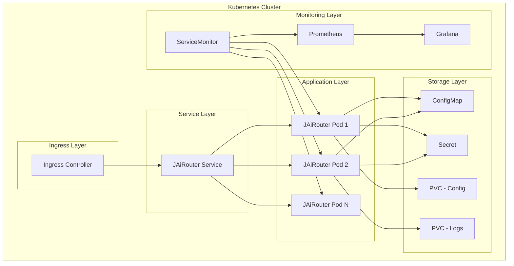

# Kubernetes 部署

<!-- 版本信息 -->
> **文档版本**: 1.0.0  
> **最后更新**: 2025-08-19  
> **Git 提交**: c1aa5b0f  
> **作者**: Lincoln
<!-- /版本信息 -->


JAiRouter 支持在 Kubernetes 集群中部署，提供高可用、自动扩缩容和滚动更新等企业级特性。本文档详细介绍如何在 K8s 环境中部署 JAiRouter。

## Kubernetes 部署概述

### 特性

- **高可用性**：多实例部署，自动故障转移
- **自动扩缩容**：基于 CPU/内存/自定义指标自动扩缩容
- **滚动更新**：零停机时间更新
- **服务发现**：内置服务发现和负载均衡
- **配置管理**：使用 ConfigMap 和 Secret 管理配置
- **持久化存储**：支持 PVC 持久化配置和日志

### 架构图



## 前置要求

### 1. Kubernetes 集群要求

| 组件 | 最低要求 | 推荐配置 | 说明 |
|------|----------|----------|------|
| **Kubernetes 版本** | 1.20+ | 1.24+ | 支持最新特性 |
| **节点数量** | 3 个节点 | 5+ 个节点 | 包含 master 和 worker |
| **节点配置** | 4C8G | 8C16G | 每个 worker 节点 |
| **存储** | 100GB | 500GB SSD | 持久化存储 |
| **网络** | CNI 插件 | Calico/Flannel | 网络通信 |

### 2. 必需组件

| 组件 | 版本要求 | 安装方式 | 用途 |
|------|----------|----------|------|
| **kubectl** | 1.20+ | 官方安装 | 集群管理工具 |
| **Helm** | 3.0+ | 官方安装 | 包管理器 |
| **Ingress Controller** | Nginx/Traefik | Helm Chart | 外部访问 |
| **Cert-Manager** | 1.0+ | Helm Chart | SSL 证书管理 |
| **Prometheus Operator** | 0.50+ | Helm Chart | 监控系统 |
| **Grafana** | 8.0+ | Helm Chart | 监控可视化 |

### 3. 存储类

```bash
# 检查可用的存储类
kubectl get storageclass

# 如果没有默认存储类，创建一个
kubectl patch storageclass <storage-class-name> -p '{"metadata": {"annotations":{"storageclass.kubernetes.io/is-default-class":"true"}}}'
```

## 基础部署

### 1. 创建命名空间

```yaml
# namespace.yaml
apiVersion: v1
kind: Namespace
metadata:
  name: jairouter
  labels:
    name: jairouter
```

```bash
kubectl apply -f namespace.yaml
```

### 2. 创建 ConfigMap

```yaml
# configmap.yaml
apiVersion: v1
kind: ConfigMap
metadata:
  name: jairouter-config
  namespace: jairouter
data:
  application.yml: |
    server:
      port: 8080
    
    model:
      load-balance:
        type: round-robin
      rate-limit:
        enabled: true
        algorithm: token-bucket
        capacity: 1000
        rate: 100
      services:
        chat:
          instances:
            - name: "llama3.2:3b"
              base-url: "http://ollama-service:11434"
              path: "/v1/chat/completions"
              weight: 1
    
    management:
      endpoints:
        web:
          exposure:
            include: health,info,metrics,prometheus
      metrics:
        export:
          prometheus:
            enabled: true
    
    logging:
      level:
        org.unreal.modelrouter: INFO
      file:
        name: /app/logs/jairouter.log
```

```bash
kubectl apply -f configmap.yaml
```

### 3. 创建 Secret

```yaml
# secret.yaml
apiVersion: v1
kind: Secret
metadata:
  name: jairouter-secret
  namespace: jairouter
type: Opaque
data:
  # Base64 编码的密钥
  api-key: eW91ci1hcGkta2V5LWhlcmU=  # your-api-key-here
  database-password: cGFzc3dvcmQ=     # password
```

```bash
kubectl apply -f secret.yaml
```

### 4. 创建 PVC

```yaml
# pvc.yaml
apiVersion: v1
kind: PersistentVolumeClaim
metadata:
  name: jairouter-config-pvc
  namespace: jairouter
spec:
  accessModes:
    - ReadWriteMany
  resources:
    requests:
      storage: 1Gi
  storageClassName: nfs-client  # 根据实际情况调整

---
apiVersion: v1
kind: PersistentVolumeClaim
metadata:
  name: jairouter-logs-pvc
  namespace: jairouter
spec:
  accessModes:
    - ReadWriteMany
  resources:
    requests:
      storage: 10Gi
  storageClassName: nfs-client  # 根据实际情况调整
```

```bash
kubectl apply -f pvc.yaml
```

### 5. 创建 Deployment

```yaml
# deployment.yaml
apiVersion: apps/v1
kind: Deployment
metadata:
  name: jairouter
  namespace: jairouter
  labels:
    app: jairouter
spec:
  replicas: 3
  selector:
    matchLabels:
      app: jairouter
  template:
    metadata:
      labels:
        app: jairouter
      annotations:
        prometheus.io/scrape: "true"
        prometheus.io/port: "8080"
        prometheus.io/path: "/actuator/prometheus"
    spec:
      containers:
      - name: jairouter
        image: jairouter/model-router:latest
        ports:
        - containerPort: 8080
          name: http
        env:
        - name: SPRING_PROFILES_ACTIVE
          value: "prod"
        - name: JAVA_OPTS
          value: "-Xms512m -Xmx1024m -XX:+UseG1GC -XX:+UseContainerSupport -XX:MaxRAMPercentage=75.0"
        - name: API_KEY
          valueFrom:
            secretKeyRef:
              name: jairouter-secret
              key: api-key
        volumeMounts:
        - name: config-volume
          mountPath: /app/config
          readOnly: true
        - name: logs-volume
          mountPath: /app/logs
        - name: config-store-volume
          mountPath: /app/config-store
        resources:
          requests:
            memory: "512Mi"
            cpu: "500m"
          limits:
            memory: "1Gi"
            cpu: "1000m"
        livenessProbe:
          httpGet:
            path: /actuator/health/liveness
            port: 8080
          initialDelaySeconds: 60
          periodSeconds: 30
          timeoutSeconds: 10
          failureThreshold: 3
        readinessProbe:
          httpGet:
            path: /actuator/health/readiness
            port: 8080
          initialDelaySeconds: 30
          periodSeconds: 10
          timeoutSeconds: 5
          failureThreshold: 3
      volumes:
      - name: config-volume
        configMap:
          name: jairouter-config
      - name: logs-volume
        persistentVolumeClaim:
          claimName: jairouter-logs-pvc
      - name: config-store-volume
        persistentVolumeClaim:
          claimName: jairouter-config-pvc
      restartPolicy: Always
```

```bash
kubectl apply -f deployment.yaml
```

### 6. 创建 Service

```yaml
# service.yaml
apiVersion: v1
kind: Service
metadata:
  name: jairouter-service
  namespace: jairouter
  labels:
    app: jairouter
spec:
  selector:
    app: jairouter
  ports:
  - name: http
    port: 80
    targetPort: 8080
    protocol: TCP
  type: ClusterIP

---
# 如果需要 NodePort 访问
apiVersion: v1
kind: Service
metadata:
  name: jairouter-nodeport
  namespace: jairouter
  labels:
    app: jairouter
spec:
  selector:
    app: jairouter
  ports:
  - name: http
    port: 80
    targetPort: 8080
    nodePort: 30080
    protocol: TCP
  type: NodePort
```

```bash
kubectl apply -f service.yaml
```

### 7. 创建 Ingress

```yaml
# ingress.yaml
apiVersion: networking.k8s.io/v1
kind: Ingress
metadata:
  name: jairouter-ingress
  namespace: jairouter
  annotations:
    kubernetes.io/ingress.class: nginx
    nginx.ingress.kubernetes.io/rewrite-target: /
    nginx.ingress.kubernetes.io/ssl-redirect: "false"
    nginx.ingress.kubernetes.io/proxy-body-size: "10m"
    nginx.ingress.kubernetes.io/proxy-read-timeout: "300"
    nginx.ingress.kubernetes.io/proxy-send-timeout: "300"
spec:
  rules:
  - host: jairouter.example.com
    http:
      paths:
      - path: /
        pathType: Prefix
        backend:
          service:
            name: jairouter-service
            port:
              number: 80
  # 如果有 TLS 证书
  # tls:
  # - hosts:
  #   - jairouter.example.com
  #   secretName: jairouter-tls
```

```bash
kubectl apply -f ingress.yaml
```

## 自动扩缩容

### 1. 水平 Pod 自动扩缩容 (HPA)

```yaml
# hpa.yaml
apiVersion: autoscaling/v2
kind: HorizontalPodAutoscaler
metadata:
  name: jairouter-hpa
  namespace: jairouter
spec:
  scaleTargetRef:
    apiVersion: apps/v1
    kind: Deployment
    name: jairouter
  minReplicas: 3
  maxReplicas: 10
  metrics:
  - type: Resource
    resource:
      name: cpu
      target:
        type: Utilization
        averageUtilization: 70
  - type: Resource
    resource:
      name: memory
      target:
        type: Utilization
        averageUtilization: 80
  # 自定义指标（需要 Prometheus Adapter）
  - type: Pods
    pods:
      metric:
        name: http_requests_per_second
      target:
        type: AverageValue
        averageValue: "100"
  behavior:
    scaleDown:
      stabilizationWindowSeconds: 300
      policies:
      - type: Percent
        value: 10
        periodSeconds: 60
    scaleUp:
      stabilizationWindowSeconds: 60
      policies:
      - type: Percent
        value: 50
        periodSeconds: 60
```

```bash
kubectl apply -f hpa.yaml
```

### 2. 垂直 Pod 自动扩缩容 (VPA)

```yaml
# vpa.yaml
apiVersion: autoscaling.k8s.io/v1
kind: VerticalPodAutoscaler
metadata:
  name: jairouter-vpa
  namespace: jairouter
spec:
  targetRef:
    apiVersion: apps/v1
    kind: Deployment
    name: jairouter
  updatePolicy:
    updateMode: "Auto"  # 或 "Off", "Initial", "Recreation"
  resourcePolicy:
    containerPolicies:
    - containerName: jairouter
      minAllowed:
        cpu: 100m
        memory: 128Mi
      maxAllowed:
        cpu: 2
        memory: 2Gi
      controlledResources: ["cpu", "memory"]
```

```bash
kubectl apply -f vpa.yaml
```

## 监控集成

### 1. ServiceMonitor

```yaml
# servicemonitor.yaml
apiVersion: monitoring.coreos.com/v1
kind: ServiceMonitor
metadata:
  name: jairouter-monitor
  namespace: jairouter
  labels:
    app: jairouter
spec:
  selector:
    matchLabels:
      app: jairouter
  endpoints:
  - port: http
    path: /actuator/prometheus
    interval: 30s
    scrapeTimeout: 10s
```

```bash
kubectl apply -f servicemonitor.yaml
```

### 2. PrometheusRule

```yaml
# prometheusrule.yaml
apiVersion: monitoring.coreos.com/v1
kind: PrometheusRule
metadata:
  name: jairouter-rules
  namespace: jairouter
  labels:
    app: jairouter
spec:
  groups:
  - name: jairouter.rules
    rules:
    - alert: JAiRouterDown
      expr: up{job="jairouter-service"} == 0
      for: 1m
      labels:
        severity: critical
      annotations:
        summary: "JAiRouter instance is down"
        description: "JAiRouter instance {{ $labels.instance }} has been down for more than 1 minute."
    
    - alert: JAiRouterHighErrorRate
      expr: rate(http_server_requests_total{status=~"5.."}[5m]) / rate(http_server_requests_total[5m]) > 0.1
      for: 2m
      labels:
        severity: warning
      annotations:
        summary: "JAiRouter high error rate"
        description: "JAiRouter error rate is above 10% for more than 2 minutes."
    
    - alert: JAiRouterHighMemoryUsage
      expr: container_memory_usage_bytes{pod=~"jairouter-.*"} / container_spec_memory_limit_bytes > 0.9
      for: 5m
      labels:
        severity: warning
      annotations:
        summary: "JAiRouter high memory usage"
        description: "JAiRouter memory usage is above 90% for more than 5 minutes."
```

```bash
kubectl apply -f prometheusrule.yaml
```

## Helm Chart 部署

### 1. 创建 Helm Chart

```bash
# 创建 Chart 目录结构
mkdir -p jairouter-chart/{templates,charts}
cd jairouter-chart
```

### 2. Chart.yaml

```yaml
# Chart.yaml
apiVersion: v2
name: jairouter
description: A Helm chart for JAiRouter AI model routing gateway
type: application
version: 1.0.0
appVersion: "1.0.0"
keywords:
  - ai
  - router
  - gateway
  - load-balancer
home: https://github.com/Lincoln-cn/JAiRouter
sources:
  - https://github.com/Lincoln-cn/JAiRouter
maintainers:
  - name: JAiRouter Team
    email: team@jairouter.com
```

### 3. values.yaml

```yaml
# values.yaml
replicaCount: 3

image:
  repository: jairouter/model-router
  pullPolicy: IfNotPresent
  tag: "latest"

nameOverride: ""
fullnameOverride: ""

serviceAccount:
  create: true
  annotations: {}
  name: ""

podAnnotations:
  prometheus.io/scrape: "true"
  prometheus.io/port: "8080"
  prometheus.io/path: "/actuator/prometheus"

podSecurityContext:
  fsGroup: 1001

securityContext:
  capabilities:
    drop:
    - ALL
  readOnlyRootFilesystem: false
  runAsNonRoot: true
  runAsUser: 1001

service:
  type: ClusterIP
  port: 80
  targetPort: 8080

ingress:
  enabled: true
  className: "nginx"
  annotations:
    nginx.ingress.kubernetes.io/rewrite-target: /
    nginx.ingress.kubernetes.io/ssl-redirect: "false"
  hosts:
    - host: jairouter.local
      paths:
        - path: /
          pathType: Prefix
  tls: []

resources:
  limits:
    cpu: 1000m
    memory: 1Gi
  requests:
    cpu: 500m
    memory: 512Mi

autoscaling:
  enabled: true
  minReplicas: 3
  maxReplicas: 10
  targetCPUUtilizationPercentage: 70
  targetMemoryUtilizationPercentage: 80

nodeSelector: {}

tolerations: []

affinity: {}

persistence:
  enabled: true
  storageClass: ""
  accessMode: ReadWriteMany
  size: 10Gi

config:
  application.yml: |
    server:
      port: 8080
    model:
      load-balance:
        type: round-robin
      rate-limit:
        enabled: true
        algorithm: token-bucket
        capacity: 1000
        rate: 100

monitoring:
  serviceMonitor:
    enabled: true
    interval: 30s
  prometheusRule:
    enabled: true
```

### 4. 模板文件

创建 `templates/deployment.yaml`：

```yaml
apiVersion: apps/v1
kind: Deployment
metadata:
  name: {{ include "jairouter.fullname" . }}
  labels:
    {{- include "jairouter.labels" . | nindent 4 }}
spec:
  {{- if not .Values.autoscaling.enabled }}
  replicas: {{ .Values.replicaCount }}
  {{- end }}
  selector:
    matchLabels:
      {{- include "jairouter.selectorLabels" . | nindent 6 }}
  template:
    metadata:
      {{- with .Values.podAnnotations }}
      annotations:
        {{- toYaml . | nindent 8 }}
      {{- end }}
      labels:
        {{- include "jairouter.selectorLabels" . | nindent 8 }}
    spec:
      {{- with .Values.imagePullSecrets }}
      imagePullSecrets:
        {{- toYaml . | nindent 8 }}
      {{- end }}
      serviceAccountName: {{ include "jairouter.serviceAccountName" . }}
      securityContext:
        {{- toYaml .Values.podSecurityContext | nindent 8 }}
      containers:
        - name: {{ .Chart.Name }}
          securityContext:
            {{- toYaml .Values.securityContext | nindent 12 }}
          image: "{{ .Values.image.repository }}:{{ .Values.image.tag | default .Chart.AppVersion }}"
          imagePullPolicy: {{ .Values.image.pullPolicy }}
          ports:
            - name: http
              containerPort: 8080
              protocol: TCP
          livenessProbe:
            httpGet:
              path: /actuator/health/liveness
              port: http
            initialDelaySeconds: 60
            periodSeconds: 30
          readinessProbe:
            httpGet:
              path: /actuator/health/readiness
              port: http
            initialDelaySeconds: 30
            periodSeconds: 10
          resources:
            {{- toYaml .Values.resources | nindent 12 }}
          volumeMounts:
            - name: config
              mountPath: /app/config
              readOnly: true
            {{- if .Values.persistence.enabled }}
            - name: logs
              mountPath: /app/logs
            {{- end }}
      volumes:
        - name: config
          configMap:
            name: {{ include "jairouter.fullname" . }}-config
        {{- if .Values.persistence.enabled }}
        - name: logs
          persistentVolumeClaim:
            claimName: {{ include "jairouter.fullname" . }}-logs
        {{- end }}
      {{- with .Values.nodeSelector }}
      nodeSelector:
        {{- toYaml . | nindent 8 }}
      {{- end }}
      {{- with .Values.affinity }}
      affinity:
        {{- toYaml . | nindent 8 }}
      {{- end }}
      {{- with .Values.tolerations }}
      tolerations:
        {{- toYaml . | nindent 8 }}
      {{- end }}
```

### 5. 部署 Helm Chart

```bash
# 安装 Chart
helm install jairouter ./jairouter-chart -n jairouter --create-namespace

# 升级 Chart
helm upgrade jairouter ./jairouter-chart -n jairouter

# 查看状态
helm status jairouter -n jairouter

# 卸载 Chart
helm uninstall jairouter -n jairouter
```

## 高级配置

### 1. Pod 反亲和性

```yaml
# 在 deployment.yaml 中添加
spec:
  template:
    spec:
      affinity:
        podAntiAffinity:
          preferredDuringSchedulingIgnoredDuringExecution:
          - weight: 100
            podAffinityTerm:
              labelSelector:
                matchExpressions:
                - key: app
                  operator: In
                  values:
                  - jairouter
              topologyKey: kubernetes.io/hostname
```

### 2. Pod 中断预算

```yaml
# pdb.yaml
apiVersion: policy/v1
kind: PodDisruptionBudget
metadata:
  name: jairouter-pdb
  namespace: jairouter
spec:
  minAvailable: 2
  selector:
    matchLabels:
      app: jairouter
```

### 3. 网络策略

```yaml
# networkpolicy.yaml
apiVersion: networking.k8s.io/v1
kind: NetworkPolicy
metadata:
  name: jairouter-netpol
  namespace: jairouter
spec:
  podSelector:
    matchLabels:
      app: jairouter
  policyTypes:
  - Ingress
  - Egress
  ingress:
  - from:
    - namespaceSelector:
        matchLabels:
          name: ingress-nginx
    ports:
    - protocol: TCP
      port: 8080
  egress:
  - to: []
    ports:
    - protocol: TCP
      port: 53
    - protocol: UDP
      port: 53
  - to: []
    ports:
    - protocol: TCP
      port: 80
    - protocol: TCP
      port: 443
```

## 运维管理

### 1. 查看部署状态

```bash
# 查看 Pod 状态
kubectl get pods -n jairouter

# 查看 Deployment 状态
kubectl get deployment -n jairouter

# 查看 Service 状态
kubectl get service -n jairouter

# 查看 Ingress 状态
kubectl get ingress -n jairouter

# 查看 HPA 状态
kubectl get hpa -n jairouter
```

### 2. 查看日志

```bash
# 查看 Pod 日志
kubectl logs -f deployment/jairouter -n jairouter

# 查看特定 Pod 日志
kubectl logs -f jairouter-xxx-yyy -n jairouter

# 查看所有 Pod 日志
kubectl logs -f -l app=jairouter -n jairouter --max-log-requests=10
```

### 3. 滚动更新

```bash
# 更新镜像
kubectl set image deployment/jairouter jairouter=jairouter/model-router:v1.1.0 -n jairouter

# 查看更新状态
kubectl rollout status deployment/jairouter -n jairouter

# 查看更新历史
kubectl rollout history deployment/jairouter -n jairouter

# 回滚到上一个版本
kubectl rollout undo deployment/jairouter -n jairouter

# 回滚到指定版本
kubectl rollout undo deployment/jairouter --to-revision=2 -n jairouter
```

### 4. 扩缩容

```bash
# 手动扩容
kubectl scale deployment jairouter --replicas=5 -n jairouter

# 查看 HPA 状态
kubectl describe hpa jairouter-hpa -n jairouter

# 临时禁用 HPA
kubectl patch hpa jairouter-hpa -n jairouter -p '{"spec":{"minReplicas":0,"maxReplicas":0}}'
```

## 故障排查

### 1. Pod 故障排查

```bash
# 查看 Pod 详细信息
kubectl describe pod jairouter-xxx-yyy -n jairouter

# 查看 Pod 事件
kubectl get events --sort-by=.metadata.creationTimestamp -n jairouter

# 进入 Pod 调试
kubectl exec -it jairouter-xxx-yyy -n jairouter -- sh

# 查看 Pod 资源使用
kubectl top pod -n jairouter
```

### 2. 网络故障排查

```bash
# 测试 Service 连通性
kubectl run test-pod --image=busybox -it --rm -- sh
# 在 Pod 内执行
nslookup jairouter-service.jairouter.svc.cluster.local
wget -qO- http://jairouter-service.jairouter.svc.cluster.local/actuator/health

# 查看 Endpoint
kubectl get endpoints -n jairouter

# 查看 Ingress 状态
kubectl describe ingress jairouter-ingress -n jairouter
```

### 3. 存储故障排查

```bash
# 查看 PVC 状态
kubectl get pvc -n jairouter

# 查看 PV 状态
kubectl get pv

# 查看存储类
kubectl get storageclass

# 查看 Pod 挂载情况
kubectl describe pod jairouter-xxx-yyy -n jairouter | grep -A 10 Volumes
```

## 最佳实践

### 1. 资源管理

- 设置合适的资源请求和限制
- 使用 HPA 和 VPA 自动扩缩容
- 配置 Pod 中断预算
- 使用反亲和性分散 Pod

### 2. 安全配置

- 使用非 root 用户运行容器
- 配置网络策略限制流量
- 使用 Secret 管理敏感信息
- 定期更新镜像和依赖

### 3. 监控告警

- 配置 ServiceMonitor 收集指标
- 设置 PrometheusRule 告警规则
- 使用 Grafana 可视化监控
- 配置告警通知

### 4. 高可用性

- 多副本部署
- 跨可用区分布
- 配置健康检查
- 实施滚动更新策略

## 下一步

完成 Kubernetes 部署后，您可以：

- **[生产环境部署](production.md)** - 配置生产级高可用环境
- **[监控指南](../monitoring/index.md)** - 设置完整的监控体系
- **[故障排查](../troubleshooting/index.md)** - 学习 K8s 环境故障诊断
- **[性能调优](../troubleshooting/performance.md)** - 优化 K8s 部署性能