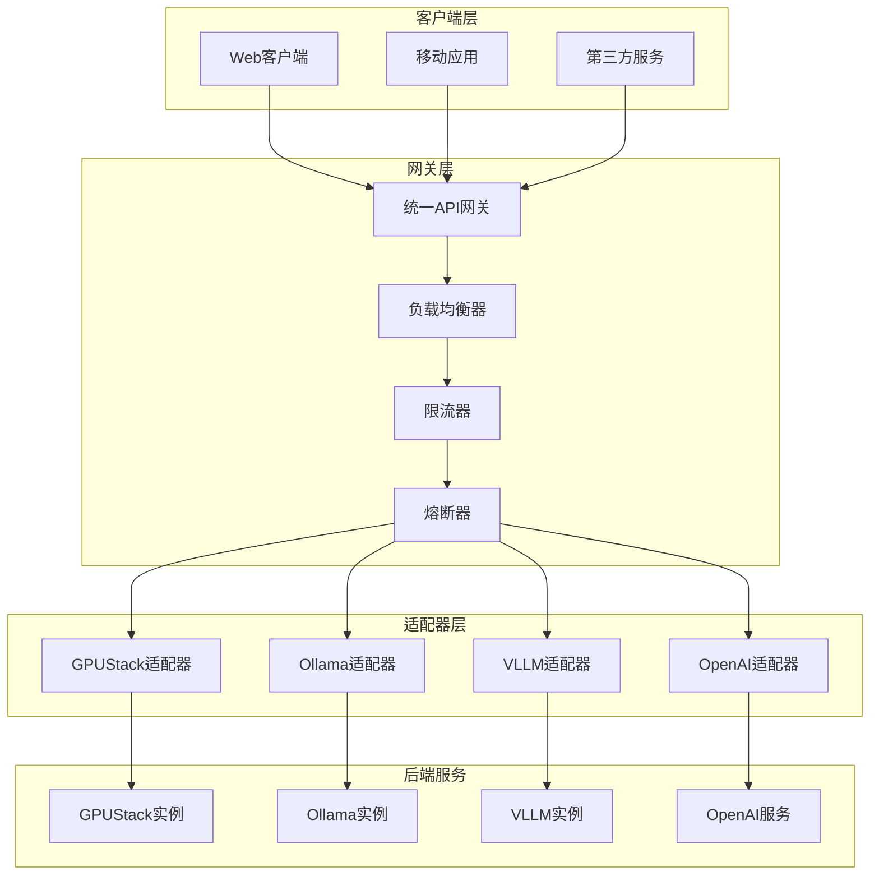
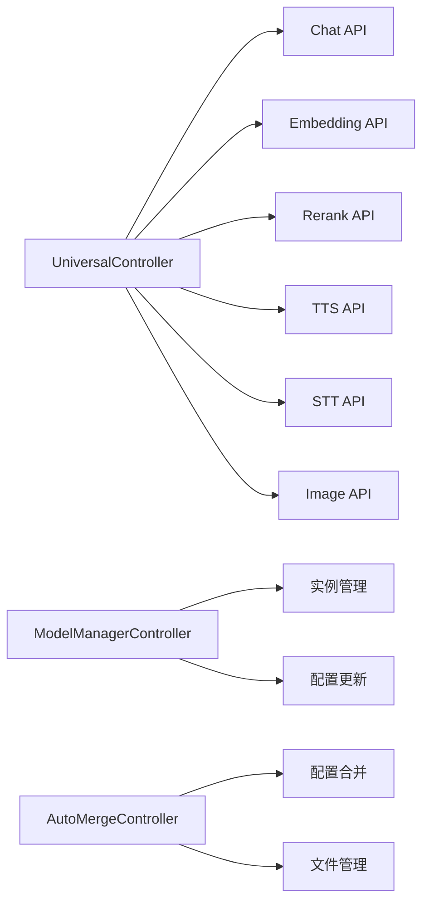
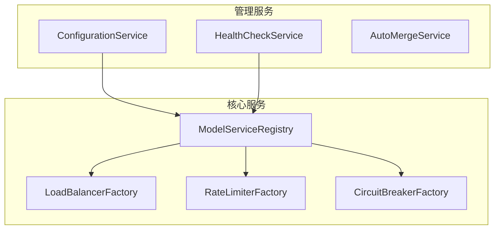
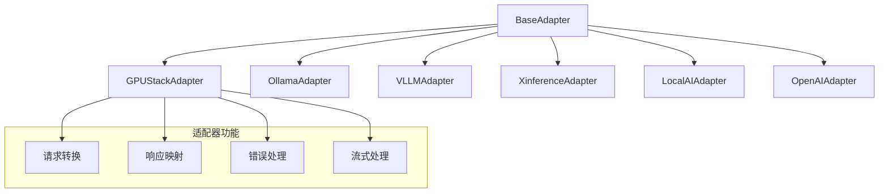
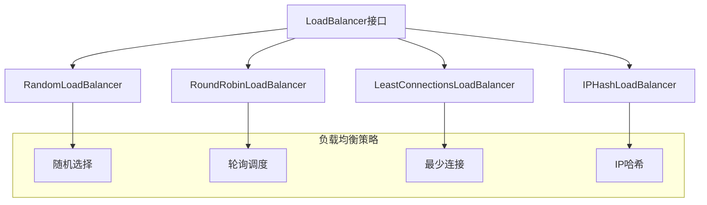
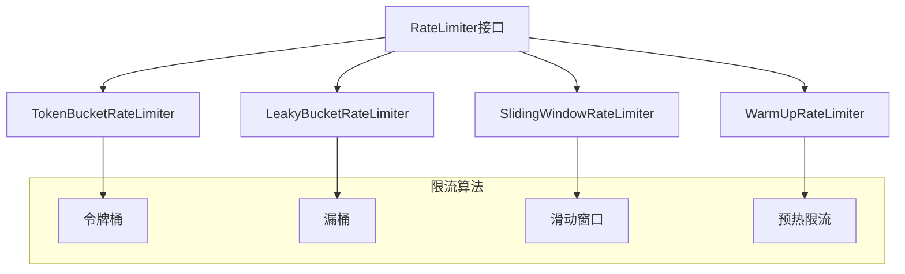
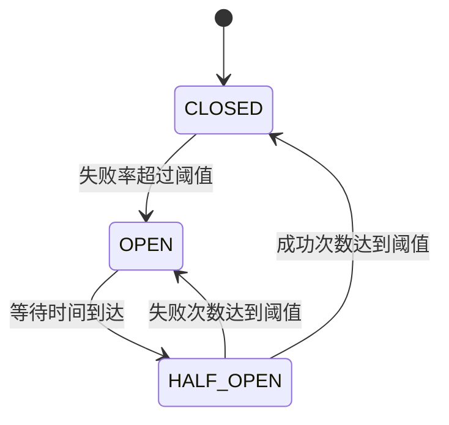
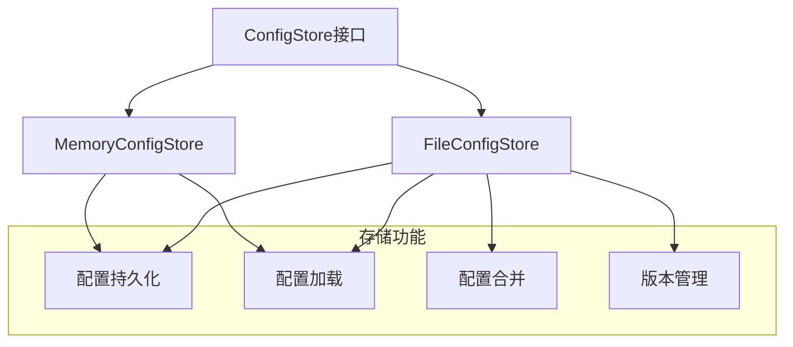

# 架构说明

<!-- 版本信息 -->
> **文档版本**: 1.0.0  
> **最后更新**: 2025-08-19  
> **Git 提交**: c1aa5b0f  
> **作者**: Lincoln
<!-- /版本信息 -->


## 概述

JAiRouter 是一个基于 Spring Boot 3.5.x 和 Spring WebFlux 构建的响应式 AI 模型服务路由网关。采用模块化设计，支持多种负载均衡策略、限流算法、熔断机制和动态配置管理。

## 整体架构



## 核心模块架构

### 1. 控制器层 (Controller Layer)



**职责：**
- 统一 API 入口，提供 OpenAI 兼容接口
- 动态配置管理接口
- 配置文件自动合并功能

### 2. 服务层 (Service Layer)



**职责：**
- 服务注册与发现
- 组件工厂管理
- 配置动态更新
- 健康检查监控

### 3. 适配器层 (Adapter Layer)



**职责：**
- 统一不同后端服务的调用方式
- 请求/响应格式转换
- 协议适配和错误处理

### 4. 负载均衡层 (Load Balancer Layer)



**职责：**
- 实现多种负载均衡算法
- 支持权重配置
- 动态实例管理

### 5. 限流层 (Rate Limiting Layer)



**职责：**
- 实现多种限流算法
- 支持客户端IP独立限流
- 动态限流参数调整

### 6. 熔断层 (Circuit Breaker Layer)



**职责：**
- 实现熔断器状态管理
- 失败率统计和阈值检测
- 自动恢复机制

### 7. 存储层 (Storage Layer)



**职责：**
- 配置数据持久化
- 支持内存和文件存储
- 配置版本管理和合并

## 技术栈

### 核心框架
- **Java 17+**: 现代Java特性支持
- **Spring Boot 3.5.x**: 应用框架和自动配置
- **Spring WebFlux**: 响应式Web框架
- **Reactor Core**: 响应式编程支持

### 构建工具
- **Maven 3.8+**: 项目构建和依赖管理
- **Maven Wrapper**: 确保构建环境一致性

### 监控和文档
- **SpringDoc OpenAPI**: API文档自动生成
- **Micrometer**: 指标收集和监控
- **Spring Boot Actuator**: 健康检查和管理端点

### 代码质量
- **Checkstyle**: 代码风格检查
- **SpotBugs**: 静态代码分析
- **JaCoCo**: 代码覆盖率分析

## 设计原则

### 1. 响应式编程
- 使用 Reactor 实现非阻塞I/O
- 支持高并发请求处理
- 背压处理和流量控制

### 2. 模块化设计
- 清晰的模块边界和职责分离
- 可插拔的组件架构
- 易于扩展和维护

### 3. 配置驱动
- 支持静态配置和动态配置
- 配置热更新无需重启
- 配置版本管理和回滚

### 4. 容错设计
- 多层次的容错机制
- 优雅降级和故障恢复
- 完善的错误处理和日志记录

### 5. 可观测性
- 全面的指标监控
- 结构化日志输出
- 健康检查和状态报告

## 扩展点

### 1. 适配器扩展
实现 `BaseAdapter` 接口，支持新的后端服务：

```java
@Component
public class CustomAdapter extends BaseAdapter {
    @Override
    public Mono<String> processRequest(String serviceType, String requestBody, ServiceInstance instance) {
        // 实现自定义适配逻辑
    }
}
```

### 2. 负载均衡策略扩展
实现 `LoadBalancer` 接口，添加新的负载均衡算法：

```java
@Component
public class CustomLoadBalancer implements LoadBalancer {
    @Override
    public ServiceInstance selectInstance(List<ServiceInstance> instances, String clientInfo) {
        // 实现自定义负载均衡逻辑
    }
}
```

### 3. 限流算法扩展
实现 `RateLimiter` 接口，添加新的限流算法：

```java
@Component
public class CustomRateLimiter implements RateLimiter {
    @Override
    public boolean tryAcquire(String key, int permits) {
        // 实现自定义限流逻辑
    }
}
```

## 性能考虑

### 1. 内存管理
- 定时清理不活跃的限流器
- 合理的缓存策略和过期机制
- 避免内存泄漏

### 2. 并发处理
- 使用响应式编程模型
- 合理的线程池配置
- 避免阻塞操作

### 3. 网络优化
- 连接池复用
- 请求超时控制
- 背压处理

### 4. 监控和调优
- 关键指标监控
- 性能瓶颈识别
- 动态参数调整

## 安全考虑

### 1. 输入验证
- 请求参数校验
- 防止注入攻击
- 数据格式验证

### 2. 访问控制
- API密钥认证
- 请求频率限制
- IP白名单机制

### 3. 数据保护
- 敏感信息脱敏
- 传输加密
- 日志安全

这个架构设计确保了 JAiRouter 的可扩展性、可维护性和高性能，为AI模型服务路由提供了稳定可靠的基础平台。