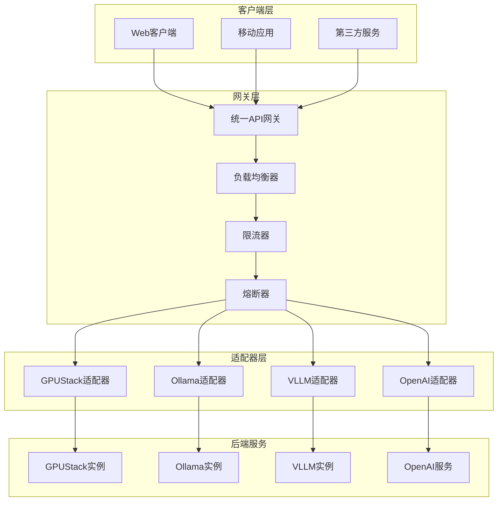
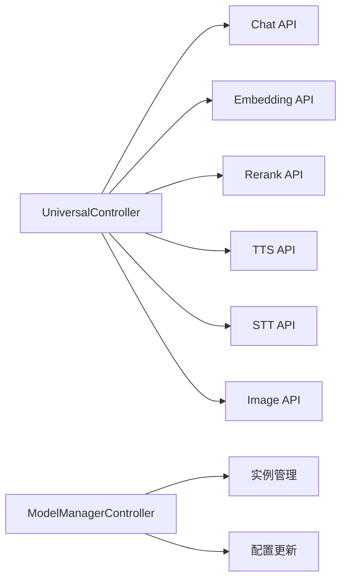
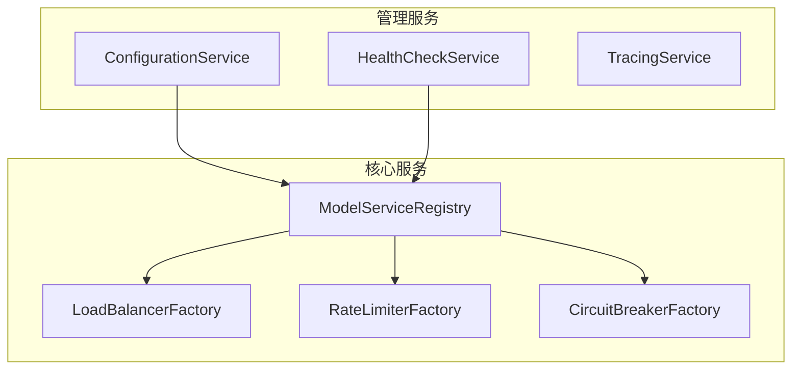
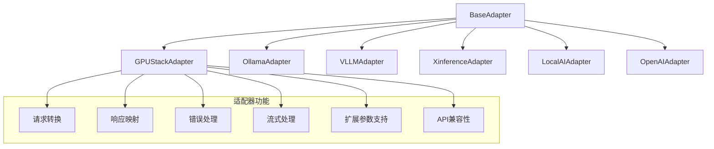
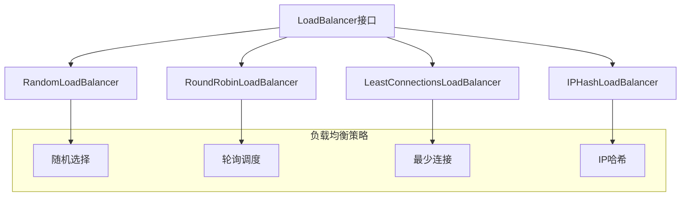
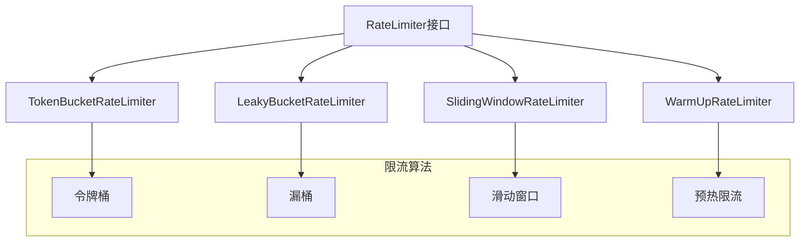
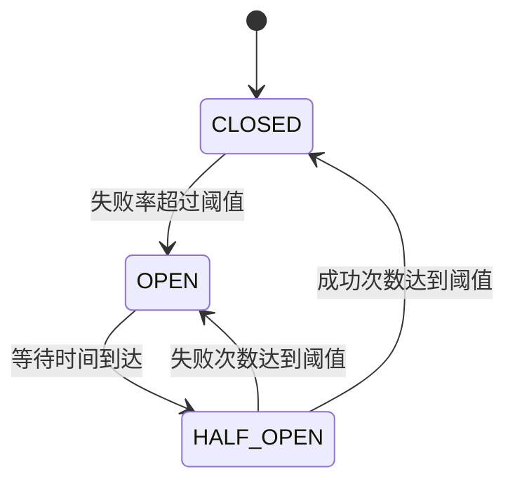
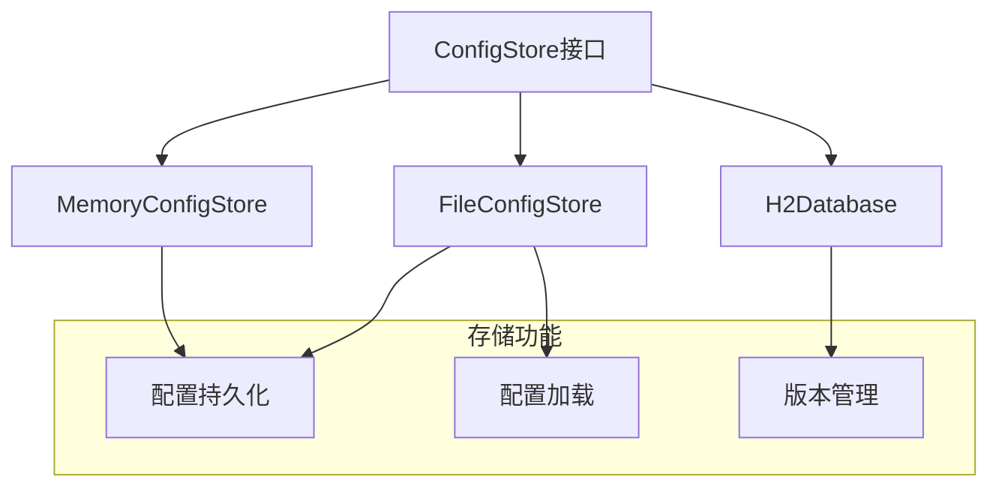

# 架构说明

<!-- 版本信息 -->
> **文档版本**: 2.0.0
> **最后更新**: 2026-06-15
> **Git 提交**: 0f56b957
> **作者**: JAiRouter Team
<!-- /版本信息 -->

## 概述

JAiRouter 是一个基于 Spring Boot 3.5.x 和 Spring WebFlux 构建的响应式 AI 模型服务路由网关。采用模块化设计，支持多种负载均衡策略、限流算法、熔断机制和动态配置管理。

## 整体架构


```mermaid
graph TB
    subgraph "客户端层"
        A[Web客户端]
        B[移动应用]
        C[第三方服务]
    end

    subgraph "网关层"
        D[统一API网关]
        E[负载均衡器]
        F[限流器]
        G[熔断器]
    end

    subgraph "适配器层"
        H[GPUStack适配器]
        I[Ollama适配器]
        J[VLLM适配器]
        K[OpenAI适配器]
    end

    subgraph "后端服务"
        L[GPUStack实例]
        M[Ollama实例]
        N[VLLM实例]
        O[OpenAI服务]
    end

    A --> D
    B --> D
    C --> D
    D --> E
    E --> F
    F --> G
    G --> H
    G --> I
    G --> J
    G --> K
    H --> L
    I --> M
    J --> N
    K --> O
```

## 核心模块架构

### 1. 控制器层 (Controller Layer)


```mermaid
graph LR
    A[UniversalController] --> B[Chat API]
    A --> C[Embedding API]
    A --> D[Rerank API]
    A --> E[TTS API]
    A --> F[STT API]
    A --> G[Image API]

    H[ModelManagerController] --> I[实例管理]
    H --> J[配置更新]
```

**职责：**
- 统一 API 入口，提供 OpenAI 兼容接口
- 动态配置管理接口
- 服务请求路由分发

### 2. 服务层 (Service Layer)


```mermaid
graph TB
    subgraph "核心服务"
        A[ModelServiceRegistry]
        B[LoadBalancerFactory]
        C[RateLimiterFactory]
        D[CircuitBreakerFactory]
    end

    subgraph "管理服务"
        E[ConfigurationService]
        F[HealthCheckService]
        G[TracingService]
    end

    A --> B
    A --> C
    A --> D
    E --> A
    F --> A
```

**职责：**
- 服务注册与发现
- 组件工厂管理
- 配置动态更新
- 健康检查监控
- 分布式追踪

### 3. 适配器层 (Adapter Layer)


```mermaid
graph TB
    A[BaseAdapter] --> B[GPUStackAdapter]
    A --> C[OllamaAdapter]
    A --> D[VLLMAdapter]
    A --> E[XinferenceAdapter]
    A --> F[LocalAIAdapter]
    A --> G[OpenAIAdapter]

    subgraph "适配器功能"
        H[请求转换]
        I[响应映射]
        J[错误处理]
        K[流式处理]
        L[扩展参数支持]
        M[API兼容性]
    end

    B --> H
    B --> I
    B --> J
    B --> K
    B --> L
    B --> M
```

**职责：**
- 统一不同后端服务的调用方式
- 请求/响应格式转换
- 协议适配和错误处理
- 支持最新的 API 特性
- 扩展参数处理

### 4. 负载均衡层 (Load Balancer Layer)


```mermaid
graph TB
    A[LoadBalancer接口] --> B[RandomLoadBalancer]
    A --> C[RoundRobinLoadBalancer]
    A --> D[LeastConnectionsLoadBalancer]
    A --> E[IPHashLoadBalancer]

    subgraph "负载均衡策略"
        F[随机选择]
        G[轮询调度]
        H[最少连接]
        I[IP哈希]
    end

    B --> F
    C --> G
    D --> H
    E --> I
```

**职责：**
- 实现多种负载均衡算法
- 支持权重配置
- 动态实例管理

### 5. 限流层 (Rate Limiting Layer)


```mermaid
graph TB
    A[RateLimiter接口] --> B[TokenBucketRateLimiter]
    A --> C[LeakyBucketRateLimiter]
    A --> D[SlidingWindowRateLimiter]
    A --> E[WarmUpRateLimiter]

    subgraph "限流算法"
        F[令牌桶]
        G[漏桶]
        H[滑动窗口]
        I[预热限流]
    end

    B --> F
    C --> G
    D --> H
    E --> I
```

**职责：**
- 实现多种限流算法
- 支持客户端IP独立限流
- 动态限流参数调整

### 6. 熔断层 (Circuit Breaker Layer)


```mermaid
stateDiagram-v2
    [*] --> CLOSED
    CLOSED --> OPEN : 失败率超过阈值
    OPEN --> HALF_OPEN : 等待时间到达
    HALF_OPEN --> CLOSED : 成功次数达到阈值
    HALF_OPEN --> OPEN : 失败次数达到阈值
```

**职责：**
- 实现熔断器状态管理（状态模式）
- 失败率统计和阈值检测
- 自动恢复机制

### 7. 存储层 (Storage Layer)


```mermaid
graph TB
    A[ConfigStore接口] --> B[MemoryConfigStore]
    A --> C[FileConfigStore]
    A --> D[H2Database]

    subgraph "存储功能"
        E[配置持久化]
        F[配置加载]
        G[版本管理]
    end

    B --> E
    C --> E
    C --> F
    D --> G
```

**职责：**
- 配置数据持久化
- 支持内存和数据库存储
- 配置版本管理

---

## Package 结构（v2.7.x 重构后）

从 v2.7.x 开始，项目采用模块化的 package 结构：

| 模块 | 包路径 | 职责 |
|------|--------|------|
| **auth** | `org.unreal.modelrouter.auth` | 认证授权、JWT、API Key |
| **config** | `org.unreal.modelrouter.config` | 配置管理、版本控制 |
| **router** | `org.unreal.modelrouter.router` | 路由、负载均衡、限流、熔断 |
| **monitor** | `org.unreal.modelrouter.monitor` | 监控、追踪、指标 |
| **persistence** | `org.unreal.modelrouter.persistence` | 数据持久化、仓库 |
| **common** | `org.unreal.modelrouter.common` | 公共工具、异常、常量 |

---

## 技术栈

### 核心框架
- **Java 17+**: 现代Java特性支持
- **Spring Boot 3.5.x**: 应用框架和自动配置
- **Spring WebFlux**: 响应式Web框架
- **Reactor Core**: 响应式编程支持

### 数据存储
- **H2 Database**: 嵌入式数据库（默认）
- **R2DBC**: 响应式数据库访问
- **Redis**: 缓存和会话存储（可选）

### 构建工具
- **Maven 3.8+**: 项目构建和依赖管理
- **Maven Wrapper**: 确保构建环境一致性

### 监控和文档
- **SpringDoc OpenAPI**: API文档自动生成
- **Micrometer**: 指标收集和监控
- **Spring Boot Actuator**: 健康检查和管理端点
- **OpenTelemetry**: 分布式追踪

### 代码质量
- **Checkstyle**: 代码风格检查
- **SpotBugs**: 静态代码分析
- **JaCoCo**: 代码覆盖率分析

---

## 设计原则

### 1. 响应式编程
- 使用 Reactor 实现非阻塞I/O
- 支持高并发请求处理
- 背压处理和流量控制

### 2. 模块化设计
- 清晰的模块边界和职责分离
- 可插拔的组件架构
- 易于扩展和维护

### 3. 配置驱动
- 支持静态配置和动态配置
- 配置热更新无需重启
- 配置版本管理和回滚

### 4. 容错设计
- 多层次的容错机制（限流、熔断、重试）
- 优雅降级和故障恢复
- 完善的错误处理和日志记录

### 5. 可观测性
- 全面的指标监控（Prometheus）
- 结构化日志输出
- 分布式追踪（OpenTelemetry）
- 健康检查和状态报告

---

## 扩展点

### 1. 适配器扩展
实现 `BaseAdapter` 接口，支持新的后端服务：

```java
@Component
public class CustomAdapter extends BaseAdapter {
    @Override
    public Mono<String> processRequest(String serviceType, String requestBody, ServiceInstance instance) {
        // 实现自定义适配逻辑
    }
}
```

### 2. 负载均衡策略扩展
实现 `LoadBalancer` 接口，添加新的负载均衡算法：

```java
@Component
public class CustomLoadBalancer implements LoadBalancer {
    @Override
    public ServiceInstance selectInstance(List<ServiceInstance> instances, String clientInfo) {
        // 实现自定义负载均衡逻辑
    }
}
```

### 3. 限流算法扩展
实现 `RateLimiter` 接口，添加新的限流算法：

```java
@Component
public class CustomRateLimiter implements RateLimiter {
    @Override
    public boolean tryAcquire(String key, int permits) {
        // 实现自定义限流逻辑
    }
}
```

---

## 架构演进历史

### V2.5.x 重构（2026-05）
- 超大类重构（BaseAdapter、TracingService 等）
- 新增 12 个组件，减少 2011 行代码（-62%）
- 测试数量达到 971 个

### V2.7.x Package 重构（2026-06）
- 迁移 481 个文件到 6 个服务模块
- 模块化准备，为微服务架构铺路

### V2.8.x 配置整合（2026-06）
- 拆分 application.yml 为 25 个模块配置文件
- 精简环境配置 763→271 行（-62%）

### V2.9.x 代码清理（2026-06）
- 删除 628 行废弃代码
- Checkstyle 警告减少 46%

---

## 性能考虑

### 1. 内存管理
- 定时清理不活跃的限流器
- 合理的缓存策略和过期机制
- 避免内存泄漏

### 2. 并发处理
- 使用响应式编程模型
- 合理的线程池配置
- 避免阻塞操作

### 3. 网络优化
- 连接池复用
- 请求超时控制
- 背压处理

### 4. 监控和调优
- 关键指标监控
- 性能瓶颈识别
- 动态参数调整

---

## 安全考虑

### 1. 认证鉴权
- API Key 认证
- JWT Token 支持
- 基于角色的访问控制 (RBAC)

### 2. 访问控制
- 请求频率限制
- IP 白名单机制
- 安全黑名单

### 3. 数据保护
- 敏感信息脱敏
- 传输加密（HTTPS）
- API Key 哈希存储

---

这个架构设计确保了 JAiRouter 的可扩展性、可维护性和高性能，为 AI 模型服务路由提供了稳定可靠的基础平台。
