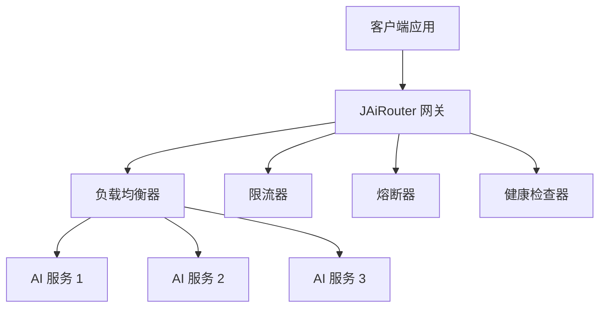

# 快速开始

欢迎使用 JAiRouter！本节将帮助您快速上手 JAiRouter，从安装到第一次 API 调用。

## 什么是 JAiRouter？

JAiRouter 是一个基于 Spring Boot 的 AI 模型服务路由和负载均衡网关，通过 OpenAI 兼容的 API 提供对各种 AI 模型服务的统一访问。

## 核心优势

- **统一接口**: 为多个 AI 模型提供商提供单一 API 端点
- **高可用性**: 内置负载均衡、熔断器和健康监控
- **易于集成**: OpenAI 兼容的 API 格式
- **动态配置**: 运行时更新，无需重启服务
- **生产就绪**: 全面的监控和日志记录

## 快速导航

1. **[安装指南](installation.md)** - 安装和配置 JAiRouter
2. **[快速开始](quick-start.md)** - 进行第一次 API 调用
3. **[第一步](first-steps.md)** - 基本配置和使用

## 前置条件

开始之前，请确保您具备：

- Java 17 或更高版本
- Maven 3.6+（或使用包含的 Maven wrapper）
- 至少一个 AI 模型服务（Ollama、VLLM、GPUStack 等）

## 架构概览

JAiRouter 位于您的应用程序和 AI 模型服务之间，提供：

- **负载均衡**: 在多个服务实例之间分发请求
- **限流**: 控制请求速率以防止过载
- **熔断**: 防止级联故障
- **健康监控**: 自动检测和处理不健康的服务

## 下一步

准备开始了吗？前往[安装指南](installation.md)在您的环境中设置 JAiRouter。