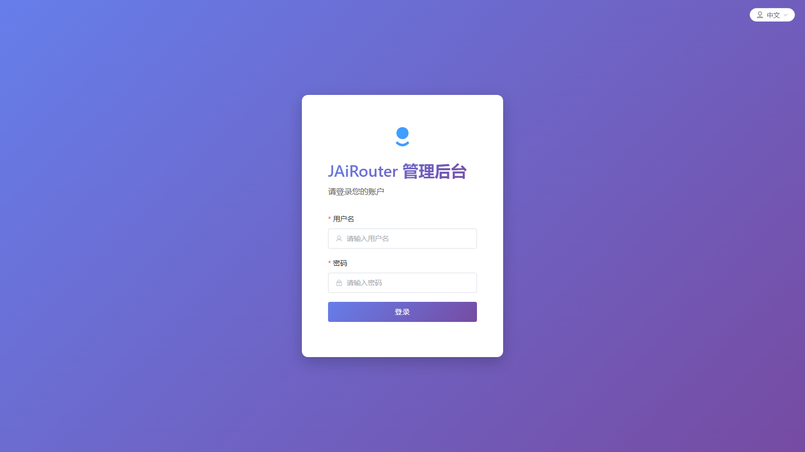
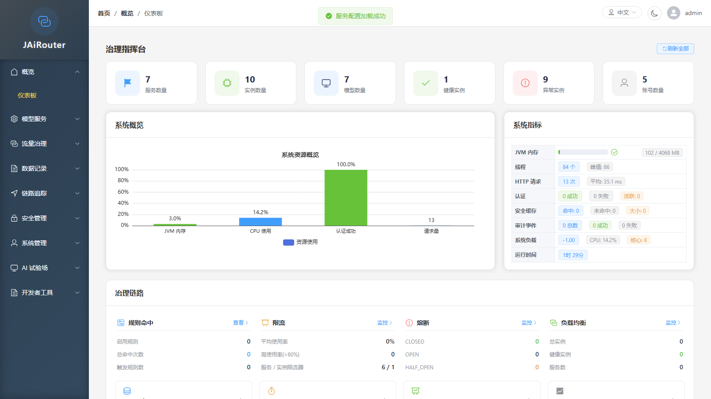
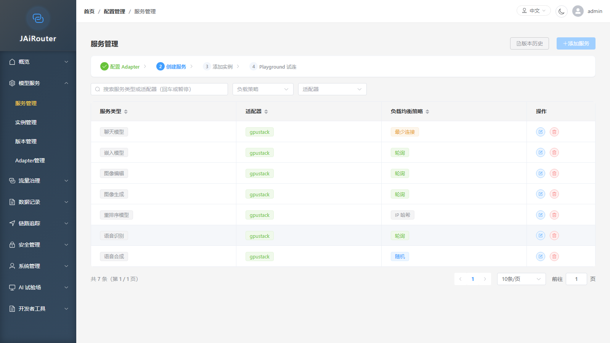
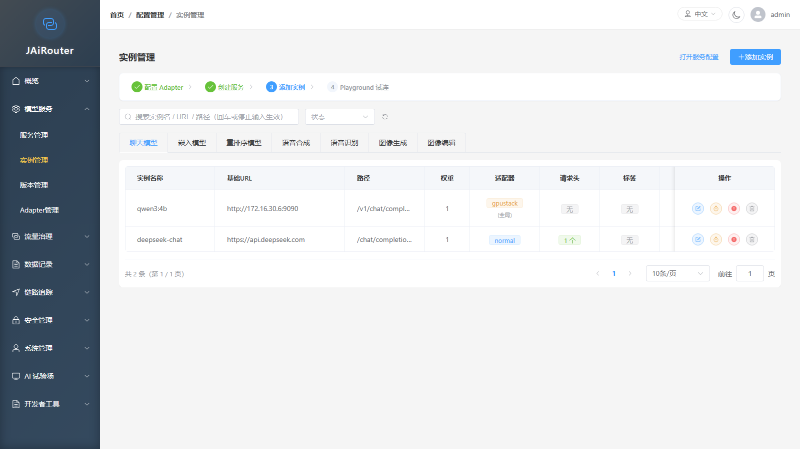

# Web 控制台操作手册

<!-- 版本信息 -->
> **文档版本**: 1.0.0
> **最后更新**: 2026-09-15
> **适用版本**: v3.1.1
> **作者**: Lincoln
<!-- /版本信息 -->

本手册面向首次使用 JAiRouter Web 控制台的操作者，覆盖从登录到首次接通模型服务、配额管理、观测排查、权限控制的完整动线。

## 1. 登录与首次启动

### 1.1 访问地址

| 部署方式 | 地址 | 说明 |
|----------|------|------|
| 本地开发（Vite） | `http://localhost:3000/admin` | Vite dev server，热更新 |
| 生产/独立部署 | `http://<host>:8080/admin` | 后端直接托管 SPA |

两个入口指向同一套前端代码，功能完全一致。

### 1.2 默认账号

| 用户名 | 默认密码 | 角色 | 说明 |
|--------|----------|------|------|
| `admin` | `ChangeMeOnFirstStartup123456` | ADMIN, USER | 超级管理员，拥有全部 53 个权限码 |
| `user` | `user123456` | USER | 普通用户，只读为主 |

> ⚠️ **首次部署务必修改 `admin` 密码**。密码通过环境变量 `INITIAL_ADMIN_PASSWORD` 设置（见 `src/main/resources/config/auth/jwt.yml`），修改后重启服务即生效。

```bash
# 示例：启动前设置环境变量
export INITIAL_ADMIN_PASSWORD="YourStr0ngPassword#2026"
```

### 1.3 Token 存储

登录成功后，JWT 存储于浏览器 `localStorage`，键名为 `admin_token`。

> ⚠️ **不建议手动注入 token**。前端路由守卫（`router.beforeEach`）在每次导航时会：
>
> 1. 检查 `localStorage` 中是否存在 `admin_token`；
> 2. 解码 JWT 检查是否过期（提前 60 秒判定过期）；
> 3. 校验路由 `meta.roles` / `meta.permissions` 是否满足。
>
> 仅满足全部条件才放行，否则重定向到 `/login`。手动写入的 token 如果过期或缺失 `permissions` claim，控制台将无法正常使用。

### 1.4 登录流程

1. 在浏览器打开控制台地址；
2. 页面标题显示「**JAiRouter 管理后台**」（英文：**JAiRouter Admin**）；
3. 输入用户名和密码，点击「**登录**」（**Login**）按钮；
4. 登录成功后自动跳转到「**仪表板**」（**Dashboard**）页面。



---

## 2. 界面结构

### 2.1 左侧导航

控制台左侧为可折叠侧边栏，包含 **9 个菜单分组**，共 **39 个页面**。菜单可见性由权限码控制——缺少对应权限码的分组/页面不会显示。



| # | 分组（zh） | 分组（en） | 子页面 |
|---|-----------|-----------|--------|
| 1 | 概览 | Overview | 仪表板 |
| 2 | 模型服务 | Model Services | 服务管理、实例管理、版本管理、Adapter管理 |
| 3 | 流量治理 | Traffic Governance | 路由规则、负载均衡监控、负载均衡策略、熔断器监控、熔断器历史、熔断器配置、限流监控、资源池、响应缓存管理、配额运行时配置 |
| 4 | 数据记录 | Data Records | 调用历史仪表盘、调用列表、Token 统计、慢调用、慢查询分析、配额用量监控、异常事件管理、异常统计分析 |
| 5 | 链路追踪 | Distributed Tracing | 追踪仪表盘、追踪搜索、追踪配置 |
| 6 | 安全管理 | Security | API 密钥管理、PII 脱敏管理、JWT 令牌管理、黑名单管理、审计日志 |
| 7 | 系统管理 | System | 账户管理、权限管理、状态持久化 |
| 8 | AI 试验场 | AI Playground | 对话测试、向量生成、重排序、语音服务、图像服务 |
| 9 | 开发者工具 | Developer Tools | 客户端接入指南 |

### 2.2 顶栏

| 区域 | 元素 | 说明 |
|------|------|------|
| 左侧 | 面包屑 | 格式：首页 / 分组名 / 当前页名 |
| 右侧 | 语言切换 | 胶囊按钮，下拉选择「中文」或「English」，切换即时生效 |
| 右侧 | 主题切换 | 圆形按钮，☀️/🌙 图标，切换亮色/暗色主题 |
| 右侧 | 用户菜单 | 头像 + 用户名（如 `admin`），下拉包含「个人资料」（Profile）和「退出登录」（Log Out） |

### 2.3 面包屑

页面顶部显示当前导航路径，如：`首页 / 概览 / 仪表板`。面包屑随页面切换自动更新。

---

## 3. 首次接通一个模型服务的最小动线

以下步骤按照依赖顺序，以配置一个 Ollama 模型服务为例。



### 步骤 1：配置服务

**菜单路径**：模型服务 → 服务管理

1. 进入「**服务管理**」页面；
2. 点击「**添加服务**」（**Add Service**）按钮；
3. 填写表单：

| 字段 | 说明 | 必填 |
|------|------|:----:|
| 服务类型（Service Type） | 下拉选择，如 `chat`、`embedding`、`completion` 等 | ✅ |
| 适配器（Adapter） | 下拉选择适配器类型 | ✅ |
| 负载均衡策略（Load Balance Strategy） | 随机 / 轮询 / 最少连接 / IP 哈希 | ✅ |
| 说明（Description） | 可选备注 | ❌ |

4. 点击「**保存**」（**Save**）；
5. 保存成功后，服务类型出现在列表中，状态为「**已启用**」（**Enabled**）。

### 步骤 2：配置实例

**菜单路径**：模型服务 → 实例管理



1. 进入「**实例管理**」页面；
2. 选择对应的服务类型（左侧下拉）；
3. 点击「**添加实例**」（**Add Instance**）按钮；
4. 填写表单：

| 字段 | 说明 | 必填 | 示例 |
|------|------|:----:|------|
| 服务类型（Service Type） | 关联的服务类型 | ✅ | `chat` |
| 实例名称（Instance Name） | 实例标识 | ✅ | `ollama-local` |
| 基础URL（Base URL） | 下游服务地址 | ✅ | `http://localhost:11434` |
| 路径（Path） | 请求路径（可选） | ❌ | `/v1/chat/completions` |
| 权重（Weight） | 负载均衡权重 | ✅ | `1` |
| 适配器（Adapter） | 留空使用全局配置 | ❌ | — |

5. 展开「**请求头配置**」（**Request Header Config**），添加下游所需认证头：

| 头名称 | 头值 | 说明 |
|--------|------|------|
| `Authorization` | `Bearer <your-api-key>` | 透传给下游模型服务的认证凭据 |

> 💡 `Authorization` 头是**透传给下游服务**的，不是网关自身的凭据。网关凭据为 `Jairouter_Token`（JWT）。

6. 可选：展开「**标签配置**」（**Tag Config**），添加标签用于路由规则筛选；
7. 点击「**保存**」（**Save**）；
8. 保存成功后，实例出现在列表中，状态列显示健康状态（健康/异常）。

### 步骤 3：版本与 Adapter（如需）

- **版本管理**（模型服务 → 版本管理）：如果模型服务需要指定版本信息，可在此配置。非必须步骤。
- **Adapter管理**（模型服务 → Adapter管理）：查看和管理已注册的适配器。如果步骤 1 中已正确选择适配器，此步可跳过。

### 步骤 4：验证连通性

配置完成后，可通过以下方式验证：

1. **仪表板**（概览 → 仪表板）：查看「服务配置速览」区域，确认服务实例数量、健康实例数是否正确；
2. **实例管理**页面：实例状态列应显示绿色「**健康**」标签（非「**异常**」）；
3. **负载均衡监控**（流量治理 → 负载均衡监控）：查看实时负载均衡状态。

### 步骤 5：在 Playground 试调用

**菜单路径**：AI 试验场 → 对话测试

1. 进入「**对话测试**」（**Chat Playground**）页面；
2. 选择模型（Model）为步骤 1 中配置的服务类型对应的模型；
3. 输入消息并发送；
4. 如果收到回复，说明整个链路（控制台 → 网关 → 模型服务）已打通。

> 💡 Playground 需要 `ai:playground:use` 权限码。ADMIN 和 USER 角色默认拥有此权限。

---

## 4. 配额怎么用

### 4.1 配额运行时配置

**菜单路径**：流量治理 → 配额运行时配置

配额功能**默认关闭**。要启用配额：


1. 进入「**配额运行时配置**」页面；
2. 找到「**热编辑配置**」（Hot-Editable Configuration）区域；
3. 打开「**启用配额**」（Enable Quota）开关；
4. 可选配置：
   - **降级放行**（Fail Open）：配额系统异常时是否放行请求；
   - **统计窗口**（Stat Windows）：选择统计维度；
5. 点击「**保存配置**」（Save Configuration）；

**可热改的字段**（无需重启）：

| 字段 | 说明 |
|------|------|
| `enabled` | 启用/禁用配额 |
| `failOpen` | 降级放行开关 |
| `windows` | 统计窗口选择 |

**需重启生效的字段**（标记「**需重启**」徽标，只读）：

| 字段 | 说明 |
|------|------|
| `backendName` | 存储后端名称 |
| `distributedEnabled` | 分布式启用 |
| `distributedKeyPrefix` | 分布式 Key 前缀 |
| `distributedTimeout` | 分布式超时 |
| `flushIntervalSeconds` | 刷新间隔 |

### 4.2 配额用量监控

**菜单路径**：数据记录 → 配额用量监控

进入「**配额用量监控**」页面可以：

- 查看配额**运行状态**：存储后端类型、降级状态；
- 按**租户 ID / API Key ID / 用户 ID / 服务类型 / 模型 / 统计窗口**筛选用量数据；
- 查看**用量明细**：请求数、Token 数。

> 💡 如果页面显示「**配额账本未启用，用量数据暂不可用**」，说明配额功能未开启，需先到「配额运行时配置」页面启用。

---

## 5. 观测与排查

### 5.1 数据记录分组

| 页面 | 路径 | 回答什么问题 |
|------|------|-------------|
| 调用历史仪表盘 | `/call-history/dashboard` | 整体调用量趋势、成功率/失败率概览 |
| 调用列表 | `/call-history/list` | 每一笔请求的详细记录（时间、服务、状态码、耗时） |
| Token 统计 | `/call-history/token-usage` | 各模型/服务的 Token 消耗量 |
| 慢调用 | `/call-history/slow-calls` | 哪些请求耗时过长 |
| 慢查询分析 | `/monitoring/slow-queries` | 慢请求的深度分析（需 `monitoring:slowquery:read` 权限） |
| 配额用量监控 | `/monitoring/quota` | 配额消耗明细 |
| 异常事件管理 | `/exceptions/list` | 所有异常事件的列表（所有已登录用户可见） |
| 异常统计分析 | `/exceptions/statistics` | 异常按类型/时间的分布统计 |

### 5.2 链路追踪分组

| 页面 | 路径 | 回答什么问题 |
|------|------|-------------|
| 追踪仪表盘 | `/tracing/dashboard` | 追踪量趋势、延迟分布、错误率趋势、吞吐量 |
| 追踪搜索 | `/tracing/search` | 按 Trace ID / 服务名 / 时间范围定位具体请求链路 |
| 追踪配置 | `/tracing/management` | 追踪开关、采样率、导出器配置（Logging / OTLP / Jaeger） |

### 5.3 仪表板总览

概览 → 仪表板提供一站式视图：

- **系统概览**：服务数量、实例数量、健康实例、异常实例；
- **系统指标**：JVM 内存、线程数、HTTP 请求、CPU 使用率、运行时间；
- **治理链路**：规则命中、限流、熔断、负载均衡状态快捷入口；
- **异常/告警摘要**：最近异常事件列表；
- **服务配置速览**：全局配置概要（适配器、限流、熔断等）。

---

## 6. 权限与角色

### 6.1 四个内置角色

| 角色 | 权限码数 | 权限范围 | 说明 |
|------|:-------:|----------|------|
| **ADMIN** | 53 | 全量权限码 | 超级管理员；URL 规则直通，JWT 内嵌全量码 |
| **OPERATOR** | 43 | 全部 `:read` + `:write` 码 | 日常运维；不含系统管理（`system:*`）、安全管理类 `manage`（API Key / JWT 令牌 / 黑名单管理） |
| **USER** | 28 | 仪表盘 + config 只读 + lb/cb/rl 全量 + monitoring 只读 + tracing 仪表盘/搜索 + AI 试验场 | 普通用户；唯一写码 `lb:config:write` |
| **VIEWER** | 27 | 全部 `:read` 码 | 纯只读角色；不含 `callhistory:view`、`ai:playground:use` |

### 6.2 为什么看不到某些菜单页 {#why-menu-pages-missing}

前端菜单渲染基于权限码过滤：

1. 每个菜单组/菜单项关联一个权限码（如 `config:services:read`）；
2. 登录后 JWT 的 `permissions` claim 包含当前用户的权限码列表；
3. `usePermission` 组合式函数在渲染时过滤掉用户不拥有的菜单项；
4. 路由守卫（`meta.permissions`）进一步拦截无权限的直接 URL 访问。

**解决方式**：

1. **系统管理** → **权限管理**页面（需 `system:permissions:manage` 权限，仅 ADMIN）；
2. 找到目标角色，勾选缺失的权限码并保存。

> 💡 `/v1/**`（OpenAI 兼容推理端点）独立于 RBAC 体系，仅要求认证，不受权限码限制。

---

## 7. 多协议接入

### 7.1 客户端接入指南

**菜单路径**：开发者工具 → 客户端接入指南

该页面提供 OpenAI 兼容接口和 Anthropic 兼容接口的完整接入示例，包括 Base URL、认证方式、curl 示例和 SDK 示例。

### 7.2 凭据头口径

| 协议面 | 凭据头 | 说明 |
|--------|--------|------|
| OpenAI 兼容 | `X-API-Key: <网关 API Key>` | 用于 `/v1/*` 端点 |
| Anthropic 兼容 | `x-api-key: <网关 API Key>` | 用于 Anthropic Messages API |
| 控制台 | `Jairouter_Token: <JWT>` | Web 控制台登录后的管理 API 凭据 |
| `Authorization` | — | **透传给下游模型服务**，不是网关凭据 |

> ⚠️ `Authorization` 头（如 `Bearer <token>`）会被网关原样转发给下游模型服务，不会作为网关自身认证凭据使用。

---

## 8. 常见问题

### 8.1 登录后页面显示 401

**现象**：登录后 API 请求返回 401 Unauthorized。

**可能原因**：

1. JWT 已过期（默认有效期 60 分钟）；
2. 环境变量 `JWT_SECRET` 与部署时不一致，导致 token 验签失败。

**处理**：

- 重新登录获取新 token；
- 确认 `JWT_SECRET` 环境变量在重启后未改变。

### 8.2 登录后页面显示 403

**现象**：部分 API 返回 403 Forbidden。

**可能原因**：当前用户角色缺少对应权限码。

**处理**：

- 用 `admin` 账号登录，进入「系统管理 → 权限管理」为对应角色补充权限码；
- 参考 [RBAC 权限管理](../security/rbac-permissions.md) 文档了解权限码体系。

### 8.3 看不到某些菜单页

**现象**：登录后侧边栏缺少部分菜单分组或页面。

**可能原因**：当前用户角色不包含对应菜单项的权限码。

**处理**：

- 参见本文「[6.2 为什么看不到某些菜单页](#why-menu-pages-missing)」一节。

### 8.4 OpenAI SDK 接入报错

**现象**：使用 OpenAI SDK 调用时返回 401。

**可能原因**：SDK 默认使用 `Authorization: Bearer <key>` 头，而非 `X-API-Key`。网关的 OpenAI 兼容端点要求 `X-API-Key` 头携带 API Key。

**处理**：

- 使用 `X-API-Key` 头而非 `Authorization` 头传递 API Key；
- 参考「开发者工具 → 客户端接入指南」页面的 SDK 示例。

### 8.5 Redis 不可用时的降级提示

**现象**：仪表板或监控页面提示连接异常。

**可能原因**：JAiRouter 依赖 Redis 进行 JWT 持久化/配额分布式存储时，Redis 未启动或不可达。本地开发环境默认 Redis 关闭（`redis.enabled: false`），JWT 使用 H2 + 内存回退。

**处理**：

- 本地开发：无需 Redis，JWT 使用 H2 存储 + 内存回退，功能不受影响；
- 生产环境：确保 Redis 可用，或配置 `jairouter.security.jwt.persistence.fallback-storage: memory`。

### 8.6 配额不生效

**现象**：发送请求后配额用量监控页面无数据。

**可能原因**：配额功能默认关闭。

**处理**：

1. 进入「流量治理 → 配额运行时配置」；
2. 启用配额开关并保存；
3. 确认存储后端状态正常（非降级）。

---

## 附录：页面路径速查表

| 分组 | 页面 | 路由路径 |
|------|------|----------|
| 概览 | 仪表板 | `/dashboard/main` |
| 模型服务 | 服务管理 | `/config/services` |
| 模型服务 | 实例管理 | `/config/instances` |
| 模型服务 | 版本管理 | `/config/versions` |
| 模型服务 | Adapter管理 | `/config/adapters` |
| 流量治理 | 路由规则 | `/config/rules` |
| 流量治理 | 负载均衡监控 | `/load-balancers/monitoring` |
| 流量治理 | 负载均衡策略 | `/load-balancers/strategy-config` |
| 流量治理 | 熔断器监控 | `/circuit-breakers/monitoring` |
| 流量治理 | 熔断器历史 | `/circuit-breakers/history` |
| 流量治理 | 熔断器配置 | `/circuit-breakers/global-config` |
| 流量治理 | 限流监控 | `/rate-limiters/monitoring` |
| 流量治理 | 资源池 | `/config/pools` |
| 流量治理 | 响应缓存管理 | `/config/cache` |
| 流量治理 | 配额运行时配置 | `/config/quota` |
| 数据记录 | 调用历史仪表盘 | `/call-history/dashboard` |
| 数据记录 | 调用列表 | `/call-history/list` |
| 数据记录 | Token 统计 | `/call-history/token-usage` |
| 数据记录 | 慢调用 | `/call-history/slow-calls` |
| 数据记录 | 慢查询分析 | `/monitoring/slow-queries` |
| 数据记录 | 配额用量监控 | `/monitoring/quota` |
| 数据记录 | 异常事件管理 | `/exceptions/list` |
| 数据记录 | 异常统计分析 | `/exceptions/statistics` |
| 链路追踪 | 追踪仪表盘 | `/tracing/dashboard` |
| 链路追踪 | 追踪搜索 | `/tracing/search` |
| 链路追踪 | 追踪配置 | `/tracing/management` |
| 安全管理 | API 密钥管理 | `/security/api-keys` |
| 安全管理 | PII 脱敏管理 | `/security/sanitization` |
| 安全管理 | JWT 令牌管理 | `/security/jwt-tokens` |
| 安全管理 | 黑名单管理 | `/security/blacklist` |
| 安全管理 | 审计日志 | `/security/audit-logs` |
| 系统管理 | 账户管理 | `/system/accounts` |
| 系统管理 | 权限管理 | `/system/permissions` |
| 系统管理 | 状态持久化 | `/config/state-persistence` |
| AI 试验场 | 对话测试 | `/playground/chat` |
| AI 试验场 | 向量生成 | `/playground/embedding` |
| AI 试验场 | 重排序 | `/playground/rerank` |
| AI 试验场 | 语音服务 | `/playground/audio` |
| AI 试验场 | 图像服务 | `/playground/image` |
| 开发者工具 | 客户端接入指南 | `/tools/client-access` |

### PII 脱敏管理（v3.2.0）

路径：**安全管理 → PII 脱敏管理** `/security/sanitization`（权限 `security:sanitization:manage`）

操作动线：
1. 查看 request/response 子配置（PII 正则、敏感词、掩码字符）
2. 热改后点保存（同步重建规则库，记录侧 SUMMARY 立即生效）
3. 「试脱敏」粘贴聊天样例，确认脱敏后出现 `****`
4. 说明：网关实时响应默认不脱敏；管理台 `/api/**` 与 AI 路径已排除

### API 密钥配额操作（v3.2.0）

路径：**安全管理 → API 密钥** 列表操作列 **「配额」**

操作动线：
1. 打开配额抽屉：今日用量 / 剩余量 + 预设（不限制/开发/标准/严格）
2. 调整限额后「保存配额」（只改配额字段，不改密钥其它属性）
3. 「重置计数」清零当日请求/Token 与速率
4. 配额监控页可交叉跳转到 API Key 设置限额

### 配额用量监控（交叉入口）

路径：**数据记录 → 配额用量监控** `/monitoring/quota`

- 展示多维用量与日请求/Token 限额、进度
- 「到 API Key 设置限额」跳转 `/security/api-keys`
