# 告警配置指南

本文档介绍如何配置和管理 JAiRouter 的告警系统，包括告警规则设置、通知配置和告警处理流程。

## 告警架构

```mermaid
graph TB
    subgraph "指标收集"
        A[JAiRouter 应用] --> B[Prometheus]
    end
    
    subgraph "告警处理"
        B --> C[告警规则评估]
        C --> D[AlertManager]
        D --> E[通知路由]
    end
    
    subgraph "通知渠道"
        E --> F[邮件]
        E --> G[Slack]
        E --> H[钉钉]
        E --> I[短信]
        E --> J[Webhook]
    end
    
    subgraph "告警管理"
        K[Grafana 告警] --> D
        L[静默规则] --> D
        M[抑制规则] --> D
    end
```



## 告警规则配置

### 基础告警规则

创建 `monitoring/prometheus/rules/jairouter-alerts.yml`：

```yaml
groups:
  - name: jairouter.critical
    interval: 30s
    rules:
      # 服务不可用
      - alert: JAiRouterDown
        expr: up{job="jairouter"} == 0
        for: 1m
        labels:
          severity: critical
          service: jairouter
        annotations:
          summary: "JAiRouter 服务不可用"
          description: "JAiRouter 服务已停止响应超过 1 分钟"
          runbook_url: "https://docs.jairouter.com/troubleshooting/service-down"

      # 严重错误率
      - alert: HighErrorRate
        expr: sum(rate(jairouter_requests_total{status=~"5.."}[5m])) / sum(rate(jairouter_requests_total[5m])) > 0.05
        for: 2m
        labels:
          severity: critical
          service: jairouter
        annotations:
          summary: "高错误率告警"
          description: "5xx 错误率超过 5%，当前值: {{ $value | humanizePercentage }}"
          runbook_url: "https://docs.jairouter.com/troubleshooting/high-error-rate"

      # 严重响应延迟
      - alert: HighLatency
        expr: histogram_quantile(0.95, sum(rate(jairouter_request_duration_seconds_bucket[5m])) by (le)) > 5
        for: 5m
        labels:
          severity: critical
          service: jairouter
        annotations:
          summary: "响应时间过长"
          description: "P95 响应时间超过 5 秒，当前值: {{ $value }}s"
          runbook_url: "https://docs.jairouter.com/troubleshooting/high-latency"

      # 内存严重不足
      - alert: HighMemoryUsage
        expr: jvm_memory_used_bytes{area="heap"} / jvm_memory_max_bytes{area="heap"} > 0.90
        for: 2m
        labels:
          severity: critical
          service: jairouter
        annotations:
          summary: "内存使用率过高"
          description: "JVM 堆内存使用率超过 90%，当前值: {{ $value | humanizePercentage }}"
          runbook_url: "https://docs.jairouter.com/troubleshooting/memory-issues"

      # 后端服务不可用
      - alert: BackendServiceDown
        expr: jairouter_backend_health == 0
        for: 1m
        labels:
          severity: critical
          service: jairouter
          adapter: "{{ $labels.adapter }}"
          instance: "{{ $labels.instance }}"
        annotations:
          summary: "后端服务不可用"
          description: "后端服务 {{ $labels.adapter }}/{{ $labels.instance }} 健康检查失败"
          runbook_url: "https://docs.jairouter.com/troubleshooting/backend-down"

  - name: jairouter.warning
    interval: 60s
    rules:
      # 警告级错误率
      - alert: ModerateErrorRate
        expr: sum(rate(jairouter_requests_total{status=~"4..|5.."}[5m])) / sum(rate(jairouter_requests_total[5m])) > 0.10
        for: 5m
        labels:
          severity: warning
          service: jairouter
        annotations:
          summary: "错误率偏高"
          description: "总错误率超过 10%，当前值: {{ $value | humanizePercentage }}"

      # 响应时间警告
      - alert: ModerateLatency
        expr: histogram_quantile(0.95, sum(rate(jairouter_request_duration_seconds_bucket[5m])) by (le)) > 2
        for: 10m
        labels:
          severity: warning
          service: jairouter
        annotations:
          summary: "响应时间偏高"
          description: "P95 响应时间超过 2 秒，当前值: {{ $value }}s"

      # 内存使用警告
      - alert: ModerateMemoryUsage
        expr: jvm_memory_used_bytes{area="heap"} / jvm_memory_max_bytes{area="heap"} > 0.80
        for: 5m
        labels:
          severity: warning
          service: jairouter
        annotations:
          summary: "内存使用率偏高"
          description: "JVM 堆内存使用率超过 80%，当前值: {{ $value | humanizePercentage }}"

      # 熔断器开启
      - alert: CircuitBreakerOpen
        expr: jairouter_circuit_breaker_state == 1
        for: 1m
        labels:
          severity: warning
          service: jairouter
          circuit_breaker: "{{ $labels.circuit_breaker }}"
        annotations:
          summary: "熔断器开启"
          description: "熔断器 {{ $labels.circuit_breaker }} 已开启"

      # 限流频繁触发
      - alert: HighRateLimitRejection
        expr: sum(rate(jairouter_rate_limit_events_total{result="denied"}[5m])) / sum(rate(jairouter_rate_limit_events_total[5m])) > 0.20
        for: 5m
        labels:
          severity: warning
          service: jairouter
        annotations:
          summary: "限流拒绝率过高"
          description: "限流拒绝率超过 20%，当前值: {{ $value | humanizePercentage }}"

      # 负载不均衡
      - alert: LoadImbalance
        expr: |
          (
            max(sum by (instance) (rate(jairouter_backend_calls_total[5m]))) -
            min(sum by (instance) (rate(jairouter_backend_calls_total[5m])))
          ) / avg(sum by (instance) (rate(jairouter_backend_calls_total[5m]))) > 0.5
        for: 10m
        labels:
          severity: warning
          service: jairouter
        annotations:
          summary: "负载不均衡"
          description: "实例间负载差异超过 50%"

  - name: jairouter.business
    interval: 60s
    rules:
      # 模型调用失败率高
      - alert: HighModelCallFailureRate
        expr: sum(rate(jairouter_model_calls_total{status!="success"}[5m])) / sum(rate(jairouter_model_calls_total[5m])) > 0.10
        for: 5m
        labels:
          severity: warning
          service: jairouter
        annotations:
          summary: "模型调用失败率过高"
          description: "模型调用失败率超过 10%，当前值: {{ $value | humanizePercentage }}"

      # 活跃会话数异常
      - alert: UnusualActiveSessionCount
        expr: |
          (
            sum(jairouter_user_sessions_active) > 
            (avg_over_time(sum(jairouter_user_sessions_active)[1h:5m]) * 2)
          ) or (
            sum(jairouter_user_sessions_active) < 
            (avg_over_time(sum(jairouter_user_sessions_active)[1h:5m]) * 0.5)
          )
        for: 10m
        labels:
          severity: info
          service: jairouter
        annotations:
          summary: "活跃会话数异常"
          description: "当前活跃会话数: {{ $value }}，与历史平均值差异较大"
```

### 业务特定告警规则

```yaml
groups:
  - name: jairouter.business-specific
    interval: 60s
    rules:
      # Chat 服务响应时间过长
      - alert: ChatServiceSlowResponse
        expr: histogram_quantile(0.95, sum(rate(jairouter_request_duration_seconds_bucket{service="chat"}[5m])) by (le)) > 3
        for: 5m
        labels:
          severity: warning
          service: jairouter
          business_service: chat
        annotations:
          summary: "Chat 服务响应缓慢"
          description: "Chat 服务 P95 响应时间超过 3 秒"

      # Embedding 服务调用量异常下降
      - alert: EmbeddingServiceLowTraffic
        expr: sum(rate(jairouter_requests_total{service="embedding"}[5m])) < (avg_over_time(sum(rate(jairouter_requests_total{service="embedding"}[5m]))[1h:5m]) * 0.3)
        for: 15m
        labels:
          severity: info
          service: jairouter
          business_service: embedding
        annotations:
          summary: "Embedding 服务流量异常下降"
          description: "Embedding 服务请求量比历史平均值低 70%"

      # 特定模型提供商故障
      - alert: ModelProviderDown
        expr: sum by (provider) (jairouter_backend_health{adapter=~".*"}) == 0
        for: 2m
        labels:
          severity: critical
          service: jairouter
          provider: "{{ $labels.provider }}"
        annotations:
          summary: "模型提供商服务中断"
          description: "模型提供商 {{ $labels.provider }} 的所有实例都不可用"
```

## AlertManager 配置

### 基础配置

创建 `monitoring/alertmanager/alertmanager.yml`：

```yaml
global:
  smtp_smarthost: 'smtp.example.com:587'
  smtp_from: 'alerts@jairouter.com'
  smtp_auth_username: 'alerts@jairouter.com'
  smtp_auth_password: 'your-password'

# 告警路由配置
route:
  group_by: ['alertname', 'service']
  group_wait: 10s
  group_interval: 10s
  repeat_interval: 1h
  receiver: 'default'
  routes:
    # 严重告警立即通知
    - match:
        severity: critical
      receiver: 'critical-alerts'
      group_wait: 0s
      repeat_interval: 5m
    
    # 警告告警延迟通知
    - match:
        severity: warning
      receiver: 'warning-alerts'
      group_wait: 30s
      repeat_interval: 30m
    
    # 业务告警特殊处理
    - match_re:
        business_service: '.*'
      receiver: 'business-alerts'
      group_wait: 15s
      repeat_interval: 15m

# 抑制规则
inhibit_rules:
  # 服务不可用时抑制其他告警
  - source_match:
      alertname: JAiRouterDown
    target_match:
      service: jairouter
    equal: ['service']
  
  # 严重告警抑制警告告警
  - source_match:
      severity: critical
    target_match:
      severity: warning
    equal: ['service', 'alertname']

# 接收器配置
receivers:
  - name: 'default'
    email_configs:
      - to: 'admin@jairouter.com'
        subject: 'JAiRouter 告警: {{ .GroupLabels.alertname }}'
        body: |
          {{ range .Alerts }}
          告警: {{ .Annotations.summary }}
          描述: {{ .Annotations.description }}
          时间: {{ .StartsAt.Format "2006-01-02 15:04:05" }}
          {{ end }}

  - name: 'critical-alerts'
    email_configs:
      - to: 'oncall@jairouter.com'
        subject: '🚨 严重告警: {{ .GroupLabels.alertname }}'
        body: |
          严重告警触发！
          
          {{ range .Alerts }}
          告警: {{ .Annotations.summary }}
          描述: {{ .Annotations.description }}
          服务: {{ .Labels.service }}
          时间: {{ .StartsAt.Format "2006-01-02 15:04:05" }}
          处理手册: {{ .Annotations.runbook_url }}
          {{ end }}
    slack_configs:
      - api_url: 'YOUR_SLACK_WEBHOOK_URL'
        channel: '#alerts-critical'
        title: '🚨 JAiRouter 严重告警'
        text: |
          {{ range .Alerts }}
          *{{ .Annotations.summary }}*
          {{ .Annotations.description }}
          {{ end }}

  - name: 'warning-alerts'
    email_configs:
      - to: 'team@jairouter.com'
        subject: '⚠️ 警告告警: {{ .GroupLabels.alertname }}'
    slack_configs:
      - api_url: 'YOUR_SLACK_WEBHOOK_URL'
        channel: '#alerts-warning'
        title: '⚠️ JAiRouter 警告告警'

  - name: 'business-alerts'
    email_configs:
      - to: 'business@jairouter.com'
        subject: '📊 业务告警: {{ .GroupLabels.alertname }}'
    webhook_configs:
      - url: 'http://your-webhook-endpoint/alerts'
        send_resolved: true
```

### 高级路由配置

```yaml
# 复杂路由示例
route:
  group_by: ['alertname', 'service', 'severity']
  group_wait: 10s
  group_interval: 10s
  repeat_interval: 1h
  receiver: 'default'
  routes:
    # 工作时间和非工作时间不同处理
    - match:
        severity: critical
      receiver: 'critical-business-hours'
      active_time_intervals:
        - business-hours
    
    - match:
        severity: critical
      receiver: 'critical-after-hours'
      active_time_intervals:
        - after-hours
    
    # 特定服务的告警
    - match:
        service: jairouter
        alertname: JAiRouterDown
      receiver: 'service-down'
      group_wait: 0s
      repeat_interval: 2m

# 时间间隔定义
time_intervals:
  - name: business-hours
    time_intervals:
      - times:
          - start_time: '09:00'
            end_time: '18:00'
        weekdays: ['monday:friday']
        location: 'Asia/Shanghai'
  
  - name: after-hours
    time_intervals:
      - times:
          - start_time: '18:00'
            end_time: '09:00'
        weekdays: ['monday:friday']
        location: 'Asia/Shanghai'
      - weekdays: ['saturday', 'sunday']
        location: 'Asia/Shanghai'
```

## 通知渠道配置

### 邮件通知

```yaml
receivers:
  - name: 'email-alerts'
    email_configs:
      - to: 'alerts@jairouter.com'
        from: 'noreply@jairouter.com'
        smarthost: 'smtp.example.com:587'
        auth_username: 'noreply@jairouter.com'
        auth_password: 'your-password'
        subject: 'JAiRouter 告警: {{ .GroupLabels.alertname }}'
        headers:
          Priority: 'high'
        body: |
          <!DOCTYPE html>
          <html>
          <head>
              <style>
                  .alert { padding: 10px; margin: 10px 0; border-radius: 5px; }
                  .critical { background-color: #ffebee; border-left: 5px solid #f44336; }
                  .warning { background-color: #fff3e0; border-left: 5px solid #ff9800; }
              </style>
          </head>
          <body>
              <h2>JAiRouter 告警通知</h2>
              {{ range .Alerts }}
              <div class="alert {{ .Labels.severity }}">
                  <h3>{{ .Annotations.summary }}</h3>
                  <p><strong>描述:</strong> {{ .Annotations.description }}</p>
                  <p><strong>服务:</strong> {{ .Labels.service }}</p>
                  <p><strong>严重程度:</strong> {{ .Labels.severity }}</p>
                  <p><strong>开始时间:</strong> {{ .StartsAt.Format "2006-01-02 15:04:05" }}</p>
                  {{ if .Annotations.runbook_url }}
                  <p><strong>处理手册:</strong> <a href="{{ .Annotations.runbook_url }}">点击查看</a></p>
                  {{ end }}
              </div>
              {{ end }}
          </body>
          </html>
```

### Slack 通知

```yaml
receivers:
  - name: 'slack-alerts'
    slack_configs:
      - api_url: 'https://hooks.slack.com/services/YOUR/SLACK/WEBHOOK'
        channel: '#jairouter-alerts'
        username: 'AlertManager'
        icon_emoji: ':warning:'
        title: '{{ if eq .Status "firing" }}🚨{{ else }}✅{{ end }} JAiRouter 告警'
        title_link: 'http://localhost:9093'
        text: |
          {{ range .Alerts }}
          *告警:* {{ .Annotations.summary }}
          *描述:* {{ .Annotations.description }}
          *服务:* {{ .Labels.service }}
          *严重程度:* {{ .Labels.severity }}
          *时间:* {{ .StartsAt.Format "2006-01-02 15:04:05" }}
          {{ if .Annotations.runbook_url }}*处理手册:* {{ .Annotations.runbook_url }}{{ end }}
          ---
          {{ end }}
        actions:
          - type: button
            text: '查看 Grafana'
            url: 'http://localhost:3000'
          - type: button
            text: '查看 Prometheus'
            url: 'http://localhost:9090'
```

### 钉钉通知

```yaml
receivers:
  - name: 'dingtalk-alerts'
    webhook_configs:
      - url: 'https://oapi.dingtalk.com/robot/send?access_token=YOUR_TOKEN'
        send_resolved: true
        http_config:
          proxy_url: 'http://proxy.example.com:8080'
        body: |
          {
            "msgtype": "markdown",
            "markdown": {
              "title": "JAiRouter 告警通知",
              "text": "## JAiRouter 告警通知\n\n{{ range .Alerts }}**告警:** {{ .Annotations.summary }}\n\n**描述:** {{ .Annotations.description }}\n\n**服务:** {{ .Labels.service }}\n\n**严重程度:** {{ .Labels.severity }}\n\n**时间:** {{ .StartsAt.Format \"2006-01-02 15:04:05\" }}\n\n---\n\n{{ end }}"
            }
          }
```

### 短信通知

```yaml
receivers:
  - name: 'sms-alerts'
    webhook_configs:
      - url: 'http://your-sms-gateway/send'
        http_config:
          basic_auth:
            username: 'your-username'
            password: 'your-password'
        body: |
          {
            "to": ["13800138000", "13900139000"],
            "message": "JAiRouter告警: {{ range .Alerts }}{{ .Annotations.summary }}{{ end }}"
          }
```

## 告警静默和抑制

### 静默规则

```bash
# 使用 amtool 创建静默规则
amtool silence add alertname="HighMemoryUsage" --duration="2h" --comment="内存优化维护"

# 静默特定服务的所有告警
amtool silence add service="jairouter" --duration="30m" --comment="服务维护"

# 静默特定实例的告警
amtool silence add instance="jairouter-01" --duration="1h" --comment="实例重启"
```

### 抑制规则配置

```yaml
inhibit_rules:
  # 服务完全不可用时抑制其他相关告警
  - source_match:
      alertname: JAiRouterDown
    target_match_re:
      alertname: '(HighLatency|HighErrorRate|HighMemoryUsage)'
    equal: ['service']
  
  # 后端服务不可用时抑制相关业务告警
  - source_match:
      alertname: BackendServiceDown
    target_match:
      alertname: HighModelCallFailureRate
    equal: ['service']
  
  # 严重级别告警抑制警告级别告警
  - source_match:
      severity: critical
    target_match:
      severity: warning
    equal: ['service', 'alertname']
```

## 告警测试

### 手动触发告警

```bash
# 停止 JAiRouter 服务测试服务不可用告警
docker stop jairouter

# 模拟高内存使用
curl -X POST http://localhost:8080/actuator/test/memory-stress

# 模拟高错误率
for i in {1..100}; do curl http://localhost:8080/invalid-endpoint; done
```

### 告警规则验证

```bash
# 验证告警规则语法
promtool check rules monitoring/prometheus/rules/jairouter-alerts.yml

# 测试告警规则
promtool query instant http://localhost:9090 'up{job="jairouter"} == 0'

# 查看当前活跃告警
curl http://localhost:9090/api/v1/alerts
```

### AlertManager 测试

```bash
# 检查 AlertManager 配置
amtool config show

# 查看当前告警
amtool alert query

# 查看静默规则
amtool silence query

# 测试通知
amtool alert add alertname="TestAlert" service="jairouter" severity="warning"
```

## 告警处理流程

### 告警响应流程

```mermaid
graph TD
    A[告警触发] --> B[告警通知]
    B --> C[值班人员确认]
    C --> D{严重程度}
    D -->|Critical| E[立即响应]
    D -->|Warning| F[计划响应]
    D -->|Info| G[记录跟踪]
    
    E --> H[影响评估]
    F --> H
    G --> I[定期回顾]
    
    H --> J[快速修复]
    J --> K[根因分析]
    K --> L[永久修复]
    L --> M[文档更新]
    M --> N[流程改进]
```



### 告警处理检查清单

#### 严重告警处理
- [ ] 确认告警真实性
- [ ] 评估业务影响范围
- [ ] 通知相关团队
- [ ] 执行应急响应计划
- [ ] 记录处理过程
- [ ] 实施临时修复
- [ ] 监控修复效果
- [ ] 进行根因分析
- [ ] 实施永久修复
- [ ] 更新文档和流程

#### 警告告警处理
- [ ] 确认告警有效性
- [ ] 评估潜在风险
- [ ] 安排处理时间
- [ ] 实施预防措施
- [ ] 监控趋势变化
- [ ] 记录处理结果

### 告警升级机制

```yaml
# 告警升级配置示例
route:
  routes:
    - match:
        severity: critical
      receiver: 'level1-oncall'
      group_wait: 0s
      repeat_interval: 5m
      routes:
        # 15分钟后升级到二级值班
        - match:
            severity: critical
          receiver: 'level2-oncall'
          group_wait: 15m
          repeat_interval: 10m
          routes:
            # 30分钟后升级到管理层
            - match:
                severity: critical
              receiver: 'management'
              group_wait: 30m
              repeat_interval: 15m
```

## 告警优化

### 减少告警噪音

#### 1. 合理设置阈值
```yaml
# 避免过于敏感的阈值
- alert: HighLatency
  expr: histogram_quantile(0.95, sum(rate(jairouter_request_duration_seconds_bucket[5m])) by (le)) > 2
  for: 5m  # 增加持续时间避免瞬时波动
```

#### 2. 使用告警分组
```yaml
route:
  group_by: ['alertname', 'service', 'severity']
  group_wait: 30s
  group_interval: 5m
```

#### 3. 实施告警抑制
```yaml
inhibit_rules:
  - source_match:
      alertname: JAiRouterDown
    target_match_re:
      alertname: '.*'
    equal: ['service']
```

### 告警质量监控

#### 告警指标收集
```yaml
# 收集告警相关指标
- record: jairouter:alert_firing_count
  expr: sum(ALERTS{alertstate="firing"})

- record: jairouter:alert_resolution_time
  expr: time() - ALERTS_FOR_STATE{alertstate="firing"}
```

#### 告警效果分析
- 告警准确率：真实问题 / 总告警数
- 告警覆盖率：发现的问题 / 实际问题数
- 平均响应时间：从告警到开始处理的时间
- 平均恢复时间：从告警到问题解决的时间

## 最佳实践

### 告警规则设计

#### 1. 遵循 SLI/SLO 原则
- 基于服务水平指标设置告警
- 关注用户体验相关指标
- 避免基于资源指标的告警

#### 2. 使用分层告警
- **症状告警**: 用户可感知的问题
- **原因告警**: 导致症状的根本原因
- **预测告警**: 可能导致问题的趋势

#### 3. 告警命名规范
```yaml
# 好的告警命名
- alert: JAiRouterHighLatency
- alert: JAiRouterBackendDown
- alert: JAiRouterHighErrorRate

# 避免的命名
- alert: Alert1
- alert: Problem
- alert: Issue
```

### 通知策略

#### 1. 分级通知
- **Critical**: 立即通知，多渠道
- **Warning**: 延迟通知，单一渠道
- **Info**: 仅记录，定期汇总

#### 2. 通知内容优化
- 包含足够的上下文信息
- 提供处理手册链接
- 使用清晰的描述语言
- 避免技术术语过多

#### 3. 通知时间管理
- 工作时间和非工作时间不同策略
- 避免深夜非紧急通知
- 考虑时区差异

## 故障排查

### 常见问题

#### 1. 告警规则不触发
**检查步骤**:
```bash
# 验证规则语法
promtool check rules rules/jairouter-alerts.yml

# 检查规则加载状态
curl http://localhost:9090/api/v1/rules

# 测试查询表达式
curl "http://localhost:9090/api/v1/query?query=up{job=\"jairouter\"}"
```

#### 2. 通知未发送
**检查步骤**:
```bash
# 检查 AlertManager 状态
curl http://localhost:9093/api/v1/status

# 查看通知历史
curl http://localhost:9093/api/v1/alerts

# 检查配置
amtool config show
```

#### 3. 告警风暴
**处理方法**:
```bash
# 创建临时静默
amtool silence add alertname=".*" --duration="1h" --comment="告警风暴处理"

# 检查抑制规则
amtool config show | grep -A 10 inhibit_rules
```

## 下一步

配置完告警后，建议：

1. [了解详细指标](metrics.md)
2. [进行故障排查](troubleshooting.md)
3. [优化监控性能](performance.md)
4. [查看测试指南](testing.md)

---

**重要提醒**: 定期回顾和优化告警规则，确保告警的有效性和准确性。避免告警疲劳，保持团队对告警的敏感度。