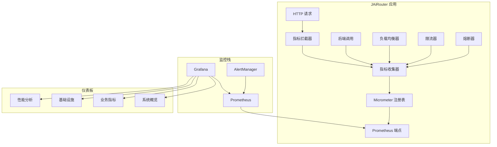

# 监控指南

<!-- 版本信息 -->
> **文档版本**: 1.0.0  
> **最后更新**: 2025-08-19  
> **Git 提交**: 87d3bddc  
> **作者**: Lincoln
<!-- /版本信息 -->


JAiRouter 提供了全面的监控功能，包括系统指标收集、Prometheus 集成、Grafana 仪表板和告警配置。本指南将帮助您了解和使用 JAiRouter 的监控功能。

## 快速开始

### 启动监控栈

#### Windows
```powershell
.\scripts\setup-monitoring.ps1
```

#### Linux/macOS
```bash
./scripts/setup-monitoring.sh
```

### 访问监控界面

- **JAiRouter 应用**: http://localhost:8080
- **Prometheus**: http://localhost:9090
- **Grafana**: http://localhost:3000 (admin/admin)
- **指标端点**: http://localhost:8080/actuator/prometheus

## 监控架构



## 监控功能概览

### 系统指标
- JVM 内存使用情况
- 垃圾回收统计
- HTTP 请求统计
- 线程池状态

### 业务指标
- AI 模型调用统计
- 服务类型分布
- 用户会话跟踪
- 请求响应时间

### 基础设施指标
- 负载均衡器状态
- 限流器事件统计
- 熔断器状态变化
- 后端服务健康状态

## 文档导航

### 配置指南
- [监控设置](setup.md) - 基础监控配置和启动
- [配置参考](configuration.md) - 详细配置选项说明

### 使用指南
- [Grafana 仪表板](dashboards.md) - 仪表板使用和自定义
- [指标参考](metrics.md) - 所有可用指标的详细说明

### 运维指南
- [告警配置](alerts.md) - 告警规则配置和管理
- [告警规则](alert_rules_guide.md) - 告警规则详细说明
- [故障排查](troubleshooting.md) - 常见问题和解决方案

### 高级主题
- [性能优化](performance.md) - 监控系统性能优化
- [测试指南](testing.md) - 监控功能测试

## 关键指标快速参考

### 系统健康
```promql
# 服务可用性
up{job="jairouter"}

# 请求错误率
sum(rate(jairouter_requests_total{status=~"5.."}[5m])) / sum(rate(jairouter_requests_total[5m]))

# P95 响应时间
histogram_quantile(0.95, sum(rate(jairouter_request_duration_seconds_bucket[5m])) by (le))
```

### 业务指标
```promql
# 模型调用成功率
sum(rate(jairouter_model_calls_total{status="success"}[5m])) / sum(rate(jairouter_model_calls_total[5m]))

# 活跃用户会话数
sum(jairouter_user_sessions_active)
```

### 基础设施
```promql
# 健康的后端实例数
sum(jairouter_backend_health)

# 熔断器开启的服务数
count(jairouter_circuit_breaker_state == 1)
```

## 支持和反馈

如果在使用监控功能时遇到问题，请：

1. 查看相关文档的故障排查部分
2. 检查应用日志和监控服务日志
3. 验证配置文件的正确性
4. 联系开发团队获取技术支持

---

**注意**: 监控功能会对系统性能产生一定影响，建议在生产环境中根据实际需求调整采样率和缓存配置。