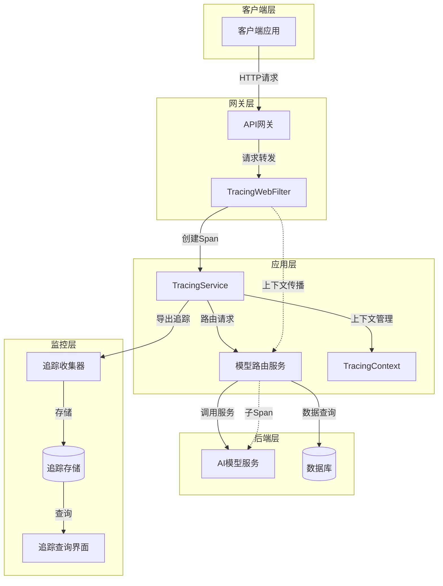
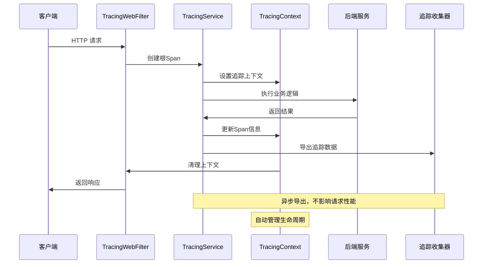

# 分布式追踪概述

JAiRouter 集成了基于 OpenTelemetry 的分布式追踪系统，提供完整的请求链路追踪、性能监控和故障诊断能力。

## 功能特性

### 🔍 全链路追踪
- **请求级别追踪**：从客户端请求到后端服务调用的完整链路追踪
- **服务间调用监控**：自动记录微服务间的调用关系和耗时
- **异步操作追踪**：支持响应式编程中的异步操作上下文传播
- **数据库查询追踪**：监控数据库操作和慢查询检测

### 📊 采样策略
- **比率采样**：基于百分比的随机采样策略
- **规则采样**：基于服务名称、操作类型、请求路径的规则采样
- **自适应采样**：根据系统负载和错误率动态调整采样率
- **动态配置**：支持运行时调整采样策略，无需重启服务

### 🏷️ 上下文管理
- **追踪标识**：自动生成和管理 Trace ID 和 Span ID
- **MDC 集成**：将追踪信息自动注入到日志中
- **上下文传播**：在响应式流中自动传播追踪上下文
- **元数据标签**：支持自定义标签和业务属性

### 🎯 性能监控
- **响应时间统计**：记录请求处理耗时和各阶段性能指标
- **错误率监控**：统计和分析错误发生情况
- **吞吐量分析**：监控系统处理能力和负载情况
- **慢查询检测**：自动识别和报告性能瓶颈

## 追踪架构

## 核心组件

### TracingService
追踪服务的核心组件，负责：
- 创建和管理 Span 生命周期
- 处理追踪上下文的创建、传播和清理
- 集成采样策略进行智能采样
- 提供追踪数据的导出和存储接口

### TracingWebFilter
Web 过滤器组件，实现：
- HTTP 请求的自动追踪包装
- 追踪上下文的创建和注入
- 响应式流中的上下文传播
- 请求和响应的自动标注

### SamplingStrategy
采样策略管理，支持：
- 多种采样算法的实现和切换
- 动态采样率调整
- 基于规则的智能采样
- 采样决策的性能优化

### TracingContext
追踪上下文容器，提供：
- Trace ID 和 Span ID 的管理
- 业务属性和标签的存储
- 上下文在线程间的传递
- 内存安全的上下文清理

## 数据流程

## 集成优势

### 🚀 性能优化
- **异步导出**：追踪数据异步处理，不影响业务请求性能
- **内存管理**：智能的 Span 缓存和过期清理机制
- **批量处理**：支持追踪数据的批量收集和传输

### 🛡️ 可靠性保障
- **故障隔离**：追踪系统故障不影响业务功能
- **降级策略**：支持追踪功能的优雅降级
- **资源限制**：内置资源使用监控和保护机制

### 🔧 运维友好
- **零侵入集成**：通过过滤器和 AOP 实现自动追踪
- **可观测性**：提供追踪系统自身的监控指标
- **故障诊断**：详细的错误信息和调试日志

## 应用场景

### 微服务链路分析
在微服务架构中，追踪系统能够：
- 可视化服务调用关系和依赖图
- 识别服务间的性能瓶颈
- 分析服务故障的影响范围
- 优化服务部署和资源分配

### 性能问题诊断
通过分布式追踪，可以：
- 定位慢请求的具体环节
- 分析数据库查询性能
- 识别代码热点和优化机会
- 监控系统容量和扩展需求

### 故障根因分析
追踪数据有助于：
- 快速定位错误发生的源头
- 分析错误传播路径
- 评估故障影响范围
- 验证修复措施的有效性

### 业务流程优化
基于追踪分析，能够：
- 优化关键业务流程
- 改进用户体验
- 降低系统运营成本
- 提升服务质量

## 下一步

- [快速开始](quickstart.md) - 快速启用和配置追踪功能
- [配置参考](config-reference.md) - 详细的配置选项说明
- [使用指南](usage-guide.md) - 常见使用场景和最佳实践
- [开发集成](../development/tracing-integration.md) - 开发者集成指南
- [故障排除](troubleshooting.md) - 常见问题和解决方案