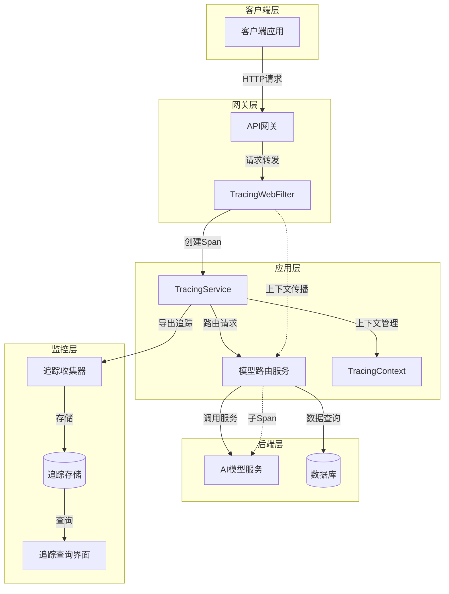
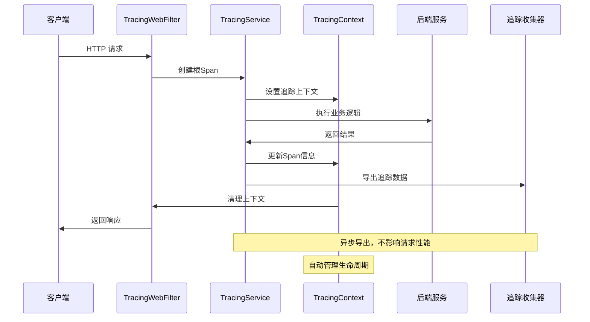

# 分布式追踪概述

---
**版本：** 2.6.11  
**最后更新：** 2026-06-09  
**配置路径：** `src/main/resources/config/tracing/tracing-base.yml`
---

JAiRouter 集成了基于 OpenTelemetry 的分布式追踪系统，提供完整的请求链路追踪、性能监控和故障诊断能力。

## 功能特性

### 🔍 全链路追踪
- **请求级别追踪**：从客户端请求到后端服务调用的完整链路追踪
- **服务间调用监控**：自动记录微服务间的调用关系和耗时
- **异步操作追踪**：支持响应式编程中的异步操作上下文传播（通过 `AsyncTracingProcessor`）
- **数据库查询追踪**：监控数据库操作和慢查询检测
- **组件级追踪**：集成限流器、熔断器、负载均衡器的追踪支持

### 📊 采样策略
- **比率采样**：基于百分比的随机采样策略（默认：0.1，v2.7.9 优化后减少 90% 开销）
- **规则采样**：基于服务名称、操作类型、请求路径的规则采样
- **自适应采样**：根据系统负载和错误率动态调整采样率
- **父采样**：遵循父追踪的采样决策
- **动态配置**：支持运行时调整采样策略，无需重启服务

### 🏷️ 上下文管理
- **追踪标识**：自动生成和管理 Trace ID 和 Span ID
- **MDC 集成**：通过 `TracingMDCManager` 将追踪信息自动注入到日志中
- **上下文传播**：通过 `ReactiveTracingContextHolder` 在响应式流中自动传播追踪上下文
- **元数据标签**：支持自定义标签和业务属性
- **结构化日志**：通过 `StructuredLogger` 输出 JSON 格式的日志

### 🎯 性能监控
- **响应时间统计**：记录请求处理耗时和各阶段性能指标
- **错误率监控**：统计和分析错误发生情况
- **吞吐量分析**：监控系统处理能力和负载情况
- **慢查询检测**：自动识别和报告性能瓶颈
- **内存管理**：通过 `TracingMemoryManager` 和 LRU 缓存智能管理追踪数据
- **性能优化**：通过 `TracingPerformanceMonitor` 自动检测瓶颈

## 追踪架构

```mermaid
graph TB
    subgraph "客户端层"
        Client[客户端应用]
    end
    
    subgraph "网关层"
        Gateway[API网关]
        TFilter[TracingWebFilter]
    end
    
    subgraph "应用层"
        Router[模型路由服务]
        TService[TracingService]
        TContext[TracingContext]
    end
    
    subgraph "后端层"
        Model[AI模型服务]
        Database[(数据库)]
    end
    
    subgraph "监控层"
        Collector[追踪收集器]
        Storage[(追踪存储)]
        UI[追踪查询界面]
    end
    
    Client -->|HTTP请求| Gateway
    Gateway -->|请求转发| TFilter
    TFilter -->|创建Span| TService
    TService -->|上下文管理| TContext
    TService -->|路由请求| Router
    Router -->|调用服务| Model
    Router -->|数据查询| Database
    
    TService -->|导出追踪| Collector
    Collector -->|存储| Storage
    Storage -->|查询| UI
    
    TFilter -.->|上下文传播| Router
    Router -.->|子Span| Model
```

## 核心组件

### TracingService
追踪服务的核心组件，负责：
- 创建和管理 Span 生命周期
- 处理追踪上下文的创建、传播和清理
- 集成采样策略进行智能采样
- 提供追踪数据的导出和存储接口
- 性能统计和优化触发

### TracingWebFilter
Web 过滤器组件，实现：
- HTTP 请求的自动追踪包装
- 追踪上下文的创建和注入
- 响应式流中的上下文传播
- 请求和响应的自动标注

### SamplingStrategyManager
采样策略管理，支持：
- 多种采样算法的实现和切换
- 动态采样率调整
- 基于规则的智能采样
- 采样决策的性能优化
- 运行时配置更新

### TracingMemoryManager
内存管理组件，提供：
- 追踪数据的 LRU 缓存
- 内存压力监控
- 自动垃圾回收触发
- 缓存命中/未命中统计

### AsyncTracingProcessor
异步追踪处理组件：
- 基于队列的追踪数据处理
- 批量导出到追踪收集器
- 高负载下的优雅降级
- 处理统计和监控

### TracingPerformanceMonitor
性能监控组件：
- 实时瓶颈检测
- 优化建议生成
- 健康状态监控
- 性能报告生成

### StructuredLogger
结构化日志组件：
- JSON 格式日志输出
- 追踪上下文注入
- 多种日志构建器（请求、响应、错误、性能、安全等）
- 自定义字段支持

### 安全组件
- **TracingSecurityManager**：追踪数据访问控制
- **TracingSanitizationService**：敏感数据清洗
- **TracingEncryptionService**：追踪数据加密

## 数据流程

```mermaid
sequenceDiagram
    participant Client as 客户端
    participant Filter as TracingWebFilter
    participant Service as TracingService
    participant Context as TracingContext
    participant Backend as 后端服务
    participant Collector as 追踪收集器
    
    Client->>Filter: HTTP 请求
    Filter->>Service: 创建根Span
    Service->>Context: 设置追踪上下文
    Service->>Backend: 执行业务逻辑
    Backend->>Service: 返回结果
    Service->>Context: 更新Span信息
    Service->>Collector: 导出追踪数据
    Context->>Filter: 清理上下文
    Filter->>Client: 返回响应
    
    Note over Service,Collector: 异步导出，不影响请求性能
    Note over Context: 自动管理生命周期
```

## 集成优势

### 🚀 性能优化
- **异步导出**：追踪数据异步处理，不影响业务请求性能
- **内存管理**：智能的 Span 缓存和过期清理机制
- **批量处理**：支持追踪数据的批量收集和传输

### 🛡️ 可靠性保障
- **故障隔离**：追踪系统故障不影响业务功能
- **降级策略**：支持追踪功能的优雅降级
- **资源限制**：内置资源使用监控和保护机制

### 🔧 运维友好
- **零侵入集成**：通过过滤器和 AOP 实现自动追踪
- **可观测性**：提供追踪系统自身的监控指标
- **故障诊断**：详细的错误信息和调试日志

## 应用场景

### 微服务链路分析
在微服务架构中，追踪系统能够：
- 可视化服务调用关系和依赖图
- 识别服务间的性能瓶颈
- 分析服务故障的影响范围
- 优化服务部署和资源分配

### 性能问题诊断
通过分布式追踪，可以：
- 定位慢请求的具体环节
- 分析数据库查询性能
- 识别代码热点和优化机会
- 监控系统容量和扩展需求

### 故障根因分析
追踪数据有助于：
- 快速定位错误发生的源头
- 分析错误传播路径
- 评估故障影响范围
- 验证修复措施的有效性

### 业务流程优化
基于追踪分析，能够：
- 优化关键业务流程
- 改进用户体验
- 降低系统运营成本
- 提升服务质量

## REST API 端点

### 查询 API (`/api/tracing/query`)
- `GET /trace/{traceId}` - 获取追踪链路详情
- `GET /search` - 搜索追踪数据（支持多条件筛选）
- `GET /recent` - 获取最近的追踪记录
- `GET /services` - 获取服务统计信息
- `GET /statistics` - 获取追踪统计信息
- `POST /export` - 导出追踪数据
- `POST /cleanup` - 清理过期追踪数据
- `GET /operations` - 获取操作列表
- `GET /health` - 查询服务健康检查
- `GET /performance/stats` - 获取性能统计
- `GET /performance/latency` - 获取延迟分析
- `GET /performance/errors` - 获取错误分析
- `GET /performance/throughput` - 获取吞吐量分析

### 性能 API (`/api/tracing/performance`)
- `GET /stats` - 获取性能统计信息
- `GET /processing-stats` - 获取异步处理统计
- `GET /memory-stats` - 获取内存使用统计
- `GET /health` - 获取追踪系统健康状态
- `GET /bottlenecks` - 检测性能瓶颈
- `GET /suggestions` - 获取优化建议
- `GET /report` - 生成性能报告
- `POST /optimize` - 触发性能优化
- `POST /tuning` - 执行性能调优
- `POST /memory/gc` - 触发垃圾回收
- `POST /memory/check` - 执行内存检查
- `POST /processing/flush` - 刷新处理缓冲区
- `GET /metrics/dashboard` - 获取监控仪表板数据
- `GET /alerts/active` - 获取活跃告警

### 执行器 API (`/api/tracing/actuator`)
- `GET /status` - 获取追踪系统状态
- `GET /health` - 获取健康状态
- `GET /config` - 获取追踪配置
- `PUT /config` - 更新追踪配置（支持运行时更新）
- `POST /sampling/refresh` - 刷新采样策略
- `GET /stats` - 获取追踪统计信息
- `POST /enable` - 启用追踪
- `POST /disable` - 禁用追踪
- `GET /export` - 导出追踪数据
- `POST /clear-cache` - 清理追踪缓存

## 下一步

- [快速开始](quickstart.md) - 快速启用和配置追踪功能
- [配置参考](config-reference.md) - 详细的配置选项说明
- [使用指南](usage-guide.md) - 常见使用场景和最佳实践
- [开发集成](../development/tracing-integration.md) - 开发者集成指南
- [故障排除](troubleshooting.md) - 常见问题和解决方案