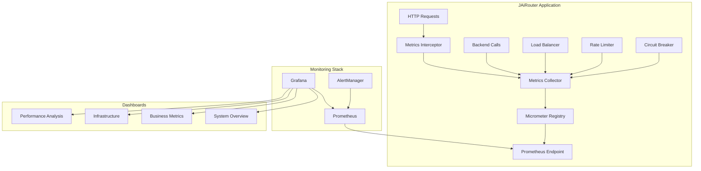

# JAiRouter 监控系统文档索引

## 概述

本文档集提供了 JAiRouter 监控系统的完整使用指南，包括配置、使用、故障排查和参考手册。

## 文档结构

### 📋 核心文档

| 文档 | 描述 | 适用人群 |
|------|------|----------|
| [监控配置指南](monitoring-configuration-guide.md) | 详细的监控功能配置说明 | 系统管理员、DevOps 工程师 |
| [Grafana 仪表板使用指南](grafana-dashboard-guide.md) | Grafana 仪表板的使用和自定义 | 运维人员、业务分析师 |
| [故障排查和性能调优指南](../troubleshooting/troubleshooting-performance-guide.md) | 问题诊断和性能优化方法 | 运维工程师、性能工程师 |
| [监控指标参考手册](../metrics-reference-manual.md) | 所有监控指标的详细说明 | 开发人员、运维人员 |

### 🚀 快速开始

#### 1. 环境准备
```bash
# 克隆项目
git clone <repository-url>
cd jairouter

# 启动监控栈
./scripts/setup-monitoring.sh  # Linux/macOS
.\scripts\setup-monitoring.ps1  # Windows
```

#### 2. 验证安装
- JAiRouter: http://localhost:8080/actuator/health
- Prometheus: http://localhost:9090
- Grafana: http://localhost:3000 (admin/admin)

#### 3. 查看指标
- 指标端点: http://localhost:8080/actuator/prometheus
- 健康检查: http://localhost:8080/actuator/health

### 📊 监控架构



### 🔧 配置快速参考

#### 基础配置
```yaml
# application.yml
monitoring:
  metrics:
    enabled: true
    prefix: "jairouter"
    enabled-categories:
      - system
      - business
      - infrastructure

management:
  endpoints:
    web:
      exposure:
        include: health,info,metrics,prometheus
```

#### 性能优化配置
```yaml
monitoring:
  metrics:
    performance:
      async-processing: true
      batch-size: 500
      buffer-size: 2000
    sampling:
      request-metrics: 0.1
      backend-metrics: 0.5
```

### 📈 关键指标概览

#### 系统健康指标
- `jairouter_requests_total`: HTTP 请求总数
- `jairouter_request_duration_seconds`: 请求响应时间
- `jairouter_backend_health`: 后端服务健康状态
- `jvm_memory_used_bytes`: JVM 内存使用量

#### 业务指标
- `jairouter_model_calls_total`: AI 模型调用总数
- `jairouter_user_sessions_active`: 活跃用户会话数
- `jairouter_loadbalancer_selections_total`: 负载均衡选择次数

#### 基础设施指标
- `jairouter_rate_limit_events_total`: 限流事件统计
- `jairouter_circuit_breaker_state`: 熔断器状态
- `jairouter_backend_calls_total`: 后端调用统计

### 🚨 常用告警规则

#### 严重告警
```yaml
# 服务不可用
- alert: JAiRouterDown
  expr: up{job="jairouter"} == 0
  for: 1m

# 高错误率
- alert: HighErrorRate
  expr: sum(rate(jairouter_requests_total{status=~"5.."}[5m])) / sum(rate(jairouter_requests_total[5m])) > 0.05
  for: 2m
```

#### 警告告警
```yaml
# 响应时间过长
- alert: HighLatency
  expr: histogram_quantile(0.95, sum(rate(jairouter_request_duration_seconds_bucket[5m])) by (le)) > 2
  for: 5m

# 内存使用率高
- alert: HighMemoryUsage
  expr: jvm_memory_used_bytes{area="heap"} / jvm_memory_max_bytes{area="heap"} > 0.8
  for: 5m
```

### 🔍 常用查询示例

#### 性能分析
```promql
# 请求率
sum(rate(jairouter_requests_total[5m]))

# P95 响应时间
histogram_quantile(0.95, sum(rate(jairouter_request_duration_seconds_bucket[5m])) by (le))

# 错误率
sum(rate(jairouter_requests_total{status=~"4..|5.."}[5m])) / sum(rate(jairouter_requests_total[5m])) * 100
```

#### 业务分析
```promql
# 按服务类型分组的请求量
sum by (service) (rate(jairouter_requests_total[5m]))

# 模型调用成功率
sum(rate(jairouter_model_calls_total{status="success"}[5m])) / sum(rate(jairouter_model_calls_total[5m])) * 100

# 活跃用户会话数
sum(jairouter_user_sessions_active)
```

### 🛠️ 故障排查检查清单

#### 监控端点问题
- [ ] 检查 `/actuator/prometheus` 是否可访问
- [ ] 验证监控配置是否正确
- [ ] 检查应用日志中的错误信息
- [ ] 确认网络连接和防火墙设置

#### 性能问题
- [ ] 检查监控对系统性能的影响
- [ ] 调整指标采样率
- [ ] 启用异步处理
- [ ] 优化内存使用配置

#### 数据问题
- [ ] 验证指标数据的准确性
- [ ] 检查 Prometheus 抓取状态
- [ ] 确认时间同步
- [ ] 检查标签配置

### 📚 学习路径

#### 初学者
1. 阅读 [监控配置指南](monitoring-configuration-guide.md) 了解基础配置
2. 跟随 [Grafana 仪表板使用指南](grafana-dashboard-guide.md) 学习可视化
3. 参考 [监控指标参考手册](../metrics-reference-manual.md) 了解可用指标

#### 进阶用户
1. 学习 [故障排查和性能调优指南](../troubleshooting/troubleshooting-performance-guide.md) 中的高级技巧
2. 自定义 Grafana 仪表板和告警规则
3. 优化监控系统性能和存储

#### 专家级
1. 深入研究指标设计和标签策略
2. 实施高级监控模式和最佳实践
3. 贡献监控功能的改进和优化

### 🤝 支持和贡献

#### 获取帮助
- 查看文档中的常见问题解答
- 在项目 Issues 中搜索相关问题
- 联系开发团队获取技术支持

#### 贡献文档
- 报告文档中的错误或不准确信息
- 提交改进建议和最佳实践
- 分享使用经验和案例研究

### 📝 更新日志

#### v1.0.0 (2025-01-15)
- 初始版本发布
- 包含完整的监控配置和使用指南
- 提供 Grafana 仪表板模板
- 实现故障排查和性能调优指南

#### 计划更新
- 添加更多监控场景和用例
- 扩展自定义指标的使用示例
- 增加监控最佳实践案例研究

### 🔗 相关链接

#### 外部资源
- [Prometheus 官方文档](https://prometheus.io/docs/)
- [Grafana 官方文档](https://grafana.com/docs/)
- [Micrometer 文档](https://micrometer.io/docs/)
- [Spring Boot Actuator 文档](https://docs.spring.io/spring-boot/docs/current/reference/html/actuator.html)

#### 项目资源
- [JAiRouter 主项目](../../README.md)
- [API 文档](../docs/api-documentation.md)
- [部署指南](../docs/deployment-guide.md)

---

**注意**: 本文档集持续更新中，如有问题或建议，请通过项目 Issues 反馈。