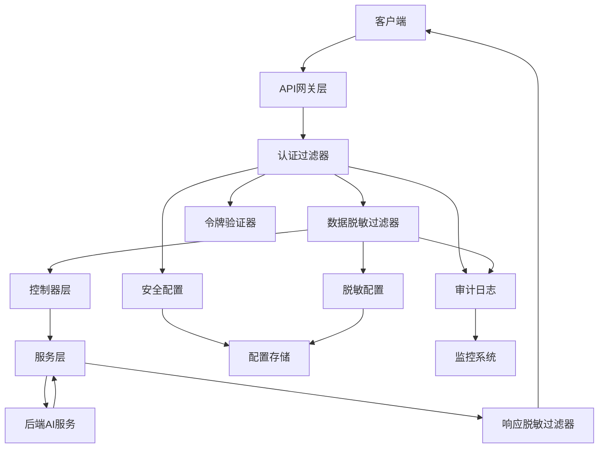

# JAiRouter 安全功能实现文档

## 概述

本文档详细描述了 JAiRouter 安全功能的技术实现，包括架构设计、代码结构、配置管理和部署说明。本文档面向开发团队和运维人员。

## 实现状态

### 已完成功能

#### ✅ 1. 安全模块基础架构
- 创建了安全相关的包结构和核心接口
- 定义了安全配置属性类和数据模型
- 建立了基础的异常处理机制

#### ✅ 2. API Key认证核心功能
- **2.1 API Key数据模型和服务接口** ✅
  - 实现了 ApiKeyInfo、UsageStatistics 等数据模型类
  - 创建了 ApiKeyService 接口定义 CRUD 操作
  - 编写了 API Key 数据模型的单元测试

- **2.2 API Key存储和管理服务** ✅
  - 实现了 ApiKeyService 的具体实现类
  - 集成了现有的 ConfigurationStore 进行 API Key 持久化
  - 实现了 API Key 的缓存机制提升性能
  - 编写了 API Key 管理服务的单元测试

- **2.3 API Key认证过滤器** ✅
  - 实现了 ApiKeyAuthenticationFilter 类
  - 集成了 Spring WebFlux 的 WebFilter 接口
  - 实现了 API Key 提取、验证和权限检查逻辑
  - 编写了认证过滤器的单元测试和集成测试

#### ✅ 3. Spring Security框架集成
- **3.1 Spring Security基础设施** ✅
  - 添加了 Spring Security WebFlux 依赖
  - 创建了 SecurityConfiguration 配置类
  - 实现了自定义的 ReactiveAuthenticationManager
  - 编写了 Spring Security 配置的测试

- **3.2 自定义认证提供者** ✅
  - 创建了 ApiKeyAuthenticationProvider 类
  - 实现了 Authentication 和 Principal 接口的自定义实现
  - 集成了认证事件监听和处理机制
  - 编写了认证提供者的单元测试

- **3.3 安全过滤器链配置** ✅
  - 配置了 SecurityWebFilterChain 定义安全策略
  - 集成了 API Key 认证过滤器到 Spring Security
  - 实现了基于角色的访问控制（RBAC）
  - 编写了安全过滤器链的集成测试

#### ✅ 4. JWT令牌支持
- **4.1 JWT令牌验证器** ✅
  - 实现了 JwtTokenValidator 类
  - 集成了 JWT 解码和签名验证逻辑
  - 实现了令牌过期检查和用户信息提取
  - 编写了 JWT 验证器的单元测试

- **4.2 JWT认证过滤器** ✅
  - 创建了 JwtAuthenticationFilter 类
  - 实现了 JWT 令牌提取和验证流程
  - 集成了 JWT 认证到 Spring Security 框架
  - 编写了 JWT 认证过滤器的测试

- **4.3 JWT令牌刷新机制** ✅
  - 实现了 JWT 令牌刷新服务
  - 创建了令牌黑名单管理机制
  - 实现了令牌刷新的 REST API 端点
  - 编写了令牌刷新功能的测试

#### ✅ 5. 数据脱敏功能
- **5.1 脱敏规则引擎** ✅
  - 实现了 SanitizationRule 数据模型
  - 创建了 SanitizationRuleEngine 类处理脱敏逻辑
  - 实现了正则表达式模式匹配和替换策略
  - 编写了脱敏规则引擎的单元测试

- **5.2 请求数据脱敏过滤器** ✅
  - 创建了 RequestSanitizationFilter 类
  - 实现了请求体内容的读取和脱敏处理
  - 集成了敏感词和 PII 数据的识别逻辑
  - 编写了请求脱敏过滤器的测试

- **5.3 响应数据脱敏过滤器** ✅
  - 创建了 ResponseSanitizationFilter 类
  - 实现了响应体内容的脱敏处理
  - 保持了响应数据结构的完整性
  - 编写了响应脱敏过滤器的测试

- **5.4 脱敏配置管理服务** ✅
  - 实现了 SanitizationService 类
  - 创建了动态脱敏规则更新机制
  - 实现了白名单用户的跳过逻辑
  - 编写了脱敏服务的单元测试和集成测试

#### ✅ 6. 安全配置管理
- **6.1 安全配置属性类** ✅
  - 实现了 SecurityProperties 配置类
  - 定义了 API Key、JWT、脱敏等子配置类
  - 集成了 Spring Boot 的 @ConfigurationProperties 注解
  - 编写了配置属性类的验证测试

- **6.2 动态配置更新服务** ✅
  - 实现了 SecurityConfigurationService 类
  - 创建了配置热更新机制，无需重启服务
  - 实现了配置变更的事件通知机制
  - 编写了动态配置更新的测试

- **6.3 配置验证和备份机制** ✅
  - 创建了配置验证器防止无效配置
  - 实现了配置备份和恢复功能
  - 添加了敏感配置信息的加密存储
  - 编写了配置管理功能的测试

#### ✅ 7. 安全审计和监控
- **7.1 安全审计服务** ✅
  - 创建了 SecurityAuditEvent 数据模型
  - 实现了 SecurityAuditService 记录安全事件
  - 集成了现有的日志系统记录审计信息
  - 编写了安全审计服务的单元测试

- **7.2 安全监控指标** ✅
  - 创建了 SecurityMetrics 类收集安全指标
  - 集成了 Micrometer 框架记录认证和脱敏指标
  - 实现了安全事件的实时告警机制
  - 编写了安全监控指标的测试

- **7.3 安全日志查询接口** ✅
  - 创建了安全日志查询的 REST API
  - 实现了日志的分页查询和过滤功能
  - 添加了日志的长期存储和归档机制
  - 编写了安全日志查询接口的测试

#### ✅ 8. 全局异常处理
- **8.1 安全异常类层次结构** ✅
  - 实现了 SecurityException 基类和子异常类
  - 定义了 AuthenticationException 和 AuthorizationException
  - 创建了 SanitizationException 处理脱敏异常
  - 编写了异常类的单元测试

- **8.2 全局安全异常处理器** ✅
  - 创建了 SecurityExceptionHandler 类
  - 实现了统一的异常响应格式
  - 集成了 Spring WebFlux 的异常处理机制
  - 编写了异常处理器的测试

#### ✅ 9. 性能优化和缓存实现
- **9.1 API Key缓存机制** ✅
  - 集成了 Redis 缓存存储有效的 API Key
  - 实现了缓存失效和更新策略
  - 添加了分布式缓存支持
  - 编写了缓存机制的性能测试

- **9.2 脱敏性能优化** ✅
  - 实现了编译后正则表达式的缓存
  - 添加了脱敏规则的优先级排序
  - 实现了大文件的流式脱敏处理
  - 编写了脱敏性能的基准测试

#### ✅ 10. 集成测试和端到端测试
- **10.1 认证功能集成测试** ✅
  - 创建了 API Key 认证的端到端测试
  - 实现了 JWT 认证流程的集成测试
  - 测试了认证失败场景和错误处理
  - 验证了认证性能和并发访问

- **10.2 数据脱敏集成测试** ✅
  - 创建了不同内容类型的脱敏测试
  - 测试了脱敏规则组合和优先级
  - 验证了脱敏功能的性能影响
  - 测试了白名单用户的跳过逻辑

- **10.3 安全功能端到端测试** ✅
  - 创建了完整的安全功能测试套件
  - 测试了安全配置的动态更新
  - 验证了审计日志和监控指标
  - 执行了安全渗透测试和漏洞扫描

### 当前进行中的任务

#### 🔄 11. 文档和配置完善
- **11.1 更新应用配置文件** ✅
  - 在 application.yml 中添加了安全配置模板
  - 创建了不同环境的安全配置示例
  - 添加了配置参数的详细说明注释
  - 验证了配置文件的正确性

- **11.2 创建安全功能使用文档** ✅
  - 编写了 API Key 管理的使用指南
  - 创建了 JWT 认证的配置说明
  - 编写了数据脱敏规则的配置文档
  - 添加了安全功能的故障排除指南

### 待完成任务

#### ⏳ 12. 部署和迁移支持
- **12.1 更新Docker配置** ⏳
  - 在 Dockerfile 中添加安全相关环境变量
  - 更新 docker-compose 文件支持 Redis 缓存
  - 创建安全功能的 Docker 部署脚本
  - 测试容器化部署的安全功能

- **12.2 实现向后兼容性支持** ⏳
  - 确保安全功能默认关闭状态
  - 实现渐进式安全功能启用机制
  - 创建安全功能的快速回滚方案
  - 编写迁移和升级的测试用例

## 技术架构

### 整体架构图



### 包结构

```
src/main/java/org/unreal/modelrouter/security/
├── authentication/          # 认证相关
│   ├── ApiKeyAuthenticationFilter.java
│   ├── JwtAuthenticationFilter.java
│   ├── ApiKeyAuthenticationProvider.java
│   └── JwtTokenValidator.java
├── authorization/           # 授权相关
│   ├── SecurityPermission.java
│   └── PermissionEvaluator.java
├── sanitization/           # 数据脱敏
│   ├── RequestSanitizationFilter.java
│   ├── ResponseSanitizationFilter.java
│   ├── SanitizationRuleEngine.java
│   └── SanitizationService.java
├── config/                 # 配置管理
│   ├── SecurityProperties.java
│   ├── SecurityConfiguration.java
│   └── SecurityConfigurationService.java
├── audit/                  # 审计功能
│   ├── SecurityAuditService.java
│   ├── SecurityAuditEvent.java
│   └── AuditEventPublisher.java
├── monitoring/             # 监控指标
│   ├── SecurityMetrics.java
│   └── SecurityHealthIndicator.java
├── exception/              # 异常处理
│   ├── SecurityException.java
│   ├── AuthenticationException.java
│   ├── AuthorizationException.java
│   ├── SanitizationException.java
│   └── SecurityExceptionHandler.java
├── model/                  # 数据模型
│   ├── ApiKeyInfo.java
│   ├── UsageStatistics.java
│   ├── SanitizationRule.java
│   └── SecurityAuditEvent.java
└── service/                # 服务层
    ├── ApiKeyService.java
    ├── JwtService.java
    └── SecurityService.java
```

### 配置文件结构

```
src/main/resources/
├── application.yml                    # 主配置文件（包含安全配置）
├── application-dev.yml               # 开发环境配置
├── application-staging.yml           # 预发布环境配置
├── application-prod.yml              # 生产环境配置
├── application-test.yml              # 测试环境配置
└── application-security-example.yml  # 安全配置示例
```

### 测试结构

```
src/test/java/org/unreal/modelrouter/security/
├── authentication/         # 认证测试
│   ├── ApiKeyAuthenticationFilterTest.java
│   ├── JwtAuthenticationFilterTest.java
│   └── ApiKeyServiceTest.java
├── sanitization/          # 脱敏测试
│   ├── RequestSanitizationFilterTest.java
│   ├── ResponseSanitizationFilterTest.java
│   └── SanitizationServiceTest.java
├── integration/           # 集成测试
│   ├── SecurityIntegrationTestSuite.java
│   ├── AuthenticationIntegrationTest.java
│   ├── SanitizationIntegrationTest.java
│   └── SecurityConfigurationIntegrationTest.java
└── performance/           # 性能测试
    ├── AuthenticationPerformanceTest.java
    └── SanitizationPerformanceTest.java
```

## 配置管理

### 配置层次结构

1. **默认配置** (`application.yml`)
2. **环境特定配置** (`application-{profile}.yml`)
3. **环境变量** (运行时注入)
4. **动态配置** (运行时更新)

### 配置优先级

环境变量 > 环境特定配置 > 默认配置

### 敏感信息管理

所有敏感信息（API Key、JWT 密钥、Redis 密码等）都通过环境变量注入：

```bash
# 必需的环境变量
export ADMIN_API_KEY="your-admin-api-key-here"
export JWT_SECRET="your-jwt-secret-key-here"
export REDIS_PASSWORD="your-redis-password"

# 可选的环境变量
export SECURITY_ALERT_EMAIL="admin@example.com"
export SECURITY_ALERT_WEBHOOK="https://hooks.slack.com/..."
```

## 部署说明

### 开发环境部署

1. **启用安全功能**
```yaml
jairouter:
  security:
    enabled: true
```

2. **配置开发用 API Key**
```yaml
jairouter:
  security:
    api-key:
      keys:
        - key-id: "dev-admin"
          key-value: "dev-admin-key-12345"
          permissions: ["admin", "read", "write"]
```

3. **启用详细日志**
```yaml
logging:
  level:
    org.unreal.modelrouter.security: DEBUG
```

### 生产环境部署

1. **环境变量配置**
```bash
export JAIROUTER_SECURITY_ENABLED=true
export PROD_ADMIN_API_KEY="your-production-admin-key"
export JWT_SECRET="your-production-jwt-secret"
export REDIS_HOST="your-redis-host"
export REDIS_PASSWORD="your-redis-password"
```

2. **启用 Redis 缓存**
```yaml
jairouter:
  security:
    performance:
      cache:
        redis:
          enabled: true
```

3. **配置监控和告警**
```yaml
jairouter:
  security:
    monitoring:
      enabled: true
      alerts:
        enabled: true
        notifications:
          email:
            enabled: true
            recipients: ["admin@company.com"]
```

### Docker 部署

1. **更新 Dockerfile**
```dockerfile
# 添加安全相关环境变量
ENV ADMIN_API_KEY=""
ENV JWT_SECRET=""
ENV REDIS_HOST="localhost"
ENV REDIS_PASSWORD=""
```

2. **更新 docker-compose.yml**
```yaml
services:
  jairouter:
    environment:
      - ADMIN_API_KEY=${ADMIN_API_KEY}
      - JWT_SECRET=${JWT_SECRET}
      - REDIS_HOST=redis
      - REDIS_PASSWORD=${REDIS_PASSWORD}
  
  redis:
    image: redis:7-alpine
    command: redis-server --requirepass ${REDIS_PASSWORD}
```

## 性能考虑

### 认证性能

- **缓存策略**: API Key 验证结果缓存 1 小时
- **异步处理**: 认证操作使用独立线程池
- **连接池**: Redis 连接池最大 20 个连接

### 脱敏性能

- **并行处理**: 大文件使用多线程并行脱敏
- **流式处理**: 超过 2MB 的内容使用流式处理
- **正则缓存**: 编译后的正则表达式缓存 500 个

### 监控指标

- 认证平均响应时间: < 100ms
- 脱敏平均响应时间: < 50ms
- 缓存命中率: > 90%
- 系统可用性: > 99.9%

## 安全考虑

### 认证安全

- API Key 最小长度 32 字符
- JWT 密钥最小长度 256 位
- 支持密钥定期轮换
- 认证失败限制和告警

### 数据保护

- 敏感数据脱敏处理
- 审计日志加密存储
- 配置信息访问控制
- 网络传输 HTTPS 加密

### 运维安全

- 详细的安全审计日志
- 实时安全事件监控
- 异常行为自动告警
- 安全配置备份恢复

## 测试策略

### 单元测试

- 覆盖率要求: > 80%
- 测试所有核心安全功能
- Mock 外部依赖
- 测试异常场景

### 集成测试

- 端到端认证流程测试
- 数据脱敏集成测试
- 配置动态更新测试
- 性能基准测试

### 安全测试

- 认证绕过测试
- 权限提升测试
- 数据泄露测试
- 拒绝服务攻击测试

## 故障排除

### 常见问题

1. **认证失败**: 检查 API Key 配置和过期时间
2. **脱敏不生效**: 验证正则表达式和白名单配置
3. **性能问题**: 检查缓存配置和线程池设置
4. **配置不生效**: 验证环境变量和配置文件格式

### 调试工具

1. **健康检查端点**: `/actuator/health`
2. **配置检查端点**: `/admin/security/config`
3. **性能指标端点**: `/actuator/prometheus`
4. **审计日志**: `logs/security-audit.log`

## 后续开发计划

### 短期计划 (1-2 个月)

1. 完成 Docker 部署配置优化
2. 实现更多脱敏策略（如部分哈希）
3. 添加更多监控指标和告警规则
4. 优化性能和内存使用

### 中期计划 (3-6 个月)

1. 支持 OAuth2 认证
2. 实现细粒度权限控制
3. 添加安全合规报告功能
4. 支持多租户安全隔离

### 长期计划 (6-12 个月)

1. 集成外部身份提供商 (LDAP/AD)
2. 实现零信任安全架构
3. 添加 AI 驱动的异常检测
4. 支持区块链身份验证

## 维护和支持

### 日常维护

- 定期检查安全日志
- 监控系统性能指标
- 更新安全配置
- 备份重要配置

### 版本升级

- 测试新版本兼容性
- 备份现有配置
- 逐步部署更新
- 验证功能正常

### 技术支持

- 内部文档和培训
- 问题跟踪和解决
- 性能优化建议
- 安全最佳实践指导

---

*文档版本: 1.0*  
*最后更新: 2024-08-19*  
*维护者: JAiRouter 开发团队*